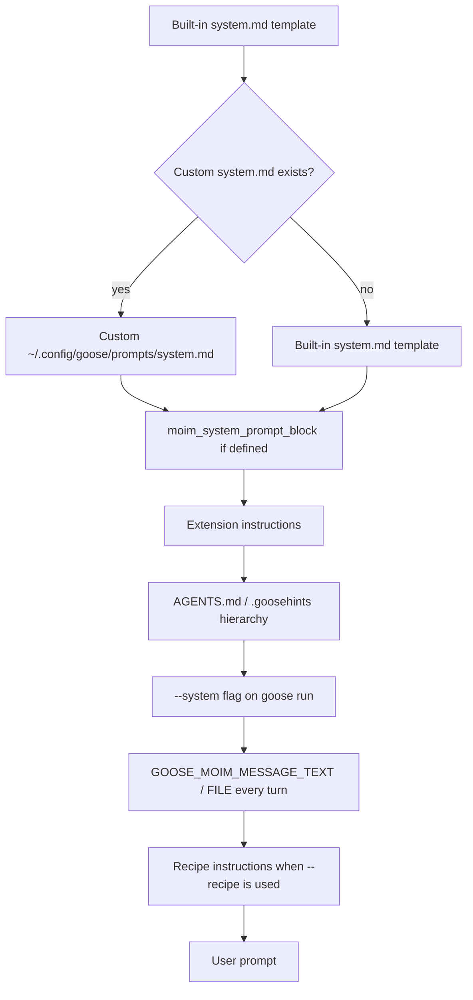

## Overview

Goose CLI builds the effective instructions for each session from several layers. The base is the built-in `system.md` Jinja2 template, which defines Goose's role, extension handling, and response guidelines. Users can override this template by placing a custom `system.md` under `~/.config/goose/prompts/`. On top of that base, Goose appends context from `AGENTS.md` and `.goosehints` files, extension instructions, a `--system` flag passed to `goose run`, and per-turn persistent instructions via `GOOSE_MOIM_MESSAGE_TEXT` / `GOOSE_MOIM_MESSAGE_FILE`. Full replacement of the system prompt from the CLI is not supported; the closest mechanisms are custom prompt templates, recipes, or the ACP session system-prompt setter.

## CLI Parameters

Only `goose run` exposes a flag that directly manipulates the system prompt for a single invocation.

| Flag | Mode | Effect |
| :--- | :--- | :--- |
| `--system "<text>"` | Append | Adds the supplied text as additional system instructions for the current `goose run`. |
| `--recipe <name_or_path>` | Modify | Loads a YAML recipe that supplies its own `instructions` and `prompt` for the run. |
| `--render-recipe` | Inspect | Prints the rendered recipe instead of executing it. |
| `--explain` | Inspect | Shows a recipe's title, description, and parameters. |

`goose session` has no `--system` flag. There are no `--system-prompt`, `--system-prompt-file`, or `--append-system-prompt` equivalents.

## Configuration and Discovery

### Prompt templates

Goose's built-in system prompt is a Jinja2 template stored in the application. Users can override it by creating files under:

- **macOS/Linux:** `~/.config/goose/prompts/`
- **Windows:** `%APPDATA%\Block\goose\config\prompts\`

Relevant templates:

| Template | Effect |
| :--- | :--- |
| `system.md` | Replaces the main session system prompt. |
| `subagent_system.md` | Replaces the system prompt used for subagents. |
| `plan.md`, `compaction.md`, `recipe.md`, etc. | Override other built-in behaviors. |

Changes take effect in new sessions. Deleting the custom file restores the default.

### Hints and context files

Goose discovers context files at session start and when accessing nested directories:

- `.goosehints` (global: `~/.config/goose/.goosehints`; project-local: `./.goosehints`)
- `AGENTS.md` (global: `~/.agents/AGENTS.md`; project-local: `./AGENTS.md`)

By default, Goose looks for `AGENTS.md` then `.goosehints`. The default can be changed with the `CONTEXT_FILE_NAMES` environment variable. Nested files are loaded as Goose reads files in those directories and remain active for the rest of the session.

### Recipes

Recipes are YAML files in `.goose/recipes/` or `~/.config/goose/recipes/` that package instructions, extensions, parameters, and settings. They are launched with `goose run --recipe <file>`. A recipe does not replace the core system prompt, but it defines the run's task identity and can supply its own `instructions` and `prompt`.

### Persistent instructions (MOIM)

The `GOOSE_MOIM_MESSAGE_TEXT` and `GOOSE_MOIM_MESSAGE_FILE` environment variables inject text into Goose's working memory every turn. Unlike `.goosehints`, which are loaded at session start, persistent instructions are re-read fresh each turn, making them suitable for critical guardrails.

## Prompt Layers and Precedence

Notes on precedence:

- A custom `system.md` replaces the built-in template entirely.
- `.goosehints` and `AGENTS.md` append project context, not a hard system-prompt layer.
- `--system` applies only to a single `goose run` invocation.
- MOIM persistent instructions are re-injected every turn and can override softer instructions.
- Recipe instructions define the run's task but do not replace the core system prompt.

## Agents and Subagents

Goose supports custom agents as Markdown files with YAML frontmatter. The file body becomes the agent's instructions.

| Surface | Location |
| :--- | :--- |
| Global agents | `~/.agents/agents/*.md` |
| Project agents | `<project>/.agents/agents/*.md` |
| Compatibility paths | `.goose/agents/`, `.claude/agents/`, `~/.goose/agents/`, `~/.claude/agents/` |

Frontmatter supports `name` (required), `description`, and `model`. Agents can be invoked by mention (`@code-reviewer`) or delegated to. Delegated agents run in isolated sessions; loading an agent adds its instructions to the current conversation without creating a separate session.

Subagents are spawned through the `summon` platform extension. They run in isolated context windows with their own `subagent_system.md` template plus task instructions. By default, subagents inherit extensions from the parent session, but access can be restricted. Subagents cannot spawn further subagents or manage extensions/schedules.

## Format Recommendations

| Goal | Recommended format | Rationale |
| :--- | :--- | :--- |
| Append (`--system`, `.goosehints`) | Pure Markdown | Headers, lists, and short paragraphs blend with Goose's Markdown-based system template. |
| Replace (custom `system.md` or recipe) | XML-wrapped Markdown | XML tags such as `<instructions>`, `<constraints>`, and `<examples>` help the model distinguish sections when the built-in structure is removed. |

For replacements via custom `system.md`, the file should reintroduce any extension handling, safety rules, and response guidelines the task still needs, because the built-in template is removed entirely.

## Recent Changes

- **v1.41.0 (2026-07-03)**: Global hints now load from `~/.agents/AGENTS.md` in addition to `~/.config/goose/.goosehints`.
- **v1.39.0 (2026-06-25)**: Added an ACP session system-prompt setter for programmatic clients.
- **v1.34.0–v1.38.0 (2026-05–2026-06)**: Projects can act as backend sources with system-prompt injection.
- **v1.27.0 (2026-02)**: Restored correct subagent system-prompt behavior.
- **v1.41.0 (2026-07-03)**: Added `--edit` session flag to edit conversation before forking.

## Quirks and Workarounds

- `--system` only works on `goose run`. For interactive sessions, use `.goosehints`, `AGENTS.md`, or load a custom agent instead.
- There is no CLI flag to replace the entire system prompt; use a custom `~/.config/goose/prompts/system.md` or a recipe.
- Nested `.goosehints` / `AGENTS.md` files are sticky: once loaded for a directory, they remain active for the session.
- MOIM persistent instructions are re-injected every turn and are stronger than one-shot system-prompt instructions.
- Recipes with an explicit `extensions` block must list `summon` (type: platform) or delegation tools will not be available.
- Custom prompt template changes only apply to new sessions; restart after editing `system.md`.
- Goose has no built-in command to export the fully rendered effective system prompt.

## Claudine Delivery Notes

- **Append**: For non-interactive `goose run`, pass the composed content to `--system <text>`. This is a per-invocation change that does not mutate user config files.
- **Replace**: Goose has no native CLI replace mechanism. Claudine should treat replace as unsupported for Goose.
- **Interactive**: `goose session` has no `--system` flag. Claudine should warn and skip system-prompt append in interactive mode.
- **No temp file**: Because Goose accepts `--system` as inline text, no temp file is required for append. Keep content within platform argv limits.

## Changelog

- Corrected earlier research: Goose append is `goose run --system <text>` only; there are no `--system-prompt` or `--system-prompt-file` flags.
- Updated documentation and repository URLs from `block.github.io/goose` and `block/goose` to `goose-docs.ai` and `aaif-goose/goose`.
- Added prompt templates, persistent instructions (MOIM), custom agents, AGENTS.md context, and recipe-based instructions from current Goose docs.
- Set `replace_support` to `none` and `claudine_delivery.replace_strategy` to `unsupported`.

## Sources

- [Goose CLI commands](https://goose-docs.ai/docs/guides/goose-cli-commands/)
- [Customizing prompt templates](https://goose-docs.ai/docs/guides/context-engineering/prompt-templates/)
- [Using goosehints](https://goose-docs.ai/docs/guides/context-engineering/using-goosehints/)
- [Persistent instructions](https://goose-docs.ai/docs/guides/context-engineering/using-persistent-instructions/)
- [Subagents](https://goose-docs.ai/docs/guides/context-engineering/subagents/)
- [Custom agents](https://goose-docs.ai/docs/guides/context-engineering/custom-agents/)
- [Recipe reference](https://goose-docs.ai/docs/guides/recipes/recipe-reference/)
- [Configuration files](https://goose-docs.ai/docs/guides/config-files/)
- [Environment variables](https://goose-docs.ai/docs/guides/environment-variables/)
- [Goose moves to AAIF](https://goose-docs.ai/blog/2026/04/07/goose-moves-to-aaif/)
- [Goose releases on GitHub](https://github.com/aaif-goose/goose/releases)
- [Built-in system.md template source](https://github.com/aaif-goose/goose/blob/main/crates/goose/src/prompts/system.md)
