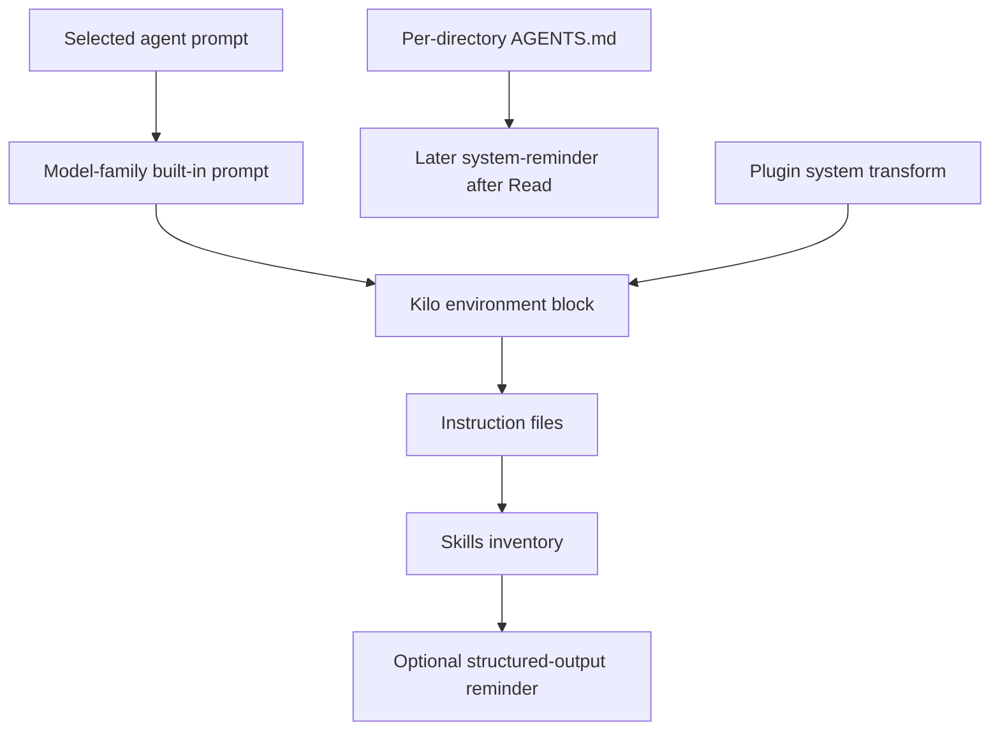

# Kilo Code System Prompt Research

## Overview

Kilo Code's current CLI is an OpenCode-derived runtime with Kilo-specific configuration, agent, and prompt assembly. The important implementation fact for a wrapper is that Kilo does not expose Claude-style `--append-system-prompt` or `--replace-system-prompt` flags in the current `kilo run` command. Prompt control is delivered through configuration layers: instruction files append to the effective system context, and custom agents provide a distinct agent prompt.

For Claudine, append is practical and non-mutating through `KILO_CONFIG_CONTENT` or `KILO_CONFIG_DIR` pointing at a temporary instruction file. Replacement is only partial: Claudine can select a temporary custom agent whose prompt replaces the active agent's behavioral prompt, but current evidence does not show a supported way to remove Kilo's model-family built-in prompt, environment block, tool descriptions, or other runtime prompt layers.

Local inspection found no files under `~/.kilo` on this host, so there were no local user Kilo prompt/config examples to incorporate.

## CLI Parameters

| Parameter | Prompt Effect | Wrapper Use |
|---|---|---|
| `kilo run --agent <AGENT>` | Selects the active agent; custom agent prompt becomes the selected agent prompt. | Use with a temporary agent injected by config for replacement-style delivery. |
| `kilo run --model <PROVIDER/MODEL>` | Changes model selection and can indirectly change the built-in model-family prompt. | Not a direct prompt-control surface. |
| `kilo run --format json` | Streams raw events. | Useful for automation, but not a proven effective-prompt export. |
| `kilo agent create ...` | Creates a persistent agent Markdown file whose body is prompt text. | Avoid for Claudine; it writes files and may use an LLM to generate the prompt. |
| `kilo agent list` | Lists agents and permissions. | Does not expose prompt text. |
| `/agents` | Interactive agent switcher. | Not suitable for non-interactive wrappers. |
| `/init` | Creates or updates `AGENTS.md`. | Persistent mutation; not suitable for ephemeral prompt append. |

No current official docs or source path showed native flags named `--append-system-prompt`, `--replace-system-prompt`, `--system-prompt`, or `--system-prompt-file` for Kilo CLI 7.4.1.

## Configuration and Discovery

Kilo prompt-relevant config is JSONC-centric:

| Source | Effect |
|---|---|
| `agent.<name>.prompt` in `kilo.jsonc` | Defines or overrides an agent prompt. |
| Agent Markdown files under `agent/` or `agents/` directories | YAML frontmatter defines metadata; Markdown body is the prompt. |
| `instructions` array in `kilo.jsonc` | Adds instruction files, globs, or URLs. |
| `AGENTS.md` | Primary global/project instruction file. |
| `CLAUDE.md` | Compatibility instruction file unless disabled. |
| `CONTEXT.md` | Deprecated additional context file. |
| `KILO_CONFIG_CONTENT` | Late inline config override; best ephemeral wrapper hook for short config. |
| `KILO_CONFIG_DIR` | Adds a temporary config directory and can provide an `AGENTS.md` candidate. |
| `KILO_DISABLE_PROJECT_CONFIG=1` | Suppresses project config/instruction discovery. |

Config precedence is high enough that `KILO_CONFIG_CONTENT` can define a temporary agent and set `default_agent`, or add a temporary path to `instructions`. Managed enterprise config and macOS managed preferences still override it.

## Prompt Layers and Precedence

The source constructs the model request system array from environment, instruction, skill, and optional structured-output layers. Built-in model-family prompt text is selected separately by model metadata/id family.

Important wrapper implications:

- Instruction files append; they do not replace the provider base.
- Agent prompts give each primary agent or subagent distinct behavior.
- Per-directory `AGENTS.md` files are injected later when relevant files are read.
- Plugin transforms can mutate the system array, but are experimental and require plugin loading.

## Agents and Subagents

Kilo supports user-defined primary agents and subagents. Agent definitions can live in Markdown files or in `kilo.jsonc`; the Markdown body or `agent.<name>.prompt` is the prompt text. Agent mode controls availability: `primary`, `subagent`, or `all`.

Subagents are invoked through the task tool in child sessions. Current source rejects primary-only agents as subagents and disallows nested task spawning. Child sessions inherit selected permission restrictions from the parent/calling agent, but their agent prompt is distinct.

For Claudine replacement delivery, define a temporary `primary` or `all` agent and select it with `--agent` or `default_agent`. This replaces the selected agent prompt layer, not every Kilo system layer.

## Format Recommendations

Use Markdown for both append and replacement:

- Append: a temporary Markdown instruction file referenced from `instructions`.
- Replace: a temporary agent Markdown body or `agent.<name>.prompt` string containing Markdown.

Kilo's docs explicitly recommend Markdown for rules and use Markdown agent files as a native format. XML-wrapped Markdown is not required; Kilo itself wraps dynamically discovered directory instructions in `<system-reminder>` tags when it injects them later.

## Recent Changes

| Date | Version | Change | Impact |
|---|---|---|---|
| 2026-07-03 | 7.4.1 | Latest npm version observed during research. | Research targets current CLI behavior. |
| 2026-02-23 | 7.0.26 | npm version series moved from 1.0.x to 7.x. | Older Kilo/Roo-style system prompt override issues should not be treated as current CLI behavior without source confirmation. |
| unknown | unknown | Current docs use agent Markdown files and `kilo.jsonc` for custom modes. | Wrappers should target the new config/agent surfaces, not legacy `custom_modes.yaml`. |

## Quirks and Workarounds

- There is no supported direct one-shot system prompt replacement flag in current Kilo CLI.
- `KILO_CONFIG_CONTENT` is powerful but should carry only small JSON; for long prompts use temp files.
- `KILO_DISABLE_PROJECT_CONFIG=1` is useful for isolation, but it also removes legitimate user/repo context.
- Kilo docs and source disagree on `AGENT.md` fallback support; rely on `AGENTS.md`.
- Session export omits agent prompt/options/permissions, so it is not prompt inspection.
- A historical issue discusses `.kilocode/system-prompt-{mode}` behavior, but that path was not present in the current CLI prompt path researched here.

## Claudine Delivery Notes

Append without persistent mutation:

1. Write a temporary Markdown file containing Claudine's appended instructions.
2. Set `KILO_CONFIG_CONTENT` to JSON that adds that file to `instructions`.
3. Run `kilo run ...` normally.
4. Avoid `KILO_DISABLE_PROJECT_CONFIG` unless the user requested isolation from repo/user instructions.

Replacement without persistent mutation:

1. Write a temporary agent prompt as Markdown or inline JSON.
2. Set `KILO_CONFIG_CONTENT` with `agent.claudine-replacement.prompt`, `description`, and `mode: "primary"`.
3. Pass `kilo run --agent claudine-replacement ...` or set `default_agent`.
4. Document that this replaces the active agent prompt layer, not the hard-coded Kilo base/environment/tool layers.

For very long prompts, prefer `KILO_CONFIG_DIR` with temporary `kilo.jsonc` and agent/instruction files over embedding prompt text directly in an environment variable.

## Sources

- [Kilo CLI documentation](https://kilo.ai/docs/code-with-ai/platforms/cli)
- [Kilo custom instructions documentation](https://kilo.ai/docs/customize/custom-instructions)
- [Kilo custom modes documentation](https://kilo.ai/docs/customize/custom-modes)
- [Kilo custom rules documentation](https://kilo.ai/docs/customize/custom-rules)
- [Kilo AGENTS.md documentation](https://kilo.ai/docs/customize/agents-md)
- [Kilo settings documentation](https://kilo.ai/docs/getting-started/settings)
- [Kilo plugins documentation](https://kilo.ai/docs/automate/extending/plugins)
- [Kilo source repository](https://github.com/Kilo-Org/kilocode)
- [@kilocode/cli npm package](https://www.npmjs.com/package/@kilocode/cli)
- [GitHub issue #4253: custom system prompt override appends unwanted user custom instructions](https://github.com/Kilo-Org/kilocode/issues/4253)
