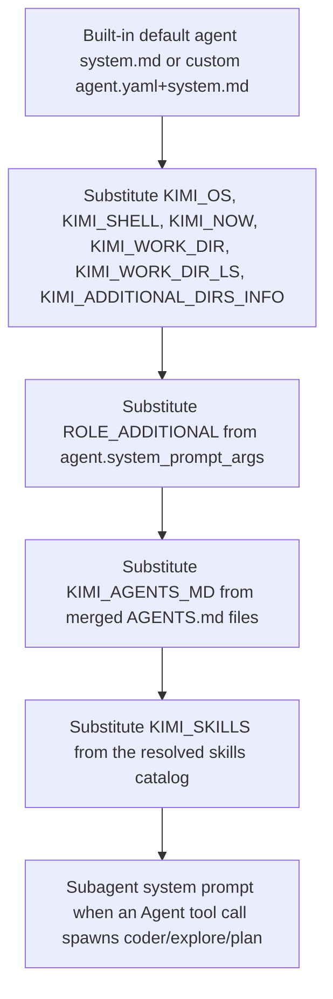

# Kimi Code CLI System Prompt

## Overview

Kimi Code CLI is the Moonshot AI terminal coding agent. Its **effective system prompt** is assembled at session start from a base template plus several layered inputs: an AGENTS.md merge, a skills catalog, working-directory listing, additional directory listings, and Jinja-substituted runtime variables. The wrapper question — how Claudine can append to or replace the system prompt without permanently mutating user config — has to be answered separately for the two implementations of "Kimi Code" that currently coexist on most machines:

| Implementation | Binary | Data root | Status |
| --- | --- | --- | --- |
| Legacy Python `kimi-cli` | `kimi-cli` (PyPI `kimi-cli`, last 1.48.0 on 2026-06-22) | `~/.kimi` (`KIMI_SHARE_DIR`) | Wind-down; docs and installs remain available. README states "Kimi CLI is evolving into Kimi Code CLI — Installing Kimi Code CLI automatically migrates your configuration and sessions." |
| New TypeScript `kimi-code` | `kimi` (npm `@moonshot-ai/kimi-code`, latest 0.22.2 on 2026-07-03) | `~/.kimi-code` (`KIMI_CODE_HOME`) | Recommended. Single binary; `AGENTS.md` is the customization surface. |

The two share the same agent vocabulary (`coder`, `explore`, `plan`), the same `Agent` tool shape, and the same AGENTS.md + Skills + Plugins model, but they expose **different** system-prompt customization surfaces. The legacy `kimi-cli` is `first_class` for replace (`--agent-file <agent.yaml>` plus a sibling `system.md` Markdown file); the new `kimi-code` has dropped `--agent` and `--agent-file` (verified against the locally installed 0.14.0 `kimi --help`), so customization moves to `AGENTS.md`. Append is `file`-based on both — write the desired instructions into a temporary `AGENTS.md` and rely on the runtime's standard discovery.

A host running both binaries (this machine does: `/Users/ken/.kimi-code/bin/kimi` reports `0.14.0`, `/Users/ken/.local/bin/kimi-cli` reports `1.47.0`) needs the wrapper to pick the right binary per provider version, set `KIMI_CODE_HOME` deliberately for isolation, and avoid the legacy `~/.kimi` data root when only the new binary is the target.

## CLI Parameters

The current `kimi --help` (verified against installed `0.14.0` and the published reference at <https://moonshotai.github.io/kimi-code/en/reference/kimi-command.html>) does **not** expose any flag whose primary purpose is to manipulate the system prompt. The flags below are the ones that interact with prompt *content* indirectly or that the wrapper must respect when shaping the runtime context:

| Flag | Mode | Effect on prompt | Notes |
| --- | --- | --- | --- |
| `--skills-dir <dir>` (repeatable) | other | Replaces the auto-discovered skills roots for this launch, changing which entries appear under `${KIMI_SKILLS}` in the legacy prompt and the equivalent skills catalog in the new kimi-code prompt. | Built-in skills still load when supported. Persistent additions belong in `extra_skill_dirs` in `config.toml`. |
| `--add-dir <dir>` (repeatable) | other | Adds an extra workspace directory, expanding `${KIMI_ADDITIONAL_DIRS_INFO}` in the legacy prompt and the new prompt's directory listing. | Persisted to `state.json` for the session. The directories propagate to every spawned subagent. |
| `--model <alias>` / `-m` | other | Selects the model alias for this launch; capabilities declared via `capabilities = [...]` may add or remove slots (`thinking`, `image_in`, `video_in`, `audio_in`, `tool_use`). | Highest-priority model override; the `KIMI_MODEL_*` family synthesizes a temporary model from env vars without editing `config.toml`. |
| `--prompt <text>` / `-p` | other | Runs one prompt non-interactively; does not change the prompt template. | Conflicts with `--yolo`, `--auto`, and `--plan`. Prompt mode uses `auto` permission by default. |
| `--yolo` / `-y` | other | Auto-approves regular tool calls for the session; inherited by subagents via the shared `Approval` runtime. | Hidden aliases: `--yes`, `--auto-approve`. |
| `--auto` | other | Auto-approve mode; suppresses AskUserQuestion and tool prompts. | Conflicts with `--yolo` and prompt mode. |
| `--plan` | other | Starts in Plan mode (read-only tools prioritized). Plan mode is parent-scoped and does **not** propagate to subagents. | Conflicts with prompt mode; exit approval is not bypassed by `--yolo`. |
| `--session [id]` / `-S` (and hidden `--resume`, `-r`) | other | Resumes a session; restores `additional_dirs`, permission mode, plan mode, and subagent instances from `state.json`. | Mutually exclusive with `--continue`. |
| `--continue` / `-c` | other | Continues the most recent session for the work directory. | Same persistence and prompt-rebuild semantics. |
| `--output-format <text\|stream-json>` | other | Output format for prompt mode. `text` (default) or `stream-json`. | Only valid with `-p`. |

The published `kimi-command` reference does not list any `--system-prompt`, `--append-system-prompt`, or `--replace-system-prompt` flag. The same is true for legacy `kimi-cli --help`. Wrapper-internal flag catalogs that record the **existence** of system-prompt-related flags should mark Kimi as `none` for that level; the actual delivery mechanisms live in config files and `AGENTS.md` (see next sections).

## Configuration and Discovery

Kimi Code assembles its effective prompt from a base template plus several layered inputs. Each layer is documented below with its discovery rule.

### Base prompt template

- **Legacy `kimi-cli`**: the default agent ships as `<site-packages>/kimi_cli/agents/default/system.md` (and `<site-packages>/kimi_cli/agents/okabe/system.md`) in the Python wheel. The template uses Jinja2 with a custom delimiter (`variable_start_string = "${"`, `variable_end_string = "}"`) and supports `` directives for splicing additional files. The runtime substitutes the following Jinja variables from its `BuiltinSystemPromptArgs` (`src/kimi_cli/soul/agent.py`): `KIMI_NOW`, `KIMI_WORK_DIR`, `KIMI_WORK_DIR_LS`, `KIMI_AGENTS_MD`, `KIMI_SKILLS`, `KIMI_ADDITIONAL_DIRS_INFO`, `KIMI_OS`, `KIMI_SHELL`, plus the agent-level `ROLE_ADDITIONAL` (or any other `system_prompt_args`).
- **New `kimi-code`**: the default agent prompt is bundled inside the single-binary distribution; current public docs describe the customization surface (AGENTS.md, Skills, sub-agents) without publishing the verbatim template. Treat the verbatim template as `unknown` until verified against the TypeScript source.

### AGENTS.md discovery

Both implementations read AGENTS.md-style instruction files. The legacy `kimi-cli` Python implementation (`src/kimi_cli/soul/agent.py: load_agents_md`) walks from the project root (nearest `.git` ancestor) down to the work directory and concatenates every applicable file in root→leaf order, with `<!-- From: <path> -->` annotations and a 32 KiB total cap (`_AGENTS_MD_MAX_BYTES`). Inside one directory:

1. `.kimi/AGENTS.md` is read first (always independently).
2. `AGENTS.md` and lowercase `agents.md` are mutually exclusive; uppercase wins.

The new `kimi-code` documentation (<https://moonshotai.github.io/kimi-code/en/customization/agents.html>) describes the same file set as the customization surface:

> Global Kimi-specific instructions can live at `$KIMI_CODE_HOME/AGENTS.md` (default: `~/.kimi-code/AGENTS.md`). When you relocate the data root with `KIMI_CODE_HOME`, this global instruction file moves with it. Generic cross-tool instructions can still live under `~/.agents/AGENTS.md` in the real OS home, and project-level instructions remain under the project tree, for example `.kimi-code/AGENTS.md` or `AGENTS.md`.

| Path | Scope | Format | Notes |
| --- | --- | --- | --- |
| `$KIMI_CODE_HOME/AGENTS.md` (default `~/.kimi-code/AGENTS.md`) | user, Kimi-specific | markdown | Moves with `KIMI_CODE_HOME`; 32 KiB cap with leaf-first truncation in the legacy runtime. |
| `~/.agents/AGENTS.md` | user, generic cross-tool | markdown | Stays under the real OS home even when `KIMI_CODE_HOME` is relocated. |
| `<project-root>/.kimi/AGENTS.md` | repo, Kimi-specific | markdown | Highest priority within a project directory; project root resolved by walking up from the work directory to the nearest `.git` ancestor. |
| `<project-root>/AGENTS.md` | repo, standard | markdown | Read together with any sibling `.kimi/AGENTS.md` (with `.kimi/` first). |
| `<project-root>/agents.md` | repo, lowercase variant | markdown | Mutually exclusive with `AGENTS.md` in the same directory (uppercase wins). |
| `<project-root>/.kimi-code/AGENTS.md` | repo, Kimi-Code-named alias | markdown | Mentioned in current Kimi Code docs; treat as legacy alias of `.kimi/AGENTS.md` until verified against the TypeScript source. |

The legacy runtime also reads `.kimi-code/AGENTS.md` (legacy kimi-cli accepts both `.kimi/` and `.kimi-code/` directory names). The new kimi-code's TypeScript source could not be confirmed within the time budget for this research; treat the `.kimi/` path as the canonical project-level location until verified.

### Skills catalog

Skills contribute `name` / `path` / `description` entries to the `${KIMI_SKILLS}` slot in the legacy prompt (and the equivalent skills catalog in the new kimi-code prompt). Skills are scoped as `Project`, `User`, `Extra`, or `Built-in` and rendered under those headings. Discovery order (from `src/kimi_cli/skill/__init__.py`):

1. `--skills-dir` (CLI override, repeatable) — replaces user and project auto-discovery.
2. Project brand group (`.kimi/skills/`, `.claude/skills/`, `.codex/skills/`) — resolved against the `.git`-anchored project root. With `merge_all_available_skills = true` (default) every existing brand directory contributes; with `false` only the first existing one does.
3. Project generic group (`.agents/skills/`) at the project root.
4. User brand group (`~/.kimi/skills/`, `~/.claude/skills/`, `~/.codex/skills/`) with the same `merge_all_available_skills` semantics.
5. User generic group (`~/.config/agents/skills/` preferred, `~/.agents/skills/` fallback) — always searched, even when empty.
6. `extra_skill_dirs` from `config.toml` — additive; non-existent entries are silently dropped.
7. `~/.kimi/plugins/<plugin>/SKILL.md` — always added as a single extra root (follows `KIMI_SHARE_DIR`/`KIMI_CODE_HOME`).
8. Built-in `<python-site-packages>/kimi_cli/skills/<name>/SKILL.md` — loaded only when the active KAOS backend is `local` or `acp`.

Each root performs a two-pass discovery (subdirectory `<name>/SKILL.md`, then flat `<name>.md`); subdirectory skills shadow flat skills of the same name in the same directory with a warning.

### Plugins

A Kimi Code plugin declares executable tools (and MCP server capabilities) via `plugin.json`. The plugin's own `SKILL.md`, if any, is loaded through the standard skills discovery (`extra`-scoped root at `<KIMI_CODE_HOME or ~/.kimi-code>/plugins/<plugin>/SKILL.md`); plugins do not currently inject a dedicated system-prompt layer in the public docs reviewed. The plugin install state lives at `<KIMI_CODE_HOME>/plugins/installed.json`; the marketplace URL is overridable via `KIMI_CODE_PLUGIN_MARKETPLACE_URL`.

### Built-in sub-agents

The three built-in sub-agents (`coder`, `explore`, `plan`) are scheduled automatically by the main agent based on task shape. Each sub-agent runs in its own context with its own system prompt, tool allowlist, and `${ROLE_ADDITIONAL}` injection. They do not see the parent's conversation history; only the final assistant message returns to the parent. Context isolation is enforced by `Runtime.copy_for_subagent(...)` (legacy) or the equivalent new-kimi-code runtime.

## Prompt Layers and Precedence

The legacy runtime builds the effective system prompt in this order (the new kimi-code preserves the same conceptual layers; the layering rule is published, the exact slot names are `unknown` until verified against the TypeScript source):

Notes:

- `KIMI_AGENTS_MD` is the AGENTS.md merge from the project-root-to-work-dir walk. In one directory, `.kimi/AGENTS.md` is read first; then `AGENTS.md` (or lowercase `agents.md`, mutually exclusive). Leaf files get the budget priority under the 32 KiB cap (`_AGENTS_MD_MAX_BYTES`).
- `KIMI_SKILLS` is grouped by scope (`### Project` / `### User` / `### Extra` / `### Built-in`) so the model can distinguish scope when responding to prompts like "the skill in this project". Same-name skills resolve by first occurrence across the resolved root list (priority `project > user > extra > builtin`); brand group (`kimi > claude > codex`) is always inserted before the generic group.
- The legacy `--agent-file <path>` flag replaces layer A. The new kimi-code does not expose this flag.
- The legacy runtime's `Jinja2.StrictUndefined` means undeclared `${VAR}` references raise `SystemPromptTemplateError`. Wrap any user-authored AGENTS.md or `system.md` content that needs a literal `${...}` accordingly.
- A subagent's system prompt is rebuilt from the subagent's own `system.yaml` with its own `system_prompt_args` plus the shared `BuiltinSystemPromptArgs`. The parent's system prompt is **not** inherited.

## Agents and Sub-agents

Kimi Code supports custom agents on the legacy `kimi-cli` runtime only. The legacy YAML agent format is `version: 1` + `agent:` mapping (validated by `kimi_cli/agentspec.py` and loaded by `kimi_cli.agentspec.load_agent_spec`). Custom agents are passed per-session via `kimi --agent-file <path/to/agent.yaml>`; there is no auto-discovered `~/.kimi/agents/` or `.kimi/agents/` directory. The new kimi-code has dropped `--agent` and `--agent-file` (verified against installed 0.14.0); the only first-class customization surface is the AGENTS.md instruction files.

Key behaviors (legacy, still authoritative for the `--agent-file` path):

- A user-defined agent file is loaded per session and merges with the built-in default via `extend: default` or `extend: <relative-path>`. Field-by-field merge: scalars (name, system_prompt_path, model, when_to_use, exclude_tools, subagents) are replaced wholesale; `system_prompt_args` is merged key-by-key so a child can add or override individual Jinja variables (most commonly `ROLE_ADDITIONAL`); `tools` / `allowed_tools` are replaced, not merged; `exclude_tools` is replaced. A child that wants to add a tool to an inherited allowlist must restate the whole list.
- The system prompt lives in a sibling Markdown file referenced by `agent.system_prompt_path` (path is relative to the agent YAML's directory, not the working directory). The Markdown supports Jinja2 templating with `${VAR}` syntax and `` directives.
- Subagents declared in the `subagents:` block (`path`, `description`) are loaded relative to the parent agent YAML's directory. Subagent `path` files are themselves valid agent YAMLs (typically extending the default). The built-in `coder`, `explore`, and `plan` ship as `kimi_cli/agents/default/{coder,explore,plan}.yaml`.
- Each subagent receives its own `KimiSoul` with its own `Context`, `KimiToolset`, and `DenwaRenji`. The parent's `Approval`, `subagent_store`, `additional_dirs`, `skills_dirs`, `root_wire_hub`, and `Session` are shared. Subagents do not see the parent's conversation history or the parent's AGENTS.md / system prompt; only the final assistant message returns to the parent.
- `${ROLE_ADDITIONAL}` is the conventional Jinja variable used to splice role-specific guidance into an inherited `system.md`. The built-in `coder.yaml` / `explore.yaml` / `plan.yaml` each pass a non-empty `ROLE_ADDITIONAL`.
- Subagents cannot launch further subagents: `Agent` is excluded from every shipped subagent's tool list, and `AgentTool.__call__` early-returns with `Subagents cannot launch other subagents` for `runtime.role != "root"`.
- MCP tools configured at the parent are not inherited by subagents by default. Each subagent's `load_agent(... mcp_configs=[])` call gets an empty MCP list, so a subagent sees only its own MCP config plus the agent-defined tools. Plugin-supplied tools load only into the parent's toolset; a subagent must explicitly reference them in its `tools` / `allowed_tools` to see them.
- YOLO/AFK propagate through the shared `Approval` runtime; plan mode is parent-scoped and does not propagate. `BackgroundConfig.max_running_tasks` (default 4) bounds concurrent background subagents.

For the new `kimi-code`, only the three built-in sub-agents (`coder`, `explore`, `plan`) are scheduled. Customization happens through `AGENTS.md` files plus plugins; the legacy `--agent-file` entry point has been removed.

## Format Recommendations

| Goal | Recommended format | Rationale |
| --- | --- | --- |
| Append | Plain Markdown | `AGENTS.md` is a user-facing Markdown file. Headers, bullet lists, and short paragraphs blend cleanly with the existing default prompt's style. |
| Replace (legacy `--agent-file`) | Plain Markdown | The sibling `system.md` is Markdown rendered through Jinja2. XML tags do not add documented value; the built-in default uses Markdown headings rather than XML section markers. Place `${ROLE_ADDITIONAL}` where role-specific guidance belongs. |

Wrap any appended Markdown in a way that does not contain undeclared `${VAR}` references — the legacy runtime's `StrictUndefined` mode raises `SystemPromptTemplateError` on undeclared variables. The declared Jinja variables in the legacy runtime are `KIMI_NOW`, `KIMI_WORK_DIR`, `KIMI_WORK_DIR_LS`, `KIMI_AGENTS_MD`, `KIMI_SKILLS`, `KIMI_ADDITIONAL_DIRS_INFO`, `KIMI_OS`, `KIMI_SHELL`, plus the agent-level `ROLE_ADDITIONAL` and any custom `system_prompt_args`.

For the new kimi-code, the format guidance is the same: `AGENTS.md` files are Markdown. Avoid literal `${...}` in appended content until the new runtime's interpolation behavior is verified.

## Recent Changes

- **kimi-code 0.22.2 (2026-07-02)** — Latest npm/GitHub release. `kimi --help` on the locally installed 0.14.0 lags the current doc surface (e.g. installed 0.14.0 still shows `-C` while current docs show `-c` for `--continue`).
- **kimi-code 0.22.1 (2026-07-01)** — Docs/CLI refinements: `--add-dir` resolves relative to the work directory; `--skills-dir` documented as repeatable; `extra_skill_dirs` clarified as additive. Confirms the append-and-replace delivery paths documented here.
- **kimi-cli 1.48.0 (2026-06-22)** — Final legacy kimi-cli 1.x release before the wind-down announcement. No new system-prompt knobs were added; `--agent-file` and `system_prompt_path` remain the documented replace path.
- **kimi-code migrator 0.1.1 (2026-06-06)** — `kimi migrate` ships: walks `~/.kimi` for the legacy Python install and writes the new `~/.kimi-code` tree, preserving config (dropping `show_thinking_stream`, `notifications`, `mcp`), user history, and skills. The new tree uses `AGENTS.md` instead of the legacy `system.md`/`agent.yaml` user-customization surface. Legacy users lose the `--agent-file` entry point on upgrade unless they keep the legacy kimi-cli installed.

## Quirks and Workarounds

- No `--system-prompt` / `--append-system-prompt` / `--replace-system-prompt` flag exists in either kimi-cli or kimi-code. Wrappers cannot deliver an inline prompt override in argv; they must use the file-based AGENTS.md (append) or `--agent-file` (legacy replace) paths.
- The new kimi-code dropped `--agent` and `--agent-file` (verified against `kimi --help` on installed 0.14.0). Customization moves to AGENTS.md. Replace is `unsupported` for new kimi-code until the upstream exposes a per-session replace surface.
- AGENTS.md files are concatenated root→leaf with `<!-- From: <path> -->` annotations; size-capped at 32 KiB total (`_AGENTS_MD_MAX_BYTES`). Leaf-first budget allocation ensures deeper (more specific) files never lose content in favor of shallower ones, but the cap can swallow whole files if they collectively exceed 32 KiB.
- Inside one directory, `.kimi/AGENTS.md` and `AGENTS.md`/`agents.md` are both loaded (with `.kimi/` first); `AGENTS.md` and lowercase `agents.md` are mutually exclusive (uppercase wins).
- The legacy system prompt is rendered through Jinja2 with `StrictUndefined`. Any undeclared `${VAR}` in user-written AGENTS.md or `--agent-file` system.md will raise `SystemPromptTemplateError` and abort the session. Avoid literal `${...}` in appended content unless you intend it to be a Jinja variable.
- MCP tools are not inherited by subagents by default in the legacy runtime. Each subagent's `load_agent(... mcp_configs=[])` call gets an empty MCP list, so the subagent sees only its own MCP config plus the agent-defined tools.
- Subagents run in isolated context windows and do not see the parent's conversation history. The shared `Approval` runtime lets subagents reuse parent's `always allow` rules; plan mode is parent-scoped and does not propagate.
- `kimi doctor` validates config but does not accept a `--system-prompt` argument; no documented introspection or export of the effective built-in system prompt exists. To capture the legacy default prompt for inspection, read the installed wheel at `<site-packages>/kimi_cli/agents/default/system.md` (or `okabe/system.md`). For the new kimi-code, the default prompt is bundled inside the binary and not separately addressable.
- The two implementations share the `~/.kimi*` and `~/.agents/` directories but use different data-root names. `~/.kimi` is the legacy Python share dir; `~/.kimi-code` is the new TypeScript share dir (controllable via `KIMI_CODE_HOME`). Running legacy `kimi-cli` against the new tree (or vice versa) will silently read the wrong config and the wrong data layout; wrappers must pick the right binary and the right `KIMI_CODE_HOME`.
- `KIMI_CODE_HOME` does **not** relocate skill discovery roots — only the data tree (config, sessions, logs, OAuth credentials, Kimi-specific user skills, Kimi-specific global `AGENTS.md`, plugins). Generic `.agents` resources stay under the real OS home even when `KIMI_CODE_HOME` is set.
- Provider API keys are NOT auto-read from shell env (`KIMI_API_KEY`, `ANTHROPIC_API_KEY`, `OPENAI_API_KEY`); they must be written in `config.toml` under `[providers.<name>]` or the `[providers.<name>.env]` sub-table. The only exception is the synthesized `KIMI_MODEL_*` family.
- `-p` mode in kimi-code uses `auto` permission by default and conflicts with `--yolo`, `--auto`, and `--plan`. Plan-mode exit approval is not bypassed by `--yolo`.
- The legacy kimi-cli still works alongside the new kimi-code: `kimi-cli --version` reports `kimi, version 1.47.0` (Python, uv-installed); `kimi --version` reports the new TS binary. Wrappers that target both should detect the binary by version-string format (`kimi, version X.Y.Z` is legacy; `X.Y.Z` is new).
- `merge_all_available_skills = false` (this host's local `config.toml` sets this) restricts the brand group to the highest-priority existing brand directory. When `false`, only `~/.kimi/skills/` (or its project counterpart) loads from the brand group; the `.claude/skills/` and `.codex/skills/` brand directories do not contribute even if present.

## Claudine Delivery Notes

| Mode | Best strategy | Why |
| --- | --- | --- |
| Append (new kimi-code) | `file_flag` via temp `AGENTS.md` written into the launch work directory or a shadow work directory | The runtime concatenates every applicable `AGENTS.md` (root→leaf) into `${KIMI_AGENTS_MD}` (legacy) or the equivalent in new kimi-code. Writing a single `AGENTS.md` into the work directory is the simplest way to inject custom instructions without touching user config. |
| Append (legacy `kimi-cli`) | `file_flag` via temp `AGENTS.md` | Same surface; the legacy runtime reads the same file set under `KIMI_SHARE_DIR` and the `.git`-anchored project root. |
| Replace (legacy `kimi-cli`) | `agent_spec` via temp `agent.yaml` + sibling `system.md`, invoked with `kimi-cli --agent-file <tmp/agent.yaml>` | The legacy runtime supports `--agent-file <path>` per-session. The agent YAML must reference a sibling `system.md` via `agent.system_prompt_path`; place `${ROLE_ADDITIONAL}` where role-specific guidance belongs. |
| Replace (new kimi-code) | `unsupported` | The new kimi-code dropped `--agent` and `--agent-file`. There is no documented per-session system-prompt replace surface in the public docs reviewed (2026-07-03). Treat replace as `unsupported` for the new binary until the upstream exposes a flag. |

Wrapper implementation notes:

- Use `KIMI_CODE_HOME` (new) or `KIMI_SHARE_DIR` (legacy) to relocate the data root when the wrapper needs to isolate config/sessions/logs from the user's existing tree. `KIMI_CODE_HOME` does **not** relocate skill discovery roots; those stay under the real OS home.
- For append, write a temporary `AGENTS.md` (or `.kimi/AGENTS.md`) into the work directory from which the wrapper launches kimi. The file content should be plain Markdown and must not contain undeclared `${VAR}` references in the legacy runtime (Jinja2 `StrictUndefined`). For best portability, use plain Markdown headers and bullet lists and avoid XML section markers.
- For replace (legacy only), write three files at minimum: the `agent.yaml` (`version: 1`, `agent.name`, `agent.system_prompt_path`, `agent.tools` or `extend: default`, optionally `system_prompt_args`), a sibling `system.md` Markdown file, and any subagent YAMLs the parent declares via the `subagents:` block. Place `${ROLE_ADDITIONAL}` at the position where role-specific guidance should land in the inherited default.
- For both modes, avoid mutating `~/.kimi-code/config.toml` or `~/.kimi/config.toml`. The wrapper should launch the binary with the temp files staged in a shadow work directory (or via the per-session `--skills-dir`/`--agent-file` overrides) so the user's persisted config is untouched.
- Prompt mode (`-p`) in kimi-code uses `auto` permission by default and is incompatible with `--yolo`/`--auto`/`--plan`. In `--prompt` mode, `--yolo` is rejected at startup (verified against installed 0.14.0 and per current docs).
- The `KIMI_MODEL_*` env-var family is the documented shadow-model channel; use it to override the default model without editing `config.toml`. `KIMI_MODEL_NAME` enables the shadow; the rest of the family supplies credentials, base URL, capabilities, and thinking effort.
- The legacy `--agent-file` path requires `kimi-cli --agent-file <path>` (not `kimi --agent-file`); the new kimi-code silently drops this flag. Detect the binary version string first.

## Sources

- [Kimi Code CLI — Getting Started](https://moonshotai.github.io/kimi-code/en/guides/getting-started.html)
- [Kimi Code CLI — `kimi` Command](https://moonshotai.github.io/kimi-code/en/reference/kimi-command.html)
- [Kimi Code CLI — Agents and Subagents](https://moonshotai.github.io/kimi-code/en/customization/agents.html)
- [Kimi Code CLI — Agent Skills](https://moonshotai.github.io/kimi-code/en/customization/skills.html)
- [Kimi Code CLI — Plugins](https://moonshotai.github.io/kimi-code/en/customization/plugins.html)
- [Kimi Code CLI — Configuration files](https://moonshotai.github.io/kimi-code/en/configuration/config-files.html)
- [Kimi Code CLI — Environment variables](https://moonshotai.github.io/kimi-code/en/configuration/env-vars.html)
- [Kimi Code CLI — Data locations](https://moonshotai.github.io/kimi-code/en/configuration/data-locations.html)
- [Kimi Code CLI — Config overrides](https://moonshotai.github.io/kimi-code/en/configuration/overrides.html)
- [Kimi Code CLI — Providers and models](https://moonshotai.github.io/kimi-code/en/configuration/providers.html)
- [Kimi Code CLI — Slash Commands](https://moonshotai.github.io/kimi-code/en/reference/slash-commands.html)
- [Kimi Code CLI — Changelog](https://moonshotai.github.io/kimi-code/en/release-notes/changelog.html)
- [Kimi Code CLI — Hooks (Beta)](https://moonshotai.github.io/kimi-code/en/customization/hooks.html)
- [Kimi Code GitHub repository](https://github.com/MoonshotAI/kimi-code)
- [Kimi Code GitHub README](https://github.com/MoonshotAI/kimi-code/blob/main/README.md)
- [Legacy `kimi-cli` docs home (wind-down notice)](https://moonshotai.github.io/kimi-cli/en/)
- [Legacy `kimi-cli` — Customization](https://moonshotai.github.io/kimi-cli/en/customization/skills.html)
- [Legacy `kimi-cli` — `kimi-cli` Command](https://moonshotai.github.io/kimi-cli/en/reference/kimi-command.html)
- [Legacy `kimi-cli` GitHub — `src/kimi_cli/soul/agent.py`](https://github.com/MoonshotAI/kimi-cli/blob/main/src/kimi_cli/soul/agent.py)
- [Legacy `kimi-cli` GitHub — `src/kimi_cli/agents/default/system.md`](https://github.com/MoonshotAI/kimi-cli/blob/main/src/kimi_cli/agents/default/system.md)
- [Legacy `kimi-cli` GitHub — `src/kimi_cli/agents/default/agent.yaml`](https://github.com/MoonshotAI/kimi-cli/blob/main/src/kimi_cli/agents/default/agent.yaml)
- [Legacy `kimi-cli` GitHub — `src/kimi_cli/agentspec.py`](https://github.com/MoonshotAI/kimi-cli/blob/main/src/kimi_cli/agentspec.py)
- [Legacy `kimi-cli` GitHub — `src/kimi_cli/skill/__init__.py`](https://github.com/MoonshotAI/kimi-cli/blob/main/src/kimi_cli/skill/__init__.py)
- [Legacy `kimi-cli` GitHub repository](https://github.com/MoonshotAI/kimi-cli)
- [Agent Skills open specification](https://agentskills.io/specification)
- Local inspection on 2026-07-03: `/Users/ken/.kimi-code/bin/kimi --version` → `0.14.0`; `/Users/ken/.local/bin/kimi-cli --version` → `kimi, version 1.47.0`; `~/.kimi-code/config.toml` (75 lines, sets `merge_all_available_skills = false` and `default_model = "kimi-code/kimi-for-coding"`); `~/.kimi-code/migration-report.json` (`startedAt: 2026-06-06T23:06:24.315Z`, source `/Users/ken/.kimi`, target `/Users/ken/.kimi-code`); `~/.kimi-code/sessions/*/<session_id>/agents/main/wire.jsonl`; `~/.kimi-code/updates/latest.json` (`latest: 0.22.2`); `~/.kimi-code/AGENTS.md` does not exist locally.