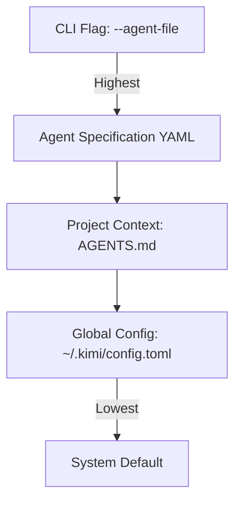

Kimi Code CLI (developed by Moonshot AI) employs a robust, Markdown-centric system for managing system prompts. Unlike other agents that may rely on complex XML structures, Kimi Code prioritizes human-readable Markdown files and a flexible "Agent Specification" system to define behavior and context.

### CLI Switches for System Prompts

Kimi Code does not provide a direct `--system-prompt "text"` flag. Instead, it uses an abstraction called **Agents**.

| Switch                | Purpose                                                                                                                                                       |
|:----------------------|:--------------------------------------------------------------------------------------------------------------------------------------------------------------|
| `--agent <NAME>`      | Selects a built-in agent (e.g., `default`, `okabe`). Each built-in agent has a hardcoded system prompt and toolset.                                           |
| `--agent-file <FILE>` | Loads a custom **Agent Specification (YAML)**. This is the primary method for providing a completely custom system prompt via the `system_prompt_path` field. |

### Prompt Manipulation via Injection

Beyond CLI switches, Kimi Code uses a template-based injection system that allows for dynamic prompt manipulation without replacing the base instructions.

* **`AGENTS.md`**: If present in the project root, its contents are automatically injected into the system prompt via the `${KIMI_AGENTS_MD}` variable. This is the "canonical" way to provide project-specific rules.
* **Agent Skills**: Directories containing a `SKILL.md` are discovered at startup. Their metadata is injected via `${KIMI_SKILLS}`, allowing the agent to decide when to "open" a skill.
* **Built-in Variables**: The following variables are available for use in any `system_prompt_path` file:

    * `${KIMI_NOW}`: Current ISO timestamp.
    * `${KIMI_WORK_DIR}`: Current working directory path.
    * `${KIMI_WORK_DIR_LS}`: Recursive directory listing of the project.

### Agent and Subagent Distinctness

Kimi Code supports a hierarchical agent model. An "orchestrator" agent can delegate tasks to subagents defined in its YAML specification.

* **Independent Prompts**: Each subagent can have its own `system_prompt_path` and `tools` list.
* **Inheritance**: Subagents can use the `extend: default` directive to inherit base capabilities while overriding the system prompt.
* **Variable Scoping**: Project-level context (`AGENTS.md`) is typically injected into both the orchestrator and all subagents unless explicitly excluded in the YAML spec.

### Precedence Logic

The final system prompt is determined by a strict hierarchy of configuration sources:

### Quirks and Workarounds

* **No Direct Flag**: The lack of a `--system-prompt` flag is a common friction point. Developers often create a "scratch" YAML file in `/tmp` to pass ad-hoc prompts.
* **Thinking Mode Binary**: "Thinking" (deep reasoning) is a binary on/off toggle (`--thinking`). It cannot be "weighted" via the prompt; it must be supported by the underlying model's capabilities.
* **Ralph Mode (v1.7.0)**: Recent updates introduced "Ralph Mode" (`--max-ralph-iterations`), which allows the agent to loop autonomously. Developers have found that adding "Keep going until tests pass" to `AGENTS.md` triggers this mode more reliably than CLI flags alone.

### Recent Changes (2026)

* **Feb 2026 (v1.7.0)**: Introduction of **Ralph Mode**. This added the `loop` configuration to the agent specification, allowing developers to define iteration limits directly in the prompt-affecting YAML or `AGENTS.md`.
* **Jan 2026**: Wire Protocol v1.3 was stabilized, allowing custom UIs to "inject" messages into the system prompt stream mid-session using the `update_context` RPC method.

### Best Practices for Formatting

Kimi Code is optimized for **Markdown**. While the underlying Moonshot models can parse XML, the CLI's internal processing logic (like variable expansion and skill discovery) is built for Markdown.

* **Appending**: Use **Pure Markdown** in `AGENTS.md`. Avoid wrapping it in tags, as Kimi Code already injects it into a structured template.
* **Replacing**: Use a **Markdown file** (.md) and point to it via `system_prompt_path` in an Agent YAML.
* **Structure**: Use H2 and H3 headers to separate concerns (e.g., `## Project Architecture`, `## Coding Standards`). This helps the agent index the instructions more efficiently than flat text.
