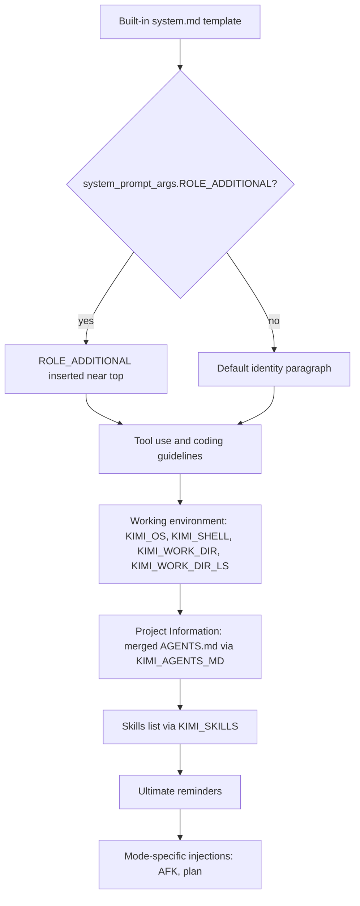

## Overview

Kimi Code CLI (the `kimi` Python package from Moonshot AI) does not expose a direct `--system-prompt` or `--append-system-prompt` flag. Instead, it builds the effective system prompt from a layered, template-driven pipeline:

1. A built-in Markdown template (`system.md`) shipped with the package.
2. Optional variable substitutions such as `${ROLE_ADDITIONAL}`, `${KIMI_AGENTS_MD}`, `${KIMI_SKILLS}`, and `${KIMI_ADDITIONAL_DIRS_INFO}`.
3. Project-level `AGENTS.md` files discovered from the git root down to the working directory.
4. Discovered Agent Skills.
5. Mode-specific injections (plan mode, AFK mode).
6. Custom agent specifications loaded via `--agent-file`.

This means Claudine cannot pass a file directly to a native append/replace flag. The wrapper must generate a temporary agent-spec YAML file that either extends the built-in `default` agent and injects additional instructions, or replaces the system prompt entirely by pointing `system_prompt_path` at a temporary Markdown file.

Important transition note: the `kimi-cli` repository is being wound down in favor of a new standalone [Kimi Code](https://github.com/MoonshotAI/kimi-code) project. Installing Kimi Code migrates configuration and sessions automatically. The findings below apply to the documented `kimi-cli` behavior.

## CLI Parameters

| Flag | Mode | Effect |
| :--- | :--- | :--- |
| `--agent-file <path>` | Replace | Loads a custom agent YAML. Its `system_prompt_path` becomes the session system prompt. |
| `--agent <name>` | Other | Selects a built-in agent (`default` or `okabe`), each with a hardcoded prompt and toolset. |
| `--config-file <path>` | Modify | Loads an alternate `~/.kimi/config.toml`; can change hooks, skills, and mode defaults that affect prompt injections. |
| `--config <string>` | Modify | Passes TOML/JSON config inline. |
| `--skills-dir <path>` | Modify | Adds skill directories; skills are injected into the system prompt. Repeatable. |
| `--add-dir <path>` | Modify | Adds workspace directories; rendered as `${KIMI_ADDITIONAL_DIRS_INFO}` in the system prompt. |
| `--thinking` / `--no-thinking` | Modify | Toggles reasoning mode; does not change system prompt text. |
| `--plan` | Modify | Starts in plan mode with tool restrictions and plan-mode constraints. |
| `--yolo` / `--afk` | Modify | Auto-approves tool calls. AFK injects a system reminder; YOLO no longer does as of v1.40.0. |

`--agent` and `--agent-file` are mutually exclusive. There is no equivalent of `--append-system-prompt-file`.

## Configuration and Discovery

### Agent specification files

Agents are defined in YAML. A minimal custom agent that replaces the system prompt looks like:

```yaml
version: 1
agent:
  name: my-agent
  system_prompt_path: ./system.md
  tools:
    - "kimi_cli.tools.shell:Shell"
    - "kimi_cli.tools.file:ReadFile"
```

To keep the default toolset while replacing or extending the prompt, use `extend: default`:

```yaml
version: 1
agent:
  extend: default
  system_prompt_path: ./my-prompt.md
```

### `AGENTS.md` hierarchy

`AGENTS.md` files are discovered from the git project root down to the working directory, including `.kimi/AGENTS.md` at each level. Their merged content is injected into the built-in `system.md` template via `${KIMI_AGENTS_MD}`. Deeper files take precedence under a 32 KiB budget cap. This is the closest native equivalent to appending project instructions, but it requires writing files into the project tree.

### Skills

Skills are directories containing `SKILL.md`. Kimi Code CLI discovers them from user, project, and extra directories (including `.claude/skills/` and `.codex/skills/`). As of v1.39.0, all existing brand directories are merged by default (`merge_all_available_skills = true`). The list of discovered skills is injected into the system prompt; the AI decides when to read an individual `SKILL.md`.

### Configuration file

`~/.kimi/config.toml` controls hooks, skills directories, loop control, and mode defaults. It does not contain a free-form system prompt key.

## Prompt Layers and Precedence

The final system prompt is assembled from the following layers, from most foundational to most specific:



Notes:

- `--agent-file` with a custom `system_prompt_path` replaces layer A entirely. The custom file can still reference variables like `${KIMI_AGENTS_MD}` and `${KIMI_SKILLS}` if desired.
- `ROLE_ADDITIONAL` is the only built-in variable designed for arbitrary additional instructions.
- `AGENTS.md` and skills are injected into the template, not appended as separate context messages.

## Agents and Subagents

Kimi Code CLI supports custom agents and subagents through YAML specifications.

- Custom agents are loaded with `--agent-file`. The Markdown file referenced by `system_prompt_path` becomes the agent's system prompt.
- `extend: default` inherits the built-in default agent's tools and other fields; overridden fields replace inherited ones. `system_prompt_args` are merged.
- Subagents are defined under the `subagents` key and launched via the `Agent` tool. Each subagent has its own system prompt and isolated context history.
- Built-in subagent types (`coder`, `explore`, `plan`) have restricted tool lists.
- As of v1.42.0, plan-mode and AFK-mode workflow prompt injections are root-only; subagents share session mode state but do not receive those injections.
- Subagents cannot create their own subagents.

## Format Recommendations

| Goal | Recommended format | Rationale |
| :--- | :--- | :--- |
| Append | Plain Markdown | The native template is Markdown with `${VAR}` substitutions; Markdown headers and lists blend cleanly with the existing structure. |
| Replace | XML-wrapped Markdown | When the default template is replaced entirely, XML tags (`<identity>`, `<rules>`, `<constraints>`, `<examples>`) help preserve the structure that the model expects. |

Because a replacement drops the built-in tool-use guidance, coding conventions, and environment context, the replacement prompt must explicitly supply whatever the task still needs.

## Recent Changes

- **v1.47.0 (2026-06-05)**: Added migration nudges to the new standalone Kimi Code, including `/upgrade`.
- **v1.43.0 (2026-05-12)**: Plan-mode and AFK-mode workflow prompts are no longer injected into subagents.
- **v1.40.0 (2026-04-30)**: YOLO mode no longer injects a non-interactive system reminder; AFK mode handles unattended execution.
- **v1.39.0 (2026-04-22)**: Skills are grouped by scope in the system prompt and `merge_all_available_skills` defaults to `true`.
- **v1.28.0 (2026-03-30)**: Added lifecycle hooks (Beta) with 13 events.
- **v1.27.0 (2026-03-25)**: System prompt strengthened to encourage tool use for coding tasks.

## Quirks and Workarounds

- There is no native `--system-prompt` or `--append-system-prompt` flag. Developers who need ad-hoc prompt changes typically create a temporary agent YAML and pass it with `--agent-file`.
- The built-in `system.md` is a template, not a static string. Variables like `${KIMI_AGENTS_MD}` are filled at runtime.
- `ROLE_ADDITIONAL` is the cleanest append point when extending `default`, but it places content near the top of the prompt, not the end.
- To append at the end of the prompt without mutating the project, the only robust path is to copy the default `system.md` content into a custom `system_prompt_path` file and add instructions at the end.
- Skills from `.claude/skills/` and `.codex/skills/` can be merged into the Kimi prompt by default, which may surprise users migrating from other agents.
- `--add-dir` expands workspace scope but it is not documented whether it also causes `AGENTS.md` discovery in added directories.

## Claudine Delivery Notes

Claudine should deliver `--append-system-prompt` and `--replace-system-prompt` through temporary agent specifications:

- **Append**: Create a temporary agent YAML that extends `default` and sets `system_prompt_args.ROLE_ADDITIONAL` to the resolved append content. Pass the YAML via `--agent-file`. This avoids mutating the user's `AGENTS.md` or `config.toml`.
- **Replace**: Create a temporary agent YAML with `system_prompt_path` pointing to a temporary Markdown file containing the full replacement prompt. Pass the YAML via `--agent-file`.
- Both modes require temp files and cleanup on exit.
- Because the default system prompt template is not exposed through a CLI export, Claudine cannot automatically prepend the default content for an end-of-prompt append. `ROLE_ADDITIONAL` append is the practical default.

## Changelog

- Refreshed research against Kimi CLI v1.48.0 documentation and source.
- Documented agent-spec-based append/replace strategy for Claudine using `system_prompt_args.ROLE_ADDITIONAL` and `system_prompt_path`.
- Corrected prior overstatement that `AGENTS.md` is the canonical append path; it mutates project state.

## Sources

- [Kimi Code CLI documentation](https://moonshotai.github.io/kimi-cli/en/)
- [Agents and Subagents](https://moonshotai.github.io/kimi-cli/en/customization/agents.md)
- [Agent Skills](https://moonshotai.github.io/kimi-cli/en/customization/skills.md)
- [Config Files](https://moonshotai.github.io/kimi-cli/en/configuration/config-files.md)
- [Environment Variables](https://moonshotai.github.io/kimi-cli/en/configuration/env-vars.md)
- [Config Overrides](https://moonshotai.github.io/kimi-cli/en/configuration/overrides.md)
- [`kimi` Command Reference](https://moonshotai.github.io/kimi-cli/en/reference/kimi-command.md)
- [Print Mode](https://moonshotai.github.io/kimi-cli/en/customization/print-mode.md)
- [Hooks (Beta)](https://moonshotai.github.io/kimi-cli/en/customization/hooks.md)
- [Sessions and Context](https://moonshotai.github.io/kimi-cli/en/guides/sessions.md)
- [Changelog](https://moonshotai.github.io/kimi-cli/en/release-notes/changelog.md)
- [Kimi CLI source: `agentspec.py`](https://github.com/MoonshotAI/kimi-cli/blob/main/src/kimi_cli/agentspec.py)
- [Kimi CLI source: `agents/default/agent.yaml`](https://github.com/MoonshotAI/kimi-cli/blob/main/src/kimi_cli/agents/default/agent.yaml)
- [Kimi CLI source: `agents/default/system.md`](https://github.com/MoonshotAI/kimi-cli/blob/main/src/kimi_cli/agents/default/system.md)
- [Kimi CLI GitHub repository](https://github.com/MoonshotAI/kimi-cli)
