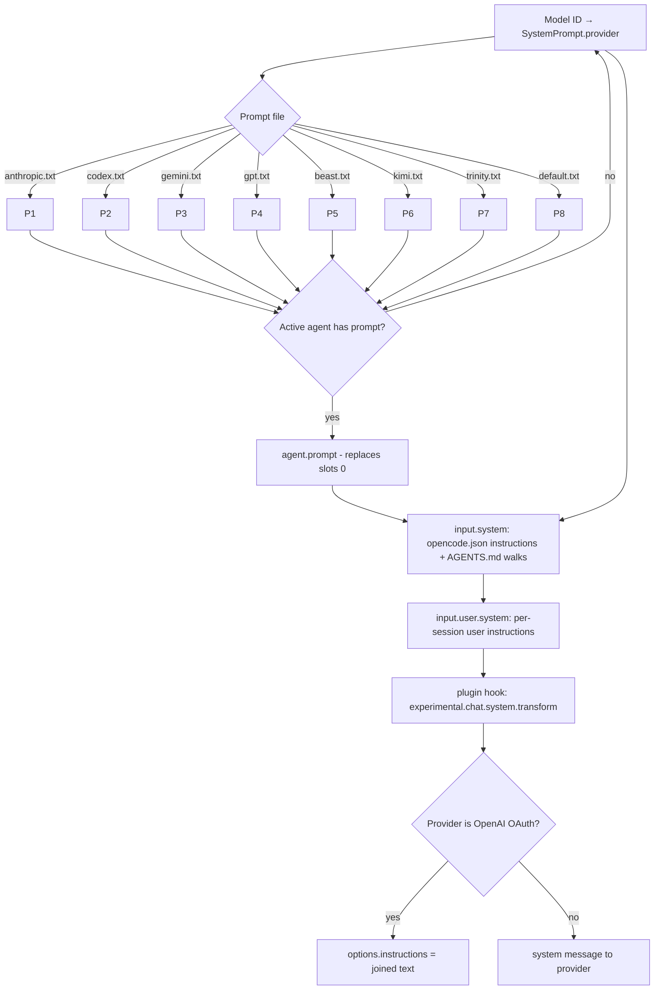

# System Prompt Handling in OpenCode CLI

## Overview

OpenCode CLI (Anomaly) has no dedicated `--system-prompt` or `--append-system-prompt` flag in v1.17.13. The only CLI parameter that influences the assembled system text is `--agent <name>`, which selects an agent whose `prompt` field replaces the stock provider/model system prompt for slot 0 of the request assembly. Every other manipulation happens through configuration files (`opencode.json`, `AGENTS.md`, `.opencode/agents/*.md`, `.opencode/skills/*`) or the `OPENCODE_CONFIG_CONTENT` environment variable.

Source of truth for the assembly is `packages/opencode/src/session/llm/request.ts:prepare()` on `dev`, which collapses the prompt into a flat string and emits it as a `system` message:

```ts
const system = [
  [
    ...(input.agent.prompt ? [input.agent.prompt] : SystemPrompt.provider(input.model)),
    ...input.system,
    ...(input.user.system ? [input.user.system] : []),
  ]
    .filter((x) => x)
    .join("\n"),
]
```

The stock provider prompt comes from `packages/opencode/src/session/system.ts:provider(model)`, which selects one of the embedded text files by substring match on `model.api.id`:

| Model substring | Prompt file |
| :--- | :--- |
| `gpt-4*`, `o1*`, `o3*` | `prompt/beast.txt` |
| `gpt*` (incl. `codex`) | `prompt/gpt.txt` or `prompt/codex.txt` |
| `gemini-*` | `prompt/gemini.txt` |
| `claude*` | `prompt/anthropic.txt` |
| `kimi*` | `prompt/kimi.txt` |
| `trinity*` | `prompt/trinity.txt` |
| fallback | `prompt/default.txt` |

Issue [#34721](https://github.com/anomalyco/opencode/issues/34721) confirms that `agent.prompt` uses replacement semantics at slot 0; no additive `systemMode` field is shipped in v1.17.13.

## CLI Parameters

`opencode run` (`v1.17.13`) accepts these flags. The only one that directly affects slot 0 of the assembled system text is `--agent`. There is no `--system-prompt`, `--append-system-prompt`, or `--prompt-instructions` flag.

| Flag | Mode | Effect |
| :--- | :--- | :--- |
| `--agent <name>` | modify | Selects an agent. If the agent defines `prompt`, that text replaces the stock per-model prompt for slot 0. |
| `--model <provider/model>` | other | Selects the model; the model ID drives `SystemPrompt.provider(model)`. |
| `--pure` | disable | Skips external plugins without changing AGENTS.md / instructions / agent prompts. |
| `--auto` | modify | Auto-approves non-`deny` permissions. Does not change prompt content. |
| `--prompt <text>` | other | Initial user prompt (TUI entrypoint only); feeds the first user message, not the system prompt. |

## Configuration and Discovery

The effective system text is assembled from several config-driven sources.

### `AGENTS.md` discovery

OpenCode walks up from the launch CWD (stopping at the git worktree) looking for the first `AGENTS.md` it finds; if none exists, it falls back to a `CLAUDE.md` for Claude-compat repos. The global layer is `~/.config/opencode/AGENTS.md`, and the Claude-compat global layer is `~/.claude/CLAUDE.md`. The first matching file per category wins.

The precedence is:

1. Project `AGENTS.md` (or `CLAUDE.md` if no `AGENTS.md`)
2. Global `~/.config/opencode/AGENTS.md`
3. Claude-compat `~/.claude/CLAUDE.md` (unless disabled)

### `opencode.json` `instructions` array

OpenCode config supports an `instructions` array of file paths and glob patterns (and remote URLs with a 5s timeout):

```jsonc
{
  "$schema": "https://opencode.ai/config.json",
  "instructions": ["CONTRIBUTING.md", "docs/guidelines.md", ".cursor/rules/*.md"]
}
```

All paths, globs, and resolved URLs are concatenated with the AGENTS.md content in slot 1 of the system text. Values must be file references; there is no inline-string form.

### Agent definitions

Agents are defined two ways. The frontmatter `prompt` field (or the file body for Markdown agents) becomes the agent's system prompt. Both inline text and `{file:path}` substitution are accepted.

JSON shape (`opencode.json`):

```jsonc
{
  "agent": {
    "review": {
      "mode": "subagent",
      "description": "Reviews code",
      "prompt": "{file:./prompts/review.txt}"
    }
  }
}
```

Markdown shape (`~/.config/opencode/agents/review.md` or `.opencode/agents/review.md`):

```markdown
---
description: Reviews code
mode: subagent
---
You are a code reviewer. Focus on security, performance, and maintainability.
```

Per docs, primary agents use `mode: primary` and can be selected via `--agent <name>` (the `Tab` key cycles between them in the TUI). Subagents (`mode: subagent`) are invoked via `@<name>` or the `task` tool. `default_agent` setting chooses the primary when none is specified; falls back to `build` if unset.

### `OPENCODE_CONFIG_CONTENT`

`OPENCODE_CONFIG_CONTENT` is an inline JSON blob applied for the running session. It wins against global and project configs but loses against managed settings. It carries the same keys as `opencode.json`, including `instructions` (append) and `agent.<name>.prompt` (replace for slot 0). Because it propagates to subagent sessions, a wrapper-injected layer is visible to every child session that starts from the same run.

### Claude compatibility

OpenCode reads `CLAUDE.md` and `.claude/skills/` by default. Three env vars gate it:

- `OPENCODE_DISABLE_CLAUDE_CODE=1` — disable both prompt and skills.
- `OPENCODE_DISABLE_CLAUDE_CODE_PROMPT=1` — disable `~/.claude/CLAUDE.md` only.
- `OPENCODE_DISABLE_CLAUDE_CODE_SKILLS=1` — disable `.claude/skills/` only.

### Managed / system configs

| OS | Path |
| :--- | :--- |
| macOS | `/Library/Application Support/opencode/opencode.json(.c)` |
| Linux | `/etc/opencode/opencode.json(.c)` |
| Windows | `%ProgramData%\opencode\opencode.json(.c)` |

macOS MDM-deployed preferences under the `ai.opencode.managed` preference domain (`/Library/Managed Preferences/ai.opencode.managed.plist`) sit at the highest priority tier and cannot be overridden by user or project config.

### Configuration precedence

The official docs give this top-down order (later sources override earlier ones only for conflicting keys):

1. Remote config (`.well-known/opencode`)
2. Global config (`~/.config/opencode/opencode.json`)
3. Custom config (`OPENCODE_CONFIG`)
4. Project config (`opencode.json` in the project root)
5. `.opencode/` directories
6. Inline config (`OPENCODE_CONFIG_CONTENT`)
7. Managed config files (`/Library/Application Support/opencode/` on macOS, `/etc/opencode/` on Linux, `%ProgramData%\opencode` on Windows)
8. macOS managed preferences (`ai.opencode.managed` plist via MDM)

Note that `OPENCODE_CONFIG_CONTENT` sits higher than managed files but lower than macOS MDM preferences, so a wrapper's overlay cannot bypass managed policy.

## Prompt Layers and Precedence

The full v2 assembly (slot 0 plus slot 1 and beyond) is:



The slot ordering matches `request.ts:prepare()`. Slot 1 is composed in `system.ts` of three independent services:

- `environment(model)` — working directory, workspace root, git/worktree, platform, today's date, available project references
- `skills(agent)` — verbose `<available_skills>` listing (filterable by permission)
- `mcp(agent)` — `<mcp_instructions>` block per MCP server with at least one allowed tool

Slot 0 is the only slot that supports replacement semantics today (per issue #34721). Every other layer appends.

## Agents and Subagents

OpenCode v1.17.13 ships:

| Category | Agents |
| :--- | :--- |
| Primary | `build`, `plan` |
| Subagent | `general`, `explore`, `scout` |
| Hidden primary | `compaction`, `title`, `summary` |

Custom agents are defined per session, project, or user (Markdown or JSON) and may include:

- `mode` — `primary`, `subagent`, or `all` (default)
- `prompt` — system prompt (inline text or `{file:path}`)
- `model` — overrides the primary's model for subagents
- `temperature`, `top_p` — sampling knobs
- `steps` — max-step cap (legacy `maxSteps` deprecated)
- `permission` — per-tool allow/ask/deny (with wildcard patterns)
- `tools` — deprecated, see `permission`
- `description` — required for `@mention` discovery
- `hidden` — hide from `@` autocomplete but allow programmatic invocation
- `color` — UI color
- Anything else — passed through as provider options

Subagents run in their own isolated child sessions; their own `prompt` replaces only their slot 0. The parent's instructions/AGENTS.md/MCP/skills layers do not propagate by default — each subagent resolves its own slot 1 from its own context. Only the final assistant summary returns to the parent.

## Format Recommendations

| Goal | Recommended format | Rationale |
| :--- | :--- | :--- |
| Append | Pure Markdown | The official `AGENTS.md` examples use Markdown headers and bullets; the embedded `prompt/*.txt` files use Markdown-flavored XML. Plain Markdown blends cleanly. |
| Replace (agent prompt) | Pure Markdown | The replacement slot 0 is read as plain text by the LLM; XML tags add no measured benefit and risk masking sections the model already covers in its stock prompt. |

For both modes the wrapper writes the prompt to a temp file and references it via `OPENCODE_CONFIG_CONTENT` (using `{file:path}` substitution or the `instructions` array).

## Recent Changes

- **v1.17.13 (2026-07-01)** — Latest stable release. No new system-prompt CLI flags; the v2 prompt-assembly code in `packages/opencode/src/session/llm/request.ts` remains unchanged from issue #34721's snapshot.
- **Issue #34721 (2026-07-01)** — Documented that custom agent `prompt` values use replacement semantics at slot 0; requested an additive `systemMode: append` field for the 2.0 branch.
- **v1.17.10 (2026-06-24)** — Added MCP server instructions to session context (now emitted via `SystemPrompt.mcp` and the `<mcp_instructions>` block).
- **v1.16.2 (2026-06-05)** — Sessions now persist system-context updates during long-running conversations; compaction preserves the assembled layers.
- **v1.16.0 (2026-06-05)** — Added skill discovery and file-based agent loading; agent definition surfaces transitioned to filesystem discovery.
- **Issue #20695 (2026-04-02)** — Memory megathread opened by `@thdxr`. Umbrella for cross-session memory and instruction-file scope; no prompt-surface change yet.

## Quirks and Workarounds

- The dedicated CLI flag for system-prompt manipulation does not exist; wrappers must rely on `OPENCODE_CONFIG_CONTENT` (with a temp file) for append and on a wrapper-named agent for replace.
- A custom agent's `prompt` only replaces slot 0; everything below (instructions, AGENTS.md, environment, skills, MCP) is appended independently and is unaffected by the replacement.
- The `prompt` field accepts both inline strings and `{file:path}` substitution; the substitution engine is shared with the rest of the config (`{env:VAR}` and `{file:path}` resolve at config-load time).
- The provider prompt selection in `system.ts:provider()` is a substring match on `model.api.id`; renaming a model (e.g. `claude-5-fable` if not `claude-…`-prefixed) can silently route to `PROMPT_DEFAULT`.
- `OPENCODE_CONFIG_CONTENT` propagates to subagent sessions, so any injected layer reaches every child session including hidden primary agents (`compaction`, `title`, `summary`).
- `--pure` only disables external `plugin` entries; it does not disable `AGENTS.md`, `instructions`, agent prompts, MCP, or skills.
- OpenAI-OAuth paths promote the assembled system text into `options.instructions` rather than sending a system message (`request.ts:60`).
- `opencode export --sanitize` exports session data as JSON, but issue [#26376](https://github.com/anomalyco/opencode/issues/26376) (open since 2026-05-08) has not yet landed a way to persist or view the effective system prompt text.
- The `default_agent` setting chooses the primary agent when none is named; setting it globally only affects subsequent sessions and does not bypass a wrapper's `--agent <name>`.
- Plugin hook `experimental.chat.system.transform` is the only documented way to mutate the assembled system array at runtime; OpenCode does not expose a stable public API for it.
- macOS MDM preferences under `ai.opencode.managed` sit at the highest priority tier, so a wrapper cannot override managed `instruction` or `agent.*.prompt` entries by setting `OPENCODE_CONFIG_CONTENT`.

## Claudine Delivery Notes

OpenCode's lack of a native `--system-prompt` flag means Claudine's existing `Unsupported` classification for append is updated to `env_var_file`, and replace remains an agent-spec delivery.

**Append** — write the resolved prompt body to a temp file (for example, `/tmp/claudine-system.md`) and export:

```sh
OPENCODE_CONFIG_CONTENT='{"instructions":["/tmp/claudine-system.md"]}' \
  opencode run "Refactor auth"
```

For large prompts, increase reliability by also passing an absolute path. Because `OPENCODE_CONFIG_CONTENT` is also used for MCP injection and YOLO-permission overlays, the wrapper's `merge_overlay` helper in `claudine/lib/src/opencode_config.rs` should compose the three payloads under one `OPENCODE_CONFIG_CONTENT` blob (deep-merge `instructions`, `mcp`, `permission`, etc.) rather than overwriting the variable.

**Replace** — write the prompt body to a temp file, then define an agent:

```sh
OPENCODE_CONFIG_CONTENT='{"agent":{"claudine":{"mode":"primary","description":"Claudine wrapper agent","prompt":"{file:/tmp/claudine-system.md}"}}}' \
  opencode run --agent claudine "Refactor auth"
```

The temporary file lives only for the duration of the spawned process; no `~/.config/opencode/opencode.json` or `AGENTS.md` is touched. Because `OPENCODE_CONFIG_CONTENT` sits below macOS MDM-managed preferences, wrapper delivery cannot bypass managed policy.

## Changelog

- **2026-07-03 curation edit** — Rewrote the four `os: windows` `config_sources` paths in Windows form (`%USERPROFILE%\.config\opencode\…`, `%USERPROFILE%\.claude\CLAUDE.md`): OpenCode resolves these dirs home-relative on every OS, so the locations were correct but unix-styled; also removed a stray `%APPDATA%` reference in the notes. Cross-validated against the agent-cli topic's host-evidence records.
- **2026-07-03 refresh** — Switched `created` / `agent` / `model` frontmatter per the prompt contract. Expanded `cli_params` to every documented `opencode run` flag with verified 1.17.13 `--help` output. Expanded `config_sources` to per-OS records (macos/linux/windows) for `AGENTS.md`, `CLAUDE.md`, `opencode.json`, `agents/*.md`, and `<name>/prompt.txt`; added managed-config paths for all three OSes plus the macOS MDM `ai.opencode.managed` plist domain. Expanded `env_vars` to cover every `OPENCODE_*` env var that touches prompt discovery, agent config, MCP, model fetches, or the system layer (per the CLI docs Environment variables section). Rebuilt `prompt_layers` to mirror the v2 source-of-truth assembly in `packages/opencode/src/session/llm/request.ts:prepare()` and the three `system.ts` services (`environment`, `skills`, `mcp`). Updated `agent_prompting` so the slot-0 replacement semantics per issue #34721 are explicit (the agent's `prompt` does not replace the entire effective system prompt, only slot 0). Updated `recent_changes` with v1.17.13, issue #34721, v1.17.10 (MCP server instructions to session context), v1.16.2 (system context updates persist), v1.16.0 (skill discovery and file-based agent loading), and issue #20695 (memory megathread). Added quirks for the v2 substitution engine, the OpenAI-OAuth `options.instructions` promotion, and the substring-match model-routing in `system.ts`. Switched `claudine_delivery.append_strategy` from `unsupported` to `env_var_file` (still `agent_spec` for replace), and added concrete `OPENCODE_CONFIG_CONTENT` invocations showing the wrapper temp-file path. Updated `format_recommendations` to recommend plain Markdown for both append and replace, because the provider prompt files (`prompt/*.txt`) are themselves Markdown-flavored XML and the model handles inline Markdown cleanly.

## Sources

- [OpenCode docs homepage](https://opencode.ai/docs)
- [OpenCode rules / AGENTS.md docs](https://opencode.ai/docs/rules)
- [OpenCode config docs](https://opencode.ai/docs/config)
- [OpenCode agents docs](https://opencode.ai/docs/agents)
- [OpenCode CLI docs](https://opencode.ai/docs/cli)
- [OpenCode skills docs](https://opencode.ai/docs/skills)
- [OpenCode permissions docs](https://opencode.ai/docs/permissions)
- [OpenCode changelog](https://opencode.ai/changelog)
- [`packages/opencode/src/session/system.ts`](https://github.com/anomalyco/opencode/blob/dev/packages/opencode/src/session/system.ts)
- [`packages/opencode/src/session/llm/request.ts`](https://github.com/anomalyco/opencode/blob/dev/packages/opencode/src/session/llm/request.ts)
- [GitHub issue #34721 — agent: support additive custom system prompts](https://github.com/anomalyco/opencode/issues/34721)
- [GitHub issue #34341 — Load AGENTS.md progressively via read-tool plugin context](https://github.com/anomalyco/opencode/issues/34341)
- [GitHub issue #26376 — Save dynamically generated system prompt to opencode.db](https://github.com/anomalyco/opencode/issues/26376)
- [GitHub issue #20695 — Memory Megathread](https://github.com/anomalyco/opencode/issues/20695)
- [OpenCode repository](https://github.com/anomalyco/opencode)
