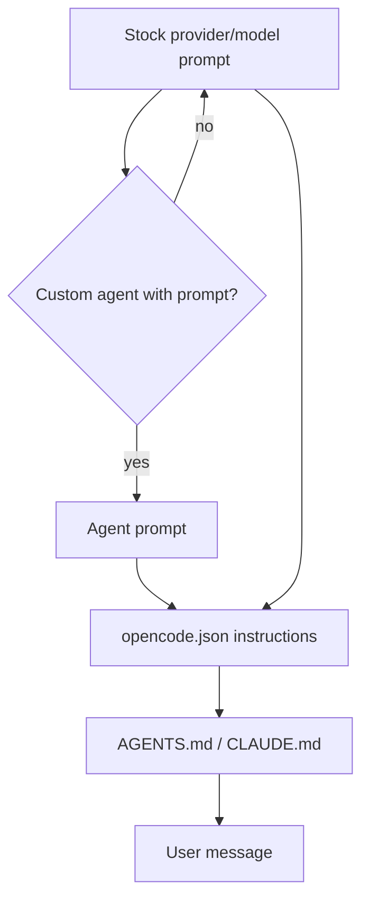

## Overview

OpenCode CLI (Anomaly) does not expose a dedicated system-prompt flag in `opencode run` or the base TUI entrypoint. As of v1.17.13, the only CLI switch that changes the effective system prompt is `--agent`, which selects a preconfigured agent whose `prompt` replaces the provider-specific stock prompt. All other system-prompt manipulation happens through configuration files (`opencode.json`, `AGENTS.md`, `.opencode/agents/*.md`) or the `OPENCODE_CONFIG_CONTENT` environment variable. This makes OpenCode the outlier among the providers Claudine wraps: there is no inline or file-backed `--append-system-prompt` equivalent, and replacement is only partial (agent prompt replaces the provider layer, not project instruction files).

## CLI Parameters

OpenCode `run` accepts no flag whose primary purpose is to append or replace the system prompt.

| Flag | Mode | Effect |
| :--- | :--- | :--- |
| `--agent <name>` | modify | Selects a custom or built-in agent. If the agent defines a `prompt`, that prompt replaces the provider stock prompt for the session. |
| `--model <provider/model>` | other | Chooses the model. Model selection determines which provider-specific stock prompt is loaded, but does not accept custom text. |
| `--pure` | disable | Skips external plugins. Does not disable `AGENTS.md`, `instructions`, or agent prompts. |
| `--auto` | modify | Auto-approves permissions. Affects execution policy, not prompt content. |

There is no `--system`, `--system-prompt`, `--append-system-prompt`, `--prompt-instructions`, or similar switch in `opencode run --help` (v1.17.13).

## Configuration and Discovery

Effective instructions are assembled from several config-driven sources.

### `AGENTS.md` hierarchy

OpenCode discovers `AGENTS.md` files by walking up from the current working directory. `CLAUDE.md` is used as a fallback when no `AGENTS.md` exists. Precedence:

1. Project `AGENTS.md` (or `CLAUDE.md` if no `AGENTS.md`)
2. Global `~/.config/opencode/AGENTS.md` (or `~/.claude/CLAUDE.md` as fallback)

`AGENTS.md` content is treated as project/user context and appended to the system text. There is no documented CLI flag to skip this discovery for a single run.

### `opencode.json` and `instructions`

`opencode.json` (project, global, or inline via `OPENCODE_CONFIG_CONTENT`) supports an `instructions` array of file paths and glob patterns. These files are included as additional system instructions, appended after the agent/provider prompt layer.

```json
{
  "$schema": "https://opencode.ai/config.json",
  "instructions": ["CONTRIBUTING.md", "docs/guidelines.md", ".cursor/rules/*.md"]
}
```

Values are file references, not inline strings. Remote URLs are also supported with a five-second timeout.

### Agent definitions

Agents can be defined in `opencode.json` or as Markdown files in `.opencode/agents/` or `~/.config/opencode/agents/`. The frontmatter `prompt` field (or the file body for Markdown agents) becomes the agent's system prompt. When active, this prompt replaces the provider-specific stock prompt.

```json
{
  "agent": {
    "review": {
      "mode": "subagent",
      "description": "Reviews code",
      "prompt": "You are a code reviewer. Focus on security, performance, and maintainability."
    }
  }
}
```

Primary agents (`mode: primary`) can be selected with `--agent`; subagents are invoked via `@mention` or the `task` tool.

### `OPENCODE_CONFIG_CONTENT`

`OPENCODE_CONFIG_CONTENT` holds a raw JSON object that is applied session-wide, including to subagent sessions. It is the natural per-invocation delivery surface for wrappers, because it does not require writing to the project `opencode.json` or `AGENTS.md`.

### `OPENCODE_DISABLE_CLAUDE_CODE*`

For users migrating from Claude Code, OpenCode reads `CLAUDE.md` and `.claude/skills/` by default. These can be disabled with:

- `OPENCODE_DISABLE_CLAUDE_CODE=1` — disable all `.claude` support
- `OPENCODE_DISABLE_CLAUDE_CODE_PROMPT=1` — disable `~/.claude/CLAUDE.md`
- `OPENCODE_DISABLE_CLAUDE_CODE_SKILLS=1` — disable `.claude/skills`

## Prompt Layers and Precedence

The effective system text is built from the following layers, from base to final.



- The stock prompt is selected by model/provider and is not published verbatim.
- A custom agent `prompt` replaces the stock prompt (not appended).
- `instructions` files are appended after the agent/stock prompt.
- `AGENTS.md` / `CLAUDE.md` are appended after `instructions`.

This ordering is consistent with the request assembly shown in GitHub issue #34721, where `agent.prompt` is used in place of `SystemPrompt.provider(model)` and `input.system` / `input.user.system` are appended afterward.

## Agents and Subagents

OpenCode supports both primary and subagent definitions with their own prompts.

- **Primary agents** are cycled with the `Tab` key or selected via `--agent`. The built-in primary agents are `build` and `plan`.
- **Subagents** are invoked with `@mention` or automatically by the primary agent via the `task` tool. Built-in subagents include `general`, `explore`, and `scout`.
- Each agent can define its own `prompt`, `model`, `temperature`, `permissions`, and `tools`.
- Subagents run in isolated child sessions; only the final summary returns to the parent.
- As of v1.17.13, a custom agent prompt **replaces** the stock provider prompt. There is no documented additive mode (issue #34721 requests `systemMode: append` for 2.0).

## Format Recommendations

| Goal | Recommended format | Rationale |
| :--- | :--- | :--- |
| Append | Pure Markdown | Appended instructions are concatenated with `AGENTS.md` and the stock prompt; headers and bullet lists blend cleanly. |
| Replace (agent prompt) | XML-wrapped Markdown | The agent prompt must be self-contained because it replaces the provider-specific operational prompt. XML tags help the model distinguish rules, constraints, context, and examples. |

When replacing, the prompt author becomes responsible for any tool-calling guidance the task still needs, because the provider-specific stock prompt is removed.

## Recent Changes

- **v1.17.13 (2026-07-01)** — Latest stable release. No new system-prompt CLI flags were added.
- **Issue #34721 (2026-07-01)** — Documented that custom agent prompts currently replace the stock provider/model prompt rather than appending to it, and requested an additive mode for 2.0.
- **Issue #34341 (2026-06-28)** — Proposed progressive, path-scoped `AGENTS.md` loading in V2, where read-tool events trigger discovery of nearby instruction files.
- **Issue #26376 (2026-05-08)** — Requested persisting the dynamically generated system prompt in `opencode.db` so transcript exports include it. As of v1.17.13, no inspect/export surface exists.

## Quirks and Workarounds

- There is no direct CLI flag for appending or replacing the system prompt. Workarounds rely on `OPENCODE_CONFIG_CONTENT`, agent definitions, or temporary `AGENTS.md` files.
- Because `AGENTS.md` is auto-discovered by directory walk, a wrapper that wants a clean replacement must either use a custom agent or place files outside the discovery path; there is no `--no-agents-md` switch.
- `OPENCODE_CONFIG_CONTENT` propagates to subagent sessions, so wrapper-injected instructions are not limited to the parent run.
- The `instructions` array accepts file paths/globs, not inline strings. A wrapper must write prompt text to a temporary file and reference it.
- `--pure` disables external plugins but leaves config-based instructions intact.

## Claudine Delivery Notes

Claudine's `SystemPromptSpec` for OpenCode currently marks both append and replace as `Unsupported`. The research points to the following delivery paths:

- **Append**: Use `OPENCODE_CONFIG_CONTENT` to inject `{"instructions": ["<tmp_file>"]}`. The temp file contains the composed prompt text. This avoids mutating project `opencode.json` or `AGENTS.md`, but requires a new `SystemPromptDelivery` variant because `OPENCODE_CONFIG_CONTENT` is neither a file path nor a standard CLI config flag.
- **Replace**: Use `OPENCODE_CONFIG_CONTENT` to define a primary agent with a custom `prompt`, then invoke `opencode run` with `--agent <name>`. This replaces only the provider stock prompt layer; `instructions` and `AGENTS.md` layers may still be appended. A true full-system-prompt replacement is not possible without also disabling `AGENTS.md` discovery, which OpenCode does not currently expose per-run.

Because `OPENCODE_CONFIG_CONTENT` is already the channel Claudine uses for MCP injection and YOLO permissions, the existing `merge_overlay` helper in `claudine/lib/src/opencode_config.rs` should be reused so the system-prompt overlay does not clobber MCP or permission overlays.

## Sources

- [OpenCode docs homepage](https://opencode.ai/docs)
- [OpenCode rules / AGENTS.md docs](https://opencode.ai/docs/rules)
- [OpenCode config docs](https://opencode.ai/docs/config)
- [OpenCode agents docs](https://opencode.ai/docs/agents)
- [OpenCode CLI docs](https://opencode.ai/docs/cli)
- [OpenCode plugins docs](https://opencode.ai/docs/plugins)
- [OpenCode agent skills docs](https://opencode.ai/docs/skills)
- [OpenCode changelog](https://opencode.ai/changelog)
- [GitHub issue #34721 — agent: support additive custom system prompts](https://github.com/anomalyco/opencode/issues/34721)
- [GitHub issue #34341 — Load AGENTS.md progressively via read-tool plugin context](https://github.com/anomalyco/opencode/issues/34341)
- [GitHub issue #26376 — Save dynamically generated system prompt to opencode.db](https://github.com/anomalyco/opencode/issues/26376)
