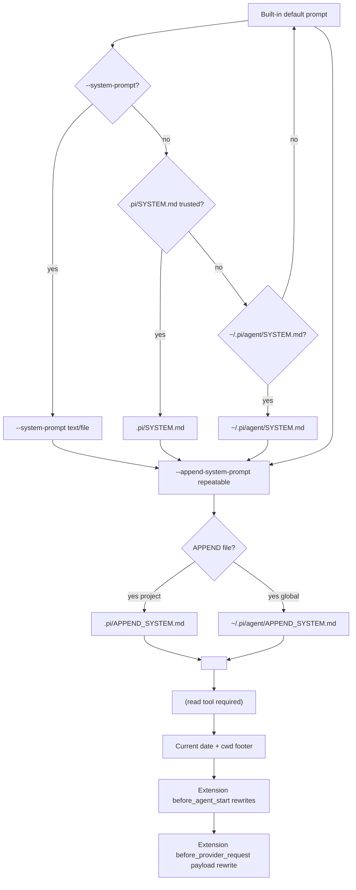

# Pi System Prompt Research

## Overview

Pi is a minimal, TypeScript-first coding-agent harness from Earendil Inc. ([pi.dev](https://pi.dev/), repo [earendil-works/pi](https://github.com/earendil-works/pi)). Unlike Claude Code or Gemini, Pi ships an aggressively minimal default prompt and treats the system prompt as a programmable surface rather than a sealed artifact — extensions can rewrite it per-turn, and `SYSTEM.md` / `APPEND_SYSTEM.md` files in the global and project config roots provide first-class file-based replacement and append without a custom agent spec.

The package version verified for this research is `0.80.3` (released 2026-06-30). The CLI binary is `pi` (npm: `@earendil-works/pi-coding-agent`); the four execution modes are interactive (TUI), print (`-p`), JSON (`--mode json`), and RPC (`--mode rpc`). The system prompt is constructed in `src/core/system-prompt.ts` (`buildSystemPrompt`) and is layered, in order: an optional replacement string, the default coding-agent paragraph, an optional append string, an XML `<project_context>` block of `AGENTS.md`/`CLAUDE.md` files, an XML `<available_skills>` block, and finally `Current date` / `Current working directory` lines.

Pi's central distinction for Claudine is that **file-flag delivery is already native**: `--system-prompt` and `--append-system-prompt` both auto-detect when their value points to an existing file and read its contents (see `resolvePromptInput` in `src/core/resource-loader.ts`). Claudine does not need to invent a separate `--*-file` flag.

## CLI Parameters

The Pi CLI exposes two flags that directly control the system prompt and a handful of related ones that affect adjacent layers.

| Flag | Mode | Effect |
| :--- | :--- | :--- |
| `--system-prompt <text-or-file>` | Replace | Replaces the default system prompt for the invocation. |
| `--append-system-prompt <text-or-file>` | Append | Appends to the default system prompt. Repeatable; values accumulate in array order. |
| `--no-context-files` / `-nc` | Disable | Skips `AGENTS.md` / `CLAUDE.md` discovery and loading. |
| `--no-skills` / `-ns` | Disable | Skips skill discovery and the `<available_skills>` block. |
| `--no-extensions` / `-ne` | Disable | Skips extension discovery (explicit `-e` paths still load). |
| `--approve` / `-a` | Modify | Trusts project-local files for this run; required in `-p`/`json`/`rpc` modes to load `.pi/SYSTEM.md`, `.pi/APPEND_SYSTEM.md`, `.pi/AGENTS.md`, project skills. |
| `--no-approve` / `-na` | Modify | Ignores project-local files for this run regardless of saved trust. |

Key behaviors to keep in mind:

- Both `--system-prompt` and `--append-system-prompt` accept either an inline string or an existing file path. The resource loader checks `existsSync(value)` first; on hit it reads the file with `readFileSync(value, "utf-8")`, on miss it uses the value as text (and warns if reading fails).
- Replacement does not disable downstream layers. AGENTS.md/CLAUDE.md context, skills, and the date/cwd footer are still appended after `--system-prompt` (see `buildSystemPrompt`).
- Appending cannot override the "You are an expert coding assistant" identity line — that sits before any appended text and wins by ordering (issue #6127).
- The CLI also exposes `--print`/`-p`, `--mode json`, `--mode rpc`, and `--tools`/`--no-tools`. Tool selection changes the system prompt indirectly because the `<available_skills>` block only renders when `read` is active.

## Configuration and Discovery

Pi's prompt is shaped by five files and one directory tree, in this lookup order:

1. **`--system-prompt`** (CLI value, file or text). If absent, falls through.
2. **`.pi/SYSTEM.md`** in the project root (trusted projects only).
3. **`~/.pi/agent/SYSTEM.md`** (global).
4. **Built-in default prompt** (`buildSystemPrompt` in `src/core/system-prompt.ts`). Anchors the coding-agent identity.
5. **`--append-system-prompt`** values (CLI, repeatable, file or text).
6. **`.pi/APPEND_SYSTEM.md`** (project, trusted).
7. **`~/.pi/agent/APPEND_SYSTEM.md`** (global).
8. **`<project_context>`** from `AGENTS.md` / `CLAUDE.md` files (case-insensitive match per directory).
9. **`<available_skills>`** from `~/.pi/agent/skills/`, `~/.agents/skills/`, `.pi/skills/`, `.agents/skills/` (cwd and ancestors).
10. **Current date** and **current working directory** (always last).

The AGENTS.md walker in `loadProjectContextFiles` reads:

1. `~/.pi/agent/AGENTS.md` (or `AGENTS.MD`, `CLAUDE.md`, `CLAUDE.MD`) once.
2. Then walks from `cwd` up to filesystem root, prepending each directory's first-matching file to the list.
3. The cwd file ends up last in the emitted `<project_context>` block, so the most specific instructions win by ordering.

File-based replacement and append are completely opt-in. With nothing discovered, the built-in default prompt is used unmodified, plus AGENTS.md context and skills.

### Project trust

Project-local resources (anything under `./.pi/`) require trust. Interactive mode prompts via `project_trust`; non-interactive modes consult `defaultProjectTrust` (`"ask"` / `"always"` / `"never"`) in `~/.pi/agent/settings.json`. `--approve` / `-a` is the one-shot override.

### Default prompt structure

The built-in default (from `buildSystemPrompt`) reads roughly:

```
You are an expert coding assistant operating inside pi, a coding agent harness. You help users by reading files, executing commands, editing code, and writing new files.

Available tools:
- read: <snippet>
- bash: <snippet>
- edit: <snippet>
- write: <snippet>

In addition to the tools above, you may have access to other custom tools depending on the project.

Guidelines:
- <dynamic guidelines based on active tools>
- Be concise in your responses
- Show file paths clearly when working with files

Pi documentation (read only when the user asks about pi itself, its SDK, extensions, themes, skills, or TUI):
- Main documentation: <abs path>
- Additional docs: <abs path>
- Examples: <abs path>
...
```

This is followed by the append section, the `<project_context>` block, the `<available_skills>` block, and the date/cwd footer.

## Prompt Layers and Precedence



Notes:

- Replacement sources (`--system-prompt`, `SYSTEM.md`) are exclusive: whichever resolves first wins.
- Append sources are additive: CLI flag array first, then project file, then global file. All three are kept in that order before the `<project_context>` block.
- `<project_context>` and `<available_skills>` use XML tags. The default prompt body and all hand-authored `SYSTEM.md` / `APPEND_SYSTEM.md` files use plain Markdown.
- Extension `before_agent_start` runs after the entire prompt is built. Multiple extension handlers chain in load order; later handlers see earlier rewrites of `event.systemPrompt`.
- Extension `before_provider_request` is the very last chance to mutate what is actually sent over the wire; its changes are not visible to `ctx.getSystemPrompt()`.

## Agents and Subagents

Pi has **no built-in sub-agent primitive** by design — that is one of the project's "what we didn't build" decisions ([pi.dev](https://pi.dev/)). Sub-agents can be built as extensions (see [`examples/extensions/subagent/`](https://github.com/earendil-works/pi/tree/main/packages/coding-agent/examples/extensions/subagent)) or by spawning external pi instances over RPC or tmux.

For Claude-Code-style agent specs (a separate system prompt per agent), Pi offers:

1. **`SYSTEM.md`** files — the most direct way to give the main thread a different persona.
2. **`APPEND_SYSTEM.md`** files — for additive customization.
3. **Skills** — SKILL.md with frontmatter; registered as `/skill:<name>` commands and summarized in the `<available_skills>` block of the prompt. A skill's full body is loaded only when the model uses `/skill:name` or reads the file on demand (progressive disclosure per the [Agent Skills standard](https://agentskills.io)).
4. **Extensions** — TypeScript modules with a `before_agent_start` handler. Each handler can mutate `event.systemPrompt` and inject persistent `pi.sendMessage({ customType, content })` context messages. Extensions also expose `ctx.getSystemPrompt()` (current rendered string) and `ctx.getSystemPromptOptions()` (structured inputs: `customPrompt`, `selectedTools`, `toolSnippets`, `promptGuidelines`, `appendSystemPrompt`, `cwd`, `contextFiles`, `skills`).

There is no `agent_spec` enum value in the sense of "separate per-agent system prompt text" — extensions *are* the agent customization layer, and they run per-turn rather than per-spawn.

## Format Recommendations

| Goal | Recommended format | Rationale |
| :--- | :--- | :--- |
| Append | Pure Markdown | Matches the default prompt style; no documented benefit from XML wrapping. The framework already wraps AGENTS.md in `<project_context>` automatically. |
| Replace | Pure Markdown | The framework auto-wraps downstream layers (skills, context, date/cwd) in XML; the replacement body itself should be Markdown. If you want to mirror Pi's own `<project_context>` / `<available_skills>` structure inside the replacement, you can, but it adds tokens without documented model-side benefit. |

For the **append** case, headers and bullet lists integrate cleanly. For the **replace** case, the prompt must self-supply any tool guidance you want the model to follow — Pi's default provides an explicit `Available tools:` section and a `Guidelines:` block; if you replace, replicate that structure or supply it via an extension that re-emits it in `before_agent_start`.

## Recent Changes

- **v0.80.3 (2026-06-30)** — Fixed extension tool changes to apply before the next provider request in the same agent run without dropping `before_agent_start` system-prompt overrides ([#6162](https://github.com/earendil-works/pi/issues/6162)). Important for extensions that swap tools mid-session.
- **v0.79.0 (2026-06-08)** — Added project trust for local inputs ([#5332](https://github.com/earendil-works/pi/pull/5332)). `--approve` / `--no-approve` gate project-local SYSTEM.md, APPEND_SYSTEM.md, AGENTS.md, skills, and packages in non-interactive modes.
- **v0.78.1 (2026-06-04)** — Added `ctx.getSystemPromptOptions()` and `ctx.mode` for extensions; structured system-prompt inspection ([#5306](https://github.com/earendil-works/pi/pull/5306)). Enables extensions to make informed rewrites instead of regex surgery on the rendered string.
- **2026-06-27 (issue #6127)** — Closed (Not planned) confirming `--append-system-prompt` cannot override the default coding-agent identity; `--system-prompt` or an extension is required for a custom persona. Useful as documented behavior.

## Quirks and Workarounds

- `--append-system-prompt` doubles as either an inline-text flag or a file flag because `resolvePromptInput` checks `existsSync` first. No separate `--*-file` flag exists; that is the file-flag delivery mechanism.
- `--append-system-prompt` is repeatable. Values are concatenated in array order before `<project_context>`.
- AGENTS.md / CLAUDE.md are equivalent (case-insensitive); the loader picks the first match in `AGENTS.md / AGENTS.MD / CLAUDE.md / CLAUDE.MD` order.
- Context files are emitted as `<project_instructions path="...">...</project_instructions>` under a single `<project_context>` wrapper, regardless of how many files were loaded. The cwd file is last (most-specific priority by ordering).
- Skills are wrapped in `<available_skills>` per the Agent Skills standard. Only name, description, and location are in the prompt — bodies are loaded on demand.
- Skills with `disable-model-invocation: true` are excluded from the prompt entirely (must be invoked via `/skill:name`).
- `<available_skills>` is omitted entirely if the `read` tool is not active. `--no-tools`, `--tools` allowlists without `read`, or `--no-skills` all drop the block silently.
- `--system-prompt` does NOT suppress the AGENTS.md context or skills block — those are appended after replacement.
- The default prompt ends with `Pi documentation: <abs path>` lines and a date/cwd footer. Replacing the prompt does not remove these unless you also suppress them via `--no-context-files` / `--no-skills`.
- Project-local resources (anything under `.pi/`) require trust; in non-interactive modes the default `defaultProjectTrust: "ask"` means they are silently ignored unless `--approve` is passed.
- No CLI command or flag dumps or inspects the effective resolved prompt. Inspection requires either an extension (`ctx.getSystemPrompt()` / `ctx.getSystemPromptOptions()`) or a debugger attachment.
- The default prompt anchors a coding-agent identity that survives any `--append-system-prompt`. For persona swaps, use `--system-prompt` (replacement) or a `before_agent_start` extension rewrite.
- Extension `before_agent_start` rewrites are scoped to the current turn; they do not persist across compaction unless re-injected via `pi.sendMessage({ customType, content, display: true })`.
- `before_provider_request` is a lower-level payload rewrite that does not update `ctx.getSystemPrompt()` — useful only for provider cache shaping, not for "make the model think differently".

## Claudine Delivery Notes

Claudine should map Pi onto its existing file-flag delivery model:

- **Append** — write the resolved prompt to a temp file (e.g. `<repo>/.claudine/tmp/<id>-append.md`) and invoke Pi with `pi --append-system-prompt <tmp>`. The auto-detect in `resolvePromptInput` means no `--*-file` flag is needed.
- **Replace** — same pattern with `pi --system-prompt <tmp>`. The replacement prompt must self-supply any tool guidance, or pair with a small extension that re-emits Pi's default `Available tools:` section via `before_agent_start`.
- **Multiple appends** — pass `--append-system-prompt` multiple times if the resolved prompt needs to be split (e.g. persona + per-task guardrail). Each value is independently file-or-text resolved.
- **Avoid mutating user config** — never write to `~/.pi/agent/SYSTEM.md`, `~/.pi/agent/APPEND_SYSTEM.md`, or project `.pi/SYSTEM.md`. CLI flags and temp files are sufficient. If you also want to suppress global AGENTS.md / skills, set `PI_CODING_AGENT_DIR` to a shadow config root in the wrapper — usually unnecessary, since flag delivery is already non-mutating.
- **Project trust** — in `-p` / `--mode json` / `--mode rpc` modes, either pass `--approve` to let project `.pi/SYSTEM.md` and `.pi/AGENTS.md` load, or pass `--no-approve` to skip them deterministically. Do not depend on `defaultProjectTrust: "always"` in user settings; that requires mutating user config.
- **Argv limits** — long prompts should always go through a temp file; Pi's value-as-file auto-detect makes this trivial and avoids Node/Bun argv caps on macOS/Linux/Windows.
- **Persona customization** — when the wrapper needs a non-coding identity, use `--system-prompt` (replace) plus an extension that re-supplies tool guidance, rather than fighting the built-in identity with `--append-system-prompt`. Documented as deliberate (issue #6127).

## Sources

- [Pi coding-agent README](https://github.com/earendil-works/pi/blob/main/packages/coding-agent/README.md)
- [Pi CLI argument parser](https://github.com/earendil-works/pi/blob/main/packages/coding-agent/src/cli/args.ts) — `--system-prompt`, `--append-system-prompt`, `--no-context-files`, `--approve`
- [Pi main entry](https://github.com/earendil-works/pi/blob/main/packages/coding-agent/src/main.ts) — wires CLI flags into `resourceLoaderOptions`
- [Pi system-prompt construction](https://github.com/earendil-works/pi/blob/main/packages/coding-agent/src/core/system-prompt.ts) — `buildSystemPrompt` and default prompt text
- [Pi resource loader](https://github.com/earendil-works/pi/blob/main/packages/coding-agent/src/core/resource-loader.ts) — `discoverSystemPromptFile`, `discoverAppendSystemPromptFile`, `loadProjectContextFiles`, `resolvePromptInput`
- [Pi skills module](https://github.com/earendil-works/pi/blob/main/packages/coding-agent/src/core/skills.ts) — `formatSkillsForPrompt` and the Agent Skills XML format
- [Pi extensions docs](https://github.com/earendil-works/pi/blob/main/packages/coding-agent/docs/extensions.md) — `before_agent_start`, `before_provider_request`, `ctx.getSystemPrompt`, `ctx.getSystemPromptOptions`
- [Pi settings docs](https://github.com/earendil-works/pi/blob/main/packages/coding-agent/docs/settings.md) — `defaultProjectTrust`, package/resource settings
- [Pi skills docs](https://github.com/earendil-works/pi/blob/main/packages/coding-agent/docs/skills.md) — skill locations, Agent Skills standard
- [Pi prompt-templates docs](https://github.com/earendil-works/pi/blob/main/packages/coding-agent/docs/prompt-templates.md) — `/name` template system
- [Pi changelog](https://github.com/earendil-works/pi/blob/main/packages/coding-agent/CHANGELOG.md) — recent versions and notable fixes
- [Pi website](https://pi.dev/) — high-level overview and philosophy
- [Issue #6127 — `--append-system-prompt` cannot override default identity](https://github.com/earendil-works/pi/issues/6127)
- [Issue #6162 — Extension tool changes dropped `before_agent_start` system-prompt overrides](https://github.com/earendil-works/pi/issues/6162)
- [PR #5306 — `ctx.getSystemPromptOptions()` for extensions](https://github.com/earendil-works/pi/pull/5306)
- [PR #5332 — Project trust for local inputs](https://github.com/earendil-works/pi/pull/5332)
- [Agent Skills specification](https://agentskills.io/specification)