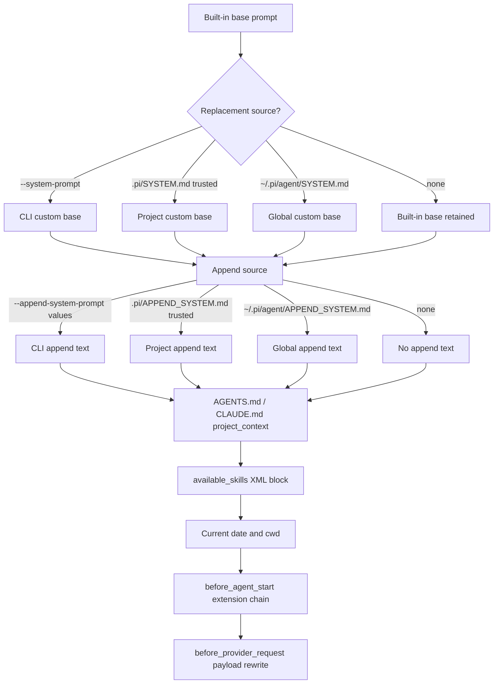

# Pi System Prompt Research

## Overview

Pi provides native per-invocation system-prompt replacement and append surfaces. `--system-prompt` replaces the base prompt, and repeatable `--append-system-prompt` values append to the chosen base prompt. Both flags accept inline text or a path to an existing file.

Replacement is not a total final-payload replacement. Pi still layers append text, context files, skills, the current date, and the current working directory after a custom base prompt. Extensions can then mutate the turn prompt through `before_agent_start`, and can even rewrite the final serialized provider payload through `before_provider_request`.

The best Claudine delivery path is therefore file-backed flags: write a temporary prompt file and pass `--append-system-prompt <file>` for append or `--system-prompt <file>` for replace. This avoids mutating `~/.pi/agent` or `.pi`, avoids shell quoting problems, and keeps long prompts out of argv as inline strings.

Local inspection on 2026-07-03 found:

| Location | Observation |
|----------|-------------|
| Current session `$HOME` | `/Users/ken/.claudine` |
| Current session Pi config | `/Users/ken/.claudine/.pi/agent` contained only `auth.json` and `sessions`; no prompt files, settings, trust file, skills, or extensions were observed. |
| User Pi config | `/Users/ken/.pi/agent/settings.json` existed and set `defaultProvider` and `defaultModel`; no `SYSTEM.md`, `APPEND_SYSTEM.md`, `AGENTS.md`, `trust.json`, or extensions were found in the inspected paths. |
| Installed Pi binary | `pi --version` returned `0.73.1`; upstream source inspected at `23d1462611ab74b4874c35e701a43d7caa5e3de3` reported package version `0.80.3`. |

## CLI Parameters

| Switch | Mode | Value | Wrapper relevance |
|--------|------|-------|-------------------|
| `--system-prompt <text>` | Replace | Inline text or file path | Primary Claudine replace mechanism. |
| `--append-system-prompt <text>` | Append | Inline text or file path; repeatable | Primary Claudine append mechanism. |
| `--no-context-files`, `-nc` | Disable | Boolean | Suppresses AGENTS.md/CLAUDE.md context injection, not SYSTEM.md/APPEND_SYSTEM.md. |
| `--no-skills`, `-ns` | Disable | Boolean | Suppresses automatic skill prompt metadata; explicit `--skill` still loads. |
| `--skill <path>` | Modify | File or directory path | Adds skill metadata to the system prompt when `read` is active. |
| `--extension <path>`, `-e <path>` | Modify | TypeScript file or directory | Loads extension hooks that can inspect or mutate prompts. |
| `--no-extensions`, `-ne` | Disable | Boolean | Prevents discovered extension prompt rewrites; explicit `-e` still loads. |
| `--approve`, `-a` | Modify | Boolean | Enables trust-gated project prompt files/resources for one run. |
| `--no-approve`, `-na` | Disable | Boolean | Ignores trust-gated project prompt files/resources for one run. |
| `--tools`, `--exclude-tools`, `--no-tools`, `--no-builtin-tools` | Modify/disable | Tool name sets | Changes available-tool snippets, tool guidelines, and skill visibility. |

Pi's `resolvePromptInput()` treats a prompt argument as a file only when `existsSync(input)` succeeds; otherwise the raw value is used as prompt text. If reading an existing file fails, Pi logs a warning and falls back to using the argument string as text.

## Configuration and Discovery

Pi discovers system-prompt and prompt-adjacent resources from user and project scopes:

| Source | Scope | Behavior |
|--------|-------|----------|
| `~/.pi/agent/SYSTEM.md` | User | Replaces built-in base prompt when no CLI or trusted project replacement exists. |
| `.pi/SYSTEM.md` | Project | Replaces built-in base prompt when trusted and no CLI replacement exists. |
| `~/.pi/agent/APPEND_SYSTEM.md` | User | Appends when no CLI append flag and no trusted project append file exists. |
| `.pi/APPEND_SYSTEM.md` | Project | Appends when trusted and no CLI append flag exists. |
| `~/.pi/agent/AGENTS.md` or `CLAUDE.md` | User | Appended in `<project_context>` unless context files are disabled. |
| `AGENTS.md`, `AGENTS.MD`, `CLAUDE.md`, `CLAUDE.MD` in cwd and ancestors | Repo | Appended in parent-first order in `<project_context>` unless disabled. |
| `~/.pi/agent/settings.json` | User | Can set `defaultProjectTrust`, extensions, skills, and other prompt-adjacent defaults. |
| `.pi/settings.json` | Project | Trust-gated project settings; can enable extensions and skills. |
| `~/.pi/agent/extensions/` and `.pi/extensions/` | Extension | TypeScript hooks can modify prompt text or provider payloads. |
| `~/.pi/agent/skills/`, `~/.agents/skills/`, `.pi/skills/`, `.agents/skills/` | User/repo | Skill metadata is rendered into the prompt in XML format when active. |

Project trust matters for `.pi` resources. In non-interactive modes, Pi does not prompt; it uses saved trust, `defaultProjectTrust`, or the explicit `--approve`/`--no-approve` override. Context files are the exception: AGENTS.md and CLAUDE.md load independently of project trust unless disabled.

`PI_CODING_AGENT_DIR` is the most useful environment-level isolation knob. It changes the global agent directory from `~/.pi/agent` to a wrapper-chosen directory, affecting global prompt files, settings, extensions, skills, and sessions.

## Prompt Layers and Precedence



Source-observed order:

1. Choose the base prompt: CLI `--system-prompt`, trusted project `.pi/SYSTEM.md`, global `~/.pi/agent/SYSTEM.md`, or Pi's built-in prompt.
2. Add append text immediately after the base prompt: CLI append values, trusted project `APPEND_SYSTEM.md`, global `APPEND_SYSTEM.md`, or nothing.
3. Add context files inside `<project_context>` and `<project_instructions path="...">` tags.
4. Add visible skills inside `<available_skills>` if `read` is active.
5. Add `Current date: YYYY-MM-DD` and `Current working directory: ...`.
6. Run `before_agent_start` extension handlers in load order; each handler sees the currently chained prompt and may return a full replacement for that turn.
7. Build the provider request; `before_provider_request` handlers may rewrite the serialized payload.

## Agents and Subagents

Pi's README says Pi ships without built-in subagents and expects extensions to provide workflows such as subagents or plan mode. The official repository includes a subagent example extension that is useful as the current provider-native pattern, but it is not a core CLI subagent feature.

The subagent example:

| Feature | Behavior |
|---------|----------|
| Agent definitions | Markdown files with YAML frontmatter and a Markdown body. |
| User location | `~/.pi/agent/agents/*.md`. |
| Project location | `.pi/agents/*.md`, enabled only with `agentScope: "project"` or `"both"`. |
| Prompt delivery | The extension writes the agent body to a temp file and launches child `pi` with `--append-system-prompt <tempfile>`. |
| Isolation | Each subagent is a separate Pi subprocess with isolated context. |
| Return path | Final output, usage, and errors return to the parent as a tool result. |

Because the example uses append, subagent prompt files layer on top of the child Pi base prompt rather than replacing it. A wrapper or extension could use `--system-prompt` instead, but that is not the sample behavior.

## Format Recommendations

Use file-backed Markdown for both append and replace.

For replacement, use a complete Markdown prompt. Pi's `SYSTEM.md` convention and `--system-prompt` behavior treat the content as raw prompt text, and the built-in layers will still append context, skills, date, and cwd.

For append, prefer XML-wrapped Markdown for Claudine-authored blocks:

```xml
<claudine_append_system_prompt>

## Additional Instructions

Markdown instructions go here.

</claudine_append_system_prompt>
```

Plain Markdown works, but Pi itself changed prompt and context boundaries to XML tags, and skills are emitted as XML. XML wrapping makes Claudine's appended block easy to distinguish from adjacent project context and skill metadata. YAML and JSON add parsing implications that Pi does not document for system prompts.

## Recent Changes

| Date | Version | Change | Impact |
|------|---------|--------|--------|
| 2026-06-30 | 0.80.3 | Fixed extension tool changes so they apply without dropping `before_agent_start` prompt overrides. | More reliable extension prompt mutation. |
| 2026-05-22 | 0.74.0 | Added `ctx.getSystemPromptOptions()` for extension commands. | Extensions can inspect base prompt inputs outside `before_agent_start`. |
| 2026-05-13 | 0.71.0 | Switched prompt/context file boundaries to explicit XML tags. | XML-wrapped append blocks align with Pi's prompt style. |
| 2026-04-20 | 0.68.0 | Added `systemPromptOptions` to `before_agent_start`. | Extensions can inspect structured base prompt inputs. |
| 2026-04-14 | 0.67.2 | Added multiple `--append-system-prompt` flags. | Claudine can pass more than one append file/string if needed. |

Older but relevant changes include automatic `SYSTEM.md` loading, `APPEND_SYSTEM.md` support, and `--system-prompt` file-path support. These were already present before the current upstream version.

## Quirks and Workarounds

- Use `--no-extensions` for deterministic wrapper validation. Otherwise global or project extensions can modify prompts after Claudine's delivery.
- Use `--no-context-files` only when suppressing AGENTS.md/CLAUDE.md is intentional. It is separate from system-prompt append/replace.
- Use `--approve` if Claudine intentionally wants project `.pi/SYSTEM.md`, `.pi/APPEND_SYSTEM.md`, `.pi/extensions`, or `.pi/skills` to participate in non-interactive runs.
- Use `--no-approve` if Claudine wants to ignore project trust-gated prompt files while still allowing global config.
- Use `PI_CODING_AGENT_DIR` or a shadow HOME if global Pi resources must be isolated. CLI prompt flags alone do not prevent global extensions, global skills, or global context files from loading.
- `ctx.getSystemPrompt()` is not an export of the final provider payload. It misses later `before_provider_request` rewrites.
- There is no documented standalone `pi --print-effective-system-prompt` style command. Inspection requires an extension hook or source-level/SDK instrumentation.

## Claudine Delivery Notes

Recommended append delivery:

```bash
PI_OFFLINE=1 PI_SKIP_VERSION_CHECK=1 pi --append-system-prompt /tmp/claudine-pi-append.md -p "..."
```

Recommended replace delivery:

```bash
PI_OFFLINE=1 PI_SKIP_VERSION_CHECK=1 pi --system-prompt /tmp/claudine-pi-system.md -p "..."
```

For strict wrapper isolation:

```bash
PI_CODING_AGENT_DIR=/tmp/claudine-pi-agent pi --no-extensions --no-context-files --system-prompt /tmp/claudine-pi-system.md -p "..."
```

Do not permanently write `~/.pi/agent/SYSTEM.md`, `~/.pi/agent/APPEND_SYSTEM.md`, `.pi/SYSTEM.md`, or `.pi/APPEND_SYSTEM.md` for wrapper delivery. File flags are native and avoid config mutation.

## Changelog

- 2026-07-03: Rewrote the Pi system-prompt research against upstream `@earendil-works/pi-coding-agent` 0.80.3 source and docs, adding current CLI semantics, discovery paths, extension hooks, subagent behavior, local config observations, and Claudine delivery guidance.

## Sources

- [Pi usage documentation](https://github.com/earendil-works/pi/blob/main/packages/coding-agent/docs/usage.md)
- [Pi README](https://github.com/earendil-works/pi/blob/main/packages/coding-agent/README.md)
- [System prompt builder source](https://github.com/earendil-works/pi/blob/main/packages/coding-agent/src/core/system-prompt.ts)
- [Resource loader source](https://github.com/earendil-works/pi/blob/main/packages/coding-agent/src/core/resource-loader.ts)
- [CLI argument parser source](https://github.com/earendil-works/pi/blob/main/packages/coding-agent/src/cli/args.ts)
- [Extension documentation](https://github.com/earendil-works/pi/blob/main/packages/coding-agent/docs/extensions.md)
- [Skills documentation](https://github.com/earendil-works/pi/blob/main/packages/coding-agent/docs/skills.md)
- [Security and project trust documentation](https://github.com/earendil-works/pi/blob/main/packages/coding-agent/docs/security.md)
- [Subagent example documentation](https://github.com/earendil-works/pi/blob/main/packages/coding-agent/examples/extensions/subagent/README.md)
- [Pi coding-agent changelog](https://github.com/earendil-works/pi/blob/main/packages/coding-agent/CHANGELOG.md)
