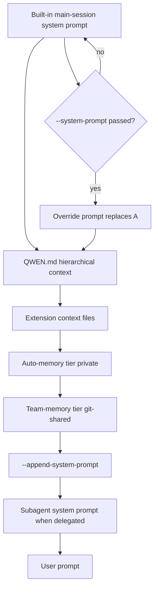

# Qwen CLI System Prompt Handling

## Overview

Qwen Code builds the effective prompt for every session from a layered instruction chain. The base is an unpublished built-in main-session system prompt; on top of that, the CLI loads a hierarchical walk of `QWEN.md` files (or whichever filename `context.fileName` selects), appends any `--append-system-prompt` text, and (for subagents) replaces the entire prompt with the subagent's Markdown body. Qwen Code does **not** publish its built-in prompt and offers no `--print-system-prompt` flag, so wrappers must rely on the documented layering order rather than runtime introspection.

The wrapper-level contract is symmetric with Claude Code's: `--system-prompt` replaces the built-in prompt for the current run (context files are still appended after), and `--append-system-prompt` appends extra instructions after the built-in prompt *and* after loaded context files. Unlike Claude Code, Qwen Code has **no** `--system-prompt-file` or `--append-system-prompt-file` variants — wrappers must always inline the text (subject to argv limits) or use a shadow `QWEN_HOME` strategy.

Subagents carry their own system prompts via Markdown bodies in `.qwen/agents/*.md` or `~/.qwen/agents/*.md`, with frontmatter controlling model, tools, approval mode, and Claude-Code-compatible fields (permissionMode, maxTurns, color, mcpServers, hooks). The built-in agent set includes `general-purpose`, `statusline-setup`, and an implicit `fork` type that inherits the parent's exact system prompt for cache sharing.

The `/memory` slash command opens a dialog showing loaded `QWEN.md` files, their sources, and an editor for opening them directly. `/context` shows high-level token counts but not the prompt body. There is no `claude-code`-style `--output-system-prompt` or `--print-system-prompt` equivalent.

## CLI Parameters

Qwen Code exposes four CLI flags that directly manipulate the system prompt for a single invocation. They work in both interactive and headless (`-p`) modes. The CLI also exposes a fifth flag, `--safe-mode`, that disables the discovery layers without disabling the prompt-override flags themselves.

| Flag | Mode | Effect |
| :--- | :--- | :--- |
| `--system-prompt <TEXT>` | Replace | Replaces the built-in main-session prompt for this run. QWEN.md context files and loaded memory are **still appended** after this override. |
| `--append-system-prompt <TEXT>` | Append | Appends extra instructions to the main-session prompt after the built-in prompt *and* after loaded context. Combinable with `--system-prompt`. |
| `--safe-mode` | Disable | Disables context files, hooks, extensions, skills, MCP, custom subagents, permission rules, memory, and sandbox settings. `--yolo` and `--approval-mode` still take effect. Does not disable `--system-prompt`/`--append-system-prompt`. |
| `-e / --extension <LIST>` | Modify | Selects extensions to load. Special value `none` excludes all extension-provided subagents, skills, and MCP servers. |
| `--include-directories <PATHS>` | Modify | Adds directories to the workspace context; combined with `context.loadFromIncludeDirectories=true`, expands QWEN.md discovery to those directories. |

A complete example combining the two prompt flags with headless mode:

```bash
qwen -p "Summarize this repository" \
  --system-prompt "You are a migration planner." \
  --append-system-prompt "Return exactly three bullets."
```

The effective system prompt for that run is: replacement prompt → loaded QWEN.md files → appended instructions → user prompt.

Important differences from Claude Code's flags:

| Feature | Qwen Code | Claude Code |
| :--- | :--- | :--- |
| `--system-prompt <TEXT>` | yes | yes |
| `--system-prompt-file <PATH>` | **no** | yes |
| `--append-system-prompt <TEXT>` | yes | yes |
| `--append-system-prompt-file <PATH>` | **no** | yes |
| `--agent <NAME>` | no (planned) | yes |
| `--agents <JSON>` | no (planned) | yes |

This asymmetry forces Claudine's wrapper to either inline all prompt text or fall back to a shadow-config strategy for large prompts.

## Configuration and Discovery

Beyond CLI flags, Qwen Code discovers persistent instruction sources automatically from JSON settings files and Markdown context files.

### Settings files

Settings are JSON and layered with system defaults at the bottom and system overrides at the top:

| Scope | macOS | Linux | Windows |
| :--- | :--- | :--- | :--- |
| System defaults | `/Library/Application Support/QwenCode/system-defaults.json` | `/etc/qwen-code/system-defaults.json` | `C:\ProgramData\qwen-code\system-defaults.json` |
| User | `~/.qwen/settings.json` | `~/.qwen/settings.json` | `%USERPROFILE%\.qwen\settings.json` |
| Project | `./.qwen/settings.json` | `./.qwen/settings.json` | `./.qwen/settings.json` |
| System overrides | `/Library/Application Support/QwenCode/settings.json` | `/etc/qwen-code/settings.json` | `C:\ProgramData\qwen-code\settings.json` |

`QWEN_CODE_SYSTEM_DEFAULTS_PATH` and `QWEN_CODE_SYSTEM_SETTINGS_PATH` relocate the system files for managed deployments. `QWEN_HOME` relocates the user tier entirely; project `.qwen/` directories are unaffected. String values in `settings.json` support `$VAR` and `${VAR}` env-var expansion at load time.

The relevant settings keys for prompt control:

- `context.fileName` — string or string array; the filename(s) discovered during the hierarchical walk. Default is `QWEN.md`.
- `context.includeDirectories` — additional directories to include in the workspace context.
- `context.loadFromIncludeDirectories` — when true, `/memory refresh` also rescans directories added via `context.includeDirectories` or `--include-directories`.
- `context.importFormat` — format hint for `@path/to/file.md` imports inside a context file.
- `memory.enableManagedAutoMemory` — toggle auto-memory extraction (default true since v0.18.x).
- `memory.enableTeamMemory` — opt in to the git-tracked `.qwen/team-memory/` tier.
- `memory.enableTeamMemorySync` — opt in to automatic commit + ff-pull + scoped push.

No `model.systemPrompt`, `model.customSystemPrompt`, `model.baseSystemPrompt`, `model.appendSystemPrompt`, `promptFile`, `instructions`, or `template` key exists in `settings.json` as of v0.19.5.

### Hierarchical context file walk

The CLI walks the configured context filename from the user's home directory upward through each ancestor directory, stopping at the project root (`.git`) or `$HOME`. The order is:

1. `~/.qwen/<configured-filename>` (global)
2. `<cwd>/<configured-filename>` and each ancestor up to `.git` root or `$HOME`

All discovered files are concatenated into the system prompt. The CLI footer shows the count of loaded context files; `/memory` opens a dialog showing each file and its source path. The `@path/to/file.md` syntax inside any context file imports additional Markdown modules, with the import format controlled by `context.importFormat`.

If a project has an existing `AGENTS.md` for other AI tools, Qwen Code reads it too — but only when `context.fileName` is set to include `AGENTS.md`. There is no built-in default discovery of `AGENTS.md`, `CLAUDE.md`, `GEMINI.md`, or `QWEN_SYSTEM.md`.

### Subagent definitions

Custom subagents are Markdown files with YAML frontmatter. The body is the subagent's system prompt; the frontmatter carries metadata:

```markdown
---
name: fast-reviewer
description: Reviews small diffs with the configured fast model
model: fast
tools:
  - read_file
  - grep_search
---

You are a code reviewer. Focus on regressions.
```

Project agents in `.qwen/agents/` take precedence over user agents in `~/.qwen/agents/`; extension-provided agents in `<ext>/agents/*.md` are loaded when the extension is enabled. The Agent tool refreshes its `subagent_type` enum dynamically from the resolved registry.

Frontmatter fields:

| Field | Type | Notes |
| :--- | :--- | :--- |
| `name` | string (required) | Non-empty; the registry key. |
| `description` | string (required) | Non-empty; drives model-side auto-delegation. |
| `model` | string | `inherit` / `fast` / `<id>` / `<authtype>:<id>`. |
| `approvalMode` | enum | `default`, `plan`, `auto-edit`, `yolo`, `bubble`. |
| `tools` | array | Allowlist; `["*"]` means inherit all. |
| `disallowedTools` | array | Blocklist; supports MCP patterns like `mcp__slack` or `mcp__server__tool`. |
| `permissionMode` | enum (CC-compatible) | Bridges to `approvalMode` at parse time; explicit `approvalMode` wins. |
| `maxTurns` | integer (CC-compatible) | Caps the turn budget; bridges to `runConfig.max_turns`. |
| `color` | enum (CC-compatible) | Allowlist `_Y` plus legacy `auto`; values outside the set are silently dropped. |
| `mcpServers` | record (CC-compatible) | Per-agent MCP overrides; merged at spawn with agent winning on key collision. |
| `hooks` | record (CC-compatible) | Per-agent hooks; **v1 limitation — fire globally for the session while the agent runs**, not scoped to that agent's tool calls. |

## Prompt Layers and Precedence

The final context for a session is assembled from the following layers, from most foundational to most specific.



Notes on precedence:

- `--system-prompt` replaces layer A only. Loaded QWEN.md context files and memory are still appended after the override.
- `--append-system-prompt` appends to layer H after the built-in prompt (or its override), loaded context, and memory. Cannot be inserted before QWEN.md.
- Subagent invocation replaces the entire effective prompt for that subagent's session with the agent's Markdown body (unless `subagent_type: fork`, which inherits verbatim for cache sharing).
- Built-in skills are model-invoked based on description matching; they do not auto-append to the system prompt.
- `--safe-mode` disables the discovery layers (D, E, F, G) but **not** the override flags themselves, so `--safe-mode --system-prompt "X"` still applies X with no QWEN.md context.

## Agents and Subagents

Qwen Code supports custom agents defined as Markdown files with YAML frontmatter in three scopes (project, user, extension). Each subagent has its own system prompt (the file body), its own tool allowlist or denylist, an optional model, permission mode, MCP servers, hooks, and color.

Key behaviors:

- Subagents run in isolated context windows. Only the final summary returns to the orchestrator.
- The built-in agent set is `general-purpose` (default), `statusline-setup`, and an implicit `fork`.
- The `fork` agent type inherits the parent's exact system prompt verbatim (for DashScope prompt cache sharing). When three forks run in parallel, the shared prefix is cached once, saving 80%+ tokens vs independent subagents.
- Recursive fork is blocked at runtime: a fork attempting to spawn another fork receives an error instructing it to execute tasks directly.
- The fork agent does **not** feed its output back into the parent's main conversation — the parent sees a placeholder and cannot act on the fork's result. This is a documented current limitation.
- `approvalMode: default` is interpreted as `auto-edit` when the parent session is in a trusted folder, so a permissive parent stays permissive. A parent in `yolo` mode overrides any explicit `approvalMode: plan` set on a subagent.
- `tools` is an allowlist; `disallowedTools` is a blocklist; both can be set. The allowlist is applied first, then the blocklist removes from that set. MCP tools follow the same rules.
- `--agent <name>` and `--agents <json>` CLI flags are not yet shipped (v0.19.5). Subagents are reachable only via the Agent tool's `subagent_type` parameter.
- Claude-Code-compatible fields (permissionMode, maxTurns, color, mcpServers, hooks) parse leniently — invalid values are silently dropped rather than rejected, matching CC's posture.

## Format Recommendations

| Goal | Recommended format | Rationale |
| :--- | :--- | :--- |
| Append | Pure Markdown | Headers, bullet lists, and short paragraphs blend cleanly with the existing structured prompt and loaded QWEN.md context. No documented XML-tag benefit in Qwen Code. |
| Replace | Pure Markdown | The wrapper supplies the entire prompt text; the model treats it as a system-prompt string. XML-wrapped Markdown has no documented token-savings or accuracy benefit on Qwen-side models. |

For replacements, the prompt must explicitly supply any tool-calling guidance, safety instructions, and environment context the task requires because the built-in `qwen` preset is removed entirely by `--system-prompt`. In practice most wrapper use cases should prefer `--append-system-prompt` over `--system-prompt` because it preserves the built-in prompt and the loaded QWEN.md context.

## Recent Changes

- **v0.19.5 (2026-07-02)** — Lazy-load memory prompt when indexes are empty (PR #6104). Memory prompts only load when there is data; first-time sessions skip the memory prompt entirely.
- **v0.19.4 (2026-07-01)** — Added `--safe-mode` flag and `QWEN_CODE_SAFE_MODE` env equivalent (PR #4943). Disables context files, hooks, extensions, skills, MCP, custom subagents, permission rules, settings-sourced approval mode overrides, memory, and sandbox settings. CLI flags `--yolo` and `--approval-mode` still take effect.
- **v0.19.3 (2026-06-28)** — Decoupled `/remember` from auto-extract (PR #5814); `/remember` no longer writes to QWEN.md and instead writes to auto-memory. Added the git-shared team memory tier at `.qwen/team-memory/` (PR #5886) with optional sync via `memory.enableTeamMemorySync`.
- **v0.19.0 (2026-06-23)** — Declarative Agent Definitions port from Claude Code 2.1.168 (PR #4842 + #4870). Added CC-compatible frontmatter fields `permissionMode`, `maxTurns`, `color`, `mcpServers`, `hooks`. Custom YAML parser replaced with the `yaml` library for block-scalar support. v0.19.0 also shipped Dynamic Workflows port (resume, saved workflows, keyword trigger) and revivable background sub-agents.
- **v0.18.4 (2026-06-20)** — Added settings file change detection via chokidar watcher (PR #4933). Some settings now reload live; the full set of hot-reloadable keys is not enumerated in the docs.
- **v0.18.x (2026-05-28, Auto-Memory on by Default weekly update)** — Auto-memory enabled by default. `/init` now generates a starter QWEN.md from project analysis.

## Quirks and Workarounds

- `--system-prompt` does not strip QWEN.md context files — the docs explicitly state "Loaded memory and context files such as `QWEN.md` are still appended after this override." A wrapper that needs a fully clean prompt must use `--safe-mode` AND ensure no QWEN.md exists in the project tree, OR use `QWEN_HOME` shadowing with an empty context directory.
- `--append-system-prompt` appends after both the built-in prompt AND loaded QWEN.md context. The order is fixed; the wrapper cannot insert text before QWEN.md via these flags.
- There is no `--system-prompt-file` or `--append-system-prompt-file` flag. Wrappers that want file-backed delivery for large prompts must inline the content (subject to argv limits) or use a shadow `QWEN_HOME` + temp `QWEN.md` strategy.
- `context.fileName` accepts a string or array of strings. Multiple filenames can be discovered simultaneously but only one walk runs at a time.
- QWEN.md is the default context filename. The docs do not document `AGENTS.md`, `CLAUDE.md`, `GEMINI.md`, or `QWEN_SYSTEM.md` as auto-discovered context files. Qwen Code only reads `AGENTS.md` if the user sets `context.fileName` to include it.
- Subagent Markdown body IS the system prompt — there is no separate `systemPrompt:` frontmatter field (unlike Claude Code's `prompt:` JSON field). The body comes after the closing `---`.
- Fork subagents inherit the parent's exact system prompt verbatim for cache sharing. Recursive fork is blocked at runtime with an error instructing the fork to execute tasks directly.
- Per-agent `hooks` (CC-compatible) fire globally for the session while the subagent runs, not scoped to that subagent's tool calls. This is a v1 limitation; prefer logging-style hooks over behavior-mutating hooks until per-agent scope filtering lands.
- `color` allowlist is restricted to CC's `_Y` set (`red`, `blue`, `green`, `yellow`, `purple`, `orange`, `pink`, `cyan`) plus a legacy `auto` sentinel; values outside the set are silently dropped at parse time.
- Subagent `approvalMode: default` is interpreted as `auto-edit` when the parent session is in a trusted folder; explicit `approvalMode` is overridden by a more permissive parent (e.g. yolo wins over plan).
- Auto-memory is on by default since v0.18.x. Disable per-project via `memory.enableManagedAutoMemory=false` in `.qwen/settings.json` or globally in `~/.qwen/settings.json`.
- `/remember` no longer writes to QWEN.md since v0.19.3 — it writes to auto-memory instead. Wrappers that previously used `/remember` to extend QWEN.md must switch to editing QWEN.md directly or the team-memory tier.
- `model.baseUrl` in settings.json is auto-managed by the model picker when multiple `modelProviders` entries share a model id. Hand-editing it can silently route requests to a different same-id provider.
- `QWEN_CODE_UNATTENDED_RETRY=1` is a strict match (case-sensitive) on the literal string `true` or `1`. `CI=true` alone does not activate persistent retry mode.
- `tools.toolSearch.enabled=true` reduces prompt size by lazy-loading MCP tools. The docs recommend disabling it for prefix-cache-sensitive providers (e.g. DeepSeek) to maximize cache hits.
- `--extension none` (or `-e none`) excludes all extension-provided subagents, skills, and MCP servers. Useful for a deterministic baseline that does not pick up extension agents.
- Local config observed on this host (`~/.qwen/`): no `QWEN.md` exists at the user tier; relies on project-level `QWEN.md`. `settings.json` is at version 3 with `model.name: qwen3.5-plus` and an `openai` provider entry pointing at DashScope. `agents/` contains three subagent definitions (`feature-tester-rust`, `feature-tester-typescript`, `tester-agent`). `skills/` has 176 entries. No `.qwen/` project directory exists in the host's working area.

## Claudine Delivery Notes

Claudine's wrapper should use the native `--append-system-prompt` and `--system-prompt` flags for typical (≤32 KB) prompts. These flags require inline text only; no file-flag variants exist, so argv limits apply directly.

### Delivery strategy

| Mode | Strategy | Notes |
| :--- | :--- | :--- |
| Append | inline_flag | Pass `--append-system-prompt <resolved text>` directly. |
| Replace | inline_flag | Pass `--system-prompt <resolved text>` directly. |
| Large prompts (>argv limit) | shadow_home_file | Write a temporary `QWEN.md` (or whichever filename `context.fileName` selects) into a fresh `QWEN_HOME` plus a temporary `.qwen/settings.json` that pins `context.fileName` if a non-default name is needed. Export `QWEN_HOME` before invoking `qwen`. |

The shadow-home strategy must:

1. Create a temporary directory owned by the wrapper (e.g., under `~/.claudine/tmp/` or the launch-cwd's `.claudine-tmp/`).
2. Copy or symlink any required auth/state (or rely on the existing `oauth_creds.json` resolved via the existing `QWEN_HOME` if the wrapper can read both).
3. Write the prompt text to a context file with the configured filename.
4. Invoke `qwen -p "..."` with `QWEN_HOME` exported to the temp directory.

Avoid mutating the user's `~/.qwen/`, project `QWEN.md`, or `settings.json`. The settings.json `.qwen/` is project-scoped but the wrapper can pass `--settings <temp.json>` to scope overrides to the invocation; combined with `QWEN_HOME`, this gives full prompt control without persistent mutation.

### Recommended invocation

```bash
QWEN_HOME="/tmp/claudine-qwen-$$" \
  qwen -p "<user-prompt>" \
  --system-prompt "<claudine-resolved-prompt>" \
  --append-system-prompt "<claudine-resolved-append>"
```

For headless runs that need a fully clean prompt (no QWEN.md, no auto-memory, no extensions):

```bash
QWEN_HOME="/tmp/claudine-qwen-$$" \
QWEN_CODE_SAFE_MODE=true \
  qwen -p "<user-prompt>" \
  --system-prompt "<claudine-resolved-prompt>"
```

`--safe-mode` disables context files, hooks, extensions, skills, MCP, custom subagents, permission rules, settings-sourced approval mode overrides, memory, and sandbox settings — but still applies the `--system-prompt` override.

### Risks and limitations

- **argv limits**: POSIX argv limits are typically 128 KB to 2 MB depending on platform; legacy Windows `CreateProcess` is 8 KB. Prompts near or above those limits must use the shadow-home strategy.
- **Shell metacharacters**: The prompt text is passed as a single shell argument; newlines and quotes must be shell-escaped. Use a temp file + `xargs -0` or pass via stdin + `--prompt -` rather than inline if escaping is fragile.
- **`context.fileName` configuration**: If the user has customized `context.fileName`, the shadow-home QWEN.md must match the configured name. The wrapper should read the user's `~/.qwen/settings.json` (or the project's `.qwen/settings.json`) to discover the filename before writing.
- **Subagent reachability**: A wrapper that wants to set the main-thread agent must wait for the planned `--agent <name>` flag. Today, subagents are reachable only via the Agent tool's `subagent_type` parameter.
- **No inspect/export**: There is no way to dump the effective built-in prompt as plain text. The wrapper must rely on documented layering order, not on introspection.

## Sources

- [Qwen Code Overview](https://qwenlm.github.io/qwen-code-docs/en/users/overview/)
- [Qwen Code Configuration](https://qwenlm.github.io/qwen-code-docs/en/users/configuration/settings/)
- [Qwen Code Headless Mode](https://qwenlm.github.io/qwen-code-docs/en/users/features/headless/)
- [Qwen Code SubAgents](https://qwenlm.github.io/qwen-code-docs/en/users/features/sub-agents/)
- [Qwen Code Skills](https://qwenlm.github.io/qwen-code-docs/en/users/features/skills/)
- [Qwen Code Memory](https://qwenlm.github.io/qwen-code-docs/en/users/features/memory/)
- [Declarative Agent Definitions — Port from Claude Code 2.1.168](https://qwenlm.github.io/qwen-code-docs/en/declarative-agents-port/)
- [QwenLM/qwen-code (GitHub)](https://github.com/QwenLM/qwen-code)
- [Qwen Code CHANGELOG](https://raw.githubusercontent.com/QwenLM/qwen-code/main/CHANGELOG.md)
- [Qwen Code Hooks and Events (existing Claudine research)](../hooks/qwen-cli.md)
- [Qwen Code Resume (existing Claudine research)](../resume/qwen.md)
- [Qwen Code Non-Interactive Sessions (existing Claudine research)](../non-interactive-sessions/qwen.md)
- Local inspection on 2026-07-02: `~/.qwen/settings.json`, `~/.qwen/agents/`, `~/.qwen/skills/`, `~/.qwen/output-language.md`.