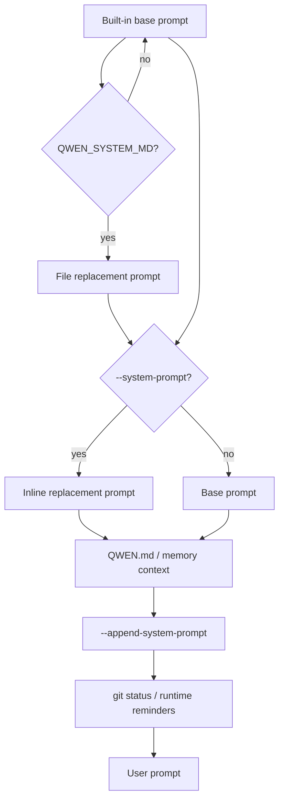

# Qwen CLI System Prompt Handling

## Overview

Qwen Code has first-class, per-run system prompt controls for the main session:
`--system-prompt` replaces the built-in main-session prompt and
`--append-system-prompt` appends extra instructions. Both are inline-text flags,
and the official docs explicitly allow them to be combined. The important wrapper
detail is that replacement is not a complete context wipe: loaded memory and
context files such as `QWEN.md` are still appended after `--system-prompt`.

The implementation also has two environment-variable prompt surfaces that are
not prominent in user docs. `QWEN_SYSTEM_MD` replaces the base prompt from a file
(`.qwen/system.md` for `1`/`true`, or a custom path), and
`QWEN_WRITE_SYSTEM_MD` writes the rendered base prompt to a file. These are useful
for research and large replacement fallback, but Claudine should prefer the
documented CLI flags for normal wrapper delivery because they are session-scoped
and do not require config mutation.

The local config inspection for this session found Qwen's default user config
root at `/Users/ken/.claudine/.qwen`. It contained debug files,
`installation_id`, `output-language.md`, and a `skills` directory, but no
`settings.json`, `QWEN.md`, or user agent definitions at the inspected depth.
The installed `qwen` binary is Homebrew `0.15.6`; current upstream and npm latest
are `0.19.6`, so local CLI help was not used as current behavioral proof.

## CLI Parameters

| Switch or command | Mode | Wrapper relevance |
| --- | --- | --- |
| `--system-prompt <TEXT>` | Replace | Native, non-mutating replacement for the built-in main-session prompt. Context files and memory still append afterward. |
| `--append-system-prompt <TEXT>` | Append | Native, non-mutating additive instruction layer after built-in/custom prompt and loaded memory/context. |
| `-p, --prompt <TEXT>` | Other | Headless user prompt. Most wrapper runs pair this with prompt flags. |
| `-i, --prompt-interactive <TEXT>` | Other | Interactive session with initial user input. Prompt flags are globally parsed, but official system-prompt examples are headless. |
| `--safe-mode` | Disable | Suppresses context files, hooks, extensions, skills, MCP servers, custom subagents, memory features, and related settings. Does not suppress explicit prompt flags. |
| `-e, --extension <LIST>` | Modify | Use `-e none` to avoid extension-sourced context, skills, MCP, and subagents. |
| `--include-directories <PATHS>` | Modify | Can widen context-file discovery when paired with `context.loadFromIncludeDirectories`. |
| `--all-files, -a` | Modify | Adds file contents to context; not a system-prompt control but changes what the model sees. |
| `--continue`, `--resume <ID>` | Other | Resume runs should re-supply wrapper prompt flags because prompt flags are invocation-scoped. |
| `QWEN_WRITE_SYSTEM_MD=<PATH|1|true> qwen ...` | Inspect | Source-supported export/write of the rendered base system prompt. Use only for inspection, not normal delivery. |

Prompt assembly in the main session source is straightforward:



## Configuration and Discovery

Qwen Code settings are JSON and are applied in this documented order:
defaults, system defaults, user settings, project settings, system settings,
environment variables, then command-line arguments. Prompt-related persistent
settings are mostly indirect: they change context filename discovery, memory,
extensions, skills, hooks, and telemetry rather than setting a named
`systemPrompt` key in settings.

| Source | Effect |
| --- | --- |
| `~/.qwen/settings.json` | User-level JSON settings. `QWEN_HOME` can relocate this root. |
| `.qwen/settings.json` | Project-level JSON settings. Overrides user settings. |
| System defaults/settings JSON | Enterprise/system layers; paths differ by OS and can be relocated with documented env vars. |
| `~/.qwen/QWEN.md` | Global Markdown context appended into the system prompt. |
| `QWEN.md` in cwd/ancestors | Project and nested Markdown context appended into the system prompt. |
| `.qwen/system.md` | Full built-in prompt replacement only when `QWEN_SYSTEM_MD=1` or `true`. |
| `.qwen/agents/*.md`, `~/.qwen/agents/*.md` | Subagent definitions; Markdown body is the subagent system prompt. |
| Extension context/agents | Loaded only when the extension is enabled. |

`context.fileName` can be a string or array of strings, so Qwen can be made to
load `AGENTS.md` or another filename. The default is Qwen's own context file
name, `QWEN.md`. Context files can import other Markdown files with
`@path/to/file.md`. The `/memory` dialog shows loaded context files and their
paths; `/context` reports context usage and has a detail mode, but neither is a
complete built-in prompt export.

## Prompt Layers and Precedence

The wrapper-critical precedence rules are:

1. The built-in prompt is the default base.
2. `QWEN_SYSTEM_MD` can replace that base from a file before normal prompt
   suffixes are added.
3. `--system-prompt` replaces the main-session base prompt for the invocation.
4. Loaded memory and context files, including `QWEN.md`, append after the base
   or replacement.
5. `--append-system-prompt` appends after loaded memory/context.
6. Subagents have separate prompt rules: named subagents use their own Markdown
   body; forks inherit the parent's exact system prompt/history/tools.

`--safe-mode` is the practical diagnostic switch. It removes most discovery
layers but leaves explicit prompt flags active, which makes it useful for
checking Claudine delivery without persistent local customization noise.

## Agents and Subagents

Qwen Code supports user-defined subagents. Agent files are Markdown with YAML
frontmatter:

```markdown
---
name: rigorous-reviewer
description: Deep code review with a turn cap
approvalMode: plan
tools:
  - read_file
  - grep_search
---

You are a code reviewer. Analyze the code thoroughly and report findings
ordered by severity.
```

The body is the subagent system prompt. Frontmatter controls metadata such as
`name`, `description`, `model`, `approvalMode`, `tools`, `disallowedTools`,
`permissionMode`, `maxTurns`, `color`, `mcpServers`, and `hooks`. Project agents
in `.qwen/agents/` have higher precedence than user agents in
`~/.qwen/agents/`; extension agents are discovered when the extension is
enabled.

Named subagents start with separate context and return a final result. Fork
subagents are selected explicitly with `subagent_type: "fork"` and inherit the
parent's exact API request prefix for prompt-cache sharing. Current docs note
that fork results are visible in UI progress but are not automatically fed back
into the main conversation. Qwen Code `0.19.6` added configurable nested
subagent spawning and web-shell tree display, so wrappers should avoid assuming
a flat one-parent/one-child prompt topology.

## Format Recommendations

Use pure Markdown for both append and replacement prompts.

| Goal | Recommended format | Reason |
| --- | --- | --- |
| Append | Markdown | Matches Qwen's context-file and subagent conventions. Headings, lists, and short paragraphs are natural in `QWEN.md`-style prompt layers. |
| Replace | Markdown | The full prompt is text; Qwen's own `.qwen/system.md`, `QWEN.md`, skills, and subagent bodies are Markdown/text-oriented. |

XML-wrapped Markdown is not documented as beneficial for Qwen CLI. YAML and JSON
are useful for subagent frontmatter or machine data, not as the primary system
prompt format. For replacements, include any safety, tool-use, and operating
context that the built-in prompt would otherwise provide.

## Recent Changes

| Date | Version | Change | Prompt impact |
| --- | --- | --- | --- |
| 2026-07-03 | 0.19.6 | Added nested subagents up to configurable depth; web-shell displays nested subagents as a tree. | Subagent prompt topology can be nested; wrappers should not assume one-level delegation. |
| 2026-07-03 | 0.19.6 | Added sessionless workspace memory forget and dream. | Memory layers can be modified outside a live session. |
| 2026-07-02 | 0.19.5 | Lazy-load memory prompt when indexes are empty. | Empty memory stores no longer add prompt overhead. |
| 2026-07-01 | 0.19.4 | Added `--safe-mode` and `QWEN_CODE_SAFE_MODE`. | Provides a non-mutating way to suppress most discovered customization layers. |
| 2026-06-28 | 0.19.3 | `/remember` stopped writing to `QWEN.md`; team memory tier added. | Persistent instructions are split between context files and managed memory. |

## Quirks and Workarounds

- `--system-prompt` replaces the built-in prompt only. It does not remove
  `QWEN.md`, managed memory, extension context, or appended instructions.
- `--append-system-prompt` is ordered after loaded memory/context; there is no
  native flag to append before `QWEN.md`.
- Qwen has no documented prompt-file variants for the native prompt flags.
  Wrapper prompts must be inline unless using an env/config fallback.
- `QWEN_SYSTEM_MD` is a real source-supported replacement mechanism, but it is
  an environment/file mechanism with fatal missing-file behavior and should be
  treated as a fallback rather than the default wrapper path.
- `QWEN_WRITE_SYSTEM_MD` can inspect/export the base prompt, but it writes a
  file and can overwrite `.qwen/system.md` when set to `1`/`true`.
- Combining `QWEN_SYSTEM_MD` and `QWEN_WRITE_SYSTEM_MD` exports the replacement
  prompt, not the built-in prompt.
- `QWEN_TELEMETRY_INCLUDE_SENSITIVE_SPAN_ATTRIBUTES=true` can send verbatim
  system prompts to telemetry backends. This is an inspection surface, but it is
  not suitable as a safe wrapper export mechanism.
- Fork subagents inherit parent context for prompt-cache sharing and currently
  do not feed their final result into the parent conversation.
- Per-agent hooks are documented as v1-limited: while a subagent runs, its hook
  entries fire for every matching event in the session, not only that
  subagent's own tool calls.

## Claudine Delivery Notes

Claudine should use:

- Append: `qwen --append-system-prompt <prepared-markdown> ...`
- Replace: `qwen --system-prompt <prepared-markdown> ...`

This is native, non-mutating, and aligns with Qwen's documented CLI contract. For
normal prompt sizes, no temporary file is required. Because both flags are inline
only, Claudine should keep argv limits in mind, especially on Windows. If a
prompt is too large:

- Replacement fallback: write a temporary Markdown file and launch with
  `QWEN_SYSTEM_MD=<temp-file>`, while also controlling `QWEN_HOME`/cwd and
  cleanup. This is file-backed but less officially documented than the native
  flag.
- Append fallback: there is no equivalent append-file flag. Use a temporary
  shadow `QWEN_HOME` and/or launch directory with a controlled `QWEN.md` only if
  preserving built-in prompt plus file-backed appended context is more important
  than strict `--append-system-prompt` semantics.
- Deterministic runs: add `--safe-mode` and `-e none` when local memory,
  extension, subagent, skill, hook, and MCP discovery must be suppressed.

Do not mutate the user's `~/.qwen/settings.json`, `~/.qwen/QWEN.md`,
project `QWEN.md`, or project `.qwen/system.md` for wrapper prompt delivery.

## Changelog

- 2026-07-03: Refreshed from Qwen Code `0.19.6` official docs, source, and
  changelog. Added `QWEN_SYSTEM_MD`, `QWEN_WRITE_SYSTEM_MD`, current subagent
  nesting behavior, and local config observations.

## Sources

- [Qwen Code configuration settings](https://qwenlm.github.io/qwen-code-docs/en/users/configuration/settings/)
- [Qwen Code headless mode](https://qwenlm.github.io/qwen-code-docs/en/users/features/headless/)
- [Qwen Code subagents](https://qwenlm.github.io/qwen-code-docs/en/users/features/sub-agents/)
- [Qwen Code commands](https://qwenlm.github.io/qwen-code-docs/en/users/features/commands/)
- [QwenLM/qwen-code repository](https://github.com/QwenLM/qwen-code)
- [Qwen Code changelog](https://github.com/QwenLM/qwen-code/blob/main/CHANGELOG.md)
- [Qwen Code prompt source](https://github.com/QwenLM/qwen-code/blob/main/packages/core/src/core/prompts.ts)
- [Qwen Code CLI option parser](https://github.com/QwenLM/qwen-code/blob/main/packages/cli/src/config/config.ts)
- [Qwen Code main-session prompt assembly](https://github.com/QwenLM/qwen-code/blob/main/packages/core/src/core/client.ts)
