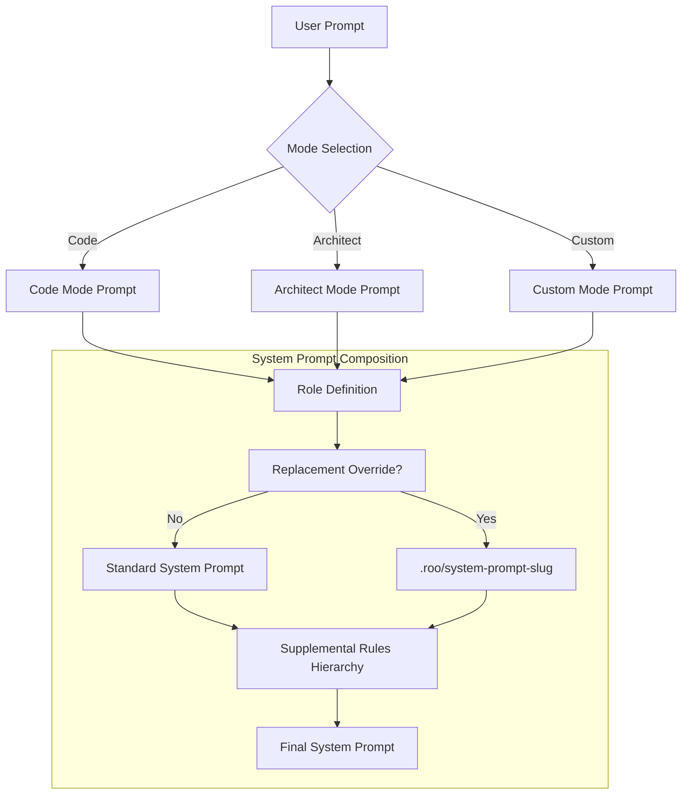

I will begin by researching Roo Code's system prompt handling, starting with a search of the local workspace for any existing documentation or configurations, followed by a broader search for technical details regarding its CLI and custom instruction capabilities.

I will now read the technical documentation in the workspace regarding Roo Code's system prompt and CLI, specifically focusing on `claudine/docs/topics/system-prompt.md` and `claudine/docs/research/agent-cli/roo-code.md`, to gain a more detailed understanding of its prompt manipulation mechanisms.

I will now read `claudine/docs/research/agent-cli/roo-code.md` to identify the specific CLI switches and mechanisms Roo Code uses for system prompt manipulation.

I will now examine `claudine/lib/src/agents/roo_code.rs` to gather more implementation details and then conduct a Google search to identify any recent updates to Roo Code's system prompt manipulation.

The following report details Roo Code's sophisticated architecture for system prompt manipulation, covering CLI integration, supplemental rules, and the advanced "Footgun" replacement mechanism.

# Roo Code System Prompt Research

Roo Code (and its standalone CLI `roo`) employs a modular, hierarchical system prompt architecture that prioritizes workspace-specific rules and mode-scoped instructions. By 2026, the platform has transitioned from monolithic configuration files to a directory-based "rules" system that enables fine-grained control over agent behavior.

## CLI Switches and Invocation

The Roo Code CLI (`roo`) and the underlying VS Code extension use several key switches to influence the system prompt and agent behavior:

| Switch                 | Function                                                           | Impact on System Prompt                                                                                |
|:-----------------------|:-------------------------------------------------------------------|:-------------------------------------------------------------------------------------------------------|
| `--mode <slug>`        | Specifies the starting mode (e.g., `code`, `architect`, `ask`).    | Selects the corresponding `roleDefinition`, `customInstructions`, and `.roo/rules-{slug}/` directory.  |
| `--prompt-file <path>` | Reads the initial user prompt from a file.                         | Influences the task context but does not modify the system prompt itself.                              |
| `--reasoning-effort`   | Sets the thinking/reasoning level (e.g., `low`, `medium`, `high`). | Injected into the system prompt to guide the model's internal monologue/thinking process.              |
| `--require-approval`   | Disables auto-approval for all actions.                            | Injects a constraint into the system prompt informing the agent that it must wait for user permission. |

## Manipulation Mechanisms (Supplemental vs. Replacement)

Roo Code distinguishes between **supplementing** the prompt (appending rules) and **replacing** it entirely.

### 1. Supplemental Sources (Custom Instructions)

Roo Code appends instructions in a strict priority order. If multiple sources exist, they are combined in the following sequence:

1. **Global Instructions:** Defined in the "Prompts" tab of the VS Code extension UI.
2. **Mode-Specific Instructions:** Defined per-mode in the UI or `.roomodes` YAML.
3. **Mode Rules Directory:** `.roo/rules-{modeSlug}/` (reads all Markdown files alphabetically).
4. **Mode Fallback File:** `.roorules-{modeSlug}`.
5. **AGENTS.md / AGENT.md:** High-level project guidelines (introduced in late 2025).
6. **Global Rules Directory:** `.roo/rules/` (applies to all modes).
7. **Global Fallback File:** `.roorules`.
8. **.rooignore:** Instructions specifically about which files the agent must not touch.

### 2. Replacement (Footgun Prompting)

For advanced users, Roo Code supports "Footgun Prompting," which allows for the **total replacement** of the built-in system prompt.

* **Mechanism:** Create a file at `.roo/system-prompt-{mode-slug}`.
* **Behavior:** When this file exists, Roo Code bypasses its standard system prompt (including tool descriptions and core rules) but preserves the `roleDefinition` and any `customInstructions`.
* **Variables:** The override file supports template variables: `{{mode}}`, `{{language}}`, `{{shell}}`, `{{operatingSystem}}`, and `{{workspace}}`.

## Agent and Subagent Distinctness

Roo Code is **mode-centric**. Each "Mode" (effectively a specialized agent) has its own distinct system prompt components:

* **Orchestrator vs. Subagent:** The `Orchestrator` mode uses a prompt focused on task decomposition and "Boomerang" task management. When it spawns a subtask in `Code` mode, that subtask inherits the `Code` mode's unique `roleDefinition`, toolset permissions, and rule directories.
* **Custom Modes:** Users can define new agents in `.roomodes` with entirely unique `roleDefinition` and `customInstructions` fields, ensuring a clean separation of concerns.

## Recent Changes and Evolution (2025–2026)

* **Directory-Based Rules (Late 2025):** The transition from a single `.roorules` file to the `.roo/rules/` directory allows for modular, maintainable instruction sets.
* **AGENTS.md Support (v3.12+):** Added to provide a cross-provider standard for agent documentation that Roo Code natively integrates into its prompt hierarchy.
* **Thinking/Reasoning Budget (v3.25):** Enhanced controls for Gemini and Anthropic reasoning models, allowing users to specify token budgets directly in the prompt configuration.

## Quirks and Workarounds

* **The "Footgun" Risk:** Replacing the system prompt often strips out the **XML tool definitions**. If a user does not manually re-define the tool schema in their replacement file, the agent will hallucinate tool calls or fail to use them entirely.
* **MCP Context Loss:** Footgun prompts often fail to include the dynamic injection point for MCP (Model Context Protocol) tools.
* **Token Bloat:** Recursively reading the `.roo/rules/` directory can lead to massive system prompts (often 10k+ tokens) if documentation files are accidentally placed there.
* **Rule Conflict:** Alphabetical loading of rules means `01-safety.md` will always be overridden by `99-yolo.md` if they contain contradictory instructions.

## Recommended Formats

| Goal                  | Best Format                  | Rationale                                                                                                                                                                             |
|:----------------------|:-----------------------------|:--------------------------------------------------------------------------------------------------------------------------------------------------------------------------------------|
| **Appending Rules**   | **Pure Markdown**            | Roo Code excels at parsing standard Markdown headers and lists. Files in `.roo/rules/` should use clear H2/H3 sections.                                                               |
| **Replacing Prompts** | **Markdown with XML Schema** | The replacement file must be Markdown but **must** include an XML-style definition block for tools to ensure the agent understands how to invoke actions (e.g., `<execute_command>`). |
| **Mode Definitions**  | **YAML (`.roomodes`)**       | The 2026 standard for custom modes is YAML, providing better readability for multi-line instructions and role definitions.                                                            |

### Summary of Research Findings

Roo Code utilizes a tiered system prompt architecture where **modes** serve as the primary unit of specialization.

* **Modular Rules:** The system has moved toward a directory-based rules model (`.roo/rules/`) where Markdown files are appended to the prompt based on alphabetical priority.
* **Total Replacement:** "Footgun" prompting allows users to completely override the system prompt via `.roo/system-prompt-{slug}`, though this requires manual re-definition of the XML tool schema.
* **Mode-Specific Context:** Each mode (agent) maintains its own persona and instructions, allowing subagents to operate with prompts entirely distinct from their orchestrators.
* **Strategic Best Practices:** For 2026, the focus has shifted to modularity and mode-switching rather than monolithic prompting to manage token efficiency and agent focus.
