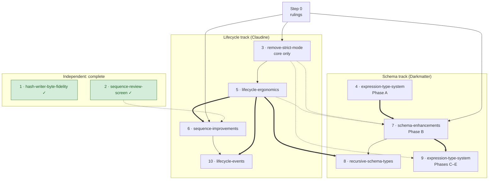

# Rollout Strategy — Lifecycle, Sequence, and Schema Specs

> **This page is a planning snapshot, not a behavior reference.** It names specs
> by their `{date}-{name}` directory, which topic pages never do. It describes
> the state of the repository on 2026-09-28, updated on 2026-10-01 for the two
> completed steps, and should be deleted when the last step below has merged.

Nine specs were open across Claudine and Darkmatter when this page was
written; two are now complete and seven remain. They overlap: several edit
the same parser, the same shipped prompts, and the same schema resolver, and
some contradict each other. This page fixes one order, says why, and lists
what has to be decided first.

**Steps 1 and 2 are complete; nothing in the other seven specs is
implemented yet.** The 2026-09-28 baseline was checked against source, not
only against spec status fields; see [Evidence](#evidence).

**Next:** step 3 (the strict-mode core) and step 4 (Phase A), in parallel.
Step 3's spec was re-scoped to its core on 2026-10-01, and ruling 2 (design
review and approval) was made the same day; its plan is in implementation. See
[step 3](#3-2026-09-17-remove-strict-mode-core-only).

## The order

| Step | Spec | Area | Size | Verdict |
|---|---|---|---|---|
| 0 | Rulings and spec reconciliation | — | spec work only | **Blocks planning.** See [Rulings needed](#rulings-needed) |
| 1 | `2026-09-28-hash-writer-byte-fidelity` | Darkmatter | small | **Complete** (closed 2026-09-30) |
| 2 | `2026-09-27-sequence-review-screen` | Claudine CLI, biscuit-tui | small | **Complete** (closed 2026-09-29) |
| 3 | `2026-09-17-remove-strict-mode` | Darkmatter, Claudine | medium | **Next.** Re-scoped to its core; first on the lifecycle track |
| 4 | `2026-09-16-expression-type-system`, Phase A only | Darkmatter | small | First on the schema track; parallel with step 3 |
| 5 | `2026-09-21-lifecycle-ergonomics` | Claudine, biscuit-speaks, DMLS | very large | The pivot: three specs wait on it |
| 6 | `2026-09-27-sequence-improvements` | Claudine | large | Directly after step 5 |
| 7 | `2026-09-21-schema-enhancements` | Darkmatter, DMLS | very large | Builds after step 4, merges after step 5 |
| 8 | `2026-09-28-recursive-schema-types` | Darkmatter, Claudine schemas | 13–20 days (spec estimate) | After steps 5 and 7 |
| 9 | `2026-09-16-expression-type-system`, Phases C–E | Darkmatter, DMLS, `md` CLI | large | After step 7 |
| 10 | `2026-09-22-lifecycle-events` | Darkmatter, Claudine | 25–45 days (spec estimate) | **Last, and gated** on a re-estimate |

Sizes without a spec estimate are a judgment from the amount of code and the
number of files each spec names, not a forecast.



Thick arrows are dependencies a spec declares itself. Thin arrows are the order
this page recommends. Dotted arrows mean "lands first so the later spec does
not redo work". Green nodes are complete.

### The two tracks

The specs fall into two tracks that mostly touch different code, so they can
be developed at the same time in separate worktrees:

- **Lifecycle track** (steps 3, 5, 6, 10): what a Claudine prompt can do at its
  lifecycle events and inside a sequence.
- **Schema track** (steps 4, 7, 8, 9): what Darkmatter's schema language and
  expression functions can express and check.

They meet in three places, and those meetings set the merge order:

1. **Shipped prompts.** Steps 3, 5, 6, and 7 each rewrite files under
   `prompts/`. See [One prompt sweep at a time](#one-prompt-sweep-at-a-time).
2. **Claudine's schemas.** Step 5 writes them; step 8 rewrites them.
3. **Expression lookup.** Step 3 changes what a bare name means; steps 7 and 9
   build type checking on top of that meaning.

## What no longer applies

| What | Disposition | Why |
|---|---|---|
| `2026-09-17-remove-strict-mode`, requirements R10, R11, R12, the "Unified global schema entry point", and "Schema Exports and Local Type Names" | **Removed from that fix.** Parts are superseded, parts move, parts are parked; see [step 3](#3-2026-09-17-remove-strict-mode-core-only) | The fix grew from one defect into a schema platform. Newer specs now own most of that ground, and none of the nine depends on the rest |
| `2026-09-17-remove-strict-mode`, `plan.md` | Already marked superseded | Predates the design rulings |
| `2026-09-17-remove-strict-mode`, the `doc.err` examples | Withdrawn | The owner's clarification recorded in `strict-mode-integration-design.md`: `err` is a lifecycle global; there is no `doc.err` model to introduce or preserve |
| `2026-09-16-expression-type-system`, its Phase B text and the three annexes from the 2026-09-26 consolidation | **Input only** | `2026-09-21-schema-enhancements` is normative for Phase B. The consolidation was reversed and the conflicts are unreconciled |
| `2026-09-16-expression-type-system` as one unit of work | **Not scheduled as a unit** | It is a charter of five phases. It is scheduled as three slices: Phase A, Phase B (through the child spec), and Phases C–E |
| `2026-09-22-lifecycle-events`, the proposal to fold its grammar in before the grammar changes | Overtaken | It is written in the `stack:`/`action:` grammar that step 5 removes |

No spec is dropped outright. The opinionated calls are the re-scope of
step 3 and holding step 10 until the end.

## The steps in detail

### 1. `2026-09-28-hash-writer-byte-fidelity`

**What it does.** Darkmatter's byte-preserving frontmatter writer
(`apply_hash_save_text`) promises to change only the `hash` node and the
`last_updated` value. It breaks that promise in five input shapes (an empty
value, an empty value with a comment, an LF line in a CRLF file, lone-CR files,
a BOM without frontmatter) and cannot safely edit a sixth (an anchored value).
The fix makes each case change only the date bytes, and refuses the anchored
case.

**Status.** Complete; closed 2026-09-30 after six review cycles. The
line-terminator ruling was made per-line: an edited line keeps its own
terminator, and an inserted line inherits a nearby one.

**Provides downstream.**

- `md hash` and Claudine's inline-compose write-back stop corrupting
  frontmatter in the six shapes.
- `2026-09-28-content-policy` (outside this set) requires its own writer to
  produce identical bytes; this fix is the other half of that guarantee.
- Nothing in this set waits on it.

**Verdict.** Done. It was the only one of the nine that corrupted user files.

### 2. `2026-09-27-sequence-review-screen`

**What it does.** The `claudine sequence` review screen clips step names to
four characters, shows provider pickers for `shell` steps that launch no
provider, and draws stray rules on the first row. The fix sizes a static table
column to its content (a `biscuit-tui` change every `InputTable` consumer
gets), lists only provider-launching steps, and fixes or explains the rules.

**Status.** Complete; closed 2026-09-29.

**Provides downstream.**

- `2026-09-27-sequence-improvements` redesigns what the rows *offer*
  (read-only rows for steps that name their own provider). It builds on a
  screen that already lists the right rows and shows their names.
- Keeps the screen usable for the 21-step `review-loop.md` until step 6
  collapses that prompt to a loop.

**Verdict.** Done. It was a display fix; the provider-selection redesign it
deliberately left out belongs to step 6.

### 3. `2026-09-17-remove-strict-mode`, core only

**What it does.** In a lifecycle expression, a name that is not set, such as
`plan` in `{{ plan ? 'has plan' : '' }}`, is rejected today as an "unknown
root" before the expression is evaluated. Authors work around it with
`plan || false`. The fix makes a bare name mean "a property of this document",
makes an absent property evaluate to `null`, removes the strictness mode that
rejected it, and removes the duplicate checks Claudine performs on its own. It
also gives Darkmatter a binding model that can tell apart three things the
current lookup cannot: an absent document property, a global whose value is
`null`, and a global that is not available at this event.

**The re-scope.** The spec was written at about 1,600 lines and also covered
schema discovery, activation predicates, code generation, and a trigger
grammar change. The owner accepted this split on 2026-10-01, and the spec's
own Scope section now records it:

| Part | Disposition |
|---|---|
| Outcome, Language Contract, Ownership Seam (less the unified global entry point), R1–R6, R7a–b, R8, R9, acceptance criteria 1–17 and 19 | **Stays.** This is the fix. Criteria 2, 10, and 17 are reworded to drop parked dependencies |
| The `doc.err` examples in the Language Contract, R2, R5, Verification, and criterion 2 | **Withdrawn**; see [What no longer applies](#what-no-longer-applies) |
| R11 rows that move `claudine.yaml` and `claudine-types.yaml` | **Superseded by step 5**, which deletes both and writes six new files |
| R11 classification of `claudine.yaml` as always-on | **Superseded by step 5**, which makes it a trigger |
| R11 row that moves `expression-functions.yaml` | **Superseded by step 7**, which replaces the catalog; moving it first means migrating it twice |
| Named-type constraint inheritance and bare local type names | **Moves** to the Darkmatter schema groundwork ahead of step 8; see [conflict X2](#conflicts-between-specs) |
| R10 (`no-shell-expansion`), R11 code-generated embedding, R12 (discovery scopes, `SCHEMAS_DIR`, activation predicates, failure recovery), R7c (lifecycle error diagnostics in the editor), criteria 18 and 20–22, the `schema-trigger` rename, the AND/OR trigger grammar, the unified global entry point | **Parked** as an unscheduled Darkmatter feature. Revisit when step 10 is planned, because step 10 needs the same descriptor mechanism |

The alternative on record, in the schema-enhancements directory's
`strict-mode-integration-design.md`, is to fold the core into step 7 and have
no separate strict-mode work. This page recommends against that: step 7 is
already the highest-risk spec in the set, the motivating expression contains
no function call so the coercion engine cannot fix it, and the lifecycle track
needs this fix before step 5.

**What the core keeps working without the parked parts.** Claudine declares
lifecycle globals through the Rust host-binding API rather than schema data.
The editor reports undeclared properties as advisories and takes its root
classification from Darkmatter, but gains no lifecycle-specific errors. The
`initialize` shell prohibition stays enforced by Claudine's parser and runtime
backstop.

**Needs first.** Met 2026-10-01: the design approval (ruling 2) and a new
plan for the core, which replaces the superseded one. In scope from the design record: D1, D2,
D4, D7, D8, D21, and contracts C1, C2, C9, and C3's per-event scope matrix.

**Provides downstream.**

| To | What it provides |
|---|---|
| Step 5 | The undefined-variable walkers are gone before the parser is rewritten, so they are not ported to nested `then`/`else` bodies and then deleted. The validator no longer walks Darkmatter expression trees, which the lift-ready rule requires |
| Step 5 | `prompts/implement.md` has its plain ternaries back before 24 prompts are swept |
| Step 6 | `when:` on a step can read an optional value (`frontmatter(spec, 'implemented') != true`) without a guard. The `in_loop` and `\|\| false` workarounds have no reason to exist |
| Step 7 | Binding classification that sits beside the argument-compatibility API, so the editor reports a missing property and a wrong argument from one source |
| Step 9 | The meaning of an undeclared name (valid, type `unknown`) that declaration projection and diagnostics build on |
| Step 10 | The binding seam and the typed error cause that the extracted engine consumes |

**Verdict.** First on the lifecycle track. The split is accepted, so steps 3
and 5 keep their order.

### 4. `2026-09-16-expression-type-system`, Phase A

**What it does.** Adds two types to Darkmatter's schema language: `unknown`
(every value, `any` is an alias) and `null`. With `null`, a schema can say
"this property must be absent", which gives the exclusive-or idiom: pass a
spec file or a review file, not both.

**Needs first.** Nothing. Its acceptance table is already written.

**Provides downstream.**

- Step 7 defines its argument categories in these terms: an untyped variable
  is `unknown`, and an optional `number` is `number | null`. It cannot start
  without them.
- Steps 8 and 9 add to the same type enumeration; Phase A lands its two
  members first.

**Verdict.** First on the schema track, in parallel with step 3. Small.

### 5. `2026-09-21-lifecycle-ergonomics`

**What it does.** Replaces the lifecycle grammar. Today an event is a
dictionary of messages plus a nested `stack:` of `action:` items. After this
feature an event is a flat list:

```yaml
start:
    - message: "starting"
    - when: "ctx.season == 'summer'"
      then:
          - shell: "run-summer-program"
      else:
          - info: "not summer"
```

It adds `else`, nesting to five levels, and a `gate:` list for loops. It
removes `stack:`, `action:`, `say_first`, and the `_loop_*` names, each with a
typed error that names the replacement. It publishes audio in the order
written, adds a TTS pre-warm pass with a `prepare` API in biscuit-speaks, and
ships Claudine's first real schemas: six files under `claudine/schemas/`.

**Needs first.** Step 3 (recommended). Two items from step 0: the
`params` → `with` ruling, because this feature writes `sequence.yaml` to the
shape step 6 defines, and the two Darkmatter schema-loader crashes fixed,
because this feature hand-authors schema files.

**Provides downstream.**

| To | What it provides |
|---|---|
| Step 6 | The grammar every example in that spec is rewritten into (this feature's last task). The action inventory that `break` and `prep` join as planned entries. `state.loop.*`. `sequence.yaml` already typed for `when:`, `loop:`, and `gate:` |
| Step 8 | The interim schemas, the generator, and the spike fixtures it measures against and then replaces |
| Step 10 | The post-change grammar, and a parser and action-model slice written to be lifted into Darkmatter as a unit |
| Every later step | A test that runs the lifecycle parser over every shipped prompt, so a later sweep cannot reintroduce removed grammar |

**Verdict.** The pivot of the rollout. Three specs declare it as a
prerequisite. It rewrites 65 non-Rust and 62 Rust files, so nothing else that
edits shipped prompts or the lifecycle topic pages merges while it is open.

### 6. `2026-09-27-sequence-improvements`

**What it does.** Makes documents, groups, and sequences loop the same way,
and fixes a defect: a looping document placed in a sequence runs one iteration
and reports success. It adds `when:` on a step or task, a `break` directive
that leaves a loop, a `prep` directive that calls another document and
returns, moves built-in state under `state.seq.*` and `state.loop.*`, and
stops `--dry-run` from executing `shell:` steps. Its migration turns the
21-step `review-loop.md` into one step and a looped group.

**Needs first.** Step 5 (declared). From step 0: its four open questions
answered, and `amendments-provider-and-with.md` merged into the spec.

**Provides downstream.**

- **Step 10** extracts the engine after the control vocabulary is final. The
  transition table is recorded once, with `break`, `prep`, and container loops
  already in it.
- **Every later step** is implemented with the review loop this feature
  repairs. That is a practical dependency, not a technical one, and it is the
  reason this step sits ahead of step 7 by default.
- **Rendezvous scheduling** (outside this set) gets the `defer` contract.

**Verdict.** Directly after step 5. Hold it to the same lift-ready rule as
step 5: the parsing of `break` and `prep` goes in the lifecycle parser slice
and imports no Claudine runtime types.

### 7. `2026-09-21-schema-enhancements`

**What it does.** This is Phase B of the type-system charter. It adds `tuple`
and `function` types and a `|` union operator to the schema language, replaces
the expression-function catalog with one written in that grammar, and
introduces a single coercion engine. The engine converts frontmatter values
during validation and function arguments before a call, under one rule list,
so a function is never called with a value it did not declare. All of roughly
110 functions move onto it in one pass. Darkmatter then rejects a call that is
provably wrong before anything runs, and the editor shows the same verdict.

**Needs first.** Step 4 (declared). From step 0: the reconciliation with the
parent's annexes. Step 5 merged (recommended), because this spec changes
function behavior that shipped prompts rely on, deletes a file in
`darkmatter/docs/schemas/` beside the two that step 5 deletes, and edits DMLS
next to the mirrors step 5 rewrites.

**Provides downstream.**

| To | What it provides |
|---|---|
| Step 8 | The final type vocabulary, so the 22 sites that walk a resolved schema are visited once. A coercion engine in place of `coerce.rs`, one of the walkers step 8 would otherwise teach to follow references and then lose. The final catalog format as generator input. `tuple`, which types the generated verbs' positional short forms |
| Step 9 | Function return types for type-aware evaluation, and the five argument categories as the diagnostics vocabulary |
| `claudine context --expressions` | The catalog it renders, read through Darkmatter's API |
| `2026-09-30-positional-args` (outside this set) | The coercion rules it uses to map command-line strings onto typed properties |

**Verdict.** Development can start as soon as step 4 lands. Merge after
step 5. Relative to step 6, whichever is ready first merges first; the default
is step 6 first.

**Planning check.** Rejecting `min(flag, 5)` where `flag` is a
schema-declared boolean requires knowing a variable's type from its schema.
The spec assigns return types and narrowing to Phases C and D but does not say
where that projection comes from. Confirm during planning whether it exists or
whether a slice of Phase C has to move into this step.

### 8. `2026-09-28-recursive-schema-types`

**What it does.** Darkmatter copies a named type's body into every place that
references it and rejects a type that references itself. A recursive grammar
therefore has to be unrolled by hand, and each level duplicates everything
below it: step 5's grammar unrolled to five levels resolves to 39.9 MB in
2.7 s. This feature lets a named type reference itself and emits `$defs`/`$ref`
for those types only, so every existing schema still lowers to byte-identical
JSON. It then switches Claudine's schemas to the recursive shape.

**Needs first.** Step 5 (declared). Step 7 (recommended). Its two open
questions answered. The groundwork below.

**Groundwork to pull forward.** Three small Darkmatter changes, none of which
needs the recursion design:

| Change | Land before | Why then |
|---|---|---|
| Fix the two schema-loader crashes on valid YAML | Step 5's schema task | Step 5 hand-authors six schema files |
| Share type tables behind an `Arc` | Step 5's schema task | Cuts resolve time for the interim shape directly |
| Preserve `required` and `generated` on a reused named type; bare local type names | Step 8's golden corpus is captured | It changes lowering output, and step 8 promises byte-identical output |

**Provides downstream.**

- Closes the gap step 5 leaves open: its schema types three nesting levels and
  the parser accepts five, and the generated verbs are admitted by a catch-all.
- Gives step 10's `lifecycle.events` container one stack type to reuse.

**Verdict.** After step 7. The interim schema shape was chosen so that step 5
would not wait; it resolves in about 82 ms and is livable. **Fallback:** if
step 7 slips, do this feature's resolver work first and defer only the
regeneration of Claudine's typed verbs. The cost is about half a day of
reference-following code in a walker that step 7 later removes.

### 9. `2026-09-16-expression-type-system`, Phases C–E

**What it does.** Phase C makes evaluation type-aware: a variable's type comes
from its schema, and an optional `A` is `A | null`. Phase D narrows types
inside guards, so `is_file_type(x) && frontmatter(x, 'title')` is known to be
safe. Phase E adds the diagnostics and consolidates the `md` command's policy
flags under three verbs: `--allow`, `--deny`, and `--disable`.

**Needs first.** Step 7 (declared). Step 3 (recommended).

**Provides downstream.**

- Four worked examples in step 7 (rows f–i) become required test cases here.
- Retires the interim null-suppression rule from
  `2026-09-15-dasherized-identifiers`.
- Nothing in this set waits on it.

**Verdict.** After step 7. The call diagnostics and the editor's strict
setting have already moved into step 7, so Phase E is smaller than the charter
reads.

### 10. `2026-09-22-lifecycle-events`

**What it does.** Moves the lifecycle language and a reusable execution
engine out of Claudine and into Darkmatter, so that any Darkmatter document,
not only a Claudine prompt, can carry lifecycle events. Darkmatter would own
`initialize`, `blocked`, and `composed` (with `start` as an alias); Claudine
would register `success`, `failure`, `finalize`, and `loop`. Provider launch,
retry execution, and budgets stay in Claudine.

**Needs first.** Steps 3, 5, and 6. Frontmatter: the spec has none today, and
adding `depends-on` is an implementation task of step 5. Its own first stage
is a boundary prototype with a gate.

**Provides downstream.**

- Editor checks for rules only the parser enforces today, such as "a
  flow-control directive must be last", which step 5 defers to this feature's
  descriptor mechanism.
- A lifecycle engine for hosts other than Claudine.
- Nothing in this set waits on it.

**Verdict.** Last, and treat it as **on hold** until step 6 has merged. It is
the largest spec, it changes no user-visible behavior, and its own spike found
that the draft's event-role model is incomplete. Extracting after steps 5 and
6 means the engine is designed once, against the final grammar and the final
set of directives. Re-estimate before planning, as the spec itself requires.

## Conflicts between specs

Each of these is a place where two specs say different things. The
recommendation is this page's; none is an owner decision yet.

| ID | Between | Conflict | Recommendation | Blocks |
|---|---|---|---|---|
| X1 | Steps 3 and 6 | Step 6 says a missing caller value in a `shell:` string is an error. Step 3 says a missing name is `null` and renders empty | Step 3's contract holds everywhere. "Must be supplied" is said with `required` in the prompt's `$schema` | Step 6 planning |
| X2 | Steps 3, 5, and 8 | `required` on a reused named type is stripped today. Step 3 calls that a bug (owner ruling, 2026-09-19). Step 5 works around it. Step 8 calls it deliberate and out of scope | Honor the ruling; land it as groundwork before step 8. Step 5's spelling stays valid either way | Step 8 planning |
| X3 | Steps 3 and 5 | Step 3 renames the trigger kind to `schema-trigger` with no alias. Step 5 ships three files as `trigger-schema`, the spelling the parser accepts | Parked with R12. Whoever renames later migrates Claudine's three triggers | Nothing now |
| X4 | Steps 3 and 5 | Step 3 moves Claudine's two old schema files and makes `claudine.yaml` always-on. Step 5 deletes both and makes it a trigger | Step 5 governs | Nothing; resolved by the step 3 re-scope |
| X5 | Steps 3 and 7 | Step 3 moves the function catalog. Step 7 replaces it | Step 7 governs; one migration | Nothing; resolved by the step 3 re-scope |
| X6 | Steps 7 and 9 (parent annexes) | See [the reconciliation list](#reconciling-the-type-system-charter-with-its-phase-b-spec) | A dated reconciliation round | Step 7 planning |
| X7 | Steps 3 and 9 | The charter keeps `is_known_variable_root` as a sanctioned hook and allows an unknown-root error. Step 3 deletes the hook and the error | Step 3 governs; correct the charter in the same round as X6 | Step 9 planning |
| X8 | Steps 3 and 5 | Step 3's global entry point has no `current_env`. Step 5's pre-warm classifier and the current docs list it | Leaves with the parked material; no change in this rollout | Nothing now |
| X9 | Steps 5 and 6 | A proposed amendment renames a task's `params:` to `with:`. Step 5 writes the schema for sequence tasks | Rule before step 5's schema task | Step 5 planning |
| X10 | Steps 3 and 7 | Step 7 says existing editor diagnostics are unaffected. Step 3 rewords "unknown identifier" | Step 3 lands first and owns the rename | Nothing, given this order |
| X11 | Steps 7 and 8 | Step 7 allows a union as an array element. Step 8 budgets 1–1.5 days to lift "array over a union-typed name" | Step 8's planning re-checks whether that item is still needed | Step 8 planning |

### Reconciling the type-system charter with its Phase B spec

On 2026-09-26 the original draft of `2026-09-21-schema-enhancements` was
consolidated into its parent, producing merge decisions M1–M16, without sight
of the six clarification rounds of 2026-09-25. The consolidation was reversed.
Both sides carry rulings the owner confirmed, so neither can be picked
mechanically. The conflicts found while writing this page:

| Subject | Charter annex says | Phase B spec says | Lean |
|---|---|---|---|
| Number storage | All numbers are `f64`; integer is a constraint (M15–M16) | Whole-number text becomes an exact 64-bit integer | Charter. One representation; the alternative needs a second storage type |
| `file_exists` with a number | Advisory warning, returns `false` | Binds like any function; no exception (decision 63) | Phase B. One engine with one exception is two engines |
| `number()` and `round()` fallback | Settled: fallback is used on any failure, error without one (M12–M14) | Left open as per-function items | Charter. It answers the question Phase B leaves open |
| `length(true)` | Rejected before conversion (M11) | The declared union would convert it to text | Owner call. The charter's rule cannot be read from the signature |
| Catalog path | `darkmatter/schemas/partials/functions.yaml` | `darkmatter/schemas/functions.yaml` | Either; pick one |

## Rulings needed

Step 0 is spec work only. Each ruling blocks the planning of the step named.

| # | Ruling | Blocks |
|---|---|---|
| 1 | ~~Accept or reject the split of `2026-09-17-remove-strict-mode`~~ **Made 2026-10-01: accepted**; the spec is re-scoped | Step 3 |
| 2 | ~~Independent design review and design approval for the strict-mode core~~ **Made 2026-10-01: approved**; the plan review covers the in-scope design artifacts | Step 3 |
| 3 | ~~Mixed line endings: per-line or global~~ **Made: per-line** | Step 1 (complete) |
| 4 | `params` → `with`, and its three sub-questions | Steps 5 and 6 |
| 5 | Merge `amendments-provider-and-with.md` into the sequence spec | Step 6 |
| 6 | The sequence spec's four open questions: iteration `skip`, what finishes after `break`, `prep` from `initialize`, control flow in parallel groups | Step 6 |
| 7 | Conflict X1: missing caller values in shell strings | Step 6 |
| 8 | The reconciliation round for X6 and X7 | Steps 7 and 9 |
| 9 | Recursive types: is the nesting limit parser-only, and does the editor treat a reference as opaque at first | Step 8 |
| 10 | Where the three groundwork changes are filed | Steps 5 and 8 |

## Rules for the rollout

### One prompt sweep at a time

Four steps rewrite files under `prompts/`:

| Step | What it changes in shipped prompts |
|---|---|
| 3 | Removes the `\|\| false` guards |
| 5 | Rewrites every lifecycle block into the new grammar |
| 6 | Replaces `review-loop.md`, removes the `in_loop` gates, renames built-in state |
| 7 | Updates calls that relied on a function quietly accepting `null` |

These merge strictly in that order, one at a time. Each re-derives the
route-drift fixture and refreshes its hash pin after its own tests pass.

### Other rules

- **Lift-ready parsing.** Steps 5 and 6 keep the lifecycle parser and action
  model free of Claudine runtime types, so step 10 lifts code rather than
  untangling it.
- **Docs move with code.** Behavior that is decided but not built is written
  into the topic page and marked **planned**; the change that lands the code
  removes the marker.
- **No new CI cells.** Every spec in this set says so independently.
- **Agents stop at "ready for review".** Moving a spec to `_completed` is the
  author's act.

## Evidence

Checked in the working tree on 2026-09-28. A spec's status field was never
taken as proof of what is built.

| Claim | What was found |
|---|---|
| Strict mode is not removed | `SubtreeStrictness` appears in 7 Rust files; `is_known_variable_root` in 7; Claudine's walkers are present |
| The `\|\| false` workaround is live | 12 lines of `prompts/implement.md` carry it |
| The bare-name fallback to `ctx` is live | `get_context_value` is still called on a missing frontmatter lookup |
| The old lifecycle grammar is live | `say_first` or `audio_phases` in 12 Rust files; `_loop_count` still seeded in `reserved.rs` |
| TTS pre-warm does not exist | `Speak::prepare` is a stub that returns `self` |
| Phase A has not landed | The schema type enumeration has `Any` and no `unknown` or `null` type |
| The new grammar has not landed | No `tuple` or `function` type in the schema grammar |
| The catalog has not moved | Darkmatter embeds `docs/schemas/expression-functions.yaml` |
| The trigger kind is unchanged | The envelope constant is `trigger-schema` |
| `required` is still stripped on reuse | The resolver's stripping function is present and documented |
| The schema move is half done | `darkmatter/schemas/` holds `darkmatter.yaml` and five partials, while `darkmatter/docs/schemas/` still holds the full old set. `claudine/schemas/claudine.yaml` is an empty file |

Spec status on the same date, with the two completed fixes and the
strict-mode re-scope updated on 2026-10-01:

| Spec | Status |
|---|---|
| `2026-09-21-lifecycle-ergonomics` | Finalized; clarified; no rulings remain |
| `2026-09-17-remove-strict-mode` | Finalized; re-scoped to its core 2026-10-01; design approved 2026-10-01; core plan in implementation |
| `2026-09-27-sequence-improvements` | Draft; reviewed; four open questions; amendments proposed and unmerged |
| `2026-09-21-schema-enhancements` | Draft; no open questions of its own; reconciliation with the parent pending |
| `2026-09-16-expression-type-system` | Draft charter; clarified; reconciliation pending |
| `2026-09-28-recursive-schema-types` | Draft; two open questions |
| `2026-09-22-lifecycle-events` | Draft for review; no frontmatter; boundary prototype not started |
| `2026-09-27-sequence-review-screen` | **Complete**; implemented, reviewed (2 iterations), closed 2026-09-29 |
| `2026-09-28-hash-writer-byte-fidelity` | **Complete**; implemented, reviewed (6 iterations), closed 2026-09-30 |
