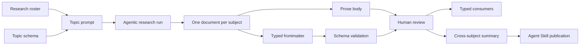

# Agentic Research as a Typed Knowledge Pipeline

Repositories often depend on facts that change faster than their code: supported command-line flags, configuration paths, protocol behavior, product capabilities, platform differences, and compatibility constraints. Traditional documentation captures these facts for people, while configuration files and source code capture a smaller subset for programs. Keeping the two synchronized is expensive, so both tend to drift.

An agentic research pipeline addresses this by producing two complementary outputs from the same research run:

- A prose explanation for developers and future research agents.
- Schema-validated metadata for generators, tests, reports, and other deterministic consumers.

The prose preserves context, caveats, evidence, and reasoning. The metadata makes important conclusions explicit, complete, and mechanically consumable. Neither output is sufficient alone: prose is difficult to query reliably, while typed fields cannot capture all the nuance needed to evaluate a changing external system.

Claudine uses this pattern to maintain knowledge about agentic CLI providers. The same pattern applies to dependency compatibility, deployment platforms, API capabilities, hardware support, package-manager behavior, security controls, or any other domain where a repository needs current, reviewable facts about a fleet of changing subjects.

## The Core Pattern

The pipeline separates orchestration, research, validation, consumption, and publication:



The important architectural choice is that the per-subject research document is the durable source artifact. Its body and frontmatter are reviewed together and committed like code. Summaries, generated catalogs, implementation work items, and Agent Skill content are projections of that research rather than competing sources of truth.

In Claudine, for example:

- [`docs/providers.yaml`](../providers.yaml) is the research roster.
- [`docs/research/skills/_fleet.md`](../research/skills/_fleet.md) defines the Agent Skills research task.
- [`docs/research/skills/_schema.yaml`](../research/skills/_schema.yaml) defines the topic's metadata contract.
- Each provider receives its own document, such as [`docs/research/skills/codex.md`](../research/skills/codex.md).
- [`docs/research/summary/agent-skills.md`](../research/summary/agent-skills.md) synthesizes the provider documents.
- `just publish-summary-research` publishes the composed summaries into the Claudine Agent Skill.

These are Claudine-specific artifacts, but their roles are reusable.

## Begin With a Domain Question

A research topic should describe one coherent knowledge domain. The goal is not “research everything about each subject.” It is to answer a bounded set of questions for a known consumer.

For example, Agent Skills research asks how each provider stores, discovers, activates, and scopes reusable skill resources. Logging research asks about log surfaces, formats, record types, timestamps, rotation, and locking behavior. These topics have different consumers and therefore different schemas.

Before writing a prompt or schema, identify:

1. The decisions the research must support.
2. The facts needed to make those decisions.
3. The evidence required to trust those facts.
4. Which conclusions belong in typed metadata.
5. Which context must remain in prose.
6. What should happen when the research discovers an unsupported value or implementation gap.

This prevents a common failure mode: collecting large amounts of interesting information that cannot answer the repository's actual questions.

A useful rule is to design the contract backward from its consumers. If a generator will eventually map a field into a Rust enum, define the research vocabulary deliberately. If a linker needs per-OS paths, require separate macOS, Linux, and Windows records. If uncertainty matters, make confidence or support level a typed field rather than leaving it implicit in prose.

## Use a Roster as the Coverage Boundary

A fleet pipeline needs one authoritative enumeration of the subjects it covers. The roster provides that boundary and supplies stable identity data to every research run.

A roster item commonly contains:

- A stable name and slug.
- The expected output filename.
- Official documentation and source repositories.
- Executable or package identity.
- User- and repository-scoped directories.
- Status fields such as active, deprecated, or excluded from research.
- Template values used to specialize the topic prompt.

Claudine's provider roster can run ahead of compiled provider support. This is useful: research can begin before implementation, and the difference between “known to the roster” and “supported in code” becomes a visible onboarding queue.

Avoid embedding a separate subject list into every topic prompt. A shared roster gives every topic the same coverage boundary, makes additions mechanical, and prevents one topic from silently omitting a provider that other topics include.

Version identity also needs deliberate handling. When a subject's major version changes its executable, protocol, or configuration surface, it may be safer to add a new roster entry than to mutate the old identity. That preserves historical meaning and allows both versions to coexist during a migration.

## Define the Metadata Contract

Each topic should have a schema describing the frontmatter its research documents must contain. Claudine stores this contract in a `_schema.yaml` sidecar and has every provider document reference it:

```yaml
---
$schema: ./_schema.yaml
created: 2026-07-01
last_updated: 2026-07-16
support: first_class
requires_claudine_update: false
---
```

The sidecar itself is a standalone Darkmatter SimplifiedSchema document:

```yaml
$schema:
    created: date
    last_updated: date(required)
    support: "enum(first_class,partial,convention_only,none,unknown; required)"
    locations: "{ os: enum(macos,linux,windows; required), scope: enum(user,repo,system,other; required), path: string(required), notes: string }[]"
    changes: string[]
    requires_claudine_update: boolean(required)
    reason: string
```

Keeping the schema in a sidecar has several advantages:

- The prompt and every generated document share one contract.
- Validation tools and downstream consumers can load the same schema.
- A schema change is visible as a focused diff.
- The schema can evolve independently of prompt wording.
- Other tooling can discover the contract without parsing an orchestration document.

The schema should capture facts that benefit from consistency, comparison, or automation. Good candidates include enums, booleans, dates, paths, ordered precedence records, capability levels, version bounds, evidence locations, and explicit gap indicators.

Do not force every conclusion into metadata. Explanations of undocumented behavior, conflicting sources, edge cases, and causal reasoning usually belong in prose. The schema should model the stable decision surface, not duplicate the entire report.

### Darkmatter's `SimplifiedSchema`

Darkmatter's [`SimplifiedSchema`](../../../darkmatter/lib/src/markdown/schemas/simplified/types.rs) is the Rust representation of this authoring grammar. Despite sometimes being described informally as a struct, the current Rust type is an enum with `Single(SchemaShape)` and `Union(Vec<SchemaArm>)` variants. It is re-exported from [`darkmatter::markdown::schemas`](../../../darkmatter/lib/src/markdown/schemas/mod.rs).

The broader API is documented in [Schema Definition](../../../darkmatter/docs/topics/schema-definition.md). Important entry points include:

- `parse_yaml_schema` for parsing the authored grammar.
- `to_json_schema` for compiling it to Draft 2020-12 JSON Schema.
- `DarkmatterSchemas` for schema resolution, validation, baselines, and caching.
- `validate_with_positions` for source-aware diagnostics.
- `normalize_frontmatter` for schema-directed normalization.
- `detect` for bootstrapping a schema from existing documents.
- `md schema about` for the implementation-bound grammar reference.
- `md schema validate <document>` for command-line validation.

SimplifiedSchema provides typed scalars, arrays, enums, constraints, property-level and root-level unions, and quoted inline-object definitions. Descriptions authored with `->` are surfaced in validation errors, so they can explain not only what type is expected but what the field means.

A few behaviors matter when designing research contracts:

- Properties are optional unless marked `required`.
- An optional property whose value is `null` is treated as absent.
- Schema-recognized scalar values can be normalized to their declared types.
- Root schemas currently allow undeclared top-level properties. If unknown-key rejection is required, add a supplemental contract check or use an appropriate strict JSON Schema.
- Inline object definitions are closed and reject undeclared fields.
- SimplifiedSchema compiles to JSON Schema and uses the same validation engine; it is an authoring surface, not a second validator.
- A schema proves shape and constraints, not factual truth.

The last point is essential. A valid URL field may still identify the wrong documentation page. A valid enum may still contain the wrong classification. Evidence requirements, mechanical checks, and review remain part of the pipeline.

## Write the Prompt and Schema Together

The research prompt and schema serve different purposes but must agree.

The prompt should tell the researcher:

- What the topic includes and excludes.
- What evidence sources to prefer.
- Which questions the prose must answer.
- Which fields must be populated.
- How uncertainty should be represented.
- How first-run and refresh behavior differ.
- Where the result must be written.
- How completion will be verified.

The schema then enforces the parts of that instruction that can be checked mechanically.

Descriptions in the prompt should not silently redefine schema enums. If `support` accepts `first_class`, `partial`, `convention_only`, `none`, and `unknown`, the prompt should explain those exact values. If an unexpected new category appears during research, the run should surface that mismatch rather than squeezing the finding into the closest existing value.

This is how the schema becomes a feedback mechanism. An unmappable or missing value may mean:

- The research is incomplete.
- The provider introduced a new behavior.
- The prompt is underspecified.
- The schema vocabulary is too narrow.
- A downstream type must be expanded.
- The fact belongs in prose rather than the typed contract.

## Pilot Before Running the Fleet

Run a new topic against one deliberately representative subject before expanding to the full roster. A good pilot has enough complexity to challenge the schema: multiple platforms, several record types, undocumented behavior, or local evidence.

Use the pilot to answer:

- Can the schema express real findings without awkward workarounds?
- Are required fields genuinely knowable?
- Are nested records shaped correctly?
- Does the prompt distinguish unknown from absent?
- Are the evidence requirements practical?
- Do validation errors help the researcher correct the document?
- Does the metadata answer the downstream consumer's questions?

Schema detection can provide a starting point when rich research documents already exist, but detected schemas require human tightening. A sample corpus cannot reliably infer required properties, enum vocabularies, evidence standards, or semantic constraints.

Claudine's provider-metadata work found that the practical authoring loop was evidence and prose first, then a hand-designed schema validated against real results. That is generally more reliable than attempting to infer the final contract automatically.

## Fan Out With Sequence Orchestration

Once the topic has a stable prompt and schema, run the same research process over the roster. Claudine's `sequence` operation injects each roster item as `state`, allowing one prompt to produce one document per provider.

This pattern produces a useful matrix:

```text
subjects × research topics = independently refreshable knowledge documents
```

Each cell remains small enough to review and rerun. Adding a subject expands every relevant topic. Adding a topic creates a new view across the existing roster.

Serial execution is often preferable for research fleets because it makes progress, rate limits, failures, and output ownership easier to reason about. Parallelism can be added when the research provider and evidence sources tolerate it, but deterministic filenames and isolated per-item state remain important.

## Use Lifecycle Controls as Quality Gates

A provider process exiting successfully does not prove that useful research was produced. Lifecycle controls should verify the artifact, communicate progress, and define bounded recovery.

A typical research lifecycle includes:

- `initialize`: determine whether the subject needs research, report progress, and skip current documents.
- `start`: record that validation and preflight checks have passed.
- `success`: verify the expected file exists, carries the current refresh date, and satisfies the topic contract.
- `blocked` or `failure`: report why research could not complete and select an appropriate recovery action.
- `finalize`: record outcome metrics or cleanup regardless of success.
- `retry` or `resume`: recover from transient failures or continue an interrupted research session.

Claudine's skills fleet, for example, checks `last_updated` before accepting success. This catches the case where an agent exits with code zero but never writes the requested document.

Quality gates should be stronger than timestamps where the domain permits it. They can require:

- Successful `md schema validate`.
- Non-empty prose sections.
- At least one evidence record for important claims.
- Source URLs or local evidence paths.
- A recognized confidence value.
- A mechanical fixture replay or parser check.
- No unexpected removal of previously supported capabilities.
- Explicit acknowledgment of new enum values or gaps.

Recovery should be bounded. Retry is appropriate for a transient network or provider failure. Resume is appropriate when the provider supports preserving the existing research context. Neither should turn a contradictory result into an infinite loop. Unexpected findings should eventually become a visible failed gate, schema change, override, or review item.

## Treat Evidence as Data

Schema validation improves consistency but cannot establish truth. High-quality research therefore records how each fact was learned.

Useful provenance fields include:

- Source URL or source-code permalink.
- Observed file or command output.
- Subject version.
- Observation date.
- Confidence such as `source_code`, `observed`, `documented`, or `inferred`.
- `since` and `until` version bounds.
- Evidence fixtures for claims that can be replayed.

Prefer evidence as close to behavior as practical. Official documentation is a strong starting point, but source code, versioned schemas, `--help` output, and carefully inspected local state can reveal behavior omitted from documentation.

When a fact cannot be established, record the gap explicitly. An `unknown` or `unspecified` value is more useful than an omitted property because it remains queryable, reviewable, and available for future refreshes.

For especially important metadata, add a domain-specific checker. If research provides a JSON locator, replay it against a captured fixture. If it provides an executable path, probe it safely. If it names an enum vocabulary, compare it with a source definition. The strongest pipeline validates both the record's shape and its claimed behavior.

## First Construction and Refresh Are Different Operations

The first run establishes a baseline. A refresh challenges that baseline with current evidence.

| Concern           | First construction               | Refresh                                             |
|-------------------|----------------------------------|-----------------------------------------------------|
| Existing document | None                             | Read for coverage and comparison                    |
| `created`         | Set once                         | Preserve                                            |
| `last_updated`    | Set to the run date              | Advance only after successful research              |
| Evidence          | Establish current facts          | Re-establish current facts independently            |
| Changelog         | Usually empty                    | Explain material changes                            |
| Typed `changes`   | Usually `[]`                     | Record concise, machine-readable changes            |
| Missing facts     | Establish as explicit gaps       | Determine whether gaps have closed                  |
| Review focus      | Completeness and contract design | Drift, removals, changed meanings, and new variants |

Old research is useful during refresh for preserving topic coverage and producing a changelog. It must not become evidence for its own continued correctness. The researcher should verify current behavior from authoritative sources again.

Freshness policy can be expressed through a date window, version change, source hash, release event, or explicit operator request. Claudine's fleets commonly skip documents that were refreshed within a configured interval, making an interrupted fleet resumable without repeating completed work.

Refresh logic should also account for roster changes:

- New subject: create every applicable topic document.
- Paused subject: retain identity but skip scheduled research.
- Removed subject: archive or delete according to repository policy.
- Major-version replacement: add a new identity and research it independently.
- Topic schema change: revalidate the whole topic, even if individual facts are still fresh.

Always review the refresh as a diff. Changes to structured fields deserve the same attention as source-code changes because they may affect generation, runtime behavior, or published guidance.

## Convert Research Into Typed Repository Data

Schema-valid frontmatter is already useful for reporting and comparison, but it can also feed strongly typed code or data artifacts.

A deterministic consumer can:

1. Load the roster.
2. Load and validate each topic document.
3. Normalize schema-recognized values.
4. Join fields from multiple topics.
5. Map string vocabularies into native enums and records.
6. Fail loudly on unknown or incompatible values.
7. Emit generated code, JSON, documentation, or tests.
8. Compare generated output with the committed snapshot.

This division of labor is powerful:

- The research agent performs broad, evidence-heavy investigation.
- The schema constrains its conclusions.
- Deterministic code performs the final mapping.
- Human review approves the research and generated diffs.

The agent does not generate unchecked runtime truth directly. It produces a reviewable knowledge artifact that deterministic tooling can consume.

This makes high-quality typed metadata practical at a scale that would be costly to maintain manually. A developer no longer has to investigate every provider before updating a capability table, but the repository still retains evidence, prose context, validation, and an explicit mapping boundary.

When repeated refreshes expose a persistent research error, keep human corrections in a separate, durable override layer rather than hand-editing generated outputs. Every override should include a reason and should also prompt a review of the research instructions. Overrides are an escape hatch, not a second unmanaged catalog.

A useful field such as `requires_claudine_update` generalizes well. It lets research state that the repository's implementation no longer matches current external behavior. This turns research into an active drift detector instead of passive documentation.

## How the Pipeline Keeps a Repository Current

The pipeline creates several reinforcing maintenance loops:

- The roster makes missing coverage visible.
- Freshness policy determines when evidence should be re-established.
- Per-subject documents keep refreshes small and reviewable.
- Schema validation catches malformed or incomplete metadata.
- Evidence records distinguish strong findings from inference.
- Changelogs and typed `changes` make drift explicit.
- Downstream generation reveals incompatible new values.
- Drift checks prevent research and generated artifacts from diverging.
- Summary regeneration exposes cross-subject changes that individual documents may hide.
- Implementation flags turn research findings into actionable engineering work.

The result is not perfect automatic truth. It is a repeatable process for replacing stale assumptions with current, reviewable evidence.

## Roll Detailed Research Into an Agent Skill

Detailed research and Agent Skill content serve different context budgets.

Per-subject research should remain comprehensive. It needs exact paths, source citations, version caveats, examples, uncertainty, and implementation notes. Injecting every research document into an Agent Skill would make the skill large, repetitive, and difficult for an agent to navigate.

Instead, add a synthesis stage:

1. Group the validated documents by topic.
2. Compare subjects using the typed metadata.
3. Read the prose for caveats that metadata cannot express.
4. Produce a cross-subject summary focused on decisions and meaningful variance.
5. Review the summary against the detailed documents.
6. Publish the summary into the Agent Skill.
7. Retain links or clear provenance back to the detailed research.

Claudine's summary prompts use iterative passes: build an initial point of view from a subset, incorporate the remaining provider documents, then normalize tone and check completeness. The resulting topic summary is published under the Claudine skill's `summaries/` directory.

The summary should not merely concatenate provider reports. It should answer comparative questions:

- What is common across the fleet?
- Which differences affect implementation or portability?
- Which classifications are safe?
- What changed during the latest refresh?
- Where are important gaps or contradictions?
- What should the consuming agent do differently because of those findings?

Treat the Agent Skill copy as a published projection, not the source of truth. Refresh the detailed research first, validate it, regenerate the summary, inspect the summary diff, and only then publish it. This preserves a clean lineage:

```text
current evidence
  → detailed research
  → validated metadata
  → cross-subject synthesis
  → Agent Skill guidance
```

The skill gains compact, current expertise, while the repository retains the deeper evidence needed for verification and future refreshes.

## A Minimal Adoption Recipe

A package or repository can adopt the pattern incrementally:

1. Choose one volatile, decision-relevant research topic.
2. Create a roster with stable subject identifiers.
3. Define one output document per subject.
4. Pilot the prose research on one representative subject.
5. Design a `_schema.yaml` sidecar backward from actual consumers.
6. Add `$schema: ./_schema.yaml` to every result.
7. Validate with `md schema validate`.
8. Add lifecycle checks that verify the artifact rather than trusting process exit.
9. Run the fleet and review the resulting prose and metadata.
10. Add a deterministic consumer only after the contract is stable.
11. Define a freshness and refresh policy.
12. Generate a cross-subject summary for documentation or Agent Skill publication.

Start with the smallest topic that produces a useful decision. The pattern earns its value through repeatability: each refresh should be easier, more complete, and more mechanically trustworthy than reconstructing the repository's knowledge by hand.
