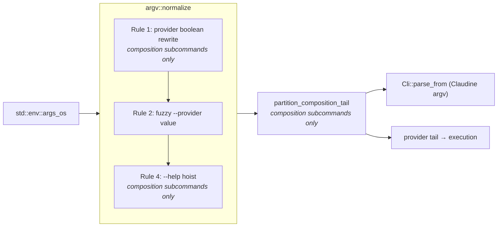

# Argv Normalization

Claudine's CLI is parsed by `clap` via derive. The surface has grown to
the point where clap's ordinary parsing model produces rough edges:
seven boolean provider flags in a mutual-exclusion group, positional
"file plus `key=value` setters" collected with `num_args = 1..`, and
fuzzy provider matching that historically only applied to the
`--provider` value.

Claudine installs a thin **argv normalization layer** between
`std::env::args_os()` and `Cli::parse_from` so a curated set of
shorthand patterns is reshaped into the canonical form clap already
understands. clap remains the authoritative parser; the normalizer
never consults clap, never reads the filesystem, and only reshapes
input on the way in.

The implementation lives in [`claudine/cli/src/argv.rs`](../../cli/src/argv.rs),
and is wired into [`claudine/cli/src/main.rs`](../../cli/src/main.rs) as
the single pre-clap entry point.

## Pipeline placement



> **Retired: Rule 3.** The former Rule 3 inserted a synthetic `--` separator to
> protect trailing setters from interleaved flags. It was removed when
> composition gained provider-argument forwarding: a synthetic `--` collided
> with an *authored* `--` boundary. Trailing-setter handling and provider
> forwarding are now both owned by the post-normalization **ownership
> partition** (see [Provider-argument partition](#provider-argument-partition)),
> not by a normalization rule.

`main.rs` collects argv once, passes it to `argv::normalize`, then to
`argv::partition_composition_tail`, and reuses the resulting Claudine argv for
the `--plain` pre-scan and every parse pass. Library code never sees argv and
therefore never normalizes.

## Rewrite rules

Rules are applied in order, in a single left-to-right pass, and stop at
the first literal `--` token.

### Rule 1 — provider boolean → `--provider <slug>`

Rule 1 is **gated on composition subcommands** (`compose`,
`inline-compose`, `sequence`). The same tokens appearing on wrapper
subcommands (`claude`, `codex`, …) are left alone so they pass through
to the wrapped child CLI unchanged. See [Pass-through guarantees](#pass-through-guarantees)
below.

The seven user-facing provider booleans are rewritten to the canonical
`--provider <slug>` pair using `Provider::as_slug()`:

| Boolean flag | Canonical slug |
|---|---|
| `--claude` | `claude` |
| `--codex` | `codex` |
| `--gemini` | `gemini` |
| `--goose` | `goose` |
| `--kimi` | `kimi` |
| `--opencode` | `opencode` |
| `--qwen` | `qwen` |

**Before**

```sh
claudine compose file.md --gemini
```

**After normalization (what clap sees)**

```sh
claudine compose file.md --provider gemini
```

Duplicates are preserved verbatim so clap keeps emitting its existing
mutual-exclusion error — `--claude --gemini` becomes
`--provider claude --provider gemini` and clap rejects it.

The normalizer does **not** fuzzy-match these flags. `--claud` is left
untouched so clap surfaces an unknown-argument error, which is the
desired outcome.

### Rule 2 — fuzzy `--provider <value>` canonicalization

Both the space form (`--provider cl`) and the equals form
(`--provider=cl`) are passed through `Provider::fuzzy_match_cli_name`.
If the helper resolves a match, the value is replaced with its canonical
slug. If it does not, the token is left untouched so clap keeps its
native "invalid value" error listing the valid variants.

**Before**

```sh
claudine compose --provider cl file.md
claudine compose --provider=oc file.md
```

**After normalization**

```sh
claudine compose --provider claude file.md
claudine compose --provider=opencode file.md
```

Edge cases intentionally left untouched:

- `--provider` with no following token — clap produces "a value is required".
- `--provider=` with an empty value — clap produces its native error.
- `--provider -x` — the next token starts with `-` and is treated as a
  flag, not a value. Leave untouched.

### Rule 4 — `--help` / `-h` hoisting

The root `Cli` declares its own non-global `help: bool` with
`disable_help_flag = true`, which means composition subcommands never
inherit a functional `--help` handler. Without intervention, typing
`claudine compose file.md --help` collapses into clap's greedy positional
collector and surfaces one of two confusing errors:

```text
error: unexpected argument '--help' found
  tip: to pass '--help' as a value, use '-- --help'
```

Rule 4 defuses that by scanning the argv between the composition
subcommand and the first literal `--` for an exact `--help` or `-h`
token and hoisting it to argv position 1, before the subcommand. The
resulting argv short-circuits into Claudine's custom help handler (via
`cli.help == true` in `main.rs`) regardless of what else appears on the
command line.

**Before**

```sh
claudine compose file.md --help
claudine compose file.md --gemini name=Ken --help
claudine compose -h
```

**After normalization**

```sh
claudine --help compose file.md
claudine --help compose file.md --provider gemini name=Ken
claudine -h compose
```

Rule 4 hoists `--help` out of the composition argv before the ownership
partition runs, so the partition never treats `--help` as an agent-tail token.
It is gated to composition subcommands only — wrapper subcommands
(`claudine claude --help`) intentionally forward `--help` to the child
CLI, and non-composition subcommands already have working `--help`
support.

Rule 4 does not fire when:

- `--help` / `-h` appears at or after the first literal `--` (it's a
  trailing raw value and belongs to someone else);
- the subcommand is a wrapper or other non-composition subcommand;
- the argv already has `--help` / `-h` at position 1 (idempotent).

## Provider-argument partition

After the four normalization rules, `argv::partition_composition_tail`
(`cli/src/argv/partition.rs`) runs on the composition subcommands only. It is
**not** a normalization rule — it returns two vectors instead of one — but it
is the successor to the retired Rule 3 and owns everything Rule 3 used to do
plus provider-argument forwarding.

It splits the normalized argv into:

1. the **Claudine argv** handed to clap (the file, `key=value` setters, and
   every Claudine-owned option with its value); and
2. the **provider tail** (`ProviderArgs`) forwarded verbatim to the underlying
   agent, threaded through `CompositionExecutionRequest` and seeded into the
   child argv at the same base position as direct-wrapper passthrough.

**Ownership model** (left to right, after the composition file has been seen):

- A token matching Claudine's clap surface (long/short/alias, space or
  `=`/attached form) always belongs to Claudine — even after an implicit tail
  has started — preserving the wrapper's flag precedence (`-m`, `-o`, `-y`,
  `--model`, `--silent`, …). Value-bearing options keep their next-token value.
- The first **non-Claudine switch** after the file starts an implicit agent
  tail; every non-Claudine token from there (including setter-shaped values and
  bare operands) is forwarded in original order.
- A literal `--` after the file starts an **explicit** opaque tail: the `--` is
  consumed by Claudine and everything after it is forwarded with no further
  classification.

The owned-flag surface is derived from the clap command definitions
(`OwnedFlags::for_composition`) and covered by a drift test — never a second
hand-maintained list.

**Ordering rule.** The composition file must precede the first implicit
provider switch, and a `--` must not precede the file. An unowned switch — or a
`--` — before the file is a partition error with targeted ordering guidance,
because the file must resolve independently of provider argv.

**Before**

```sh
claudine sequence fleet.md --codex -c model_reasoning_effort=low
```

**After partition**

```text
Claudine argv:  claudine sequence fleet.md --provider codex
provider tail:  -c model_reasoning_effort=low   (→ codex)
```

## Pass-through guarantees

The normalizer never mutates argv when any of the following hold:

1. **Completion mode.** `clap_complete::CompleteEnv` signals completion
   through the `COMPLETE` environment variable. When set, argv is
   returned untouched so dynamic completion sees exactly what the shell
   typed.
2. **Tokens at or after `--`.** The first literal `--` terminates the
   rule scan; everything after it is copied verbatim.
3. **Non-UTF-8 tokens.** Rules are pattern-based on `&str`; `OsString`
   values that are not valid UTF-8 are left in place.
4. **Argv with fewer than two elements.** Nothing downstream needs
   parsing.
5. **Non-composition subcommands.** Rule 1 and Rule 4 (and the ownership
   partition) are gated to the composition trio (`compose`,
   `inline-compose`, `sequence`); wrapper subcommands (`claude`, `codex`, …)
   and every other subcommand pass through unchanged. Rule 2 remains
   flag-driven so `--provider` resolution works regardless of subcommand.
   Unknown-subcommand handling stays with clap.

Every new rule added to the normalizer MUST land with a matching
pass-through unit test so the normalizer cannot silently start
rewriting inputs it should leave alone.

## Testing

Unit tests live inside the `argv` module (`#[cfg(test)] mod tests` in
`mod.rs` and `partition.rs`) and cover every rewrite rule, each
boolean-to-slug mapping, every pass-through guarantee, and the ownership
partition (implicit/explicit tails, owned-flag reclaim after tail start,
ordering errors, setter-vs-tail classification, owned-surface drift).

Integration tests live in
[`claudine/cli/tests/argv_normalization.rs`](../../cli/tests/argv_normalization.rs)
and drive the compiled `claudine` binary through the headline cases plus
the key pass-through cases (`--version`, root `--help`, `hooks --describe`)
and the provider-forwarding cases (non-owned flag after/before the file).

Reference: features `2026-04-17-cli-pre-processing` and
`2026-07-13-cli-switches`.
