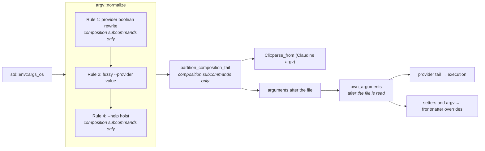
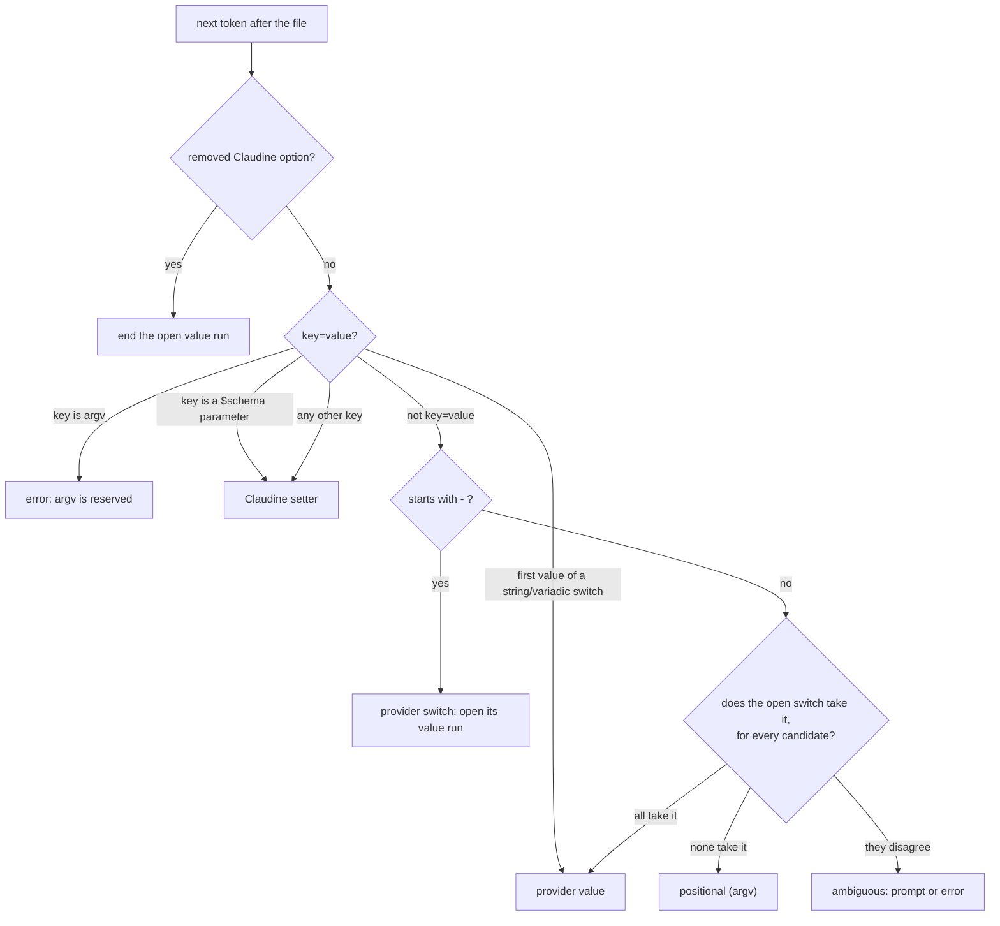

# Argv Normalization

Claudine's CLI is parsed by `clap` via derive. The surface has grown to
the point where clap's ordinary parsing model produces rough edges:
seven boolean provider flags in a mutual-exclusion group, positional
"file plus `key=value` setters" collected with `num_args = 1..`, and
fuzzy provider matching that historically only applied to the
`--provider` value.

Claudine installs a thin **argv normalization layer** between
`std::env::args_os()` and `Cli::parse_from` so a curated set of
shorthand patterns is reshaped into the canonical form clap already
understands. clap remains the authoritative parser; the normalizer
never consults clap, never reads the filesystem, and only reshapes
input on the way in.

The implementation lives in [`claudine/cli/src/argv/mod.rs`](../../cli/src/argv/mod.rs),
and is wired into [`claudine/cli/src/main.rs`](../../cli/src/main.rs) as
the single pre-clap entry point.

## Pipeline placement


```mermaid
flowchart LR
    A["std::env::args_os"] --> B["argv::normalize"]
    subgraph B["argv::normalize"]
        direction TB
        R1["Rule 1: provider boolean rewrite<br/><i>composition subcommands only</i>"]
        R2["Rule 2: fuzzy --provider value"]
        R4["Rule 4: --help hoist<br/><i>composition subcommands only</i>"]
        R1 --> R2 --> R4
    end
    B --> P["partition_composition_tail<br/><i>composition subcommands only</i>"]
    P --> C["Cli::parse_from (Claudine argv)"]
    P --> T["arguments after the file"]
    T --> O["own_arguments<br/><i>after the file is read</i>"]
    O --> TL["provider tail → execution"]
    O --> ST["setters and argv → frontmatter overrides"]
```

> **Retired: Rule 3.** The former Rule 3 inserted a synthetic `--` separator to
> protect trailing setters from interleaved flags. It was removed when
> composition gained provider-argument forwarding: a synthetic `--` collided
> with an *authored* `--` boundary. Trailing-setter handling and provider
> forwarding are now both owned by the post-normalization **ownership
> partition** (see [Provider-argument partition](#provider-argument-partition)),
> not by a normalization rule.

`main.rs` collects argv once, passes it to `argv::normalize`, then to
`argv::partition_composition_tail`, and reuses the resulting Claudine argv for
the `--plain` pre-scan and every parse pass. Library code never sees argv and
therefore never normalizes.

## Rewrite rules

Rules are applied in order, in a single left-to-right pass, and stop at
the first literal `--` token.

### Rule 1 — provider boolean → `--provider <slug>`

Rule 1 is **gated on composition subcommands** (`compose`,
`inline-compose`, `sequence`). The same tokens appearing on wrapper
subcommands (`claude`, `codex`, …) are left alone so they pass through
to the wrapped child CLI unchanged. See [Pass-through guarantees](#pass-through-guarantees)
below.

The seven user-facing provider booleans are rewritten to the canonical
`--provider <slug>` pair using `Provider::as_slug()`:

| Boolean flag | Canonical slug |
|---|---|
| `--claude` | `claude` |
| `--codex` | `codex` |
| `--gemini` | `gemini` |
| `--goose` | `goose` |
| `--kimi` | `kimi` |
| `--opencode` | `opencode` |
| `--qwen` | `qwen` |

**Before**

```sh
claudine compose file.md --gemini
```

**After normalization (what clap sees)**

```sh
claudine compose file.md --provider gemini
```

Duplicates are preserved verbatim so clap keeps emitting its existing
mutual-exclusion error — `--claude --gemini` becomes
`--provider claude --provider gemini` and clap rejects it.

The normalizer does **not** fuzzy-match these flags. `--claud` is left
untouched so clap surfaces an unknown-argument error, which is the
desired outcome.

### Rule 2 — fuzzy `--provider <value>` canonicalization

Both the space form (`--provider cl`) and the equals form
(`--provider=cl`) are passed through `Provider::fuzzy_match_cli_name`.
If the helper resolves a match, the value is replaced with its canonical
slug. If it does not, the token is left untouched so clap keeps its
native "invalid value" error listing the valid variants.

**Before**

```sh
claudine compose --provider cl file.md
claudine compose --provider=oc file.md
```

**After normalization**

```sh
claudine compose --provider claude file.md
claudine compose --provider=opencode file.md
```

Edge cases intentionally left untouched:

- `--provider` with no following token — clap produces "a value is required".
- `--provider=` with an empty value — clap produces its native error.
- `--provider -x` — the next token starts with `-` and is treated as a
  flag, not a value. Leave untouched.

### Rule 4 — `--help` / `-h` hoisting

The root `Cli` declares its own non-global `help: bool` with
`disable_help_flag = true`, which means composition subcommands never
inherit a functional `--help` handler. Without intervention, typing
`claudine compose file.md --help` collapses into clap's greedy positional
collector and surfaces one of two confusing errors:

```text
error: unexpected argument '--help' found
  tip: to pass '--help' as a value, use '-- --help'
```

Rule 4 defuses that by scanning the argv between the composition
subcommand and the first literal `--` for an exact `--help` or `-h`
token and hoisting it to argv position 1, before the subcommand. The
resulting argv short-circuits into Claudine's custom help handler (via
`cli.help == true` in `main.rs`) regardless of what else appears on the
command line — including when the rest does not satisfy the subcommand. A
root help request is answered before clap's required-argument check, so
`claudine compose --help` shows help and exits 0 without a file, exactly as
`claudine compose missing.md --help` does without opening `missing.md`. The
same holds for `claudine --help <command>` on any command with required
arguments, such as `claudine --help completions`.

**Before**

```sh
claudine compose file.md --help
claudine compose file.md --gemini name=Ken --help
claudine compose -h
```

**After normalization**

```sh
claudine --help compose file.md
claudine --help compose file.md --provider gemini name=Ken
claudine -h compose
```

Rule 4 hoists `--help` out of the composition argv before the ownership
partition runs, so the partition never treats `--help` as an agent-tail token.
It is gated to composition subcommands only. Wrapper subcommands
(`claudine claude --help`) show Claudine's own wrapper help, and
non-composition subcommands already have working `--help` support. To
send `--help` to the provider, put it after `--`
(`claudine claude -- --help`).

Rule 4 does not fire when:

- `--help` / `-h` appears at or after the first literal `--` (it's a
  trailing raw value and belongs to someone else);
- the subcommand is a wrapper or other non-composition subcommand;
- the argv already has `--help` / `-h` at position 1 (idempotent).

## Provider-argument partition

After the four normalization rules, `argv::partition_composition_tail`
(`cli/src/argv/partition.rs`) runs on the composition subcommands only. It is
**not** a normalization rule, but it is the successor to the retired Rule 3.
It settles everything that needs no composition file and leaves the rest for
[type-aware ownership](#type-aware-ownership), which runs once the file has
been read.

It splits the normalized argv into:

1. the **Claudine argv** handed to clap: the file, any setters *before* it, and
   every Claudine-owned option with its value, wherever it appears before an
   authored `--`; and
2. the **arguments after the file** (`claudine::composition::ArgumentsAfterFile`):
   every other token after the file in original order, plus the opaque suffix
   after the first `--`.

Partition rules, left to right:

- A token matching Claudine's clap surface (long/short/alias, space or
  `=`/attached form) always belongs to Claudine, with the next token when the
  option takes a value (`-m`, `-o`, `-y`, `--model`, `--silent`, …). After the
  file, the removed option leaves a marker, so the tokens on either side of it
  can never join one provider value run.
- The first bare non-setter token is the composition file.
- A literal `--` after the file starts an **explicit** opaque tail: the `--` is
  consumed by Claudine and everything after it is forwarded with no further
  classification. Only the first `--` is consumed; a later one is forwarded
  as an ordinary token.

The owned-flag surface is derived from the clap command definitions
(`OwnedFlags::for_composition`) and covered by a drift test — never a second
hand-maintained list.

**Ordering rule.** The composition file must precede every provider switch,
and a `--` must not precede the file. An unowned switch — or a `--` — before
the file is a partition error with targeted ordering guidance, because the
file must resolve independently of provider argv.

**Before**

```sh
claudine sequence fleet.md --codex -c model_reasoning_effort=low phase=2
```

**After partition, then ownership**

```text
Claudine argv:       claudine sequence fleet.md --provider codex
after the file:      -c model_reasoning_effort=low phase=2
ownership decides:   provider tail  -c model_reasoning_effort=low   (→ codex)
                     setter         phase=2
```

## Type-aware ownership

`claudine::composition::own_arguments` (`lib/src/composition/ownership.rs`)
decides, token by token, who owns each argument after the file. The CLI calls
it from `compose`, `inline-compose`, and `sequence` right after the file is
resolved (`cli/src/commands/compose/ownership.rs`). Help and version never get
that far, so they never open a file.

What you can rely on:

```sh
# -c takes a string for Codex, so the setter-shaped value is forwarded;
# phase=2 follows a value, not a switch, so it is Claudine's setter.
claudine compose plan.md --codex -c model_reasoning_effort=low phase=2

# --add-dir takes a list for Claude: a and b are forwarded, x=y is a setter.
claudine compose plan.md --claude --add-dir a b x=y

# Bare words nothing takes are positionals: argv is ["alpha", "beta"].
claudine compose plan.md alpha --codex -c x=y beta

# Anything after -- goes to the agent untouched.
claudine compose plan.md --codex -- exec-operand --anything
```


```mermaid
flowchart TD
    T["next token after the file"] --> O{"removed Claudine option?"}
    O -- yes --> E["end the open value run"]
    O -- no --> S{"key=value?"}
    S -- "key is argv" --> R["error: argv is reserved"]
    S -- "key is a $schema parameter" --> CS["Claudine setter"]
    S -- "first value of a string/variadic switch" --> FW["provider value"]
    S -- "any other key" --> CS
    S -- "not key=value" --> W{"starts with - ?"}
    W -- yes --> SW["provider switch; open its value run"]
    W -- no --> B{"does the open switch take it,<br/>for every candidate?"}
    B -- "all take it" --> FW
    B -- "none take it" --> P["positional (argv)"]
    B -- "they disagree" --> A["ambiguous: prompt or error"]
```

### The rules

1. **Claudine options first.** Already removed by the partition; each removed
   option ends any open value run.
2. **Schema parameters always win.** A `key=value` whose key the document's
   authored `$schema` declares (in any union arm) is a Claudine setter, even
   directly after a provider switch. `argv=…` is always an error before `--`.
3. **A `key=value` goes to a provider only** as the first value of a switch in
   space form that takes a string or a list for at least one candidate
   provider. Every other `key=value` is a setter.
4. **Each switch takes values by its researched type** (from
   `claudine::provider::match_switch_token`, at the command path the launch
   uses): *none* takes nothing; *string* takes the next token; *number* takes
   the next token if it is a finite decimal (`5`, `+5`, `.5`, `1e-3`; not
   `0x10`, `NaN`, `inf`, `1_000`); *variadic* takes every following bare word
   until a switch, setter, or Claudine option.
5. **Unrecognized switches** (not in a candidate's catalog, or researched as
   `unknown`) take the next bare word, and never a `key=value`. Unknown is never
   read as "takes no value".
6. **Exact spellings and researched attached forms only.** `--config=x` and
   Codex's `-cx` carry their value and take nothing more. An unresearched
   `--name=value` also takes nothing more. A short cluster such as `-abc` is
   never split; it is an unrecognized switch.
7. **A value starting with `-` must be attached** (`--temperature=-0.5`).
8. **A bare word nothing takes is a positional** in the `argv` array.
9. **Only the first `--` is consumed**; everything after it is forwarded and
   never checked.

An empty argument is a valid string value and stays empty. A repeated scalar
switch (`-c a=1 -c b=2`) is two switches, each with its own value.

### Candidate providers and the authored snapshot

The switch types come from the **candidate providers**:

1. the provider named on the command line (`--codex`, `--provider codex`);
   otherwise
2. the providers in the document's literal frontmatter `agent`; otherwise
3. every provider Claudine supports.

Ownership reads the document **as authored**, before any caller override: a
caller `agent=codex` or `--set` still selects the run's provider as usual, but
it does not change who owns a token (`compose plan.md agent=codex -c foo` is
read against every candidate the document lists; write `--codex` instead). An
`agent` written as an expression (`"{{ env.AGENT }}"`) narrows nothing.
`sequence` uses the sequence document's `agent`; per-step providers never
narrow the set.

Schema parameter names come from the literal `$schema`, resolved relative to
the document through the composer's own loader (no templates, shell, or
network). SimplifiedSchema contributes every arm's property names; raw JSON
Schema its statically declared top-level names. A `$schema` that cannot be
read is an error, not a guess. A `$schema` written as an expression cannot be
read without running it, so a `key=value` a provider switch would take is then
an error telling you to put it after `--` or pass it with `--set`.

### Ambiguity

When the candidates disagree about whether a switch takes the next bare word —
Claude's `-c` takes no value, Codex's takes one — Claudine never picks
silently:

- In an interactive session (`prompt_for_missing` on, stdin and stderr are
  terminals, no `--silent`) it asks which agent the arguments are intended for.
  The answer decides **how the arguments are read** only; the run, each
  `sequence` step, and each proxy target still resolve their own provider.
- Otherwise the command fails before launch:

```text
Error: ambiguous provider argument: the candidate agents read the word after `-c` differently.
  Claude: takes no value (leaves the word to Claudine)
  Codex: takes one value (takes the word as its value)
Name the provider (for example `--codex`), or pass provider arguments after `--`.
```

A scalar-versus-list disagreement (one candidate stops after one value, another
keeps going) is ambiguous the same way.

### Shell completion reads the same ownership

`claudine __complete` asks the same function who owns the word under the
cursor (`claudine::composition::owner_of_last_argument`, called from
`cli/src/completion/engine/ownership.rs`). It normalizes and partitions the
words before the cursor exactly as a run would, reads the file's literal
`agent` and `$schema` only when a provider switch follows the file, and
offers nothing for a word the agent owns or a line ownership rejects. A flag
at the cursor is judged by the words before it, so `--codex -c phase=2
--mod<TAB>` offers nothing while `--codex -c low --mod<TAB>` offers
`--model`. It never prompts. See
[Shell Completions → Provider arguments after the composition file](completions/shell-completions.md#provider-arguments-after-the-composition-file).

```text
$ claudine compose plan.md --codex -c <TAB>      # nothing: the word is -c's value
$ claudine compose plan.md --codex -c low ph<TAB>
phase=
```

### The resolved-provider check

Ownership with several candidates reads a union of types, so the provider that
finally runs may disagree with it. Before a launch Claudine checks each implicit
switch against that provider at the command path it really uses:

| Problem | Example |
| --- | --- |
| missing value | `--codex -c phase=2` where `phase` is a schema parameter leaves Codex's `-c` empty |
| extra value | `-c model_reasoning_effort=low` forwarded because Codex takes it, but the run resolved to Claude |
| too few values | a list switch researched with a minimum of two got one |
| attached only | Claude's `--debug` takes its value only as `--debug=…` |

The check runs when ownership is decided (failing only if every candidate is
wrong), for the command's provider before anything runs, for every `sequence`
step whose provider is known before step 1, and before every spawn (a retry, a
proxy target, a resume, or a step decided at runtime). A resume is checked at
the resume entrypoint (`exec resume` for Codex), whose switches can differ:
Codex's `--image` takes a list at `exec` but one value at `exec resume`. Only
researched types fail; a switch the catalog does not establish is left to the
provider. The failure is a Claudine error before the spawn, never a native-exit
report:

```text
Error: provider argument `-c` takes no further value for Claude (at its root command), but
`model_reasoning_effort=low` was forwarded as its value because another candidate agent reads
it as one. Name the provider (for example `--codex`), or pass provider arguments after `--`.
```

A value shown in that message is hidden behind a secret-named switch, has
recognized secrets masked, and has control characters escaped.

Ownership is fixed once per invocation: a retry, proxy target, or step may run
a different provider, but it never reassigns a setter or positional.

### The tail descriptor

`ProviderTail` keeps the forwarded tokens in order together with the
**boundary**: the index where the tokens that followed an authored `--` begin.
The `--` itself is consumed, so the boundary is the only record of where the
caller put it.

| Command line after the file | Forwarded tokens | `boundary()` |
| --- | --- | --- |
| `-c x=y` | `-c x=y` | `None` (all implicit) |
| `-- -c value` | `-c value` | `Some(0)` (all opaque) |
| `-c x=y -- --native z` | `-c x=y --native z` | `Some(2)` |
| `-c x --` | `-c x` | `Some(2)` (authored, empty suffix) |

`implicit_args()` and `opaque_args()` return the two halves. The child always
receives `launch_args()`, the whole list, unchanged. The descriptor's `Debug`
output prints counts only, so a traced request never shows a token.

### Non-UTF-8 tokens are refused

Child argv is `String`-based, so a token after the file that is not valid
UTF-8 cannot be passed on byte for byte. Rather than rewrite it, the partition
fails before anything runs and names the token's position after the file,
never its bytes:

```text
Error: argument 2 after the composition file is not valid UTF-8.
```

A non-UTF-8 token before or in the file position is left for clap, which
rejects it. Direct wrappers behave the same
way: clap refuses non-UTF-8 passthrough for them.

### Forwarding notice and redaction

Before launch, Claudine prints one INFO status naming what it forwards. Both
composition and the direct wrappers (`claudine codex …`) print it:

```text
ℹ Forwarding provider arguments to Codex: -c
ℹ Forwarding an opaque argument tail to Codex (passed after --).
ℹ Forwarding provider arguments to Codex: -c, followed by an opaque argument tail (passed after --).
```

- Only switch names from the implicit part are listed. An `=value` suffix is
  stripped. A short token with attached text is split only where the compiled
  switch catalog researched that form for the switch: Codex's `-csecret`
  becomes `-c`. Any other (`-yq`, or a provider whose catalog is a gap) is
  described as "a short switch with attached text (not shown)" rather than
  split or echoed. Tokens after `--` are never listed.
- Below the line, each distinct implicit switch gets one sentence from the
  compiled catalog, looked up at the command path the launch uses (`exec`
  for a non-interactive Codex run; see
  [Provider Metadata → Looking a switch up](provider-metadata.md#looking-a-switch-up)).
  A switch whose record establishes a value type says what it is; anything
  else (no record there, or a record that declares its type unknown, such as
  OpenCode's `--get-yargs-completions`) says the catalog has no established
  type for it there and that Claudine forwards it anyway, without claiming
  the provider will reject it:

  ```text
  ℹ Forwarding provider arguments to Codex: -c, --frobnicate
  - -c is Codex's --config switch (override one configuration value for this run); forwarding to Codex.
  - --frobnicate: Claudine's compiled Codex switch catalog has no established type for it at its `exec` command; Claudine forwards it anyway.
  ```

  The sentences describe the forwarded switches; ownership reads the same
  catalog to decide which tokens they are (see
  [Type-aware ownership](#type-aware-ownership)).
- `--quiet` and `--silent` suppress it. It goes to stderr.
- It appears once per distinct provider and tail for each command. The
  record belongs to the top-level command: every `sequence` step, parallel
  task, and retry of that command shares it, and a separate command starts
  fresh. The tail's boundary is part of the key, so `-c x` and `-c -- x` are
  announced separately.

Every surface that shows argument values passes them through the shared
`redact_sensitive_args` policy first: the composition `--dry-run` "Provider
args" row, the direct-wrapper `--dry-run` command line and environment list,
the debug trace of the provider argv, the warning about a flag after `--`, and
`AGENT_PARAMS`. The policy masks the value after a secret-named switch
(`--api-key ****`, `--token=****`) and a credential attached to a short switch
(`-csk-…` becomes `-c****`). Every other token keeps only what the shared
argument recognizer (`claudine::secrets::mask_argument_token`) leaves visible,
so a credential embedded in an ordinary token is masked too:

```text
typed:    -c api_key=sk-proj-abc… --config=sk-proj-abc… ghp_abc…
shown:    -c api_key=****        --config=****          ****
```

That recognizer masks a whole token or an `=` value starting with a known
credential prefix, and anything the shared catalog recognizes inside the
token, such as the value of a secret-named assignment. Redaction is by shape
and name, so an ordinary value such as `-cfoo` or
`-c model_reasoning_effort=high` is shown as typed. The child still receives
the original tokens.

### Resume and the tail

The tail is part of every launch's argv, including a lifecycle `resume`.
`resume::assemble_resume_args` builds a resume argv in three parts:

1. the provider's resume entrypoint (`codex exec resume <session>`);
2. the tail, once, in authored order;
3. the transport and safety flags Claudine itself injected into the first
   launch (`--json`, `--format json`, `--print-logs`, Pi's `--mode`, …).

The third part is read from the first launch's argv with the tail's one
contiguous run removed. Every launch plan seeds its argv with the tail and only
prepends the entrypoint or appends after it, so the run is always found. That
is how a `--json` the caller forwarded is neither dropped nor doubled:

```text
tail:           --add-dir a --add-dir a --json
first attempt:  exec --add-dir a --add-dir a --json --output-last-message /tmp/x
resume:         exec resume thread-7 --add-dir a --add-dir a --json --output-last-message /tmp/x
```

The session-compatibility check compares the invocation's canonical argv on
both sides, and the tail is in both, so the tail never makes a resume look
incompatible.

### Correlated errors

When a launch with a non-empty tail fails, the one report builder
(`AgentErrorReport::for_native_exit`) decides whether to attribute the failure
to the tail. Both launch paths call it once per terminal failure: the direct
wrappers after the agent exits, and composition after lifecycle recovery is
exhausted. It reads a typed `NativeExit` (exit code, termination, and the last
ten lines of stdout and of stderr) and attributes the failure only when the
agent rejected its arguments and any switch the rejection names is one of the
tail's tokens (`-c` matches a forwarded `-cvalue`, `--token` matches
`--token=…`). Its wording and the rest of the classification are described in
[composition.md → When the agent rejects the tail](composition.md#when-the-agent-rejects-the-tail).

Provider text the report quotes is masked with the shared secret recognizer
plus every value `redact_sensitive_args` would mask in the tail, so an agent
that echoes `hunter2222` back without `--password` still shows `****`. Control
characters are removed and markup is escaped before display. On the captured
(non-structured) composition path, a failure that will be attributed to the
tail is not also echoed raw; any other captured stderr is echoed with the same
masking.

## Pass-through guarantees

The normalizer never mutates argv when any of the following hold:

1. **Completion mode.** `clap_complete::CompleteEnv` signals completion
   through the `COMPLETE` environment variable. When set, argv is
   returned untouched so dynamic completion sees exactly what the shell
   typed. The `__complete` engine then normalizes the typed words itself
   (`normalize_for_completion`), so its ownership reading matches a real
   run.
2. **Tokens at or after `--`.** The first literal `--` terminates the
   rule scan; everything after it is copied verbatim.
3. **Non-UTF-8 tokens.** Rules are pattern-based on `&str`; `OsString`
   values that are not valid UTF-8 are left in place. (The ownership
   partition that runs afterwards refuses one that would be forwarded; see
   [Non-UTF-8 tokens are refused](#non-utf-8-tokens-are-refused).)
4. **Argv with fewer than two elements.** Nothing downstream needs
   parsing.
5. **Non-composition subcommands.** Rule 1 and Rule 4 (and the ownership
   partition) are gated to the composition trio (`compose`,
   `inline-compose`, `sequence`); wrapper subcommands (`claude`, `codex`, …)
   and every other subcommand pass through unchanged. Rule 2 remains
   flag-driven so `--provider` resolution works regardless of subcommand.
   Unknown-subcommand handling stays with clap.

Every new rule added to the normalizer MUST land with a matching
pass-through unit test so the normalizer cannot silently start
rewriting inputs it should leave alone.

## Testing

Unit tests live inside the `argv` module (`#[cfg(test)] mod tests` in
`mod.rs`, and `partition/tests.rs`) and cover every rewrite rule, each
boolean-to-slug mapping, every pass-through guarantee, and the partition
(what reaches clap and what reaches ownership, owned-flag markers, the
boundary, ordering errors, non-UTF-8 refusal, owned-surface drift), plus the
partition followed by ownership with exact forwarded tokens. The ownership
rules themselves are covered beside `own_arguments` in
`lib/src/composition/ownership/tests.rs` (every rule, union readings and
ambiguity, numbers, attached forms, the resolved-provider check, and a fixed
catalog for shapes the research does not contain).

Integration tests live in
[`claudine/cli/tests/l1/argv_normalization.rs`](../../cli/tests/l1/argv_normalization.rs)
and drive the compiled `claudine` binary through the headline cases plus
the key pass-through cases (`--version`, root `--help`, `hooks --describe`)
and the provider-forwarding cases (non-owned flag after/before the file).
[`provider_tail_launch.rs`](../../cli/tests/l1/provider_tail_launch.rs)
checks the exact child argv of every launch (fresh, retry, proxy target,
resume, each sequence step), secrets on every display surface, and the
correlated report; [`provider_tail_notice.rs`](../../cli/tests/l1/provider_tail_notice.rs)
checks the notice and the non-UTF-8 refusal.
[`provider_tail_notice.rs`](../../cli/tests/l1/provider_tail_notice.rs) covers
the notice, its deduplication across sequence steps and parallel tasks,
redaction, and non-UTF-8 refusal on both launch paths.
The ambiguity question is proved in a real terminal by
[`level2_ownership_prompt_capture.rs`](../../cli/tests/level2/level2_ownership_prompt_capture.rs)
(`just test-l2 ownership_prompt_capture`): for `compose`, `inline-compose`,
and `sequence` it reads the drawn question and both choices back from tmux,
answers each way, and checks that choosing Codex forwards `-c foo` while
choosing Claude leaves the actual Codex launch refused for a missing value.
