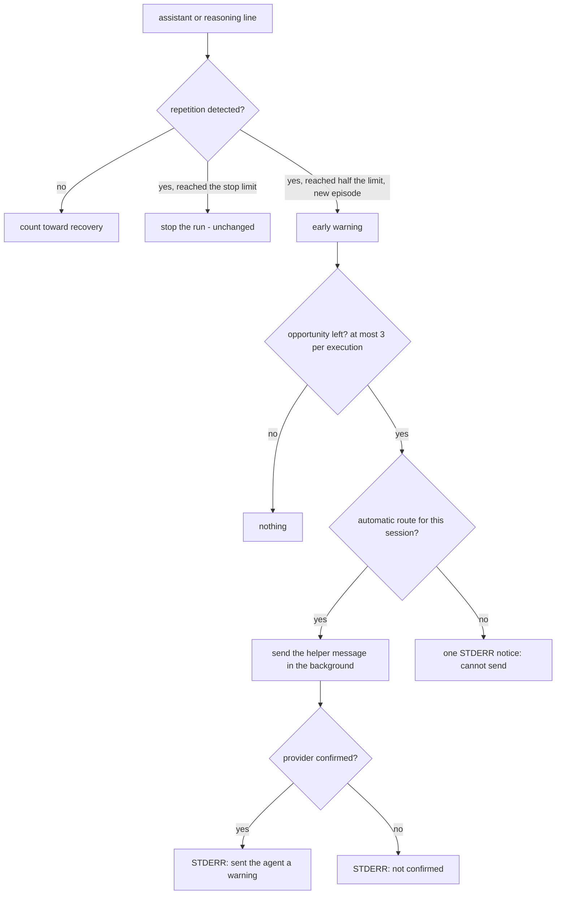

# Automatic Steering

When an agent Claudine is running starts repeating itself, Claudine can send it
a short message suggesting it check its progress — before the
[repetition guard](timeouts.md#content-guards-runaway-output) stops the run.
This page explains when that happens, what the agent receives, what you see on
STDERR, and how to turn it off.

Automatic steering never replaces the guard. A run that keeps repeating is
still stopped at exactly the same point as before.

> **Status:** implemented. Delivery is enabled for Claudine-managed Codex
> runs on macOS at Codex 0.157.1 ([Managed Codex app-server execution](codex-app-server.md)):
> the warning is sent over `turn/steer` and reaches the model at its next tool
> boundary. Every other session (other providers, versions, and platforms; Pi's
> managed profile is blocked) produces the "cannot send" notice described
> below. See [Steering Activation](steering-activation.md).

## What happens, step by step



1. **Early warning.** The repetition guard stops a run when the same group of
   lines repeats `max_repeats` times (30 by default). Halfway there, rounded up
   — 15 of 30, 3 of 5 — it raises an early warning. A limit of 1 or 2 leaves
   no room between "repetition recognized" and the stop, so it never warns.
2. **One warning per episode.** An episode keeps its single warning however long
   it continues. A new episode needs a real break first: at least
   `max(8, 2 × L)` nonblank lines with no repetition recognized, where `L` is
   the number of lines in the block that was warned about. Blank lines do not
   count, and any recognized repetition (including a different block) starts
   the count again. Turn boundaries, silence, and replies to steering neither
   advance nor reset it. After a break, the next episode must reach the
   halfway point on its own.
3. **Three opportunities per execution.** Each warning uses one opportunity,
   whether the message is sent, refused, times out, or cannot be sent at all.
   Nothing is retried or refunded. After three, further warnings are silent.
   Each agent execution — every sequence task, retry, and resume — has its own
   three; ordinary turns within one execution share them.
4. **Delivery.** The message goes only to the session that produced the
   repeated output, through its own [steering owner](steering-routing.md),
   using a route that never interrupts the agent. It is sent in the background
   with a 2-second acceptance deadline, and at most one automatic message is in
   flight per execution. A second warning while one is in flight is reported as
   not sent (busy).
5. **Hard stop wins.** If the chunk that reaches the warning also reaches the
   stop, only the stop happens. If the stop happens while a message is being
   sent, the send is abandoned and no further notice is printed.

Sending, accepting, or answering a warning is not treated as progress: it does
not clear the repetition count, and it does not refresh the
[stream-silence clock](timeouts.md#raw-byte-clock-last_byte_at).

## What the agent receives

The message is fixed text plus counts. It never quotes the agent's output:

```text
Claudine has detected repeated output that may indicate a loop. Please check
whether you are making progress toward the user's task. If you are repeating
the same approach, change your approach or stop and explain what is
preventing progress. Claudine's existing runaway limits still apply.

(Observed: the same line 15 times in a row.)
```

Every message handed to the session's owner is written to the steering audit
log with the secret-masked text, its opportunity ID, and its outcome (see
[Traces and Logging](traces-and-logging.md#steering-audit-records)). An
opportunity that has no route is not submitted, so it produces only the notice
and a trace event.

## What you see

A confirmed send:

```text
ℹ Claudine detected repeated output and sent the agent a warning (queued; 1 of 3).
  The repetition limit of 30 still applies.
```

A session that cannot take automatic help (the common case today):

```text
⚠ Claudine detected repeated output but cannot send automatic steering to this
  session: no verified non-interrupting delivery is available. It will keep
  enforcing the repetition limit of 30.
⚠ runaway repetition detected (cycle length 1, 30 repeats); terminated to stop
  the loop
```

Identical notices are printed once per execution, so a long loop cannot flood
STDERR.

## Which sessions can receive it

Automatic help needs a live semantic stream Claudine is reading (a structured
wrapper or composition run) and a route that can reach a turn that may never
end: steering the active turn. A follow-up delivered at the next turn, starting
an idle turn, or anything that interrupts is never used. Sessions found only by
`claudine steer --list` discovery get no automatic help, and the capture path
(no live stream) gets no early warning. The exact rules are in
[Steering Activation](steering-activation.md#manual-and-automatic-eligibility-differ).

## Turning it off

Automatic help is on by default. Turning it off removes the messages and the
notices; the repetition guard, its limit, and manual `claudine steer` are
unaffected.

| Where | Setting | Wins over |
| --- | --- | --- |
| Environment | `CLAUDINE_AUTO_STEER` | everything |
| Repo config (`<repo>/.claudine/config.json`) | `steering.automatic.enabled` | user config |
| User config (`~/.claudine/config.json`) | `steering.automatic.enabled` | built-in default (on) |

```json
{ "steering": { "automatic": { "enabled": false } } }
```

```sh
CLAUDINE_AUTO_STEER=off claudine pi "refactor the parser"
```

Rules:

- Only a value that is set takes part: a repo config that does not mention
  `steering.automatic.enabled` keeps the user's choice.
- `CLAUDINE_AUTO_STEER` accepts `true/false`, `1/0`, `yes/no`, and `on/off`,
  trimmed and in any letter case. An empty or unrecognized value stops the run
  with a configuration error before the agent starts.
- In a config file, `enabled` must be a boolean. `null`, a string, a number, or
  an unknown key beside it is a configuration error, also before the agent
  starts. (A duplicated key is not detected: Claudine config files keep the
  last occurrence of any repeated key.)
- There is no CLI flag or frontmatter setting, and the warning point, the
  three-opportunity cap, and the recovery rule are not configurable.
