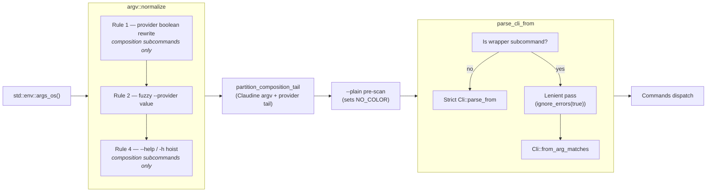

# CLI Pre-Parsing and Clap Parsing

Claudine's CLI uses `clap` (derive mode) as the authoritative argument
parser, but ships a small **pre-parsing layer** that runs above `clap`
to reshape a curated set of shorthand patterns into the canonical forms
`clap` already understands. The pre-parser is intentionally thin,
purely syntactic, and never consults the filesystem or reads state
beyond the argv vector itself.

This document describes the full pipeline — from `std::env::args_os()`
through normalization into `Cli::parse_from` — explains why the
pre-parser exists at all, and captures the best practices that keep
the layer maintainable as the CLI surface grows.

- Pre-parser implementation: [`claudine/cli/src/argv/mod.rs`](../../cli/src/argv/mod.rs)
- Pre-parser wiring: [`claudine/cli/src/main.rs`](../../cli/src/main.rs)
- Clap surface: [`claudine/cli/src/args.rs`](../../cli/src/args.rs)
- Feature spec: `claudine/features/_completed/2026-04-17-cli-pre-processing/spec.md`
- Rule-by-rule reference: [argv-normalization.md](./argv-normalization.md)

## Pipeline overview



`main.rs` collects argv once, hands it to `argv::normalize`, and reuses
the same normalized vector for the `--plain` pre-scan and for every
subsequent clap parse pass. Library code never touches argv and
therefore never pre-parses.

## Pre-parsing stage

`argv::normalize` is the single entry point above `clap`. It accepts
the raw `Vec<OsString>` from `std::env::args_os()`, applies three rewrite
rules in a fixed order, and returns the rewritten vector:

| Rule | Purpose | Gated on |
|---|---|---|
| **Rule 1** | Catalog-derived `--<provider>` booleans → `--provider <slug>` | `compose`, `inline-compose`, `sequence` |
| **Rule 2** | Fuzzy canonicalization of `--provider <value>` and `--provider=<value>` via `Provider::fuzzy_match_cli_name` | Any subcommand (flag-driven) |
| **Rule 4** | Hoist a trailing `--help` / `-h` to argv position 1 so the root custom help handler fires | `compose`, `inline-compose`, `sequence` |

**Retired: Rule 3.** A former Rule 3 inserted a synthetic `--` separator to
protect trailing setters. It was removed when composition gained
provider-argument forwarding (a synthetic `--` collided with an authored `--`
boundary). Its job — plus forwarding the agent tail — now belongs to the
post-normalization ownership partition, `argv::partition_composition_tail`,
described in [argv-normalization.md](./argv-normalization.md#provider-argument-partition).
Rule 4 still runs so `--help` is hoisted before the partition sees it.

For the token-level semantics of each rule — including every pass-through
guarantee and the full corner-case matrix — see
[argv-normalization.md](./argv-normalization.md). That document is the
authoritative rule reference and is kept in lockstep with the
`argv.rs` tests.

### Pass-through guarantees

The normalizer never mutates argv when any of the following hold:

1. **Completion mode** — `clap_complete::CompleteEnv` signals completion
   through the `COMPLETE` environment variable. Returning argv untouched
   is required so dynamic completion sees exactly what the shell typed.
2. **Tokens at or after the first literal `--`** — the wrapper separator
   ends the rule scan window.
3. **Non-UTF-8 tokens** — rules are pattern-based on `&str`; opaque
   `OsString` values are copied verbatim.
4. **Argv with fewer than two elements** — nothing downstream needs
   parsing.
5. **Non-composition subcommands** — Rules 1 and 4 are gated to the
   composition trio. Wrapper subcommands (`claude`, `codex`, `gemini`,
   `goose`, `kimi`, `opencode`, `qwen`, `kilo`, `pi`, `antigravity`) and every
   other subcommand pass through unchanged. Rule 2 remains flag-driven so
   `--provider` resolution works regardless of subcommand.

## Clap parsing stage

After normalization, `main.rs::parse_cli_from` chooses one of two clap
passes based on whether a wrapper subcommand is present.

### Non-wrapper path (strict pass)

The common path. A single `Cli::parse_from(argv)` call produces full
clap diagnostics for unknown arguments, invalid `ValueEnum` values, and
missing required values. This is the strictest — and friendliest —
surface because clap owns the complete error-rendering pipeline.

### Wrapper path (lenient pass + strict fallback)

Wrapper subcommands (`claude`, `codex`, …) must accept an arbitrary tail
of unknown flags and forward them to the wrapped child CLI. To make that
possible without giving up clap's error rendering entirely, the wrapper
path:

1. Clones the clap `Command` tree via `<Cli as CommandFactory>::command()`.
2. Walks every wrapper subcommand and marks it with
   `ignore_errors(true)` so unknown tokens flow through instead of
   aborting the parse.
3. Calls `try_get_matches_from` followed by `Cli::from_arg_matches`.

If the lenient pass or `from_arg_matches` ever fails, `parse_cli_from`
falls back to a plain `Cli::parse_from(argv)`. The fallback is
defensive — `ignore_errors(true)` absorbs every unknown token, so the
failure branch is unreachable in practice — but it exists so a future
clap upgrade that tightens `from_arg_matches` cannot silently drop into
an `unwrap()` panic. On the rare failure path the user still sees a
standard clap error.

### Root Cli quirks the pre-parser accounts for

Several properties of the clap surface shape the pre-parser's rules:

- `Cli` sets `disable_help_flag = true` and declares its own non-global
  `help: bool`. Composition subcommands therefore never inherit a
  functional `--help` handler. Rule 4 exists precisely to route
  `--help` / `-h` into the root handler on those subcommands.
- `ComposeArgs`, `InlineComposeArgs`, and `SequenceArgs` each expose a
  greedy multi-value positional (`#[arg(num_args = 1..)]`) that collects
  files plus `key=value` setters in any order. The ownership partition
  removes the agent tail before clap sees it, so this positional only ever
  receives the file and Claudine setters; Rule 4 handles the trailing
  `--help` case separately.
- The original seven provider booleans on `SharedComposeArgs` are retained only
  as clap help entries. Rule 1 accepts every catalog-derived provider boolean,
  including providers without a dedicated struct field, and rewrites it before
  clap sees it. `explicit_provider()` therefore reads only `self.provider`.
- `Provider::fuzzy_match_cli_name` is the single source of truth for
  fuzzy provider name resolution. Rule 2 delegates to it so the same
  fuzzy behavior applied to `--provider <value>` remains intact after
  normalization.

## Why a pre-parser?

The pre-parser exists to fix an identifiable class of clap parsing
failures without giving up any of clap's benefits. Four factors drove
the decision.

### 1. The motivating bug

```sh
$ claudine compose @prompts/greet.md --gemini name="Ken" --help
error: unexpected argument '--help' found
  tip: to pass '--help' as a value, use '-- --help'
Usage: claudine compose --gemini <ARG>...
```

Root cause: the composition subcommands declare a greedy multi-value
positional and also accept boolean flags interleaved with those
positionals. clap enters "positional collection" after the first
positional, suspends it for `--gemini`, resumes it for `name="Ken"`, and
then refuses `--help` as an "unexpected positional" instead of treating
it as the help flag. The tip is actively misleading — the user did not
want `--help` as a value.

This is structurally unavoidable in clap's derive model without giving
up either the greedy positional or help recognition. The pre-parser and
ownership partition convert argv into a shape clap already handles correctly:
`--help` is hoisted to a root-level flag position, and the provider tail is
removed before clap receives composition setters.

### 2. Catalog-derived provider booleans plus `--provider`

The composition surface accepts one boolean flag for every compiled provider,
plus the canonical `--provider <value>`. Without normalization, downstream
code would have to re-resolve every representation whenever it needs the
selected provider. Rewriting booleans into `--provider <slug>` collapses those
representations into one and lets `explicit_provider()` read only the canonical
field.

### 3. Fuzzy provider matching existed but was applied inconsistently

`Provider::fuzzy_match_cli_name` already supported shorthand like `cl` →
`claude` or `gem` → `gemini`, but only through the
`provider_value_parser`, which matched exact aliases. Pre-canonicalizing
the value via the normalizer means fuzzy input is accepted everywhere
`--provider` is, without teaching clap's value parser about fuzzy
resolution (which would have distorted its error messages).

### 4. A custom parser would have cost weeks

Writing a full custom argument parser to avoid these rough edges would
have meant giving up clap's help rendering, shell completions,
`ValueEnum` validation, derive ergonomics, error formatting,
`--version`, and man-page generation. A thin syntactic pass in front of
clap preserves all of that while removing the observable pain. It is
also the cheapest place to host future pre-parse work (e.g.
tag-stripping, alternate positional shorthand) consistently.

## Best practices

The pre-parser is easy to maintain **only** if the following rules stay
true as the CLI evolves. Every one of these has a backing unit or
integration test; if you change the layer, keep those tests green.

### 1. Keep the pre-parser purely syntactic

The normalizer must **never** consult clap, read the filesystem, or
inspect any state beyond the argv vector. Its contract is:
`Vec<OsString> → Vec<OsString>`. Resist the temptation to "just peek at"
the config or the environment — the more the pre-parser knows, the
harder its failure modes become to reproduce.

The one exception is `COMPLETE`, and it exists solely to **disable** the
pre-parser during shell completion. Additional environment signals
should be introduced with the same polarity (disable, not change,
behavior).

### 2. Every new rule ships with a matching pass-through test

A new rewrite rule cannot land without a matching "this argv must be
untouched" unit test. Without that, the pre-parser can silently start
rewriting inputs it should leave alone. This contract is documented in
the `argv.rs` module docs and is the first thing to check in review.

### 3. Derive the owned-flag surface from clap, never a hand-maintained list

The ownership partition must know which composition-argv tokens Claudine owns
(and whether each consumes a value) to decide where the agent tail begins and
which flags to reclaim from it. `OwnedFlags::for_composition` in
`argv/partition.rs` derives that surface by introspecting the root `Cli`
globals plus the `ComposeArgs`/`SequenceArgs` clap definitions — never a
second hand-maintained constant.

The drift-detection test `owned_surface_is_derived_from_clap_and_non_empty`
asserts the derived surface is populated and contains representative value and
boolean flags, so a refactor that breaks the derivation surfaces as a test
failure instead of a silent forwarding bug.

### 4. Gate rules narrowly

Rules 1 and 4 are gated to composition subcommands. Rule 2 is
flag-driven and applies anywhere `--provider` appears. Expanding a
rule's scope — e.g. firing Rule 1 on wrapper subcommands — breaks
wrapper passthrough: a user typing `claudine claude --gemini file.md`
is sending `--gemini` to the child CLI, and Rule 1 would silently
rewrite it to `--provider gemini` inside the child's argv.

Keep the gate narrow. If another subcommand exhibits the same shape as
the composition trio, add it explicitly to `COMPOSITION_SUBCOMMANDS`
rather than loosening the check.

### 5. Never touch tokens at or after the first literal `--`

The first `--` is the wrapper separator. Everything after it belongs to
someone else (a wrapped child CLI, a shell-escaped setter, whatever).
The normalizer treats it as a hard stop for rule scans and copies the
tail verbatim. Every rule helper uses `first_dash_dash_index` to find
the boundary; new rules must do the same.

### 6. Let clap render every user-facing error

The pre-parser never emits an error message. Unknown arguments, invalid
values, missing values, and mutual-exclusion conflicts all flow through
to clap, which has the vocabulary and formatting for them. When a rule
could rewrite an input into a clap-friendly form but is uncertain, it
must leave the input untouched so clap renders the native error (see
Rule 2's treatment of `--provider` with no value, empty value, or
hyphen-prefixed next token).

This also means the pre-parser does **not** suggest "did you mean?"
corrections. clap already does that for recognized args; adding it to
the normalizer is a separate concern and would split error responsibility
between two layers.

### 7. Keep pass-through argv shapes documented and tested

Any argv that is untouched by the pre-parser is part of its contract
and should have at least one test proving it. `--version`, root
`--help`, `hooks --describe`, wrapper passthrough with `--`, and
non-composition subcommands all have locked-in pass-through tests —
keep adding them when new subcommands join the surface.

### 8. Update this document and the rule reference together

Whenever a rule is added, modified, removed, or re-gated:

1. Update [argv-normalization.md](./argv-normalization.md) with the new
   rule details and pass-through guarantees.
2. Update this document if the rule changes the pipeline shape, the
   clap parsing stages, or the best-practices surface.
3. Update the `///` module docs in `argv.rs` so the in-crate
   documentation matches.
4. Add unit tests in `argv.rs` and — if the rule is load-bearing —
   integration tests in
   [`claudine/cli/tests/argv_normalization.rs`](../../cli/tests/argv_normalization.rs).

The pre-parser's value is in its predictability. Out-of-date docs are
the fastest way to erode that.

### 9. Prefer fixing clap-friendly shapes over expanding the pre-parser

When a new parsing rough edge surfaces, first ask whether the clap
surface can be adjusted (e.g. a different `num_args`, an explicit
`value_parser`, a narrower `conflicts_with`). A clap-side fix is
preferable because it is visible in `--help` output and participates in
shell completion. Only reach for the pre-parser when the clap surface
cannot express the desired shape without collateral damage (as with the
greedy-positional + `--help` interaction).

## Testing

- **Unit tests** live in the `argv` module (`mod.rs` and `partition.rs`)
  under `#[cfg(test)] mod tests` and cover every rewrite rule, each
  boolean-to-slug mapping, every pass-through guarantee, and the ownership
  partition (implicit/explicit tails, owned-flag reclaim, ordering errors,
  setter-vs-tail classification). They include a drift-detection test that
  iterates the clap surface to verify the derived owned-flag surface.
- **Integration tests** live in
  [`claudine/cli/tests/argv_normalization.rs`](../../cli/tests/argv_normalization.rs)
  and drive the compiled `claudine` binary end-to-end through the
  headline bug cases, the fuzzy-match case, and the core pass-through
  cases (`--version`, root `--help`, `hooks --describe`, wrapper
  passthrough).
- **Wrapper regression tests** in
  [`claudine/cli/tests/wrap_direct_argv.rs`](../../cli/tests/wrap_direct_argv.rs)
  ensure the wrapper lenient pass continues to accept unknown tokens
  after any pre-parser change.

Reference: `claudine/features/_completed/2026-04-17-cli-pre-processing/spec.md`.
