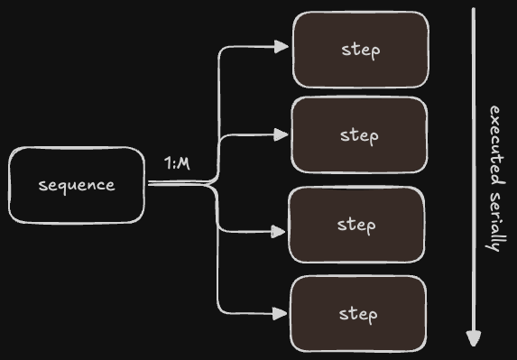

# Sequences in Claudine

A **sequence** runs an ordered list of *steps*. Each step composes and executes
one unit of work, and later steps can see what earlier steps produced.



```sh
claudine sequence <file> [key=value ...]
```

## The two meanings of `prompt`

Read this before anything else. `prompt` means different things at two adjacent
levels, and the distinction is load-bearing:

| Level | Value | Meaning |
|---|---|---|
| **Document** (frontmatter root) | prose string | Flips the whole sequence to **inline-compose**: the composed `prompt` is the agent prompt, and the provider's reply replaces the document body on disk. |
| **Step / task** | file reference | Names a **prompt document** to compose and execute for that step. |

```yaml
---
prompt: "Summarize {{ state.name }}."   # ← document level: prose, inline-compose
sequence:
    - name: alpha
      prompt: "@prompts/review.md"      # ← step level: a file reference
---
```

The two never occur at the same level, and their value types differ, so
Claudine can always tell them apart. The name was kept because `prompt` is
entrenched in inline-compose throughout the CLI and docs.

## Steps and tasks

There is one execution model. A **task** is the atomic executable unit; a
**step** is an entry in the `sequence:` list — its state, plus optionally the
task fields.

A task declares **exactly one** executable field:

| Field | Runs |
|---|---|
| `prompt: <file-ref>` | The referenced Markdown document (inline-compose if *that* document is configured for it, otherwise a normal compose) |
| `shell: <string \| string[]>` | One or more shell commands |
| `side_effect: <action>` | One Darkmatter side effect, in the standard lifecycle action grammar |
| `group: <group-ref \| inline group>` | A [group](#groups) |
| `task: <file-ref>` | An externalized `kind: task` file |

Declaring two is a typed error naming both fields.

A step with **no** executable runs the **default action**: it composes the
source document's Markdown body. A step **with** one runs that instead of the
body. A source with no body — a `kind: sequence` YAML file invoked directly —
simply requires every step to carry an executable.

Optional task fields: `name`, `setup:` / `teardown:` (action stacks), `params:`
(user setters passed to a `prompt` document), `timeout:` (per shell command),
`operation:`, `flow:`. A field that cannot affect the chosen executable — say
`params:` on a `shell:` task — is a typed error, not a silent no-op.

```yaml
---
sequence:
    - name: alpha            # no executable → composes this document's body
      topic: parsing
    - name: run-tests
      shell: just test
    - name: review
      prompt: "@prompts/review.md"
      params:
          topic: "{{ state.topic }}"
    - name: build-phase
      group: build-group@my-catalog.yaml
---
Work on {{ state.topic }}.
```

## Step state

Every step gets a `state` object. A bare string is shorthand for `{name: <string>}`:

```yaml
sequence:
    - one
    - two
    - one
```

normalizes to:

```json5
[
    { id: "one",   name: "one", index: 1, count: 3, is_first: true,  is_last: false },
    { id: "two",   name: "two", index: 2, count: 3, is_first: false, is_last: false },
    { id: "one-2", name: "one", index: 3, count: 3, is_first: false, is_last: true  },
]
```

Generated fields — you may read them, never author them:

| Field | Meaning |
|---|---|
| `id` | Unique per step. The dasherized `name`, suffixed `-2`, `-3`, … on collision. |
| `index` | One-based position. |
| `count` | Total steps. |
| `is_first` / `is_last` | Boundary flags. |
| `sequence_id` | One collision-resistant token per invocation, copied into every step. |

Object steps carry whatever else you want:

```yaml
sequence:
    - name: Bob
      age: 32
    - name: Sally
      age: 36
```

### Reserved keys at the frontmatter root

Each step's composition sees four reserved root properties:

| Property | Meaning |
|---|---|
| `state` | The current step's state. Always present. |
| `previous` | The previous step's state, or `null` on the first step. |
| `next` | The next step's state, or `null` on the last step. |
| `outputs` | The accumulating [output array](#the-outputs-array). |
| `sequence_id` | This invocation's correlation token. |

These are read-only. A `set` targeting any of them is a typed error, and they
outrank `--set`, shorthand setters, and accumulated runtime mutations.

### `{{ state }}` is a proxy for `{{ state.name }}`

In **string context**, a state value renders its `name`:

```md
The person's name is {{ state }}.        <!-- renders "Bob" -->
```

A whole-value `{{ state }}` span in an *expression* context still yields the
typed object, so `{{ state.age }}` and passing `state` to a function keep
working. The same coercion applies to `previous` and `next`; absent neighbors
stay `null` rather than coercing to an empty-named state.

### Keys you cannot author as state

Rejected with a typed error naming the offending key:

- executable and task keys — `prompt`, `shell`, `side_effect`, `group`, `task`,
  `setup`, `teardown`, `params`, `timeout`, `operation`, `flow`
- generated state keys — `id`, `is_first`, `is_last`, `index`, `count`, `sequence_id`
- root reserved keys — `state`, `previous`, `next`, `outputs`, `sequence_id`

## Sources

`sequence:` accepts a static list, a typed expression, a shell expansion, or a
file reference.

### Source grammar

```text
sequence: <file-ref> [-> <offset.path>] [::<operator>(<args>)]
```

- `<file-ref>` keeps its full powers — relative paths, `@` magic, `!` package,
  `~`, `vault:`, and `{{ }}` interpolation. Interpolation resolves **before**
  the suffix is parsed, and resolution is relative to the **authoring
  document's** directory, never the process CWD.
- `->` is a dot-notation **offset** into the document. YAML/JSON/JSON5 only; a
  typed error on JSONL/NDJSON, whose root is always the list.
- `::` is an **operator** on the resolved list. Exactly one per reference.
- Expression (`{{ … }}`) and shell (`$( … )`) sources produce lists directly and
  take no suffix.

The suffix parser respects quoted arguments, so a path containing a space or an
`@`, and an operator argument containing a comma, all survive.

### Operators

| Operator | Effect | Fails when |
|---|---|---|
| `map(from, to)` | **Renames** `from` to `to` (the original key is removed) | an item lacks `from`, or is a scalar — the error names the item index |
| `name(from)` | **Copies** `from` into `name` (the original is retained) | same as `map` |
| `template(expr)` | Computes `name` per item with a Darkmatter expression; the item's top-level fields shadow globals | the result is null or empty |

```yaml
sequence: things.yaml -> colors.data                          # names become "1", "2", "3"
sequence: things.yaml -> colors.data::map(color, name)
sequence: things.yaml -> colors.data::name(color)
sequence: things.yaml -> colors.data::template(color + '-is-great')
```

### Data formats

YAML, JSON, JSON5, JSONL, and NDJSON all work and normalize identically.
JSONL/NDJSON take operators but never an offset:

```yaml
sequence: list.ndjson::map(color, name)
```

### String list formats

A string source is classified in this order: Markdown list markers (ordered or
unordered) → multiple lines → tabs (TSV) → commas (CSV, quote-aware) → spaces →
otherwise a single-item list. Whitespace-only entries are dropped; CSV/TSV
parsing is delimiter-aware, so quoted delimiters and escaped quotes survive.

```yaml
sequence: "{{ ctx.dirty_files }}"    # typed arrays bypass classification entirely
sequence: "$(ls -1 src)"             # the command must be approved at preflight
```

### Strictness depends on provenance

- **Authored for sequences** — inline lists and formal `kind: sequence`
  documents — stay **strict**. An object must carry a string `name`; a scalar
  must be a string. An omission here is a typo worth catching.
- **Foreign data** — arbitrary data files reached via offset/operator,
  JSONL/NDJSON, `{{ expr }}`, `$( shell )` — is **lenient**. Numbers and
  booleans coerce to string names, and a nameless object receives its one-based
  ordinal (`"1"`, `"2"`, …).

`null` items are a typed error either way.

### Empty lists

A static empty `sequence: []` is an authoring error. A **dynamic** source that
resolves to zero steps is a graceful no-op: Claudine prints a "resolved to 0
steps" notice to stderr and exits `0`. A clean repo legitimately makes
`{{ ctx.dirty_files }}` empty.

### Formal sequence documents

A YAML file using the `sequence:` property is a *formal* sequence document. It
may add `template:` (values merged into every step, with the item's own fields
in scope) and `$schema:`.

```yaml
kind: sequence
sequence:
    - name: blue
      color: blue
      rank: 5
template:
    desc: "{{ color }}({{ rank }})"
$schema:
    color: string(required) -> the color being evaluated
    rank: number(required)  -> a 1-5 ranking, 5 being best
    desc: string(required)
```

Template values apply **before** generated fields, so `desc` is ordinary
authored state by the time `id` and `index` are made. A schema failure names the
step index, its id, and the failing property path.

> **Known asymmetry.** The `$schema` above validates each step's *state* when the
> file is **referenced** from another document (`sequence: formal.yaml`). When
> the same file is invoked **directly** (`claudine sequence formal.yaml`) it is
> also the composition document, so its root `$schema` is validated as the
> document's own frontmatter schema instead. The specification calls for one
> shape across both entry modes; reconciling them is deferred. Both behaviors are
> pinned by tests in `cli/tests/sequence_sources_cli.rs`.

The retired external `kind: sequence` + `list:` form is **gone**. Use
`sequence:`.

## Execution

Sequence execution is two phases.

### Phase 1 — Static preflight

Before anything runs, Claudine walks the **entire task graph**:

- **Dynamic sources resolve exactly once.** The resulting step list is a
  snapshot; it never re-evaluates mid-run, even if the environment changes.
- **Every referenced document loads transitively** — `kind: group` files,
  `kind: group-catalog` entries, `kind: task` files, and every `prompt:`
  document. Reference cycles are rejected with the complete chain.
- **Schemas validate and missing properties aggregate** across all steps and all
  referenced prompt documents, with one interactive collection pass.
- **Every shell command is approved byte-for-byte** — `shell:` tasks and
  `$( … )` expansions alike, across every step, group, and referenced document,
  *including branches that may never run*. Approved bytes are executed bytes.

  Resolution is **early-binding only**: `state`, `params`, template values,
  `doc.*`, `ctx.*`, `env.*`. A shell string referencing `outputs` or a
  runtime-mutated value is a typed preflight error — route that work through a
  `prompt` or `side_effect` task instead.
- **Provider and model resolve once**, producing a per-step target vector.

A preflight failure aborts the sequence regardless of `fail_fast`. Preparation
never degrades to best-effort.

### Phase 2 — Just-in-time composition

Each step composes **at its turn**, not up front. At every step boundary
Claudine checks the interrupt flag, **re-reads the live source file from disk**,
re-layers state, composes, validates, executes, appends the output, and folds in
any mutations.

State layering, lowest precedence to highest:

1. source document frontmatter (live, from disk)
2. user setters (`--set`, shorthand `key=value`)
3. accumulated runtime mutations (what `set` writes)
4. the reserved per-step overlay

**Live-disk chaining.** Because each step re-reads the source, an
inline-compose sequence's body write-backs — and any frontmatter an agent edits
mid-run — are visible to later steps. Mid-run *external* edits take effect too;
that is both the feature and the hazard.

What is *not* re-derived at a step boundary: the step list. A
`sequence: $(ls)` that would enumerate differently mid-run does not change the
plan under execution.

**Mid-run failures.** A just-in-time composition failure is a failure of *that
step*: recorded in the summary, halting under `fail_fast: true`, letting later
steps run under `fail_fast: false`.

## The `outputs` array

Every executed task pushes its final stdout onto `outputs`, in execution order.
The previous task's output is `{{ last(outputs) }}`.

- A task with no stdout pushes an empty string, so entries stay aligned with
  executed tasks.
- A **parallel group** pushes a single entry that is itself an array — one
  string per task, in **declaration** order, never completion order. The overall
  shape is `(string | string[])[]`.
- Single-document `compose` / `inline-compose` use the same key, so a prompt
  written with `{{ last(outputs) }}` behaves identically standalone and
  mid-sequence.
- `outputs` is reserved: it cannot be authored as state, set via `--set`, or
  written by `set`.

**What an entry contains.** The task's captured, undecorated stdout. Terminal
status rendering, stderr, lifecycle messages, color bars, and provider protocol
records are never included. For a prompt task it is the provider's final
assistant text; for a multi-command shell task, the commands' stdout
concatenated in declaration order; for a side effect, its returned text or an
empty string. One trailing transport newline is removed; other whitespace is
preserved.

**Lifecycle timing.** `initialize` and `start` see only prior entries. `success`
sees this run's output appended. `failure` sees no new entry — it has `err`
instead. `finalize` sees whatever has accumulated at that point.

Failed and interrupted tasks append no entry, except that each slot of a
completed parallel group stays positionally present and holds whatever partial
stdout that task captured.

## Mutating state with `set`

`set` is the state-mutation side effect. It works anywhere the lifecycle action
grammar applies — lifecycle stacks, task `setup:`/`teardown:`, and
`side_effect:` tasks:

```yaml
side_effect:
    set: ["ready", "{{ true }}"]
```

- positional form `set: [key, value]`; key/value form `{action: set, key: …, value: …}`
- a whole-value `{{ expr }}` span carries its typed value — the example above
  writes boolean `true`, not the string `"true"`
- it writes to the **in-memory runtime layer**, never to disk. That is what
  distinguishes it from `set_frontmatter`, which targets a file.
- top-level keys only; reserved keys are rejected
- outside a sequence it still works, mutating the state visible to later
  lifecycle actions and loop iterations in the same run

Mutations are visible to subsequent lifecycle actions, loop iterations, serial
tasks, and later steps. `state`, `previous`, and `next` remain immutable
authored views; runtime mutation flows through ordinary frontmatter keys.

## Groups

A group bundles one or more tasks under a name, for semantic naming, reuse, and
concurrency. **A group cannot be executed directly** — it runs only as a
sequence task.

### Defining a group

Three places, all behaviorally equivalent once loaded:

**Inline:**

```yaml
sequence:
    - name: build-phase
      group:
          name: ICR
          execution: serial
          tasks:
              - prompt: "@prompts/implement.md"
              - shell: just commit
              - prompt: "@prompts/review.md"
```

**A `kind: group` file** — one group per file, normal file-reference grammar:

```yaml
sequence:
    - name: build-phase
      group: my-group-file.yaml
```

**A `kind: group-catalog` file** — a root `groups:` list. One group is
referenced `{name}@{file}`, name first, matching Darkmatter's named-type import
convention. Magic refs compose: `build-group@@catalogs/all.yaml` splits on the
first `@` after the group name.

```yaml
sequence:
    - name: build-phase
      group: build-group@my-catalog.yaml
```

### Group fields

| Field | Meaning |
|---|---|
| `name` (required) | Identifies the group |
| `description` | Optional longer prose |
| `variables` | Group-scoped values exposed to tasks on the `group.*` global, discarded when the group completes |
| `tasks` (required, ≥1) | The tasks to run |
| `execution` | `serial` (default) or `parallel` |
| `max_parallel` | Cap on simultaneous tasks. Integer ≥ 1. **Invalid on a serial group.** |
| `operation` / `flow` | Defaults for the group's tasks; task-level values override |

A single-task group is legitimate — it is the honest way to get a semantic name
or `variables` scoping around one task.

**Groups do not nest in v1.** A task inside a group may not be a `group` task.

**Group `loop` is blocked.** Iteration commit semantics are unratified, so a
group carrying `loop` is rejected at preflight with a typed, actionable error
rather than left to implementation judgment.

### Task setup and teardown

```yaml
kind: task
prompt: review.md
setup:
    - when: "file_exists(foo/bar/baz.md)"
      action:
          - message: "the file exists"
    - action:
          - set: ["title", "About to do the thing"]
teardown:
    - when: "ctx.dirty_files"
      action:
          - message: "I've made a mess of the place"
```

- `setup` runs before the primary action. If it fails, the primary action is skipped.
- `teardown` runs exactly once after setup has started — including after primary
  failure or interruption — and receives the current `err`.
- Teardown failure turns an otherwise successful task into a failure. If the
  primary action already failed, its error stays primary and teardown errors
  attach as secondary diagnostics.
- Output is appended only **after** teardown completes, so later work never sees
  the output of a task whose teardown failed it.

An external `task:` reference is exclusive with the other executables and is an
immutable expansion of the referenced file — v1 does not support patching or
overriding fields at the referencing site.

### Shell tasks

```yaml
sequence:
    - name: JustOne
      shell: just test
    - name: Multiple
      shell:
          - just test
          - just lint
```

Every command gets a **30s** default timeout, overridable with `timeout:` as a
duration (`45s`, `2m`) — a bare integer is rejected because the unit is part of
the grammar, and `0s` is rejected rather than read as unbounded. A task passes
when every command exits `0`. Stdout is concatenated in declaration order.

### Serial groups

The default. State passes along the task chain, so each task sees prior tasks'
mutations and `{{ last(outputs) }}` — whether the previous task was in this
group or before it in the sequence. The first failing task stops the group; the
remaining tasks do not run and the owning step is failed. Sequence-level
`fail_fast` then decides whether the sequence continues.

### Parallel groups

```yaml
group:
    name: fan-out
    execution: parallel
    max_parallel: 3
    tasks:
        - prompt: "@prompts/a.md"
        - prompt: "@prompts/b.md"
```

- **Scheduling** — all tasks launch at once unless `max_parallel` is set, in
  which case they admit in **declaration order** as slots free up.
- **Snapshot isolation** — every task receives the same state snapshot and the
  same `outputs` view, taken when the group starts. Live-disk re-reads happen
  between *steps*, never between sibling tasks, so a sibling's mid-group file
  edits are invisible inside the group.
- **State merge** — mutations fold in **task-declaration order**, never
  completion order. Disjoint keys merge cleanly; when two tasks wrote the same
  key the later-declared task wins and Claudine warns on stderr naming the key
  and both tasks.
- **Failure policy** — all tasks run to completion regardless of sibling
  failures; canceling a mid-flight agent discards useful work. A failed task's
  partial stdout still lands in its `outputs` slot. The group fails if any task
  failed.
- **No interactivity** — a late required property becomes a task *failure*
  inside a parallel group, never a TTY prompt: N concurrent tasks cannot share
  one terminal. Serial contexts keep the standard interactive collection.
- **Write-back collisions** — two tasks whose `prompt` documents are
  inline-compose targets of the same file (or of the sequence source itself) is a
  typed **preflight** error. Racing write-backs are never legal.
- **Process isolation** — each task runs as an independent child with
  spawn-level environment and working directory. Claudine never mutates process
  environment or CWD on behalf of one task while siblings run.
- **Timeouts and guards** apply to each task independently. Ctrl+C fans out to
  all running children; the group is marked interrupted and the sequence exits
  `130`.

### Reading concurrent output

Parallel tasks render with line-interleaved color bars: each task takes a color
from a fixed cycling palette, announces itself with a `▶ <task-name>` header,
prefixes its lines with a colored vertical bar, and closes with a footer
carrying its outcome and duration. Lines interleave in arrival order —
attribution comes from the bar and the label, not from ordering.

Serial work renders in the same geometry with an **invisible** bar, so the
stream does not lurch sideways when execution switches between serial and
parallel.

Degradation is by design: without color, the header and footer still name the
task; without Unicode, `▶` becomes `>`. Task and provider data stay on stdout;
headers, footers, status, and warnings go to stderr. One synchronized sink
writes complete frames, so sibling writers cannot tear an ANSI sequence.

## Fail-fast, exit codes, and dry-run

Fail-fast precedence: `--fail-fast` → document `fail_fast` → default `true`. The
effective value reaches child processes as `CLAUDINE_FAIL_FAST`.

| Code | Meaning |
|---|---|
| `0` | Every executed step succeeded (or a dynamic source resolved to 0 steps) |
| `1` | At least one step failed |
| `130` | Ctrl+C interrupted the sequence |

`--dry-run` performs the **full preflight**, then just-in-time-composes every
step against the *initial* state — empty `outputs`, no runtime mutations —
without launching a provider and without inline-compose write-back.
Late-binding references render exactly as a first-step composition would see
them.

> **`--dry-run` still executes shell work.** `$( … )` expansions and `shell:`
> tasks run for real, because their output is what composition needs. A dry-run
> of a sequence containing `shell: just commit` will commit. This is inherited
> behavior, called out here because it is genuinely surprising.

## Requiring caller input

A document declaring `required` schema properties it does not define is asking
the caller for them. Well-designed sequences front-load that interaction, and
Claudine helps two ways:

1. Preflight approves **all** shell expansion across the entire sequence before
   the first step starts — including commands in conditional blocks that will
   never run. No exceptions. Once the sequence starts, nothing stops to ask.
2. Missing required properties aggregate across every step and every referenced
   prompt document into one interactive collection pass.

Claudine cannot guarantee that runtime mutations satisfy every later step. If
just-in-time validation still finds a required property missing, the normal
behavior applies: interactive collection in a serial TTY context, a typed error
otherwise. Arrange for earlier tasks to `set` what later tasks require.

## Operations

Any step may define `operation`, whose value becomes the `OPERATION`
environment variable for that step — the same dimension the `--operation` CLI
switch sets, and a reportable field in Claudine's logs.

## Out of scope in v1

Deferred deliberately, each addable later without a breaking change: nested
sequences, nested groups, group `loop`, sequence-level parallelism, group-level
fail-fast, sibling cancellation, and persisted checkpoint/resume.
