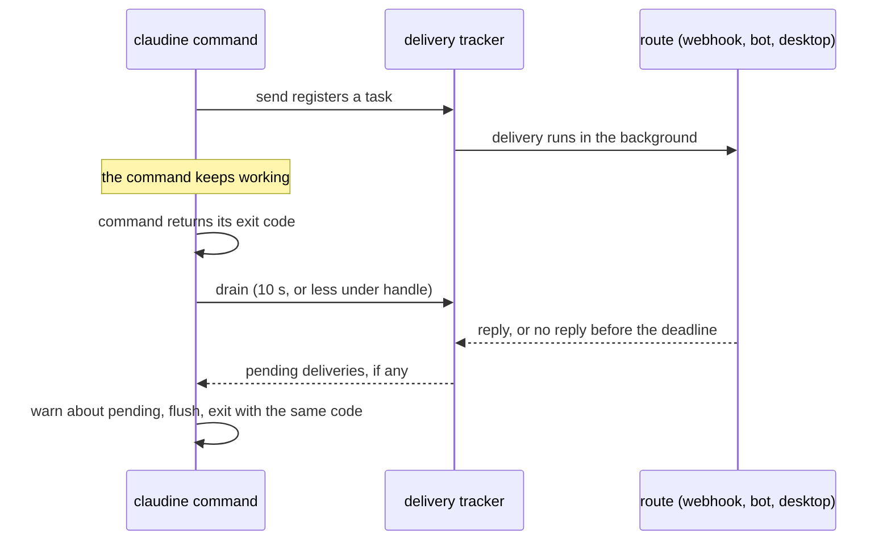

# Messaging

Claudine's `messaging` module provides outbound message delivery for lifecycle
actions and hook actions across four providers, plus the `claudine config` TUI
that manages the routes. Desktop notifications are a separate, zero-config path
(see [Desktop notifications](#desktop-notifications)).

## Routes

A route is one entry of `MessagingRouteConfig`, targeting one of four providers:

| Provider | Delivery mechanisms |
|----------|--------------------|
| Discord | Bot token (channel ID) or incoming webhook |
| Slack | Bot token (channel ID) or incoming webhook |
| Signal | Bot / REST recipient |
| WhatsApp | WhatsApp Business API |

Discord and Slack support **webhook** routes in addition to bot-token routes;
Signal and WhatsApp are token/recipient only. Secrets resolve at send time via
`resolve_secret`, so a route may store either an inline value or the name of an
environment variable that holds it.

## Config TUI

`claudine config` manages bot-token routes and webhook routes interactively:

- **Webhook URLs use masked input** and are validated before the wizard advances.
  Validation is a conservative early check (`validate_discord_webhook_url` /
  `validate_slack_webhook_url`); the authoritative check happens at send time in
  the `messenger` provider's `try_new`.
- **Env-only routes are allowed** — a blank URL plus an environment variable name
  is a valid configuration (the URL is resolved from the env var at send time).
- **Test Connection** — pressing `T` during webhook input runs
  `test_webhook_connection`, sending a test message **without saving** the route.

## Webhook redaction invariants

Webhook URLs embed a secret token in the path, so they are never surfaced raw:

- Inline webhook URLs render masked (shown as `webhook: ********`), never verbatim.
- Secret input buffers are masked during entry in the TUI.
- **All** webhook send errors and test-connection failures pass through
  `redact_webhook_urls` before display, so a failing send cannot leak the token
  via an error string. The Discord and Slack URL shapes it replaces with
  `<redacted-webhook-url>` are the shared webhook rules described in
  [Secret Recognition](secret-recognition.md).

## Relationship to lifecycle and hook actions

Message delivery is invoked two ways, both routing through the same `send` layer:

- **Lifecycle actions** — the `message` communication channel in a composition
  document's lifecycle stacks. See [Lifecycle](flow-control/lifecycle.md).
- **Hook actions** — the `message` action fired on a normalized event (see the
  Supported Actions reference). A hook message has no timeout of its own: the
  action starts the send and the handler moves on to its next action. Under
  `claudine handle` the send is bounded by the handler's overall deadline,
  through the exit drain described below.

## Delivery tracking

A send returns immediately; the delivery runs as a background task. Every such
task, message or desktop notification, is registered with one process-wide
delivery tracker in `claudine::messaging`, so a program can wait for it before
it exits instead of killing it mid-send.

A program that embeds the `claudine` library opts in by awaiting
`drain_deliveries` before it exits, on the same Tokio runtime the sends ran on:

```rust
use claudine::messaging::{DELIVERY_DRAIN_BUDGET, drain_deliveries};

let outcome = drain_deliveries(tokio::time::Instant::now() + DELIVERY_DRAIN_BUDGET).await;
outcome.report(); // one Warning naming each delivery still sending
```

- One deadline covers every pending delivery, including any started while the
  drain runs. With nothing pending the drain returns at once.
- A delivery still running at the deadline is cancelled and listed in
  `outcome.pending`. Whether it arrived is unknown. `report()` names it by its
  route name, or as `desktop notification`, and never by URL, token, or body.
- A delivery that fails while the drain waits reports its usual
  "Failed to send …" warning. A delivery task that panics is reported the same
  way. Neither is returned as an error.
- Without an active Tokio runtime a send logs a warning and does nothing.

### The CLI drains before every ordinary exit

Every `claudine` command, including one that ends in an error, exits through
one shutdown path. That path drains pending deliveries while the runtime is
still running, prints the warning for any that did not finish, flushes stdout
and stderr, and exits with the command's own code. A `success` or `finalize`
message sent in the last moments of a run therefore arrives, or is reported,
before the process ends.

- The drain waits at most 10 seconds in total (`DELIVERY_DRAIN_BUDGET`).
- Under `claudine handle` the drain also stops at the handler's overall
  deadline (`CLAUDINE_HANDLE_DEADLINE_SECONDS`), so a stalled route cannot
  hold a hook past it. A handler that already hit its deadline still exits
  `124` and reports its pending deliveries without waiting.
- The exit code never changes: an undelivered message does not turn a
  successful run into a failure.
- A run that sent nothing exits exactly as fast as before.
- Ctrl+C during the drain prints a notice. A second press, or the first press
  after one made during the run, force-exits with `130`.

A delivery that did not finish in time is named in one warning on stderr, for
example `Route alerts was still sending at exit; delivery is unknown`.



The tests for this path, and the loopback listener they use, are described in
[Testing → Messaging fixtures](testing.md#messaging-fixtures).

## Desktop notifications

Desktop notifications are intentionally **not** a messaging route. They are
zero-config and triggered only via the lifecycle `notify` frontmatter action, so
they never appear in the config TUI's route management.
