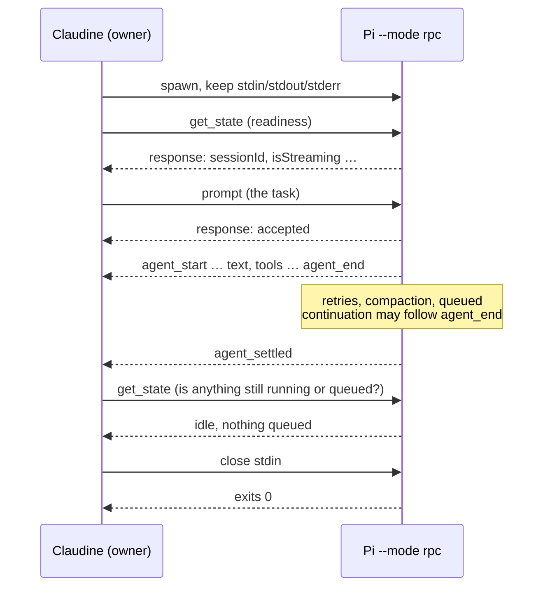

# Managed Pi RPC Execution

When you run Pi through Claudine without `-i` — `claudine pi "fix the failing
test"`, a `compose`, or a `sequence` step — Claudine launches Pi in its RPC
mode and stays connected to it for the whole run. This page explains what that
launch does, what you see, how it fails, and how it can later carry steering.

Nothing changes in how you invoke Claudine. Interactive runs (`claudine pi -i`)
still start Pi's own terminal UI.

## What runs

```sh
pi --no-approve --mode rpc [your model, system-prompt, and pass-through flags]
```

- `--mode rpc` keeps Pi's stdin open as a command channel. Claudine sends the
  task as one RPC `prompt` command instead of piping it as raw text, and reads
  the same live event stream Pi's JSON mode prints (text, tools, usage,
  errors), so the output and summary look exactly as before.
- Extensions, skills, prompt templates, and context files (`AGENTS.md`)
  stay enabled. Claudine does not add `--no-extensions`, `--no-skills`,
  `--no-prompt-templates`, or `--no-context-files`.
- `--no-approve` is Claudine's existing project-trust choice and is unchanged:
  Pi ignores *project-local* resources (`.pi/` in the repository) that you have
  not trusted, while your user-level resources (`~/.pi/agent/…`) load normally.
  Context files load either way.

Pi's research selects RPC as its preferred interface and its JSON stream as
the fallback (`docs/research/non-interactive-sessions/pi.md`); the wrapper
reads that selection from the generated steering catalog.

## A run, start to finish



1. **Readiness.** Claudine's first command is `get_state`. Pi must answer it
   with a session id before the task is sent. That id is the conversation the
   run is bound to.
2. **Task.** One `prompt`. Pi's answer only means it accepted, queued, or
   handled the task; the verdict comes from the events that follow.
3. **Settlement.** `agent_end` is not the end: Pi may retry, compact, or run
   queued input after it. Claudine waits for `agent_settled`, then asks Pi for
   its state once more. Only when nothing is running, compacting, or queued
   does it close stdin, which ends Pi. A task that an extension command
   handled without a model turn produces no events; its `prompt` answer
   triggers the same state check, so the run still ends.
4. **Exit.** Pi exits on its own once stdin closes. If it has not exited
   five seconds later, the run is completed by terminating it.

The run keeps every guard ordinary structured runs have: `timeout`,
`step_timeout`, runaway-output guards, Ctrl+C, and the failure lifecycle.

## Unattended requests

In RPC mode Pi tells extensions a UI is available, so an extension can open a
dialog and wait for the answer. Nobody is watching a managed run, and Claudine
never invents an approval:

| Pi request | What Claudine does | What you see |
| --- | --- | --- |
| Dialog: `confirm`, `select`, `input`, `editor` | Answers with Pi's documented cancellation. A `confirm` resolves `false`. | A warning: "a Pi extension asked for `confirm` input (…); nobody can answer during a managed run, so the request was cancelled" |
| Notice: `notify` | Nothing to answer | The notice, as info (or a warning for a warning/error notice) |
| Notice: `setStatus`, `setWidget`, `setTitle`, `set_editor_text` | Nothing to answer | Nothing |
| Any other method, or a request Claudine cannot read | No safe answer is known | The run fails with `error_kind = "input_required"` ([Timeouts](timeouts.md#content-guards-runaway-output)) |

An extension that errors is reported as a warning and does not fail the run.

## When RPC is unavailable

If Pi cannot become ready — it exits, refuses the readiness check, answers
with something unreadable, or stays silent for 30 seconds — Claudine has not
sent the task yet. It stops that child, shows Pi's stderr, and runs the same
launch as Pi's JSON stream instead (`-p --mode json`, the task on stdin), with
a warning:

```text
⚠ Pi's readiness check failed: Pi refused it (…). Running Pi's one-way JSON
  stream instead: this run cannot be steered or queried, and Pi tells
  extensions no UI is available, so their dialogs take their own defaults.
```

Once the task may have reached Pi there is no fallback and no second attempt:
Pi documents no duplicate suppression, so resending could run the task twice.
A Pi that crashes after accepting the task fails the run like any other
provider crash. A user interrupt during readiness never falls back.

## Tools that outlive Pi

Claudine starts every provider as the leader of its own process group and
signals that group when the run ends. Pi's `bash` tool starts its commands in
process groups of their own, so that signal does not reach them, and a crashed
Pi leaves them running.

For a managed RPC launch, Claudine therefore records every process it sees
under Pi (pid and start time, scanned every 250 ms) and, when the run ends,
terminates each recorded process that is still that same process: `SIGTERM`,
then `SIGKILL` after the kill grace. It never signals a process that merely
reused a pid. A survivor is reported separately from the run's outcome:

```text
⚠ 1 tool process started by the provider outlived it; Claudine terminated it
```

The scan cannot see a process that starts and escapes between two scans. On
Windows the wait scope's Job Object already ends every descendant that did not
break away, so the scan is Unix-only.

## Resumed runs

A `resume` or `retry` of a Pi run relaunches with `pi --session-id <id>` and
carries over `--mode` and the trust flag, so the resumed run is also a managed
RPC run.

## Steering adapter

The same connection carries steering. The `pi-rpc` adapter (revision 1,
`cli/src/commands/wrap/exec/pi_rpc/executor.rs`) implements three researched
mechanisms:

| Mechanism | When | What it sends | A success means |
| --- | --- | --- | --- |
| `rpc-steer` | Pi is working | `steer` | queued in Pi's memory; delivered after the current tool batch |
| `rpc-idle-prompt` | Pi is idle, nothing queued | `prompt` | accepted; a new turn starts |
| `rpc-abort-submit` | Pi is working, with explicit consent | `abort`, wait until idle, re-check the session, `prompt` | the cancellation and the replacement each report their own outcome |

Every delivery holds one mutation lock, shared with the settlement decision,
from a fresh `get_state` to its last answer. A different session id, or a state
the operation cannot serve, sends nothing. A command that may have reached Pi
without an answer is `unknown` and is never resent. Interruption never clears
Pi's pending queues. A settled one-shot run that is closing refuses new
steering rather than becoming an interactive service.

> **Status:** implemented and tested, but **blocked**. Pi's commands target
> whichever session is current and take no expected session, and an enabled
> extension can switch sessions on its own, so an accepted message could be
> lost to the replaced session. The lock cannot order a switch it does not
> start, so the reviewed policy blocks the `retained-rpc` profile
> ([Steering Activation — The shipped Pi block](steering-activation.md#the-shipped-pi-block)).
> A managed Pi run lists as unavailable with that reason.

## Known limits

- Real-Pi behavior is verified on macOS with Pi 0.87.1. Linux and native
  Windows are covered by the deterministic fake-Pi tests, not yet by real Pi.
- The wrapper does not establish Pi's version for the run.
- A tool process that starts and escapes Pi between two scans is not reaped.

## Testing

| What | Where | Tier |
| --- | --- | --- |
| Strict readers of Pi's RPC records (input-robustness matrix over real Pi records) | `lib/src/stream/protocol/pi/rpc/tests.rs` | L1 |
| Parser handling of RPC records | `lib/src/stream/providers/pi/tests.rs` | L1 |
| The owner and adapter over an in-memory wire and a real controller | `cli/src/commands/wrap/exec/pi_rpc/tests.rs` | L1 |
| Descendant reaping | `cli/src/commands/wrap/exec/spawn/descendants.rs` | L1 (Unix) |
| The wrapper against a compiled fake Pi (`tests/bin/fake_pi`): RPC run, fallback, crash without replay, dialog cancellation, `input_required` | `cli/tests/l1/pi_managed_rpc.rs` | L1 (`test-fixtures`) |
| The wrapper against the installed Pi: settlement, resources, tool batch, dialogs, handled tasks, crash cleanup | `cli/tests/real/real_pi_managed_rpc.rs` | real |
| The adapter against the installed Pi: steer, idle prompt, consented interruption | `cli/src/commands/wrap/exec/pi_rpc/tests.rs` (`real_pi_protocol`) | real |

Real-tier tests run only when asked:

```sh
just test-real real_pi_   # in claudine/, with `pi` on PATH
```

They use a deterministic local model (`tests/fixtures/steering/pi-probe.ts`)
and a disposable Pi agent directory; no network, credentials, or existing
session is touched.
