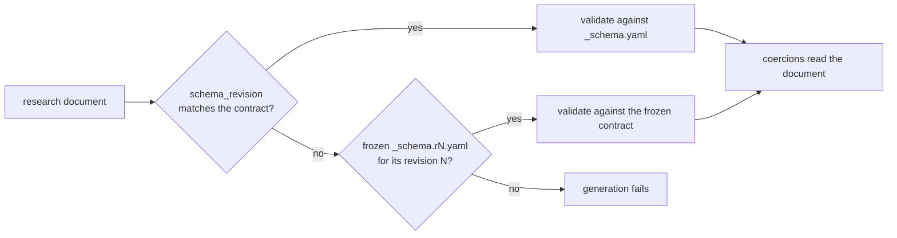

# Provider Metadata

## Why Metadata Matters

Claudine normalizes many agentic CLIs into a single configuration model. Each
provider differs in dozens of material ways: binary name, config file paths,
stream protocol, hook event names, YOLO flag, reasoning controls, system-prompt
delivery, model-catalog source, and more. Without a type-strong, centralized
catalog these differences leak into scattered `match Provider { … }` blocks,
a maintenance burden that grows with every provider.

`ProviderInfo` solves this by being the **single authoritative record** for
every static fact about a provider. Each compiled `Provider` variant maps to
exactly one `&'static ProviderInfo` served from the central registry. Identity
fields are non-optional so a compile-time gap is impossible; genuinely dynamic
behavior (payload detection, MCP import/export, stream-parser construction, hook
registration) lives behind four trait objects on the same struct, so one
registry lookup returns both data and behavior.

The design goal: **all provider variation is driven by `ProviderInfo` metadata**.
When a feature must branch on provider identity it reads
`provider_info(provider).<field>` or calls a behavior trait — never a bare
`match Provider` outside the registry.

### Providers: the compiled set

The **compiled** `Provider` enum has **ten** variants (`PROVIDER_COUNT = 10`,
`PROVIDERS_DISPLAY_ORDER` in `lib/src/provider_id.rs`): Claude Code, Codex CLI,
Gemini CLI, Goose, Kimi Code, OpenCode, Qwen Code, and — added via the Phase H
provider ladder (2026-07-08) — Kilo, Pi, and Antigravity. The **research roster**
(`docs/providers.yaml`) is currently in sync with the enum (all ten wired); it is
designed to run *ahead* of the enum during onboarding (a new roster entry is
active-but-unwired until its variant lands) and carries a `skip_research: true`
flag for keep-identity-but-pause deprecations. Roo Code was removed in 2026-07.
Major provider version changes enter the roster as new entries rather than
mutating existing ones ("Major-version changes are new providers" — see
`features/2026-07-02-provider-metadata/spec.md`).

## Generated, Not Hand-Written

As of generator v1, each `lib/src/provider/<slug>/data.rs` is **generated** by
`claudine-gen` from four sources — the roster (`docs/providers.yaml`), per-provider
facts (`docs/providers/facts/<slug>.yaml`), the schema-enforced research fleets
(`docs/research/<topic>/`), and field-keyed overrides
(`docs/providers/overrides/<slug>.yaml`). Only `behavior.rs` (and the
parser/adapter/configurator/wrapper code) is hand-written. `data.rs` is **never**
hand-edited.

- Regenerate all providers + `catalog.json` + the field-list guards:
  `claudine providers generate --yes`.
- CI/drift path (byte-equality): `claudine providers generate --check`.
- One change = registry + `emit.rs` + regen-all + `catalog.json` + both
  field-list guards, together (the "one-change discipline").

The mapping registry (`gen`) declares the **compiled subset** of `ProviderInfo`;
`catalog.json` emits the full **superset** so docs/reporting tooling can consume
fields that are not compiled. This is the ratified answer to the spec's compiled-
subset boundary (Open Question 4).

### Per-provider module shape (`module-split.md`)

Each provider is a directory `lib/src/provider/<slug>/`:

- `data.rs` — the generated `&'static ProviderInfo` constant and its typed
  catalog constants.
- `behavior.rs` — the hand-written zero-sized struct implementing the four
  behavior traits.
- `mod.rs` — wiring.

The legacy `AgentCapabilities` tree and every transitional `legacy.rs` were
**retired in Phase C**; a guard (`provider_legacy_files_only_shrink`) keeps them
from returning.

## What We Capture

`ProviderInfo` carries **46 serialized fields** plus four non-serialized behavior
trait objects. The serialized set is the authoritative live surface — inspect it
with `claudine providers --describe --format json`, or read the committed
`docs/providers/catalog.json`. It is pinned on both sides by
`serialized_field_list_matches_catalog` (lib) and `registry_coverage` (gen), so
this prose intentionally does **not** re-list every field (that would drift).

The fields group into three families:

- **Identity** — `provider`, `display_name`, `slug`, `short_name`, `binary`,
  `agent_offset`, `cli_aliases`, `docs_url`, `usage_dashboard_url`,
  `sniff_binding`, `supports_skills`, `platform_kind`.
- **Behavior traits** (dynamic dispatch, `lib/src/provider/behavior.rs`) —
  `behavior` (`ProviderBehavior`: payload detection + parser construction),
  `mcp` (`McpBehavior`), `adapter` (`AdapterBehavior`), `configurator`
  (`ConfiguratorBehavior`). Each has default "not supported" impls so providers
  override only what they need.
- **Typed catalog data** — strongly-typed static facts, each backed by a module
  under `lib/src/provider/` with its own enum/struct: `stream_protocol`,
  `event_mapping`, `session_log_paths`, `config_paths`, `memory_files`,
  `output_formats`, `entrypoints`, `system_prompt`, `yolo`, `reasoning`,
  `known_gaps`, `acp`, `prompt_arg_conventions`, `unmapped_native_events`,
  `cli_sensitive_axes`, `repo_home_root_files`, `model_env_vars`,
  `model_catalog_source`, `expected_offerings`, `offering_sources`, `resume`,
  `model_cli_flag`, `non_interactive_conflicting_flags`, `billing_models`,
  `allowed_env_keys`, `display_policy`, `suppress_structured_stderr_on_success`,
  `supports_interactive_inline_closure`, `model_required_in_non_tty`,
  `overlay_selector`, `overlay_capabilities`, `cli_switches`.

Several fields that were sketched as "future work" in earlier drafts have since
landed (Phases D/F/G): `billing_models`, `model_cli_flag`, `resume`
(`ResumeSupport`), `supports_interactive_inline_closure`,
`model_required_in_non_tty`, `platform_kind`, the model-catalog fields
(`expected_offerings`/`offering_sources`/`model_catalog_source`), and — as a
**generated `DisplayPolicy` sub-record** — the former stdout/stderr noise prefixes
plus tool-result and event-suppression policy (single owner; zero `provider ==`
in render code).

### Switch metadata (`cli_switches`)

`cli_switches` records how each switch of the provider's own CLI takes its
value, so Claudine can tell which words on a command line belong to the agent.
It comes from the `agent-cli` research topic and holds one of two things:

- `CliSwitchCatalog::Researched(&[CliSwitch])`: every researched switch, with
  its canonical spelling and aliases, its value type, the forms its value may be
  written in, and the command paths that accept it.
- `CliSwitchCatalog::Unknown { gap }`: the inventory is not established, and
  `gap` says why. This is a gap, not an empty inventory: a switch looked up in
  it is unrecognized, never "takes no value".

A research record and what it generates:

```yaml
# docs/research/agent-cli/codex.md (frontmatter, contract revision 2)
schema_revision: 2
cli_switches:
  - flag: --config
    aliases: ["-c"]
    value_type: string          # none | string | number | variadic | unknown
    value_optional: false       # only for string and number
    attachment: [space, equals, short_attached]
    invocation_scope:
      - applies_to: global      # or: applies_to: command, command: [exec]
    description: "Override a configuration value for this invocation."
    evidence_ids: [codex-cli-reference]
```

```rust
CliSwitch {
    flag: "--config",
    aliases: &["-c"],
    value: SwitchValue::String { optional: false },
    attachments: &[SwitchAttachment::Space, SwitchAttachment::Equals, SwitchAttachment::ShortAttached],
    scopes: &[SwitchScope::Global],
    description: "Override a configuration value for this invocation.",
    gap: None,
}
```

The record type is `cli_switch` in `docs/research/agent-cli/_types.yaml`, which
describes every field. Generation fails, rather than skipping a record, when:

- a field the record needs is missing, `null`, or the wrong type, or one list
  element is the wrong type (the generator reads the frontmatter as written, so
  `7` in a command path is an error, not the word `"7"`);
- `value_optional` appears on anything but a `string` or `number` switch, or
  `variadic_min` on anything but a `variadic` one (`variadic_min` is an integer
  of at least 1, or `unknown`);
- `attachment` is empty for a switch that takes a value, or set for one that
  does not, or lists `short_attached` without a one-dash, one-character spelling;
- a value type or variadic minimum is `unknown` without a `gap`, or a `gap` is
  present when nothing is unknown;
- two records claim the same spelling at a command path both accept. A global
  record meets every path; two command records meet only at an identical path,
  so `--json` may mean different things under `exec` and under `mcp list`;
- `cli_switches` is empty without a `cli_switches_gap` saying why.

Records are emitted sorted by canonical spelling and then by command path, so
the order of the research document never changes `data.rs`.

#### Looking a switch up

Every reader goes through one lookup in `claudine::provider`, keyed by provider
and by the native command path the launch uses: the words after the executable,
such as `["exec"]` for a non-interactive Codex run or `["exec", "resume"]` for
its resume entrypoint, and `[]` for the root command. A record answers there
when one of its scopes is global or names that exact path.

```rust
use claudine::provider::{Provider, SwitchLookup, lookup_switch, match_switch_token};

// An exact spelling: canonical or alias.
let SwitchLookup::Known(config) = lookup_switch(Provider::Codex, &["exec"], "-c") else { … };
assert_eq!(config.flag, "--config");

// A token with its value attached, split only in a researched form.
let token = match_switch_token(Provider::Codex, &["exec"], "-cmodel=o3").unwrap();
assert_eq!(token.spelling, "-c");
```

| Function | Answers |
| --- | --- |
| `lookup_switch(provider, path, spelling)` | `Known(&CliSwitch)`; `NotInCatalog` when the inventory is researched and nothing applies there; `CatalogGap { gap }` when the inventory is a gap |
| `match_switch_token(provider, path, token)` | The record for a whole token: an exact spelling, `--name=value` for a switch that accepts `equals`, or `-xvalue` for one that accepts `short_attached`; `None` otherwise |

`SwitchLookup::value()` reads anything not established as
`SwitchValue::Unknown`, never `None`, so an unresearched switch is never
mistaken for one that takes no value.

Two readers use the lookup:

- **The forwarding notice** names `-csecret` as `-c` only because Codex's `-c`
  is researched as `short_attached`, and it explains each forwarded switch
  (see
  [CLI Pre-Parsing → Forwarding notice](argv-normalization.md#forwarding-notice-and-redaction)).
- **Type-aware ownership** reads each candidate provider's value type through
  `match_switch_token` to decide which words after a composition file belong
  to the agent, and checks them again against the provider that launches
  (see [Type-aware ownership](argv-normalization.md#type-aware-ownership)).
  A switch one candidate knows and another does not is read differently by
  the two, which ownership treats as a disagreement, never as "takes no
  value". Shell completion asks the same question, so it never offers a
  setter for a word the agent will receive.

A test in `claudine-cli` fails when a switch table (a `CliSwitch` literal, an
array of them, or a researched catalog over a literal slice) is written
anywhere but a generated `data.rs`, so no second, hand-kept table can drift
from the research. Matching on a looked-up `SwitchValue` is reading the
research and is allowed.

#### Research written for an older contract

A research topic whose `_schema.yaml` declares `schema_revision: literal(N)` is
versioned. When a document's `schema_revision` differs from `N` (a document
without one is revision 1), the generator validates it against the frozen
contract for its own revision, `_schema.r<revision>.yaml` beside the sidecar,
and fails when that file does not exist. This lets a contract change land before
the fleet re-researches every provider.



Each coercion decides what an older document projects to. Today only `agent-cli`
is versioned this way: a revision-1 document would keep feeding `config_paths`,
and its `cli_switches` would generate as `Unknown` with a gap asking for
re-research. Every `agent-cli` document is now at revision 2, so the area keeps
no frozen contract; the generator's tests keep the revision-1 contract as a
fixture to prove the mechanism. Delete a frozen contract once no document is at
its revision.

### Related generated artifacts

- **`catalog.json`** (`docs/providers/`) — the serialized superset, `CATALOG_SCHEMA_VERSION`-stamped.
- **Signal detection tables** (`lib/src/signals/generated.rs`) — compiled from
  the `signals` research fleet; walked by one generic engine (see
  `design/signal-detection.md`).
- **Stream error vocabulary** (`lib/src/stream/providers/vocabulary.rs`) —
  compiled from the `agent-errors` research fleet. Provenance objects remain in
  research; generation projects only the ordered semantic kinds, needles, and
  numeric codes needed at runtime. Retired `error_vocabulary` facts keys are a
  hard source collision rather than a fallback.
- **Steering catalog** (`lib/src/steering/generated.rs`) — compiled from the
  `steering` and `non-interactive-sessions` research plus the hand-reviewed
  `docs/providers/steering-activation.yaml`. Research facts, reviewed
  adapters, activation grants, and blocked launch profiles are emitted as
  separate tables; generation fails when a grant does not match its research
  exactly or names a blocked profile. The research execution selection it
  carries also chooses a provider's structured launch interface (Pi's RPC
  mode; see [Managed Pi RPC execution](./pi-rpc.md)). See
  [Steering Activation](./steering-activation.md).
- **Model catalog** (`unchained-ai/artifacts/models-catalog.json` + the vendored
  `families_generated.rs` slice) — model identity ground truth joined into
  `expected_offerings` (see `design/model-catalog-boundary.md`).
- **Dispatch inventory** (`docs/providers/dispatch-inventory.json`) — the
  mechanical census that seeds the drift guard (below).

## Provider Overlay

A provider overlay redirects one provider's config root without touching the
user's home (see [Repo Isolation](./repo-isolation.md)). Whether a provider can
have one, and how, is generated metadata from two facts keys. **Every new
provider must fill both.** Record what you observed, never what a variable's
name suggests; the evidence for the shipped providers is in
`fixes/2026-09-12-shadow-home/audit.md`.

`overlay_selector` is the provider-owned redirection surface, or `null` when the
only lever is `HOME` itself (Antigravity):

| Key | Meaning |
|-----|---------|
| `env_var` | The provider's own variable, e.g. `CODEX_HOME`. |
| `shape` | `provider_dir` when the value *is* the config directory; `parent_of_provider_dir` with a `child` segment when the provider appends its own directory (Gemini: `child: .gemini`); `inline` for config content carried in the variable. |
| `relocates` | Resource classes the selector moves: `config`, `auth`, `sessions`, `cache`, `state`. |
| `additive` | `true` when the directory is layered over the user's config instead of replacing it (OpenCode, Kilo). |
| `source_root` | Home-relative default config root the overlay is built from, e.g. `~/.pi/agent`. `null` when there is no single root (Goose collapses three per-OS trees). This is not `agent_offset`. |

`overlay_capabilities` gives one verdict per activation reason
(`repo_resources`, `repo_prompt`, `mcp`):

| Verdict | Meaning |
|---------|---------|
| `native_root` | A filesystem overlay selected through `overlay_selector`. |
| `composable_injection` | Satisfied with no overlay at all, e.g. OpenCode's inline MCP config. |
| `unsupported` | Refused before spawn with `provider.overlay_unsupported`, if the reason is ever raised. |

Reasons are raised only when the launch needs a config root. A provider with no
runtime MCP injector never raises `mcp`, so its `unsupported` verdict there is
inert and `--mcp` keeps its `claudine mcp export` guidance.

Invariants in `lib/src/provider/tests.rs` reject inconsistent records:
`additive_selectors_cannot_claim_repo_resource_isolation`,
`repo_resource_isolation_requires_a_single_source_root`,
`selector_shapes_and_source_roots_are_well_formed`,
`source_roots_are_independent_of_the_agent_offset`, and
`overlay_capability_matrix_matches_the_audit`, which pins the whole matrix.
Provider-specific side effects, such as Codex's `CODEX_SQLITE_HOME` pin, belong
in `WrapperProfile::overlay_strategy`, not in facts.

## Ensuring a Single Source of Truth

### Generated-data drift tests

`claudine providers generate --check` regenerates every `data.rs` +
`catalog.json` in memory and byte-compares against the committed files, so any
hand edit or stale generator fails CI. The registry-covers-all-fields guard
(`gen/tests/l1/registry_coverage.rs` and its lib twin
`serialized_field_list_matches_catalog`) pins the field list on both sides.

### Exhaustive invariant tests (`lib/src/provider/tests.rs`)

Registry completeness (every variant resolves to a `ProviderInfo` whose
`provider` matches the key; the array has `PROVIDER_COUNT` slots); non-empty
mandatory identity fields; sniff-binding round-trip; behavior trait objects
non-null; plus structural invariants (every provider has a config path; supported
events have native names; hook events imply `configurator.hooks_supported()`;
stream providers expose an event; ACP events imply ACP support).

### The unified `Provider`-dispatch drift guard (Phase I)

Decentralized `match Provider` / `matches!` / `== ` / `!=` dispatch is prevented
from regrowing by a single inventory-based, site-level guard in
**`claudine-cli/tests/l1/dispatch_inventory.rs`**, covering **both** `lib/src` and
`cli/src`. (Phase I retired the lib crate's earlier regex-based
`no_unauthorized_match_provider_in_lib` guard and folded both crates into this one
mechanism.)

- **Mechanical inventory** — the scanner classifies every `Provider::<Variant>`
  occurrence into a pattern form (`match-provider`, `matches-macro`,
  `eq-comparison`, `ne-comparison`, `tuple-array`, `let-pattern`, `provider-arm`,
  `direct-ref`) and a `dispatch_class` (`conditional` = behavior varies by
  provider; `reference` = merely names one). `#[cfg(test)]` module bodies are
  blanked before scanning, and blanket-exempt files are tagged (`exempt_candidate`):
  the authoritative lib registry/identity/methods, the stream-parser factory, the
  per-provider `permissions/providers/*.rs` and CLI `wrap/profile/*.rs` impl files,
  the clap mapping in `main.rs`, and test paths. The census is committed at
  `docs/providers/dispatch-inventory.json` and byte-compared on every run
  (regenerate with `CLAUDINE_UPDATE_INVENTORY=1 …`).
- **The guard** (`cli_dispatch_guard_holds_the_line`) — every *conditional,
  non-exempt* site must be grandfathered in `GUARD_ALLOWLIST` with a workstream
  tag and a `reason`, matched line-independently by `(path, form, providers)`. A
  new decentralized dispatch site fails until migrated to a catalog field /
  behavior trait or consciously listed; a stale entry (matching no live site,
  e.g. after a provider removal) also fails. A burn-down summary by tag prints on
  every run.
- **Governed-site census.** The authoritative count is the length of
  `GUARD_ALLOWLIST` itself — the guard prints a live burn-down summary by tag on
  every run, so the number is derived rather than frozen in prose. Every
  remaining site is tagged `keep`; the ws0-prep / ws3-profile / render
  migrations completed in Phases C/D/G. The remainder are genuinely behavioral:
  Codex/OpenCode wire and stderr-bridge quirks, and
  Claude's canonical role as the native home for linked skills/commands/agents.

### WrapperProfile as a behavior shim

`WrapperProfile` (CLI layer) provides defaults derived from the central catalog
(`binary`, `agent_env`, `apply_yolo`, `apply_entrypoint`, `apply_output_format`,
`prompt_arg_conventions`, `apply_model`, `supports_resume`, …). After Phase D,
**static-fact overrides reached zero**: the remaining overrides are genuinely
behavioral (prompt-delivery mechanics, wire-RPC quirks). Adding a provider is
now catalog data + behavior-trait impls, not a spray of profile overrides.

## Remaining Gaps

Most gaps sketched in earlier drafts are closed. The tracked residue:

1. **Prompt-delivery *selection* enum** — the delivery *mechanics* stay
   behavior-half (the required `WrapperProfile::prompt_delivery`), but the
   enumerable mechanism vocabulary graduating to a `PromptDeliverySpec`
   *selection* field is a future item (Open Question 5 ruling: selection is data,
   mechanics stay code).
2. **Sandbox/container descriptor** — `apply_sandbox` is still a per-provider
   override; deferred until the permissions six-axis work provides a consumer
   (Checkpoint D ruling).
3. **Unmapped-research graduation** — the follow-up spec at
   `features/2026-07-06-more-struture/spec.md` covers research fields that are
   captured but not yet compiled.
