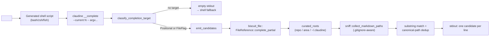

# Shell Completions

Claudine ships dynamic shell completions for `bash`, `zsh`, and `fish`.
Typing `<TAB>` on `claudine compose`, `claudine inline-compose`,
`claudine sequence`, or a `--append-system-prompt` / `--replace-system-prompt`
value slot surfaces markdown files from a small set of **curated
locations** — prompts and sequences that live where Claudine expects
them. Every other argument position falls through to the shell's default
behavior (filenames, flag names, etc.).

This document introduces how completion is wired up today, which
positions actually fire, which directories are searched, and where the
system is most naturally extended.

- Engine: [`claudine/cli/src/completion/supplement.rs`](../../cli/src/completion/supplement.rs)
- Shell scripts: [`claudine/cli/src/completion/bootstrap.rs`](../../cli/src/completion/bootstrap.rs)
- `__complete` entry: [`claudine/cli/src/commands/completions.rs`](../../cli/src/commands/completions.rs)
- Source-of-truth partial-completion API: [`biscuit-file/lib/src/file_reference/resolve.rs`](../../../biscuit-file/lib/src/file_reference/resolve.rs)
- Curated-scope walker: [`sniff/lib/src/filesystem/docs.rs`](../../../sniff/lib/src/filesystem/docs.rs)

## Installation

`claudine completions <shell>` prints the registration script for a
given shell. Redirect it into the shell's completion file once:

```sh
# Bash
claudine completions bash > ~/.local/share/bash-completion/completions/claudine

# Zsh — drop into any directory in $fpath
claudine completions zsh > "${fpath[1]}/_claudine"

# Fish
claudine completions fish > ~/.config/fish/completions/claudine.fish

# PowerShell / Elvish (legacy one-line bootstrap; see below)
claudine completions powershell >> $PROFILE
claudine completions elvish    >> ~/.elvish/rc.elv
```

Open a new shell (or re-source the rc file) and completion is live.

The zsh script is self-healing against rc ordering: if sourced before
`compinit` has initialized, it autoloads and runs `compinit` on demand
so the `compdef _claudine claudine` registration always succeeds — that
guard is why `source <(claudine completions zsh)` early in a `.zshrc`
still works.

> **Backwards compatibility.** The previous one-liner
> `source <(COMPLETE=<shell> claudine)` activates a legacy
> `clap_complete`-driven path that still compiles but does not carry any
> of the rules below. Users stay on the legacy path until they run
> `claudine completions <shell>` again and replace the installed script.

## How dynamic completion works

On every `<TAB>`, the generated script collects the full command line
the user has typed plus the cursor index, then shells out to:

```text
claudine __complete --current <INDEX> -- <argv...>
```

`<argv...>` starts with the binary name at position 0 (`claudine`) and
includes every token through the one at the cursor. `__complete` is a
hidden subcommand that intentionally skips the main CLI's startup path
— it does not load config, telemetry, or the wrapper pipeline. It
classifies the cursor position, applies the rules below, and prints one
candidate per line on stdout. Each shell then either presents those
candidates to the user or — if stdout is empty — falls back to its
native file completion (`_files` for zsh, `-o bashdefault -o default`
for bash, fish's own filename fallback via `-a` on zero output).

### Why dynamic (and not static `clap_complete` output)

`clap_complete` can generate a static completion script from the clap
command tree, but it cannot see into subcommand-specific semantics like
"only markdown files inside `prompts/`" or "filenames that pass a
frontmatter validator." Every `<TAB>` must re-query the filesystem, so
we run the engine in-process via a subprocess on each invocation. The
shell script is static; the candidates are fresh.

## What positions trigger completion

The classifier in `supplement.rs` only fires for these exact
argument positions. Everywhere else the shell's default behavior
applies.

| Position | Subcommands |
|---|---|
| Positional `<FILE>` (the first non-flag argument) | `compose`, `inline-compose`, `sequence` |
| `--append-system-prompt <FILE>` / `--asp <FILE>` | `compose`, `inline-compose`, `sequence`, plus every wrapper: `claude`, `codex`, `gemini`, `goose`, `kimi`, `opencode`, `qwen` |
| `--replace-system-prompt <FILE>` / `--rsp <FILE>` | same 10 subcommands |

Other positions — subcommand names, flag names, global flags, setter
syntax (`key=value`), arbitrary trailing tokens — return zero custom
candidates so the shell's default completion takes over.

## What token shapes are recognized

The two entry forms supported by
`biscuit_file::FileReference::complete_partial` both fire:

| Partial | Form | Meaning |
|---|---|---|
| `@…` | Magic | `@`-prefixed file reference |
| `prompts/…`, `sequences/…`, bare names | Implicit-relative | File reference resolved relative to a known scope |

Anything else — `!pkg`, `vault:x`, `./local`, `../parent`, `/abs/path`,
`%VAR`, `{{VAR}}` — returns zero candidates and the shell falls back to
default behavior. `./` / `../` traversal UI is deliberately **not** a
supplement form; the legacy `CompleteEnv` path offered it and the
current engine does not.

## Current scope — what gets searched

Only three directory roots are walked, in order:

1. **Repo scope** — `<repo>/prompts/` and `<repo>/sequences/` when cwd
   is inside a git repository.
2. **Package-area scope** — `<repo>/<area>/prompts/` and
   `<repo>/<area>/sequences/` where `<area>` is the enclosing package
   area reported by `sniff::package_area_for_dir`. This is skipped when
   the area is the virtual `"root"` package.
3. **User scope** — `~/.claudine/prompts/` and `~/.claudine/sequences/`.

There is **no broad repo scan** — earlier revisions walked the entire
repo once the typed partial reached 3+ meaningful characters, and that
behavior was removed on 2026-04-18 because it flooded candidate lists
with every `.md` file in the workspace. Today the engine is strictly
scope-bounded.

If cwd is not inside a git repository, the repo and area scopes drop
out and only the user scope applies. `~/.claudine/` is intentionally
the only home-level directory — the raw `$HOME/prompts/` is **not**
searched.

Per-path refinements:

- Walking uses `sniff::collect_markdown_paths`, which is backed by
  `ignore::WalkBuilder`. That means `.gitignore` / `.git/info/exclude`
  / global git ignore rules are honored inside the curated scopes —
  gitignored markdown never surfaces.
- When the user has already committed to a subdirectory via `/`
  (e.g. `prompts/<cursor>` or `@prompts/<cursor>`), the curated subdir
  list collapses to just that subdirectory under each scope base.
- Candidates are deduplicated by canonical path, so single-crate areas
  where the area root coincides with the repo root (e.g. `tabby`,
  `tui`) don't produce duplicates.

## Matching semantics

- **Case-insensitive substring** on the filename with the trailing
  `.md` stripped **for matching only**. Directory components are never
  considered.
- Returned candidates keep their full `.md` extension so the shell
  inserts a valid file reference.
- Every candidate is a `*.md` file. Directories, non-markdown files,
  and setter-shaped tokens (`KEY=`) never appear.

Examples (from a repo whose `<repo>/prompts/` contains `plan.md`,
`plain.md`, `suppress.md`):

| Typed | Result |
|---|---|
| `@` | every `.md` under the three scopes (landing menu) |
| `@plan` | `@prompts/plan.md` |
| `plan` | `prompts/plan.md` |
| `@omp` | `@prompts/prompt.md` (mid-filename substring) |
| `@prompts/` | every `.md` under `<repo>/prompts/` (path-reset) |
| `./local` | zero candidates (unsupported form) |

## Shell-specific notes

### Zsh — substring completion and `compadd -U`

The supplement engine returns **substring** matches, which means a
candidate may not start with what the user typed. Zsh's default
`compadd` behavior would silently drop those candidates and — worse —
collapse them into an empty "unambiguous common prefix" that erases
the typed text. The generated `_claudine` function therefore:

- Sets `compstate[insert]=menu` to force menu-completion instead of
  common-prefix insertion.
- Passes `-U` to `compadd` so the engine's matches survive unmolested.
- Passes `-Q` to skip double-quoting path specials and `-S ''` to
  suppress the trailing space after a unique match.

These flags together are what make `claudine compose plan<TAB>`
surface `prompts/plan.md` instead of replacing `plan` with nothing.

### Fish — no native fallback

The fish script registers `complete -c claudine -f -a …` with `-f`,
which means fish does **not** fall back to file completion when the
supplement returns nothing. This is a known gap; non-targeted
positions on fish see no completion at all. A future fix would either
drop `-f` or add an explicit filename-completion fallback from the
callback.

### PowerShell and Elvish

Both retain the legacy `source <(COMPLETE=<shell> claudine)` bootstrap.
The supplement contract and every rule in this document apply to
bash/zsh/fish only. Adding PowerShell coverage would require
rewriting the registration to match the `__complete` protocol.

## Architecture at a glance



| File | Role |
|---|---|
| [`supplement.rs`](../../cli/src/completion/supplement.rs) | The engine. Classifier, scope computation, walker, matcher, deduplicator. |
| [`bootstrap.rs`](../../cli/src/completion/bootstrap.rs) | Shell-script text for bash/zsh/fish (plus legacy PowerShell/Elvish one-liners). |
| [`commands/completions.rs`](../../cli/src/commands/completions.rs) | `claudine completions <shell>` and the hidden `__complete` subcommand. |
| [`completion/mod.rs`](../../cli/src/completion/mod.rs) | Legacy `CompleteEnv` hook, kept compilable for users still on the old bootstrap. |
| [`biscuit-file` `complete_partial`](../../../biscuit-file/lib/src/file_reference/resolve.rs) | Token-shape classifier the engine consumes (form, active segment, rendered prefix). |
| [`sniff` `collect_markdown_paths`](../../../sniff/lib/src/filesystem/docs.rs) | Gitignore-aware markdown walker. |

## Dimensions we can modify going forward

The current engine uses **one** candidate pipeline for every targeted
position: positional `<FILE>` on the three composition subcommands and
`--asp`/`--rsp` values on those plus the seven provider wrappers all
land in the same `emit_candidates` call. Several axes are straight-
forward to vary from here.

### 1. Per-target scope (largest pending change)

`CompletionTarget` already distinguishes `Positional` from `FileFlag`
but does not yet propagate downstream. The natural next step is:

```text
CompletionTarget {
  ComposePositional        → {repo,area,~/.claudine}/prompts/
  InlineComposePositional  → {repo,area,~/.claudine}/prompts/
                             (with a `prompt:` frontmatter validator)
  SequencePositional       → {repo,area,~/.claudine}/sequences/
                             (with a `sequence:` frontmatter validator)
  SystemPromptFlag         → system-prompt.md discovery
                             (via the existing LaunchContext logic)
}
```

This would fix the current quirk where `claudine compose @<TAB>`
offers `sequences/*.md` and `claudine sequence @<TAB>` offers
`prompts/*.md`. It would also give `--replace-system-prompt` a
meaningful completion set — today it returns the same prompts/sequences
union, which is rarely what the user wants for a `system-prompt.md`.

### 2. Matching rules

Today every target uses case-insensitive substring. Other options are
cheap to add per-target:

- **Fuzzy** (subsequence) matching — like fzf.
- **Prefix only** for contexts where pasted paths are common.
- **Filename stem vs. full relative path** — currently only the
  filename stem is matched; allowing directory-component matches would
  let `claudine compose plan/review<TAB>` narrow to files whose
  relative path contains both segments.

### 3. Validators

The `validate` module (`validate.rs`) already has `is_valid_prompt`,
`is_valid_sequence`, etc. — but the supplement engine does not
currently invoke them. Plugging validators in per-target would let us
surface only files that actually parse for a given subcommand (e.g.
`sequence @<TAB>` would drop sequence files whose YAML fails
`resolve_sequence_plan`).

### 4. Scope dimensions

The scope list is a fixed array of bases × subdirs. The easy knobs:

- **Adding a scope** — e.g. a project-local `.claudine/prompts/` —
  is a one-line change in `curated_roots`.
- **Conditional scopes** — e.g. only include the area scope when the
  area has markdown — requires threading an existence check into
  `push_scope`.
- **Subcommand-specific subdirs** — tied to the per-target split in
  §1.

### 5. Ordering and ranking

Candidates come out of `emit_candidates` in alphabetical order (backed
by a `BTreeSet`). Future work could:

- Rank curated-scope hits above user-scope hits.
- Apply last-used / last-modified ordering (requires a cache).
- Use match-quality scoring (exact filename match first, substring
  anywhere second).

### 6. Caching

Every `<TAB>` re-runs `sniff::detect_repo_structure` (which shells out
to `cargo metadata`) and re-walks each scope directory. In a 48-crate
workspace that is perceptibly slow. An in-process cache keyed on
`(cwd, repo_root)` or a file-mtime-based cache would cut re-runs to
a near-zero cost, at the cost of occasional staleness.

### 7. Observability

The `__complete` subcommand currently emits no tracing output; shell
completion pipelines swallow stderr, and noisy logs would corrupt
stdout. Future work could:

- Add `--debug` that writes to `~/.claudine/logs/completion.log`.
- Honor `RUST_LOG=trace` on `__complete` specifically and redirect to
  a log file.
- Surface the engine's decision tree (form, scope, chosen roots) in a
  structured log for diagnosing "completion isn't working."

### 8. Shell surface

PowerShell and Elvish are still on the legacy `CompleteEnv` path.
Fish's no-fallback quirk is known. Rewriting those registrations
against the `__complete` protocol (and documenting that contract in
`bootstrap.rs`) brings the whole surface under one set of rules.

## Historical context

- The legacy `source <(COMPLETE=<shell> claudine)` bootstrap predates
  the supplement engine. It drove completion through `clap_complete`'s
  `CompleteEnv` runtime path, which does not understand the curated-
  scope semantics documented here. Stale installations still reach
  that path via `claudine/cli/src/completion/mod.rs`.
- The supplement engine shipped as feature `2026-04-18-file-completion-
  supplement`, replacing feature `2026-04-17-file-completion` which
  had used `ArgValueCompleter` attached to clap args.
- The 3+-character broad repo scan (walking the entire repo and
  substring-matching every `.md` file) was part of the original
  supplement design and was removed on 2026-04-18; the scope list now
  terminates at the three curated roots above.
