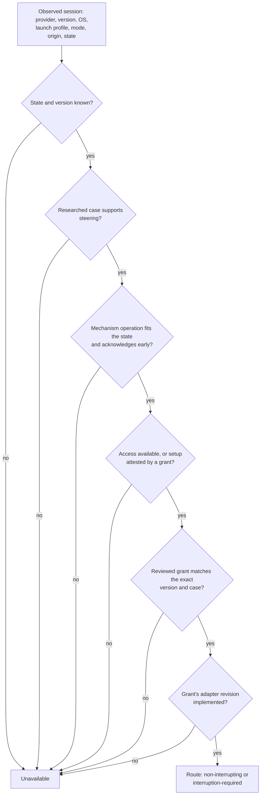

# Steering Activation

Claudine can only steer a running agent session through a mechanism that has
been researched, live-tested, reviewed, and implemented for that exact kind of
session. This page explains how those pieces fit together, how to check them,
and how a mechanism is enabled.

> **Status:** the typed facts, activation checks, and eligibility rules below
> are implemented, as are managed control routing and session discovery (see
> [Steering Routing](steering-routing.md)). The `claudine steer` command,
> automatic repetition warnings, and every provider adapter are **planned**.
> Until an adapter ships, every session reports steering as unavailable, each
> with a specific reason.

## What you can do today

Check every provider's steering research and the activation policy:

```sh
claudine providers steering check          # every active roster provider
claudine providers steering check pi --json
```

Regenerate the runtime tables after editing research or the policy:

```sh
claudine providers generate --yes
```

Both commands forward to `claudine-gen`. A check failure names the provider,
the record, and the exact reason, for example:

```text
pi: steering research has 2 error(s)
- activation: grants[0] pi/rpc-steer: verification `pi-rpc-steer-eof-0844` documents an expected loss and cannot activate delivery
- activation: grants[0] pi/rpc-steer: verification lacks required assertions: target_identity, acceptance_signal, conversation_delivery, running_work_preserved
```

## The three inputs

| Input | Owner | What it says |
| --- | --- | --- |
| `docs/research/steering/<slug>.md` | research fleet | Discovery methods, mechanisms, capability cases, access, receipts, and live verification records with typed assertions |
| `docs/research/non-interactive-sessions/<slug>.md` | research fleet | Execution interfaces and the preferred/fallback selection |
| `docs/providers/steering-activation.yaml` | human review | Reviewed adapter revisions and exact activation grants |

Research describes what a provider does. The policy file records what Claudine
has reviewed. A passing test in research grants nothing on its own, and a grant
is rejected unless research supports every part of it.

The generator joins all three into `lib/src/steering/generated.rs`. The
library adds the fourth, code-owned input: `IMPLEMENTED_ADAPTERS` in
`lib/src/steering/adapters.rs`. A test keeps it equal to the reviewed adapter
list, so neither can enable an adapter without the other.

## How a session becomes steerable



Every "no" becomes a reason the user sees, such as
`` `rpc-steer` has no reviewed live verification for this provider version and
launch profile; it also requires setup: Owned RPC child, retained pipes, fresh
get_state. ``

### Manual and automatic eligibility differ

Manual steering prefers a non-interrupting route and falls back to one that
requires interruption (which always needs the user's explicit consent).

Automatic help, sent when Claudine suspects a repetition loop, is stricter. It
needs a working session and a non-interrupting route that can reach a turn
that may never end:

| Mechanism | Manual | Automatic |
| --- | --- | --- |
| Steer the active turn at the next tool boundary | yes | yes |
| Queue a follow-up delivered at the next turn | yes | **no** — the looping turn never ends |
| Start a turn in an idle session | yes | no — nothing is looping |
| Interrupt, then submit | yes, with consent | never |
| Any mechanism whose acknowledgment arrives only when the turn ends | no | no |

## Writing an activation grant

A grant names one exact case. Everything is required; nothing is inferred.

```yaml
adapters:
  - id: pi-rpc
    revision: 1
    provider: pi
    mechanism_ids: [rpc-steer]
grants:
  - provider: pi
    mechanism_id: rpc-steer
    operation: steer_active_turn
    adapter: { id: pi-rpc, revision: 1 }
    profile_id: retained-rpc
    os: macos
    provider_version: "0.84.4"
    launch_mode: non_interactive
    origin: claudine
    session_state: working
    verification_ids: [<verification record id>]
```

`claudine-gen` accepts a grant only when:

- the researched case for that profile, OS, mode, origin, and state lists the
  mechanism with a supporting verdict, and the operation matches the
  mechanism's researched operation and fits the state;
- the mechanism acknowledges before the turn ends (`early` or `multi_phase`);
- access for that profile and OS is `available` or `setup_required` (never
  `blocked` or `unknown`);
- `provider_version` is one exact release (no `x`, ranges, or wildcards);
- the adapter id and revision are reviewed and bind the mechanism;
- each named verification record matches every dimension of the grant, passed,
  and is not an expected-loss record, and together they cover the operation's
  required assertions.

| Operation | Required assertions |
| --- | --- |
| `steer_active_turn`, `queue_follow_up` | `target_identity`, `acceptance_signal`, `conversation_delivery`, `running_work_preserved` |
| `start_idle_turn` | `target_identity`, `acceptance_signal`, `conversation_delivery` |
| `interrupt_then_submit` | `target_identity`, `acceptance_signal`, `cancellation_established`, `conversation_delivery` |

The policy parser is strict. Both lists must be present (an empty `[]` means
"nothing reviewed", but a missing or null list is an error), unknown keys and
duplicate keys are errors, and string fields must be YAML strings: write
`provider_version: "1.2"`, not `provider_version: 1.2`.

Bump an adapter's revision whenever its protocol behavior changes. Existing
grants then stop applying until someone re-reviews them against the new
revision.

## Typed verification records

Research verification rows carry a stable `id` and typed `assertion_kinds`
alongside their prose `assertions`. A record that documents a loss or failure
boundary includes `expected_loss`; it remains valuable regression evidence but
can never satisfy a grant.

```yaml
- id: pi-rpc-steer-active-0844
  assertion_kinds: [target_identity, acceptance_signal, delivery_boundary,
                    running_work_preserved, conversation_delivery, duplicate_behavior]
  assertions:
    - acceptance precedes tool completion
    - both tool calls finish before subsequent model input contains steering
  mechanism_id: rpc-steer
  outcome: passed
  # ... exact version, OS, profile, mode, origin, state
```

A record's scope is exact. A test of a directly launched provider (`origin:
native`) is not evidence for a Claudine-managed launch (`origin: claudine`).

## Related

- [Provider Metadata](./provider-metadata.md) — the generator and its other
  artifacts
- [Non-Interactive Sessions](./non-interactive-sessions.md)
