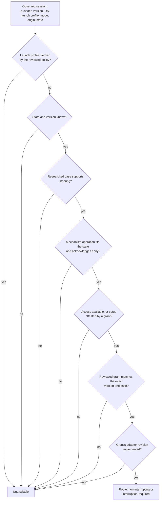

# Steering Activation

Claudine can only steer a running agent session through a mechanism that has
been researched, live-tested, reviewed, and implemented for that exact kind of
session. This page explains how those pieces fit together, how to check them,
and how a mechanism is enabled.

> **Status:** the typed facts, activation checks, eligibility rules, profile
> blocks, managed control routing, session discovery, the
> [`claudine steer`](../cli/steer.md) command, and
> [automatic repetition help](automatic-steering.md) are implemented (see
> [Steering Routing](steering-routing.md)). Two adapters are implemented and
> reviewed:
>
> - `codex-app-server` revision 1 ([Managed Codex app-server execution](codex-app-server.md))
>   is **granted** for Claudine-managed non-interactive Codex runs on macOS at
>   exactly Codex 0.157.1 — see [The shipped Codex grants](#the-shipped-codex-grants);
> - `pi-rpc` revision 1 ([Managed Pi RPC execution](pi-rpc.md)) is **blocked**
>   (see [Blocking a profile](#blocking-a-profile)).
>
> Every other session reports steering as unavailable, each with a specific
> reason, in `claudine steer --list`.

## What you can do today

Check every provider's steering research and the activation policy:

```sh
claudine providers steering check          # every active roster provider
claudine providers steering check pi --json
```

Regenerate the runtime tables after editing research or the policy:

```sh
claudine providers generate --yes
```

Both commands forward to `claudine-gen`. A check failure names the provider,
the record, and the exact reason, for example:

```text
pi: steering research has 2 error(s)
- activation: grants[0] pi/rpc-steer: verification `pi-rpc-steer-eof-0844` documents an expected loss and cannot activate delivery
- activation: grants[0] pi/rpc-steer: verification lacks required assertions: target_identity, acceptance_signal, conversation_delivery, running_work_preserved
```

## The three inputs

| Input | Owner | What it says |
| --- | --- | --- |
| `docs/research/steering/<slug>.md` | research fleet | Discovery methods, mechanisms, capability cases, access, receipts, and live verification records with typed assertions |
| `docs/research/non-interactive-sessions/<slug>.md` | research fleet | Execution interfaces and the preferred/fallback selection |
| `docs/providers/steering-activation.yaml` | human review | Reviewed adapter revisions, exact activation grants, and blocked launch profiles |

Research describes what a provider does. The policy file records what Claudine
has reviewed. A passing test in research grants nothing on its own, a grant is
rejected unless research supports every part of it, and a blocked profile can
never be granted.

The generator joins all three into `lib/src/steering/generated.rs`. The
library adds the fourth, code-owned input: `IMPLEMENTED_ADAPTERS` in
`lib/src/steering/adapters.rs`. A test keeps it equal to the reviewed adapter
list, so neither can enable an adapter without the other.

## How a session becomes steerable



Every "no" becomes a reason the user sees, such as
`` `rpc-steer` has no reviewed live verification for this provider version and
launch profile; it also requires setup: Owned RPC child, retained pipes, fresh
get_state. `` A block is reported first and alone, because it does not depend
on state or version: `steering is blocked for this launch profile: Pi offers
no expected-session guard, …`.

### Manual and automatic eligibility differ

Manual steering prefers a non-interrupting route and falls back to one that
requires interruption (which always needs the user's explicit consent).

Automatic help, sent when Claudine suspects a repetition loop, is stricter. It
needs a working session and a non-interrupting route that can reach a turn
that may never end:

| Mechanism | Manual | Automatic |
| --- | --- | --- |
| Steer the active turn at the next tool boundary | yes | yes |
| Queue a follow-up delivered at the next turn | yes | **no** — the looping turn never ends |
| Start a turn in an idle session | yes | no — nothing is looping |
| Interrupt, then submit | yes, with consent | never |
| Any mechanism whose acknowledgment arrives only when the turn ends | no | no |

## Writing an activation grant

A grant names one exact case. Everything is required; nothing is inferred.

```yaml
adapters:
  - id: pi-rpc
    revision: 1
    provider: pi
    mechanism_ids: [rpc-steer, rpc-idle-prompt, rpc-abort-submit]
blocks: []
grants:
  - provider: pi
    mechanism_id: rpc-steer
    operation: steer_active_turn
    adapter: { id: pi-rpc, revision: 1 }
    profile_id: retained-rpc
    os: macos
    provider_version: "0.84.4"
    launch_mode: non_interactive
    origin: claudine
    session_state: working
    verification_ids: [<verification record id>]
```

`claudine-gen` accepts a grant only when:

- the researched case for that profile, OS, mode, origin, and state lists the
  mechanism with a supporting verdict, and the operation matches the
  mechanism's researched operation and fits the state;
- the mechanism acknowledges before the turn ends (`early` or `multi_phase`);
- access for that profile and OS is `available` or `setup_required` (never
  `blocked` or `unknown`);
- `provider_version` is one exact release (no `x`, ranges, or wildcards);
- the adapter id and revision are reviewed and bind the mechanism;
- each named verification record matches every dimension of the grant, passed,
  and is not an expected-loss record, and together they cover the operation's
  required assertions;
- no block names the grant's provider and profile.

A case researched as `non_interrupting` can list an interruption mechanism as
a manual fallback, but that mechanism cannot be granted on that case: a grant's
mechanism must support the case the way the research says it does. This is
also the runtime behavior — a selectable non-interrupting route is always
preferred, so an interruption grant there could never be chosen.

| Operation | Required assertions |
| --- | --- |
| `steer_active_turn`, `queue_follow_up` | `target_identity`, `acceptance_signal`, `conversation_delivery`, `running_work_preserved` |
| `start_idle_turn` | `target_identity`, `acceptance_signal`, `conversation_delivery` |
| `interrupt_then_submit` | `target_identity`, `acceptance_signal`, `cancellation_established`, `conversation_delivery` |

The policy parser is strict. All three lists must be present (an empty `[]`
means "nothing reviewed", but a missing or null list is an error), unknown keys
and duplicate keys are errors, and string fields must be YAML strings: write
`provider_version: "1.2"`, not `provider_version: 1.2`.

Bump an adapter's revision whenever its protocol behavior changes. Existing
grants then stop applying until someone re-reviews them against the new
revision.

## Blocking a profile

A block is a reviewed refusal: "whatever the research and tests say, do not
steer sessions launched with this profile". Use one when the evidence shows a
profile cannot be targeted safely, so the listing states that reason instead of
suggesting that more setup or verification would help.

```yaml
blocks:
  - provider: pi
    profile_id: retained-rpc
    reason: >-
      Pi offers no expected-session guard, and an enabled extension can switch
      the session outside Claudine's control, so a message could be accepted
      and then lost to the replaced session.
```

`claudine-gen` rejects a block that names a profile no researched case uses, a
profile blocked twice, or an empty reason, and rejects every grant for a
blocked profile. Lifting a block is a policy edit that must come with the new
evidence that answers its reason.

### The shipped Pi block

Pi's managed RPC launch (`retained-rpc`) is blocked on every OS. Pi's `steer`
and `prompt` act on whichever session is current and accept no expected
session. The research record `pi-rpc-steer-switch-0844`, re-run against Pi
0.87.1 with the same result, shows an extension holding a session switch while
`get_state` still reports the old session: a steer sent at that moment is
acknowledged and then lost. Claudine keeps extensions enabled, and its own
mutation lock (see [Managed Pi RPC execution](pi-rpc.md#steering-adapter))
cannot order a switch that an extension starts on its own, so no check before
sending closes that window.

### The shipped Codex grants

The reviewed policy grants two Codex cases, both for the
`managed-app-server` profile on macOS, `provider_version: "0.157.1"`,
`launch_mode: non_interactive`, `origin: claudine`:

| Mechanism | State | Verification records |
| --- | --- | --- |
| `app-server-steer` (`steer_active_turn`) | working | `codex-app-server-steer-tool-01571`, `codex-app-server-steer-stale-01571`, `codex-app-server-steer-generation-01571` |
| `app-server-turn-start` (`start_idle_turn`) | idle | `codex-app-server-idle-01571` |

The records come from the production session and adapter run against the
installed Codex 0.157.1 with a scripted local model
(`features/2026-09-08-steering/verification/codex-macos-0.157.1.json`). Codex's
`turn/steer` names the running turn as `expectedTurnId` and refuses anything
else, which is the target guard Pi lacks, so no block applies.

A managed Codex run is steerable only when all of this holds; a different
Codex version, Linux, native Windows, or an `exec`-only run lists as
unavailable with the specific reason. The interrupt-then-start mechanism is
implemented and verified (`codex-app-server-interrupt-01571`) but not granted,
for the reason given under [Writing an activation grant](#writing-an-activation-grant).

## Typed verification records

Research verification rows carry a stable `id` and typed `assertion_kinds`
alongside their prose `assertions`. A record that documents a loss or failure
boundary includes `expected_loss`; it remains valuable regression evidence but
can never satisfy a grant.

```yaml
- id: pi-rpc-steer-active-0844
  assertion_kinds: [target_identity, acceptance_signal, delivery_boundary,
                    running_work_preserved, conversation_delivery, duplicate_behavior]
  assertions:
    - acceptance precedes tool completion
    - both tool calls finish before subsequent model input contains steering
  mechanism_id: rpc-steer
  outcome: passed
  # ... exact version, OS, profile, mode, origin, state
```

A record's scope is exact. A test of a directly launched provider (`origin:
native`) is not evidence for a Claudine-managed launch (`origin: claudine`).

## Related

- [Provider Metadata](./provider-metadata.md) — the generator and its other
  artifacts
- [Managed Codex app-server execution](./codex-app-server.md) — the
  `codex-app-server` adapter and the launch it steers
- [Managed Pi RPC execution](./pi-rpc.md) — the `pi-rpc` adapter and the
  launch it steers
- [Non-Interactive Sessions](./non-interactive-sessions.md)
