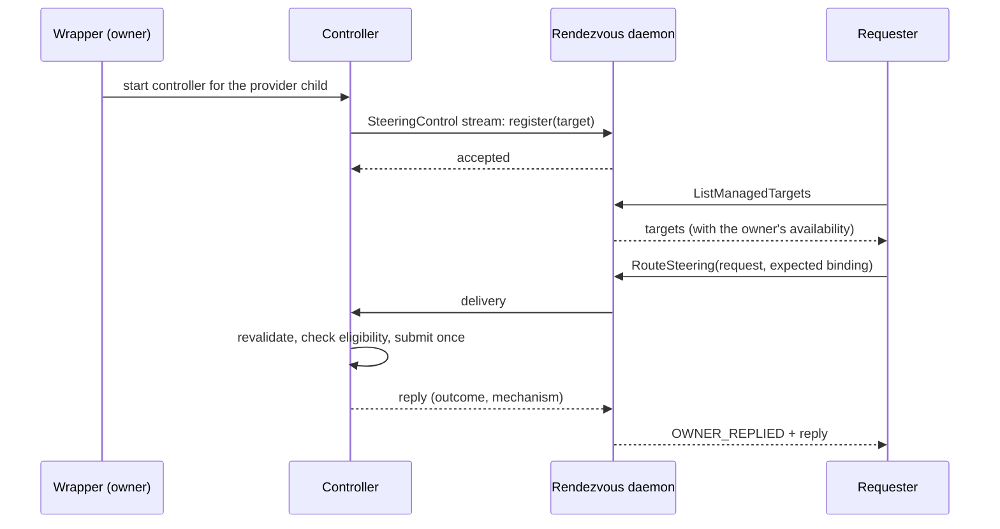

# Steering Routing

Steering sends a short message into an agent session that is already running.
This page covers the plumbing that makes that possible for sessions Claudine
owns: who owns a session's steering I/O, how a request from a separate process
reaches that owner, how steerable sessions are listed, and what every failure
looks like. Whether a given session *can* be steered at all is a separate
question, answered by [Steering Activation](steering-activation.md).

> **Status:** ownership, local routing, and discovery are implemented, with
> two provider adapters:
>
> - a managed Codex app-server launch registers under the `managed-app-server`
>   profile with the `codex-app-server` executor
>   ([Managed Codex app-server execution](codex-app-server.md)) and records the
>   Codex version it read at start-up; on macOS at Codex 0.157.1 it lists as
>   steerable;
> - a managed Pi RPC launch registers under the `retained-rpc` profile with the
>   `pi-rpc` executor ([Managed Pi RPC execution](pi-rpc.md)); the reviewed
>   policy blocks that profile, so it lists as unavailable with the block's
>   reason.
>
> Every other wrapped launch maps to no profile and lists as unavailable for
> that reason. The [`claudine steer`](../cli/steer.md) command is the
> production requester. [Automatic repetition help](automatic-steering.md)
> submits to the owner's controller directly.

## The three roles

| Role | Where it lives | What it does |
| --- | --- | --- |
| **Owner** | The `claudine` wrapper running the agent (`cli/src/steering/owner.rs`) | One steering controller per provider child. It alone submits steering to the provider, one request at a time, through the provider's adapter when its launch has one. |
| **Router** | The local Rendezvous daemon (`rendezvous-daemon`, `steering.rs`) | Holds live owner registrations in memory and carries one request to one owner and its reply back. |
| **Requester** | Any other local `claudine` process (`cli/src/steering/requester.rs`); in practice [`claudine steer`](../cli/steer.md) | Lists managed targets and routes a request to one of them. |



The owner's registration is **not** the dashboard presence entry. Presence is a
replicated, best-effort register governed by `CLAUDINE_RENDEZVOUS_REPORT`;
control registration lives only in the daemon's memory while the owner's stream
is open, never reaches a mesh peer or disk, and that switch does not affect it.

## Target identity

Every managed execution gets a fresh random ID, and a listed target is bound to
more than that ID:

```text
managed:1b4e28ba-2fa1-11d2-883f-0016d3cca427     ← the ID a user selects
binding: wrapper PID 4242 + process start 1759961234, conversation generation 3
```

A PID alone is never an identity (PIDs are reused), so the wrapper pairs its
PID with its process start time. Each time the provider's conversation changes
the generation increments, including the first time the provider reports its
conversation ID. A request carries the binding it was selected under. If the
wrapper or the conversation has changed since, the request is rejected as
stale — first by the daemon, again by the owner just before submission — and
is never delivered to the new conversation instead.

## What the owner guarantees

The controller (`claudine::steering::controller`) is the one queue in front of
the provider:

| Bound | Value | When exceeded |
| --- | --- | --- |
| Requests queued or in flight per execution | 16 | `busy`; nothing already accepted is evicted |
| Automatic requests pending at once | 1 | `busy` |
| Manual deadline, dispatch → acceptance | 10 s | see below |
| Automatic deadline | 2 s | see below |
| Consented interruption | 10 s to cancel, then 10 s to submit | see below |

The deadline covers queue wait as well as submission:

- A request that **expires before submission** is discarded as `busy` — nothing
  was sent.
- A request **submitted without acceptance** by its deadline is `unknown`. It
  may have reached the provider, so it is never retried. If the provider
  confirms later, a `late_result` audit record is appended; the caller's
  answer does not change.
- A request ID is accepted once per execution. A repeated ID is `refused`,
  so neither a reconnection nor a retrying client can deliver a message twice.
- A receipt stronger than the mechanism can prove (for example `delivered`
  from a mechanism that only confirms acceptance) is lowered to what it can.
- Changed availability is reported, not worked around: a request for
  non-interrupting delivery never turns into an interruption.
- A request names the **operation** it wants (`steer_active_turn`,
  `start_idle_turn`, `interrupt_then_submit`, …). The owner submits only when
  its current route performs exactly that operation; otherwise it answers
  `unavailable` ("the requested `x` operation is no longer available; this
  session now offers `y`"). A requester therefore sends the operation the
  listing row named, and a session that went idle, or started needing
  interruption, since it was listed is never steered with a different action.

Every request, including refusals, is audited by the owner (see
[Traces and Logging](traces-and-logging.md#steering-audit-records)).

The controller needs no daemon. [Automatic help](automatic-steering.md) raised
inside the owner calls it directly, so it keeps working when Rendezvous is not
running. When a content guard stops the run, automatic help stops the
controller: queued requests are answered `unavailable` and a submission in
progress is abandoned as `unknown`, so nothing reaches the provider after the
decision to terminate it.

### Where the profile and adapter come from

A wrapped launch driven by a retained-stdin control session (today, Codex's
`app-server` and Pi's `--mode rpc`) registers under the research profile that
session names and submits through the session's adapter. The session also
keeps the controller current: the provider's state (`working` on each turn
start, `idle` when the turn completes or the run settles), its conversation
(each change starts a new generation), its process identity, and — when the
provider reports one before the task starts, as Codex's `initialize` does —
its exact version (`SteeringController::set_provider_version`). A grant
applies only at that exact version; a session whose version is unknown is
never guessed steerable. Every other launch registers with no profile, which
lists as unavailable with "this launch is not mapped to a researched steering
launch profile".

## What the router guarantees

The daemon adds three RPCs to its local gRPC service (see
[Rendezvous — Local IPC §15](../rendezvous/local-ipc.md#15-steering-control)):

| Route outcome | Meaning | Requester reports |
| --- | --- | --- |
| `OWNER_REPLIED` | The owner answered | the owner's outcome |
| `NO_OWNER` | No live registration | `unavailable` |
| `STALE_TARGET` | The binding changed | `unavailable` ("the selected target changed: …") |
| `DUPLICATE_REQUEST` | ID already routed | `refused` |
| `BUSY` | Owner channel full (16) | `busy` |
| `UNKNOWN` | Forwarded, no reply (disconnect or deadline) | `unknown` |

Only the owner decides a delivery outcome; the daemon never upgrades a receipt,
never retries, and never redirects. When an owner's stream closes, its
registration disappears and any request it was holding resolves as `unknown`.

## When the daemon is missing or fails

Nothing fails the wrapped agent task:

- The owner's link makes time-bounded connection attempts (500 ms each) with
  backoff (1, 2, 4, 8 s) and stops after five consecutive failures. A lost
  connection after a successful registration reconnects and registers again;
  nothing is replayed.
- A requester that cannot reach the daemon reports `unavailable` with "no local
  steering route".
- Daemon shutdown ends every owner stream, so a graceful shutdown never waits
  on a running agent.

## Listing sessions

`claudine::steering::discovery` merges two kinds of source into one listing:

- **Managed** — the daemon's live registrations. Each row carries its owner's
  own availability verdict and the operation its route performs, and keeps
  (in memory, not in JSON) the binding it was listed under, which is what a
  requester routes with as `expected`. A registration whose `operation` does
  not agree with its availability (missing while selectable, present while
  unavailable, or not an operation name) is reported as a discovery error,
  never listed with a guessed operation.
- **Native** — provider-specific discoverers for researched discovery methods
  (`discovery` records in `docs/research/steering/<slug>.md`, projected into the
  generated catalog), under `claudine::steering::native`. Every researched
  native method this build does not run is reported as a coverage gap rather
  than an error.

### Native Claude Code sessions

Claude Code writes one record per running process to
`$CLAUDE_CONFIG_DIR/sessions/<pid>.json` (default `~/.claude/sessions/`). The
Claude registry discoverer reads those files — it never opens a socket, reads
a credential, or asks the session anything — and lists a record only when it
names a live session:

- its process is running, and started no later than the record's `startedAt`
  (a record left behind by an exited session whose PID was reused names a
  newer process, and is dropped);
- `pid`, `sessionId`, `startedAt`, `kind`, and `entrypoint` are present and
  well-typed (a damaged file is skipped with a trace, and never hides the
  others).

The row's ID is `native:claude:<pid>:<process start>:<sessionId>`, its state
comes from the record's `status` (`busy` → working, `idle` → idle, anything
else → unknown), and a terminal session (`kind: interactive`,
`entrypoint: cli`) maps to the researched `ordinary-interactive` profile.
SDK and print-mode sessions (`entrypoint: sdk-*`) are listed without a
profile, because the registry does not say whether they are one-shot or
retained. Claude Code's peer-messaging delivery is researched but not
implemented or verified, so every native Claude row is listed as unavailable
with the specific reason.

A native row in `claudine steer --list --json` (abridged):

```json
{
  "id": "native:claude:4242:1790657970:3f1c9b1e-7a2d-4e53-9b8e-0c1d2e3f4a5b",
  "provider": "claude",
  "name": "fix the parser",
  "cwd": "/work/project",
  "state": "working",
  "origins": ["native"],
  "launch_profile": "ordinary-interactive",
  "provider_version": "2.1.284",
  "availability": "unavailable",
  "operation": null,
  "reason": "`peer-unix-active` has no reviewed live verification for this provider version and launch profile; …"
}
```

```rust
let managed: Arc<dyn ManagedSource> = Arc::new(DaemonManagedSource);
let report = claudine::steering::discovery::discover(Some(managed), &native).await?;
// report.sessions — merged, sorted rows
// report.errors   — sources that failed (secret-masked text)
// report.gaps     — researched native methods this build cannot run
```

Rules the aggregator applies:

- A 5-second deadline for the whole pass, and at most four provider tasks at
  once. A source that times out or fails becomes an error beside the other
  sources' rows; only when every source fails does discovery fail. An empty
  listing is a success.
- Rows merge only when identities prove the same session: an identical target
  ID, or a native observation whose provider process (PID + start) and
  conversation match a managed registration. The merged row keeps the managed
  ID and lists both sources in `origins`.
- Rows sort by research-roster order (`docs/providers.yaml`), then directory,
  then full ID.
- Unknown state stays `unknown` and is unavailable; it is never guessed.
- Session history and mesh presence are not inputs: neither proves the session
  is local, alive, or writable.

A row serializes as:

```json
{
  "id": "managed:1b4e28ba-2fa1-11d2-883f-0016d3cca427",
  "provider": "pi",
  "name": null,
  "cwd": "/work/project",
  "state": "working",
  "origins": ["managed"],
  "launch_profile": "retained-rpc",
  "provider_version": null,
  "availability": "unavailable",
  "operation": null,
  "reason": "steering is blocked for this launch profile: Pi offers no expected-session guard, and an enabled extension can switch the session outside Claudine's control, so a message could be accepted and then lost to the replaced session.",
  "setup_requirements": [],
  "observed_at": "2026-09-28T17:02:11Z"
}
```

`operation` is `null` exactly when `availability` is `unavailable`. The full
listing document `claudine steer --list --json` prints wraps these rows; see
[`claudine steer`](../cli/steer.md#json).

## Testing

- Controller: `lib/src/steering/controller/tests.rs` (fake executor, paused
  clock for deadlines).
- Aggregator: `lib/src/steering/discovery/tests.rs`.
- Claude Code registry discovery: `lib/src/steering/native/claude_registry/tests.rs`
  (record robustness matrix, PID-reuse rejection, state and profile mapping,
  directory scan) and `cli/tests/l1/steer_cli.rs` (a live and a stale record
  through the shipped binary).
- Router: `rendezvous/daemon/src/steering/tests.rs`; end to end over the real
  local endpoint, including shutdown with a connected owner and the check that
  no message text reaches the daemon's data directory:
  `rendezvous/client/tests/steering_round_trip.rs`.
- Owner link and requester: `cli/src/steering/tests.rs`. The daemon-backed
  cases need the CLI's `daemon-tests` feature (enabled in CI).
- The `claudine steer` command: `cli/src/commands/steer/tests.rs` (fake
  service, scripted picker and consent, off-screen rendering, and
  daemon-backed end-to-end cases) and `cli/tests/l1/steer_cli.rs` (the shipped
  binary: exit codes, stdout/stderr, no configuration written).
- The Codex adapter: see [Managed Codex app-server execution — Testing](codex-app-server.md#testing).
- The Pi adapter: see [Managed Pi RPC execution — Testing](pi-rpc.md#testing).
- L1 spawn fixtures point `RENDEZVOUS_ENDPOINT` at a private endpoint nothing
  listens on, so a wrapped test execution never registers with a developer's
  own daemon.
