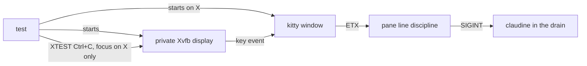

# Testing

Claudine's default verification path is the package-area `just` recipes, which run package-scoped nextest when `cargo-nextest` is installed and fall back to `cargo test` otherwise:

```bash
cargo --version
rustc --version
just test
just lint
```

The root nextest config marks tests as slow after 5 seconds in the default profile and after 10 seconds in CI. CI also writes JUnit output to `test-results.xml`.

Additional expectations for the Claudine test suite:

- New and modified tests should prefer `#[rstest]` when fixtures or parameterized cases make the setup clearer; do not bulk-migrate unrelated tests.
- Tests that mutate process-global state, especially environment variables, should stack `#[serial_test::serial]` directly on the test.
- Environment setup/teardown should use `test_toolkit::EnvGuard` instead of local guard types. `EnvGuard::set` and `EnvGuard::remove` are unsafe and require the test to serialize environment access.
- Use `test_toolkit::trace_phase!` only for meaningful setup, body, or teardown boundaries where a tracing span helps diagnose hangs or fixture failures.
- PTY tests (`cli/tests/l1/level1_*_pty.rs`) are Level 1: they prove from raw bytes what an interactive prompt sends and launches, for example that it never enters the alternate screen. A PTY renders nothing and keeps no scrollback, so a promise about what the terminal shows is proved at Level 2 (`just test-l2`), inside tmux and WezTerm. `level2_inline_prompt_scrollback.rs` is the example: it prints lines before the provider picker, the `$schema` prompts, and the partial-file chooser and confirmation, and checks that those lines stay in the terminal history, that each widget's rows are drawn, and that closing the prompt leaves no blank rows behind
- Snapshot updates should be reviewed with `cargo insta review` and accepted with `cargo insta accept`
- Benchmarks are opt-in and non-gating: `cargo bench -p claudine --bench runtime_hot_paths`
- CLI integration helpers live under `claudine/cli/tests/common/mod.rs`
- Inline unit tests are preferred for private library logic such as harness, sequence, dispatch, and TUI reducers

## Silent audio fixtures

Use clear speech such as “This is a test message.” and explicit zero volume for
real playback. Pin test providers and voices; these tests do not validate the
operator's personal Claudine speech configuration. A fake agent does not disable
lifecycle TTS or sound effects in a real prompt template.

`CliProcessFixture::command()` already sets child-only `PLAYA_DRY_RUN=1` and a
private `PLAYA_SPOOL_DIR` (`fixture.audio_spool()`); a test that executes a
shipped prompt asserts that directory is never created. This preserves normal
lifecycle evaluation while suppressing audio publication. `detached_audio.rs`,
whose subject is publication, removes the dry-run key on its built command.
Publication tests retain real handoff with the workspace-shared
`test_toolkit::LockedAudioSpool` fixture: it holds `worker.lock` for its whole
lifetime and takes `queue.lock` before scanning and removing pending jobs, so a
publisher or preparation helper cannot commit behind the scan. Destruction runs
the same cleanup while unwinding, and releases `worker.lock` while still holding
`queue.lock` — the order `run_scheduler_with` uses — so no publisher can commit
between the final scan and the release of worker ownership. A cleanup failure is
reported on stderr and retains worker ownership instead of exposing what it
could not remove; it also panics unless the thread is already panicking.
Tests that execute helpers must release blocked fixtures and observe completion
before removing their spool. Never use the operator's real queue for test cleanup.

## Messaging fixtures

A test that needs a real outbound message uses the loopback webhook listener in
`claudine/cli/tests/common/webhook_listener.rs`, never a real Discord or Slack
endpoint. For example:

```rust
write_webhook_route(fixture.home());
let listener = WebhookListener::start(ListenerMode::WithholdUntilReleased);
let mut command = fixture.command_std();
listener.apply_route_env(&mut command);
// spawn, wait for listener.wait_for_request(..), then listener.release()
```

- `write_webhook_route` writes an active `discord_webhook` route that reads its
  URL from an environment variable. The inline URL validator accepts only
  production Discord hosts, and the environment-backed route keeps that
  validation in the path under test.
- `apply_route_env` points that variable at the listener, removes inherited
  proxy variables, and sets `NO_PROXY`.
- The URL's token is `dummy-token`. Redaction only recognizes
  `https://discord.com/...` URLs, so an error string can print the loopback URL
  verbatim; assert the token is absent where a test checks redaction.
- `ListenerMode::Reply(status)` answers at once, `WithholdUntilReleased` holds
  every reply until `release()`, and `NeverReply` never answers. One polling
  thread serves every connection, so several held deliveries can be open at
  once, and a watchdog stops the listener even if a test forgets to.
- `write_config_with_webhook_route(home, json)` writes the same route next to
  other config keys. A `claudine handle` test uses it to add hook `actions`,
  for example `{"actions": {"session_end": [{"type": "message", "message": "…"}]}}`.
- A test of Ctrl+C during the exit drain uses `DrainCommand` from
  `claudine/cli/tests/common/drain_interrupt.rs`. `prepare` writes the stub
  `claude`, the route, and the document for one command, and returns its
  arguments. `pane::assert_second_press_during_the_drain_exits_130` runs the
  whole two-press scenario in any `TerminalHarness`. The caller passes the
  press as a closure, so each tier differs only in how the key arrives:

  ```rust
  assert_second_press_during_the_drain_exits_130(&mut harness, DrainCommand::Sequence, |pane| {
      pane.send_key("ctrl+c").expect("press"); // kitty; tmux uses "C-c"
  });
  ```

  The OS-keyboard version presses through the X server instead; see
  [Keyboard tests on a private display](#keyboard-tests-on-a-private-display).

  On Windows, `lifecycle_message_drain_console_windows.rs` runs the same
  `prepare` output as the root process of a windowless ConPTY console and
  types ETX into it. It re-enables inherited Ctrl+C processing first, or
  conhost never delivers the press.
- A test of a desktop `notify` must stay silent. Make every backend fail
  fast: on Unix, spawn with
  `command_builder().fake_only_path()` so neither a notification helper nor
  `osascript` is on `PATH`, and set `DBUS_SESSION_BUS_ADDRESS` to a missing
  socket for Linux. Windows fails before the toast API because Claudine
  configures no AppUserModelID.
- A test of a desktop `notify` that never finishes sets
  `CLAUDINE_TEST_DESKTOP_NOTIFICATION=stall` on the child. This is a
  [process-level test seam](#process-level-test-seams): it exists only in a
  `test-fixtures` build, so the test carries
  `#[cfg(feature = "test-fixtures")]`. The library then
  holds the notification send open before it reaches any host backend, on
  every OS, so the exit drain times out and warns about the
  `desktop notification` label. No host backend can be made to stall silently
  on all three OSes, which is why this one seam exists. Keep the fail-fast
  setup above as well, so a broken seam produces a failure warning rather than
  a notification on the host. Any other value leaves sends unchanged.

  ```rust
  command.env("CLAUDINE_TEST_DESKTOP_NOTIFICATION", "stall");
  // exits about 10 s later with code 0 and
  // "Desktop notification was still sending at exit; delivery is unknown"
  ```
- A test that waits out the 10-second exit drain stays in L1 under an ordinary
  name. Claudine does not declare `l1-include-slow`, so a `slow_` prefix
  would leave the test running in no recipe at all.

## Keyboard tests on a private display

A Level 3 test presses a real key: the event starts where a physical keypress
starts, before the terminal. Most of Claudine's L3 tests do that on the user's
own desktop, so they raise a window and need `just test-l3`'s attended-run
confirmation. On Linux, `level3_drain_ctrl_c.rs` and
`level3_sequence_review_screen_keys.rs` do it on a display of their own
instead, and never touch the user's desktop:



`biscuit_test_harness::xvfb::XvfbKitty` owns the display and the window:

```rust
let kitty = XvfbKitty::launch(160, 50).expect("launch");
let mut harness = kitty.harness(); // types commands and reads the screen
assert_second_press_during_the_drain_exits_130(&mut harness, DrainCommand::Compose, |_| {
    kitty.press_ctrl('c').expect("press");
});
```

- `press_ctrl` presses a Ctrl+letter chord and `press_escape` presses
  Escape. The sequence review screen's test presses `Ctrl+S`, `Esc`, and
  `Ctrl+C` this way and checks what each one started: the fixture's fake
  providers record every launch, and its `shell` and `side_effect` steps
  write a file, so a cancelled screen leaves both empty.
- The host needs `Xvfb` and `kitty` on `PATH` (Debian and Ubuntu packages
  `xvfb` and `kitty`). Without them the tests skip. No window manager is
  needed.
- The tests are Linux-only. macOS and Windows have no isolated desktop that
  can receive a real key event; the reasons are in
  [Signal Handling](signal-handling.md).
- CI runs no Level 3 tests, and the Linux build host has neither tool
  installed. A Linux container on a macOS host works, because Docker's Linux
  VM has no display of the user's to disturb:

  ```sh
  # from a copy of the worktree at ~/.cache/rb-linux/src (see the `os` skill)
  docker run --rm --memory=7g -v ~/.cache/rb-linux/src:/src -v ~/.cache/rb-linux/target:/t \
    <image with rust, cargo-nextest, xvfb, kitty, libdbus-1-dev, libasound2-dev> \
    bash -c 'cd /src && CARGO_TARGET_DIR=/t RUN_LEVEL3=1 cargo nextest run -p claudine-cli \
      --features terminal-tests --test level3 -j 1 -E "test(/level3_drain_ctrl_c::/)"'
  ```

- Run them with that filter rather than `just test-l3`: the recipe runs every
  L3 test, including the ones that take the user's focus, and so refuses to
  start without a person present.

## Process-level test seams

Some behavior can only be observed from outside the `claudine` process, so a
few environment variables named `CLAUDINE_TEST_*` change what the binary does.
None of them exists in a default or installed build: each is compiled only
under a test feature, and a production binary ignores the variable entirely.

| Variable | Compiled with | What it does |
|----------|---------------|--------------|
| `CLAUDINE_TEST_DESKTOP_NOTIFICATION=stall` | `test-fixtures` | holds every desktop notification open before any host backend |
| `CLAUDINE_TEST_DIAGNOSTIC_SNAPSHOT=<path>` | `test-fixtures` | writes the diagnostic selected for a top-level error to `<path>` as JSON |
| `CLAUDINE_TEST_TEARDOWN_HOLD=<path>` | `terminal-tests` (Unix) | holds the process-group teardown open until `<path>.release` exists |

`claudine-cli`'s `test-fixtures` feature enables the library's feature of the
same name. `just test` and CI both pass `--features test-fixtures`, so these
tests run in every L1 run, but a test that sets one of these variables must be
compiled only where its seam exists:

```rust
#[cfg(feature = "test-fixtures")]
#[test]
fn a_stalled_terminal_notify_is_reported_as_unknown_after_the_drain_budget() {
    // ... command.env("CLAUDINE_TEST_DESKTOP_NOTIFICATION", "stall") ...
}
```

To add a seam, name it `CLAUDINE_TEST_*` and put the item or statement that
reads it behind `#[cfg(feature = "test-fixtures")]`. The L1 guard
`test_seam_gate_guard.rs` parses `lib/src` and `cli/src` and fails on any
`CLAUDINE_TEST_*` name that a shipped build could compile.

The guard evaluates each `#[cfg(...)]` predicate rather than looking for the
word `test` or `feature` in it. A gate passes only when every configuration
that satisfies it has `test` set or enables a test-only feature:
`test-fixtures`, `terminal-tests`, `daemon-tests`, or `real-tests` (the list
lives in `cli/tests/l1/cfg_gate.rs`; no default build or `cargo install`
enables any of them).

| Gate | Result | Why |
|------|--------|-----|
| `#[cfg(feature = "test-fixtures")]` | pass | only a test feature compiles it |
| `#[cfg(all(unix, feature = "terminal-tests"))]` | pass | `all` needs every part, and one part is a test feature |
| `#[cfg(any(feature = "test-fixtures", unix))]` | fail | every ordinary Unix build compiles it |
| `#[cfg(feature = "whatever")]` | fail | not a test-only feature |
| `#[cfg(not(test))]`, `#[cfg(unix)]` | fail | selects shipped builds |
| `#[cfg_attr(test, allow(dead_code))]` alone | fail | `cfg_attr` changes attributes, not whether the item compiles |

Gates nest: a seam inside a gated module, function, `impl`, or statement is
covered when any enclosing gate passes, because the compiler requires all of
them. A predicate the guard cannot parse, such as `#[cfg(test, unix)]`, fails
the guard instead of counting as a gate. The same evaluator decides which items
the diagnostic error guards (`error_guards.rs`) skip as test code.
