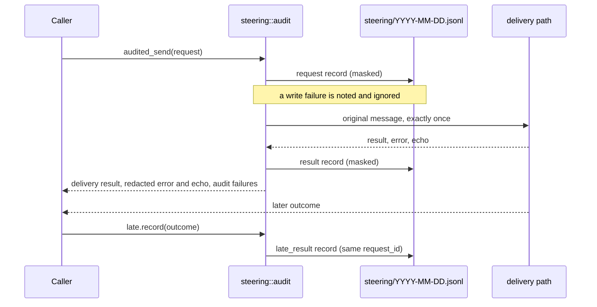

# Traces and Logging

Claudine produces structured JSONL logs for every wrapped session and dispatched event. These logs live under `~/.claudine/logs/` with one file per calendar day (`YYYY-MM-DD.jsonl`).

## Wrapper Environment Variables

When Claudine operates as a wrapper (`claudine <provider>`), it injects several environment variables into the provider process before spawn:

| Variable | Description |
|----------|-------------|
| `AGENT` | Provider name (e.g., `codex`, `claude`) |
| `YOLO` | `true` or `false` — whether auto-approval mode is active |
| `INTERACTIVE` | `true` or `false` — whether the session is interactive |
| `AGENT_PARAMS` | JSON array of provider-specific argv tokens |
| `CLAUDINE_SESSION_ID` | UUID for the current wrapped session |
| `CLAUDINE_PID` | Claudine's own process ID at wrapper startup |
| `PACKAGE_AREA` | Monorepo package area, when resolvable |
| `PACKAGE` | Monorepo package name, when resolvable |

### `CLAUDINE_PID`

`CLAUDINE_PID` is Claudine's own process ID. It is set in the provider environment **before** spawn so the provider and downstream consumers (logs, reports) can correlate back to the wrapper process.

### `AGENT_PID`

`AGENT_PID` is **not** injected into the provider environment. It represents the immediate child PID returned by `std::process::Command::spawn()` and is only available to Claudine-controlled contexts **after** a successful spawn. The provider process is not required to receive this value.

## PID Fields in JSONL Logs

Wrapped session lifecycle records carry two PID-related fields:

- **`env.claudine_pid`** — present on wrapper-emitted records. Derived from `CLAUDINE_PID` or the wrapper's own process ID.
- **`agent_pid`** — present only after a successful provider spawn. Omitted from raw JSONL when no child PID is available.

Report and query outputs expose a stable nullable `agent_pid` field, where `null` means no provider child PID was available for that row.

## Steering Audit Records

Every steering request — a manual `claudine steer` send or an automatic
repetition warning — is recorded in its own daily file,
`~/.claudine/logs/steering/YYYY-MM-DD.jsonl` (local date). The subdirectory
keeps these records out of `claudine logs` ingestion, which reads only the
files directly under `~/.claudine/logs/`. Files are append-only and are kept
until you delete them; there is no automatic retention.

> **Planned:** the library API (`claudine::steering::audit`) writes these
> records today. The routing and CLI paths that call it arrive with the
> `claudine steer` command and automatic warnings.

### What a record holds

Each line is one JSON object with `"record": "steering"`, a `schema` version,
a UTC `timestamp`, the `request_id`, and a `kind`:

| `kind` | Written when | Fields |
| --- | --- | --- |
| `request` | before delivery | `target`, `execution` (managed targets), `origin`, `opportunity` (automatic), `operation`, `provider`, `conversation`, `generation`, `profile`, `mechanism`, `consent`, `may_interrupt`, `message`, `message_bytes` |
| `result` | after delivery returns | `mechanism`, `outcome`, `receipt`, `interruption` (`cancellation` and `replacement` separately), `error`, `provider_echo` |
| `late_result` | an outcome arrives later | same fields as `result`, correlated by `request_id` |

```json
{"record":"steering","schema":1,"timestamp":"2026-09-28T17:02:11Z","request_id":"…002a","kind":"request","target":"managed:…0007","origin":"manual","operation":"interrupt_then_submit","message":"Use password=**** and GITHUB_TOKEN=****","message_bytes":58,"may_interrupt":true}
{"record":"steering","schema":1,"timestamp":"2026-09-28T17:02:12Z","request_id":"…002a","kind":"result","outcome":"partial_interruption","receipt":"unknown","interruption":{"cancellation":"established","replacement":"unknown"},"error":"replacement rejected: '****' is not a command"}
```

(Abbreviated: real records contain full IDs and every field, with `null` for
values that do not apply.)

`message` is the **full** message with recognized secrets replaced by `****`
(see [Secret Recognition](secret-recognition.md)); `message_bytes` is the size
of the original. Email addresses and paths are kept. `error` and
`provider_echo` pass through the same message-aware redaction, so an error
that repeats a secret from the message is masked too. The original text never
reaches a record, a trace, or a rendered error: it exists only in memory for
delivery to the agent.

### Auditing never changes delivery



If a record cannot be written — no home directory, a read-only disk, a file
where the directory should be — Claudine emits a warning that names only the
failure kind, returns the delivery result unchanged, and does not retry,
resend, interrupt, or stop the agent. A late outcome is only ever appended as
a `late_result`; it is never a new send, and a late outcome for a different
request is refused rather than recorded under this one.
