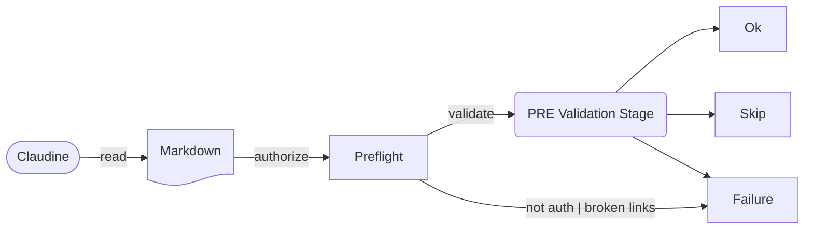
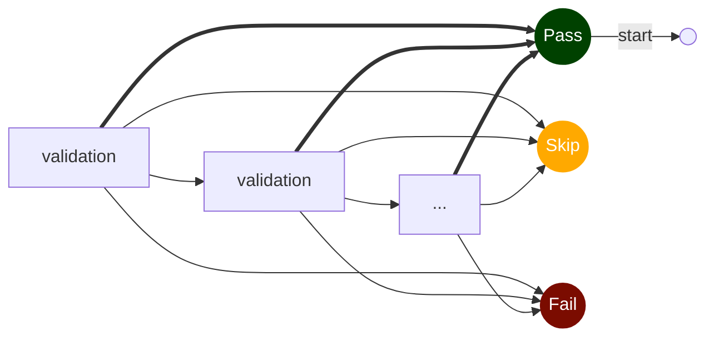

# Validations and Handlers

When Claudine runs a Markdown-backed prompt in non-interactive mode, it can do more than simply forward a prompt to a provider and hope for the best. It can act like a small, typed job harness. That is what validations and handlers are for.

They let a Markdown document describe:

- what must already be true before the agent starts
- what success should look like after the agent finishes
- how long the run is allowed to take
- what Claudine should do when something goes wrong

The important framing is that this is not meant to turn Claudine into a general-purpose workflow engine. The feature exists to make composed prompts safer, more repeatable, and easier to recover when the failure is predictable enough to describe in frontmatter.

## Why Claudine Has This Feature

The composition pipeline is powerful precisely because it lets a Markdown file become an executable piece of workflow. Once you have that power, the next problem is reliability.

A prompt that says "update this file" is only half of the story. In practice you often also care about things like:

- whether the source file you want to edit actually exists
- whether the agent was allowed to write to it
- whether the document body really changed
- whether the final response included the summary text you expected
- whether the repo was already dirty before the run started
- whether the agent timed out and should resume instead of starting over

Without validations, those concerns end up either undocumented or duplicated in ad-hoc shell wrappers. Claudine keeps them close to the prompt itself so the document describes both the work and the conditions around the work.

## Where The Harness Is Active Today

The harness is intentionally scoped to the two canonical composition commands:

1. `claudine compose <file>` — converts the referenced file into an Agent prompt
2. `claudine inline-compose <file>` — converts the referenced file's `prompt` property into an Agent prompt designed to update the body of the same file
3. `claudine sequence <file>` - a **sequence** builds on top of the `compose` functionality by allowing a define set of "state" be executed serially to solve a multi-prompt based solution

All three of these primitives provide a "document driven execution" concept which allows the Markdown document to provide all the instructions necessary to execute one or more agentic processes while also allowing each document to define "what done is" in such a way that the document can not only self-validate but also try to recover from any failures.

## Think In Three Phases

Claudine evaluates a harnessed run in three phases.

### Before The Provider Starts

The first stage of the process is intended to determine if the process _is ready_ to start.



When Claudine is provided a document to _compose_, it's first step is to run through a two-step process to ensure we're ready to start the agentic harness:

1. **Preflight Authorization**

    We will evaluate not only the _referenced file_ but the entire graph of files which will be involved in the "composition". This process will focus on the following things:

   - ensure all image references, file hyperlinks, and [transclusion]() references are valid
   - if any of these are broken then **Claudine** will immediately exit with a well formed message about what needs to be fixed
   - then we evaluate all of the files across the document graph for [shell expansion](pre-flight-checks.md) directives
   - every **shell expansion** requires that the user **explicitly** include a rule in their shell expansion _whitelist_ to allow it's execution
       - this _whitelist_ is persisted so that over time most scripts will become pre-approved
   - if all shell commands in the graph are already included in the _whitelist_ then execution immediately proceeds
   - but if there are any shell commands which have not been approved we will move into an interactive process of confirming with the caller if they would like to approve the outstanding shell commands.
   - if there is a command that the user is not comfortable approving, the process will exit in failure

1. **Pre Validation**

    Once the preflight checks have successfully completed, we are ready to start the **pre-validation** process:

    - a document uses the `pre_checks` Frontmatter property to define the rules they want to put in place to validate that the agentic process be allowed to start
    - if there is no `pre_checks` property then the document automatically passes
    - configuring the [Pre Validation](./pre-validation.md) process involves adding one or more rules in place that can resolve in one of three states:
        - `pass` - _the validation passes_
        - `skip` - _the validation expresses that it's utility is not needed and can be safely skipped_
        - `fail` - _the process is not ready to start_



If all validations pass then we're ready to start.

### While The Provider Is Running

This is the actual provider execution. Claudine still does the normal wrapper work here:

- prompt preparation
- provider-specific argument shaping
- structured or captured output handling
- session ID capture when available
- timeout enforcement

If the provider exits non-zero or times out, that is classified as a failure event and passed into handler resolution.

### After The Provider Finishes

`post_checks` answer the second question: did the run accomplish what the document claimed it should accomplish?

This is where file-diff checks, frontmatter comparisons, and response-based checks live. Post-checks are especially useful when an agent reports success but the actual side effects are incomplete or wrong.

This is the core idea behind the harness: success is not just "the provider exited 0." Success is "the provider exited, and the state now matches the contract."

## Writing Validations

Claudine accepts validations in two authoring styles:

1. list form, which is the best choice when order matters or when you want repeated checks of the same type
2. map form, which is a compact shorthand for simple cases

For example, both of these are valid:

```yaml
pre_checks:
  - file_exists: "@docs/brief.md"
  - has_write_permission: "@docs/brief.md"
```

```yaml
pre_checks:
  file_exists: "@docs/brief.md"
  has_write_permission: "@docs/brief.md"
```

The list form is the more expressive style, so it is the better default when writing new documents.

## The Kinds Of Things You Can Validate

The validations fall into a few natural groups.

### Filesystem And Data Shape Checks

These checks are about whether the expected input or output files exist and are structurally sane:

- `file_exists`
- `dir_exists`
- `json_file_exists`
- `yaml_file_exists`
- `toml_file_exists`
- `has_write_permission`

The typed file checks matter because "the file exists" is often too weak. A JSON file that exists but is malformed is not a usable prerequisite. Claudine treats those as distinct validation concerns so the error is closer to the real problem.

### Repository State Checks

These checks look at dirty source state:

- `no_dirty_source_code`
- `has_dirty_source_code`

These are useful when a prompt is intended to work from a clean baseline, or when a prompt is only meaningful if the user has already made local edits that the agent is supposed to inspect.

### Shell-Based Checks

`shell_command` exists for the cases where the thing you need to verify is easier to express as a command than as a built-in validation.

That flexibility is useful, but Claudine does not treat it as a free-form escape hatch. Runtime shell commands go through the same centralized approval and policy system that Darkmatter uses for shell expansion. In practice, that means shell validations are still part of the typed harness model, not an uncontrolled bypass around it.

### Post-Run File And Frontmatter Checks

These checks only make sense after the agent has run:

- `file_changed`
- `file_unchanged`
- `frontmatter_prop_changed`
- `frontmatter_prop_unchanged`
- `frontmatter_prop_equals`

These are especially helpful for document-maintenance workflows. If a prompt is supposed to update a body but keep frontmatter stable, Claudine can check both conditions explicitly instead of assuming the provider followed instructions.

### Response Checks

These checks look at the provider's final assistant response text:

- `response_length_at_least`
- `response_length_at_most`
- `response_includes`
- `response_missing`

The important implementation detail is that Claudine evaluates these against the final non-thinking assistant response, and length checks are character-based rather than byte-based. That keeps the checks aligned with what the user actually reads in the terminal.

This matters most on legacy non-structured runs, where Claudine now captures the real final response text before applying response validations.

## Path Resolution Is Document-Centric

One subtle but important design choice is how paths inside validations are resolved.

For harness rules:

- absolute paths stay absolute
- `@foo/bar.md` resolves from the repo root
- any other relative path resolves from the source document's directory

This is different from some CLI-facing file-reference behavior, and it is intentional. Inside a Markdown document, a relative path should usually mean "relative to this document," not "relative to wherever the shell happened to be when the user launched Claudine."

That makes authored documents more portable and easier to move around inside a repo.

## Timeouts Are Part Of The Failure Model

Timeouts are declared in frontmatter with the `timeout` property:

```yaml
timeout: 5m
```

Claudine accepts seconds, minutes, and hours in a few natural spellings. The more important point is not the syntax, though. The important point is that a timeout is treated as a first-class failure event.

That means a timeout can be:

- reported clearly
- matched by `handle_timeout`
- recovered with `retry`, `resume`, or `redirect`

This is why the timeout logic lives inside the harness model rather than being a separate wrapper concern.

## Handlers Are Recovery, Not Decoration

Handlers are what make the harness more than a validation layer. They define how Claudine should respond when a failure happens.

Claudine supports four declarative recovery actions:

- `retry`
- `resume`
- `redirect`
- `deviate`

It also supports a programmatic `handle` hook that can decide among the supported typed actions at runtime.

The design principle here is that the result of a handler should still be explicit. Claudine does not just ask "did something handle this?" It asks "what is the next attempt plan?"

That plan can change the source document, prompt text, frontmatter overlay, timeout context, and launch mode for the next attempt.

## How Handler Resolution Works

When a failure occurs, Claudine resolves handlers in a predictable order:

1. subject-specific YAML handler for the failing event
2. generic YAML handler for the failing event
3. programmatic `handle`
4. unhandled failure

That precedence is intentional.

Statically-declared YAML handlers are easier to audit, easier to parse up front, and easier to reason about when reading a document. Programmatic handlers still exist as an escape hatch, but they are a fallback, not the primary model.

## Choosing Between The Handler Types

The handler types are similar on the surface, but they are meant for different recovery strategies.

### `retry`

Use `retry` when the next attempt should start as a fresh provider session.

This is the right choice when:

- the first attempt produced the wrong output but the session context is not worth preserving
- you want to append extra guidance to the prompt
- you want to tweak frontmatter-derived state in memory for the next attempt

`retry` can:

- append additional prompt text
- apply a `set` overlay to frontmatter
- emit terminal messaging with `msg`
- optionally speak a message with `say`
- cap retries with `retries`

If you do not supply a prompt addition, Claudine falls back to a generic explanation that the previous attempt failed and needs correction. That default exists because "retry" without any additional pressure should still be useful.

### `resume`

Use `resume` when the provider's existing session context is valuable and the provider actually supports native resume.

This is the right choice when:

- the run timed out
- the model got partway through a long task
- you want to continue from a captured `session_id` instead of starting over

Unlike `retry`, `resume` requires a prompt. That is deliberate. A resumed attempt without a new instruction is usually ambiguous: should the agent keep going, re-evaluate, fix a validation failure, or summarize? Claudine makes the author be explicit.

### `redirect`

Use `redirect` when recovery should switch to a different Markdown document.

This is the right choice when:

- a failure should hand off to a fallback prompt
- a pre-check determines the "real" prompt should come from a different file
- you want to preserve document-local workflow logic instead of stuffing every branch into one frontmatter block

`redirect` can optionally ask Claudine to resume the existing provider session before using the new document, but it can also start fresh. The design intent is that document structure should be allowed to shape recovery.

### `deviate`

Use `deviate` when Claudine needs to perform an approved external command before trying again.

This is useful for things like:

- generating a prerequisite artifact
- running a formatter or generator
- performing a narrow repair step that is better expressed as a command than as another agent instruction

The important safety property is that `deviate` commands are declared in frontmatter and screened through the shell approval path before execution.

## `set` Overlays Are In-Memory State For The Next Attempt

The `set` property on handlers is one of the most important pieces of the design because it lets recovery adjust frontmatter-derived state without rewriting the source document before the next attempt.

That means a handler can say, in effect:

- "run the same document again, but with this frontmatter key changed"
- "remove this key by setting it to null"
- "change a prompt-file-derived environment value for the retry"

This is why Claudine treats handler application as building the next attempt plan instead of merely incrementing an attempt counter. Recovery is often about changing the effective document state, not just running the same thing twice.

## Programmatic `handle`

Some workflows want a script to inspect the failure context and decide what to do. Claudine supports that through `handle`.

The programmatic handler can return:

- no action
- a default retry
- a typed recovery action such as retry, resume, or redirect

The one important restriction is that programmatic handlers cannot return `deviate`.

That limitation is intentional. Declarative `deviate` commands are statically known and can be screened against the shell approval policy before execution begins. A runtime script returning an arbitrary command would weaken that guarantee, so Claudine keeps that action declarative-only.

## Inline Documents Are Supported Too

`claudine inline-compose` deserves special mention because it is the most stateful mode.

In inline mode, Claudine is not only validating the provider's response. It is also reconciling the target document itself:

- it checks whether the body changed
- it preserves or restores frontmatter layout when needed
- it updates `last_updated`
- it can now recover and retry inside the harness loop instead of treating inline failures as terminal

That implementation detail matters because inline documents are often long-lived artifacts. A harnessed inline run needs to reason about the document's pre-run and post-run state, not just the provider's exit code.

## A Good Mental Model

If you are authoring a harnessed Markdown document, the most useful mental model is this:

"I am describing a job contract, not just a prompt."

That contract says:

- these are my prerequisites
- this is the work
- this is what success looks like
- this is how to recover when the likely failures happen

Once you think in those terms, the feature becomes much easier to use well.

## A Small Example

```yaml
---
pre_checks:
  - file_exists: "@docs/brief.md"
  - has_write_permission: "@docs/brief.md"

post_checks:
  - file_changed: "@docs/brief.md"
  - response_includes: "Updated brief"

timeout: 10m

handle_timeout:
  resume:
    prompt: "Continue from where you stopped and finish the brief."
    retries: 2

handle_response_includes:
  retry:
    prompt: "Your final response must explicitly say 'Updated brief'."
    set:
      strict_summary: true
---
```

This is a good example because it captures the whole shape of the harness:

- start only if the target exists and is writable
- require both a file change and a specific final response
- resume if the model times out
- retry with stronger instructions if the output contract is not satisfied

## Current Boundaries And Intentional Limits

The current functionality is broad, but it is still intentionally scoped.

- The harness only runs for Markdown-backed workflows.
- Some validations are post-only and cannot appear in `pre_checks`.
- Resume only works when the provider actually exposes native resume support.
- Shell-backed runtime actions remain gated by approval policy.
- Programmatic handlers are powerful, but they are not allowed to invent unscreened runtime commands.

Those limits are not accidental. They are what keep the feature predictable enough to be useful in real documents.

## In Practice

The best Claudine validation and handler configurations tend to be small and specific.

Use validations to describe concrete expectations. Use handlers to capture the one or two recovery paths that are genuinely worth automating. If a document needs a page of branching logic, it is usually a sign that the workflow should be split into smaller documents and connected with `redirect`.

That is the larger philosophy behind the implementation: keep the prompt authoring model document-first, keep failure handling typed, and make recovery explicit enough that another person can read the frontmatter and understand how the run is supposed to behave.
