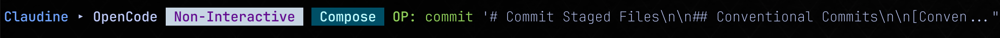

# Claudine Execution line

The Claudine "execution line" is the first line of reporting which Claudine sends to STDERR when running a Claudine wrapper command. It looks something like:

Where the structure of the command line is:

- `Claudine ▸ <agent> [badges] [prompt]`

## Badges

### Non-Interactive and Interactive

Whenever we run a wrapped command (e.g., `claudine claude`, `claudine opencode`, etc.) and add some kind of prompt -- either directly or via compose/inline-compose -- the default session type is **non-interactive**.

- In these situations we need to stop displaying the `Non-Interactive` badge as this is the norm (e.g., the status quo)
- Instead, if the user is providing a prompt of any sort but includes the `--interactive` / `-i` switch so that they are opting-in to a interactive session then we should show a `Interactive` badge
    - this badge, I believe, doesn't yet exist
    - make it's color scheme be an inverse of what we have for the Non-Interactive badge (which has a whitish background and purplish text color)

In situations where NO prompt is provided, the default behavior is still to start the agent in an interactive mode. In these situations:

- We do not _need_ to show the `Interactive` badge because in essence this is the _status quo_ for non-prompted session starts.
- However, I think for now at least we **should** display the `Interactive` badge in these cases

### Operation Badge

- We allow for sessions to be started with an _operation_ specified using the `--operation <op>`/`--op <op>` CLI switch
- When we do that we add an operations badge to the command line
- Unlike others, it only has a text color (no background color)
- It's format is `OP: {op}`

We should make a mild change here:

- added a complimentary background color so it looks more like a badge
- use the following formatting for the text `<b>Op(<dim><i>{op}</i></dim>)</b>`

## Prompt

The prompt a user provides comes in two general forms:

1. a string prompt that is taken "as is"
    - `claudine claude 'hi, how are you?'`
2. a file reference which points to a Markdown document, is composed (inline or direct) and the _composed_ string content is what is used as the actual prompt.
    - `claudine claude compose '@greet.md'`

In this latter case (e.g., a file reference is used), the actual prompt is typically quite long. This _might_ be the case if just typed in a prompt but is less likely.

- no change needed for sessions starts where the user provides a static string
    - e.g., display and truncate where needed on the Claudine execution line
- when a file-reference is provided for a _compose-based_ command we will make a change:
    - do not display the resolved prompt on the Claudine execution line anymore
    - just add the following to the right of the badges: ` <dim><i>prompt sourced from <blue>{file}</blue></i></dim>` 
    - in addition, after we've reported all of the ENV variables, and added a blank line
    - we will render the following block to STDERR:
        - line 1: `<b>Prompt:</b>`
        - then we render based on whether the `--verbose` / `-v` flag is set:
            - verbose mode: we display the entire prompt as a block quote (use `biscuit-terminal`'s `BlockQuote` component)
            - non-verbose: we display the first 10 lines as a block quote, add a blank line and then `<dim><i>remaining prompt truncated for brevity, use <blue>--verbose</blue> to show entire prompt</i></dim>` (again using `BlockQuote`)
