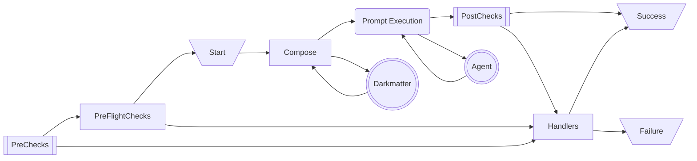

# The `blocked`, `start`, `success`, and `failure` properties

This feature is about building out the special features that `start`, `success`, `blocked` and `failure` have when using `compose` or `inline-compose`.

All three properties represent a way to communicate a state change to TTS, messaging apps, STDERR, or as a sound effect.

## The Pipeline



- The `start` property is our opportunity to communicate about the Agentic process _starting_ but this only happens after:
    - `PreChecks` (if defined) all pass
    - `Preflight` checks all possible shell executions and makes sure that they are all covered by the whitelist policy; assuming that all commands are authorized then we're ready to "start"
- The `blocked` property is our opportunity to communicate that the Agentic process was _blocked_ from being run. This can happen because:
    - The `PreChecks` fail and no `Handlers` correct this
    - 

## Messaging

### Handling Multiple Audio Outputs

The schema for all of the frontmatter properties is the same. Here's an example:

```yaml
start:
    speak: "You did it, we're starting something great"
    effect: crowd-applause
    message: "You did it, we're starting something great"
    stderr: "Starting"
```

With this configuration, if we reach the `start` part of the pipeline we will:

- Together/Concurrently:
    - play the "crowd-applause" sound effect,
    - send the message `Starting` using the "info" state of the `Status` struct to STDERR
    - send a message to the app configured (no-op if not configured)
- Then
    - speak "You did it, we're starting something great" using TTS

Why aren't we doing all four at the same time? Because both sound effects and TTS use audio as the output modality and doing both at the same time would be poor experience.

Usually it's better to have the sound effect first for both a technical and functional reason:

- technically 
    - the TTS must "render" the audio and that could be nearly instantaneous but it also might take a second or two
    - by putting is later we give it time to be ready when the sound effect stops playing
- functionally
    - it's often best to use the sound effect to get the user's attention
    - and then speak once that attention has been gained

However to provide flexibility we offer another command `speak_first`:

```yaml
start:
    speak_first: "You did it, we're starting something great"
    effect: crowd-applause
    message: "You did it, we're starting something great"
    stderr: "Starting"
```

This reverses the order so that our execution looks like:

- Together/Concurrently:
    - speak "You did it, we're starting something great" using TTS
    - send the message `Starting` using the "info" state of the `Status` struct to STDERR
    - send a message to the app configured (no-op if not configured)
- Then
    - play the "crowd-applause" sound effect

> **Note:** the `speak` command can not be used with `speak_first`; this will cause an error.

### Singular Audio Output

Of course if you only have one audio output then all the gymnastics above are unnecessary and we just communicate concurrently on all the configured commands.
