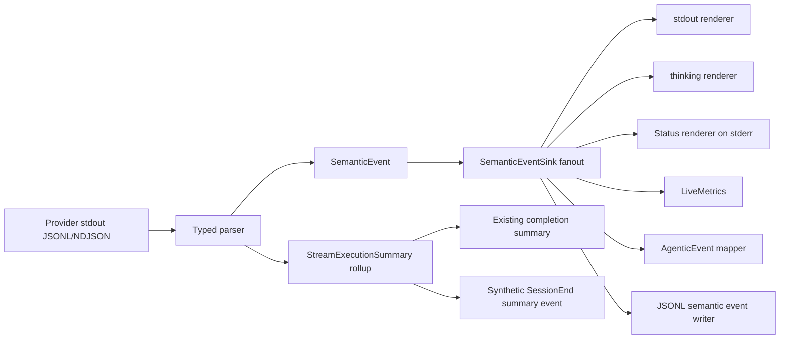

# More Meta Response Tech Design

This document turns [spec.md](./spec.md) into an implementation-ready design for Claudine's structured stream pipeline, live STDERR status rendering, and stream-event reporting.

Primary inputs:

- `claudine/features/_unscheduled/more-meta-response/spec.md`
- `claudine/lib/src/stream/parser.rs`
- `claudine/lib/src/stream/{claude,codex,gemini,kimi,opencode,qwen}.rs`
- `claudine/lib/src/stream/protocol/*.rs`
- `claudine/lib/src/stream/{progress,reporting,stderr,summary}.rs`
- `claudine/cli/src/commands/wrap/{mod,exec,composition}.rs`
- `biscuit-terminal/lib/src/components/status.rs`
- `claudine/docs/research/non-interactive-sessions/*.md`

## Summary

The current stream architecture splits output into two incompatible lanes:

- `StreamChunk` carries assistant text and reasoning
- `StreamEventSink` side-channel callbacks carry tool, warning, and subagent metadata

That split is the root problem. Providers can emit rich metadata, but Claudine only turns a narrow subset of it into live user feedback. The result is sparse heartbeats, incomplete tool visibility, dropped provider-specific events, and inconsistent reporting fidelity.

This design replaces that split with a single semantic event pipeline.

The concrete implementation choices are:

1. Introduce a new `SemanticEvent` enum that represents both output deltas and metadata.
2. Remove `StreamChunk` from the parser contract and route every successfully parsed line through `SemanticEventSink`.
3. Preserve unknown structured events verbatim as `ProviderExtension`.
4. Move STDERR rendering, live-metrics updates, hook dispatch, and JSONL stream logging behind one event fanout path.
5. Keep the existing end-of-run `StreamExecutionSummary`, but treat it as a rollup derived from semantic events rather than as the only reporting surface.

## Scope

This design applies to the providers that already have structured stream parsers in `claudine/lib/src/stream/`:

- Claude
- Codex
- Gemini
- Kimi Code
- OpenCode
- Qwen Code

Goose and Roo Code are intentionally not included in the initial implementation plan because Claudine does not currently have a structured stream parser for them in this module. Their research should still inform the enum design, but parser work for those providers belongs in a follow-up feature.

## Goals

1. Surface substantially richer live feedback on STDERR without inventing provider behavior.
2. Preserve every successfully parsed JSON line as either a typed semantic event or `ProviderExtension`.
3. Make tool calls, tool results, subagents, file changes, plan updates, reasoning, and provider diagnostics first-class stream concepts.
4. Replace the legacy callback matrix in `StreamEventSink` with a single event interface.
5. Persist semantic events to JSONL with full-fidelity payloads and no SQLite schema migration.
6. Keep the final assistant output and session summary behavior intact for composition and wrapper flows.

## Non-Goals

1. No new verbosity flags.
2. No synthetic start or stop events when the provider did not emit them.
3. No SQLite table migration in this feature.
4. No attempt to normalize providers that still lack a structured stream parser.
5. No heuristic severity detection from payload fields such as `level` or `status`.

## Current Baseline

Today the path looks like this:

1. `exec.rs` reads provider stdout line-by-line.
2. Each parser returns `Option<StreamChunk>` and separately invokes methods on `StreamEventSink`.
3. `LiveStreamSink` in `wrap/mod.rs` maps some callbacks to:
   - `AgenticEvent` dispatch
   - `LiveMetrics`
   - one-line `StatusState::ToolUse` emissions
   - warning output
4. `progress.rs` only understands tool lifecycle, token usage, and generic "activity".
5. Unknown structured events are often silently dropped by typed parser fallthrough.

The main consequences are:

- metadata is lost if it does not map to one of the old callback hooks
- heartbeat output degrades to elapsed-time ladders during long silent stretches
- provider-specific diagnostics are only partially preserved
- stream reporting logs only the synthetic end summary, not the live semantic stream

## Proposed Architecture



The parser remains provider-specific, but every consumer after parsing becomes provider-agnostic.

## Semantic Event Model

### New Module

Add `claudine/lib/src/stream/semantic.rs` containing the serialized event model and shared helpers.

### Concrete Enum Shape

The technical design chooses to absorb output text into the semantic model rather than preserving `StreamChunk` as a parallel API.

Recommended initial enum:

```rust
pub enum SemanticEvent {
    SessionStart {
        session_id: Option<String>,
        model: Option<String>,
        extra: serde_json::Value,
    },
    TurnStart {
        extra: serde_json::Value,
    },
    TurnComplete {
        provider_status: Option<String>,
        token_usage: Option<NormalizedTokenUsage>,
        cost_usd: Option<f64>,
        duration_ms: Option<u64>,
        extra: serde_json::Value,
    },
    OutputText {
        text: String,
        extra: serde_json::Value,
    },
    Reasoning {
        text: String,
        extra: serde_json::Value,
    },
    ToolCall {
        name: Option<String>,
        id: Option<String>,
        input: Option<serde_json::Value>,
        extra: serde_json::Value,
    },
    ToolResult {
        name: Option<String>,
        id: Option<String>,
        status: Option<String>,
        exit_code: Option<i32>,
        output: Option<serde_json::Value>,
        extra: serde_json::Value,
    },
    PermissionRequest {
        kind: Option<String>,
        tool_name: Option<String>,
        extra: serde_json::Value,
    },
    SubagentStart {
        name: Option<String>,
        id: Option<String>,
        extra: serde_json::Value,
    },
    SubagentStop {
        name: Option<String>,
        id: Option<String>,
        status: Option<String>,
        extra: serde_json::Value,
    },
    FileChange {
        path: Option<String>,
        change_kind: Option<String>,
        extra: serde_json::Value,
    },
    PlanUpdate {
        message: Option<String>,
        extra: serde_json::Value,
    },
    Info {
        message: String,
        extra: serde_json::Value,
    },
    Warning {
        message: String,
        extra: serde_json::Value,
    },
    Error {
        message: String,
        terminal: bool,
        extra: serde_json::Value,
    },
    ProviderExtension {
        provider: Provider,
        kind: String,
        payload: serde_json::Value,
    },
}
```

### Common Payload Rules

All typed variants store provider-specific spillover under `extra`. `extra` should always be a JSON object and should always include:

- `provider`
- `raw_kind`
- `line_num`

Recommended optional fields when known:

- `session_id`
- `tool_id`
- `tool_name`
- `status`
- `provider_status`

`ProviderExtension` is the only variant that carries the raw payload as the contract, not a narrowed `extra` object.

### Why `OutputText` Is Part of the Enum

This is the key design choice that resolves the current split model.

Benefits:

- one event surface for all consumers
- silence suppression can key off every event, not only tool callbacks
- parser behavior is easier to test end-to-end because one input line yields one semantic event
- direct wrap and composition flows can share the same fanout machinery

Trade-off:

- JSONL semantic logs will be larger because output deltas are now first-class events

That trade-off is acceptable here because fidelity is the explicit goal of this feature. If volume later becomes a problem, batching adjacent `OutputText` events in the writer is a separate optimization and should not leak back into the parser contract.

## Parser Contract

### Replace `StreamEventSink`

`claudine/lib/src/stream/parser.rs` should move to:

```rust
pub trait SemanticEventSink: Send {
    fn on_semantic_event(&mut self, event: SemanticEvent);
}
```

The old hook matrix is deleted after migration.

### Remove `StreamChunk` From the Parser API

Change `StreamParser` to:

```rust
pub trait StreamParser: Send {
    fn feed_line(&mut self, line: &str) -> Result<(), StreamParseError>;
    fn finish(self: Box<Self>, exit_code: i32) -> StreamExecutionSummary;
}
```

### Malformed JSON Policy

`MalformedLine` should stop being a public parse outcome. Instead:

1. malformed JSON is dropped
2. the parser emits `SemanticEvent::Warning`
3. `feed_line(...)` returns `Ok(())`

`StreamParseError` remains only for fatal parser failure, meaning "the stream is no longer trustworthy and exec should fall back to raw forwarding".

This matches the spec's no-drop invariant while keeping the exec loop simpler.

### Typed Parse Fallback

Every parser should use the same two-stage logic:

1. parse the line into `serde_json::Value`
2. extract the provider's discriminator string
3. attempt typed deserialization
4. on success, emit one or more typed `SemanticEvent`s
5. on unknown or shape-drifted but parseable events, emit `ProviderExtension`

There should be no silent `_ => Ok(None)` path left for typed-but-unhandled kinds.

## Provider Parser Design

### Foundation Pattern

Each provider parser keeps ownership of:

- session rollup state for `StreamExecutionSummary`
- provider-specific correlation caches
- provider-specific allowlists for warning and error classification

Each parser becomes responsible for translating its typed protocol into semantic events, not directly into dispatch callbacks.

### Codex

Codex is the most urgent audit target because the spec already names concrete gaps.

The initial Codex parser expansion should include:

- `item.updated`
- `file_change`
- `plan_update` or equivalent todo/plan items
- `reasoning` routed to `SemanticEvent::Reasoning`
- `command_execution` completion fields such as `status` and `exit_code`
- `mcp_tool_call`, `collab_tool_call`, `web_search`, and `todo_list` preservation via typed events or `ProviderExtension`

`claudine/lib/src/stream/protocol/codex.rs` must add missing union members before parser logic changes. Unknown item variants should continue to deserialize safely.

### Claude

Claude already has the richest structured stream. The design expectation is:

- assistant text deltas map to `OutputText`
- thinking deltas map to `Reasoning`
- `tool_use` and `tool_result` map directly
- `task_started`, `task_progress`, and `task_notification` become subagent or info events
- `rate_limit_event`, `system/api_retry`, and related diagnostics map through the per-provider allowlist
- any still-unmodeled event types become `ProviderExtension`

### Gemini

Gemini's stream has a smaller event set, but it should still emit:

- `SessionStart`
- `OutputText`
- `ToolCall`
- `ToolResult`
- `Warning` or `Error` from explicit raw type allowlists
- `TurnComplete`

Gemini-specific fields in `result.stats.models` remain in `extra`.

### OpenCode

OpenCode's NDJSON stream is filtered and completion-heavy. The design must preserve that reality:

- `tool_use` may only have completion visibility today, so an orphan `←` tool line is valid
- `reasoning` and `text` become typed output events
- `step_start` and `step_finish` should at minimum surface as `Info` or `ProviderExtension` if they do not cleanly map elsewhere
- parent-session permission gaps remain out of scope for this parser because the stdout stream does not expose them

### Kimi Code and Qwen Code

These parsers should be migrated onto the same semantic foundation even if their initial event sets remain smaller. The important part is that they stop silently dropping parseable event lines and begin emitting `ProviderExtension` for unknown kinds.

## Live Sink and CLI Integration

### New Sink Type

Replace `LiveStreamSink` in `claudine/cli/src/commands/wrap/mod.rs` with `LiveSemanticSink`.

This sink should own:

- `StreamOutput`
- a `StreamTextRenderer`
- a `StreamThinkingRenderer`
- shared `LiveMetrics`
- the existing dispatch closure
- semantic event writer state
- summary detail state

`exec.rs` then becomes a simple line pump:

1. read a line
2. call `parser.feed_line(&line)`
3. let the sink handle all rendering and dispatch side effects

### Capture Mode

`run_child_stream_capture(...)` should use a lightweight sink that:

- emits warnings to captured STDERR when appropriate
- records semantic events for logging if enabled
- does not render live stdout status lines

It should still share the same parser and semantic event model.

## STDERR Rendering

### Status State Additions

Add `StatusState::Subagent` to `biscuit-terminal/lib/src/components/status.rs` with icon mappings for:

- `StatusTheme::Circular`
- `StatusTheme::Rounded`
- `StatusTheme::Timeline`

This is an upstream coordination point but small and mechanical.

### Rendering Rules

The renderer in `claudine/lib/src/stream/progress.rs` or a new helper module should map semantic events as follows:

| Semantic event | Status state | Prefix |
| --- | --- | --- |
| `ToolCall` | `ToolUse` | `→` |
| `ToolResult` | `ToolUse` | `←` |
| `SubagentStart` | `Subagent` | `→` |
| `SubagentStop` | `Subagent` | `←` |
| `FileChange` | `Info` | none |
| `PlanUpdate` | `Info` | none |
| `Info` | `Info` | none |
| `Warning` | `Warning` | none |
| `Error` | `Failure` | none |
| `ProviderExtension` | `Info` | none |

`Reasoning` continues to use the existing dimmed thinking renderer rather than `Status`.

`OutputText` continues to render to stdout only.

### Provider Extension Fallback Formatter

The default `ProviderExtension` formatter should emit:

```text
provider/kind · summary
```

Summary extraction order:

1. `message`
2. `status`
3. `name`
4. `path`
5. compact JSON fallback

The formatter should be intentionally conservative and one-line only.

## Heartbeat Design

The heartbeat remains as a silence fallback, not the primary progress signal.

### Live Metrics Refactor

`claudine/lib/src/stream/progress.rs` should stop accepting `EventMeta` and instead expose:

- `observe_event(&mut self, event: &SemanticEvent, now: Instant)`
- semantic-event-based description helpers

State should continue to track:

- in-flight tools
- completed tool count
- latest token usage
- latest cost
- last observed event
- last emitted heartbeat

Additional event families that should count as "activity":

- `OutputText`
- `Reasoning`
- `Info`
- `Warning`
- `Error`
- `ProviderExtension`

### Timing Policy

Keep the current effective timings as implementation defaults:

- heartbeat interval: `30s`
- silence window: `30s`
- force window: `120s`

Move them into named constants or a private `HeartbeatPolicy` struct inside `exec.rs` so the behavior is explicit and tested.

## Hook Dispatch Compatibility

The stream feature is not replacing Claudine's higher-level `AgenticEvent` system. It is replacing the parser-to-consumer callback surface.

Add a semantic-to-agentic mapping layer in `wrap/mod.rs`:

| Semantic event | Agentic event |
| --- | --- |
| `SessionStart` | `SessionStart` |
| `TurnStart` | `BeforePrompt` |
| `TurnComplete` | `TurnComplete` |
| `ToolCall` | `BeforeTool` |
| `ToolResult` | `AfterTool` |
| `PermissionRequest` | `PermissionRequest` |
| `SubagentStart` | `SubagentStart` |
| `SubagentStop` | `SubagentStop` |
| terminal `Error` | `TurnError` |
| non-terminal `Info` / `Warning` / `ProviderExtension` | `Notification` when useful |

Two important constraints:

1. this mapper is lossy by design because `AgenticEvent` is higher-level and older than the new stream model
2. fidelity lives in semantic event logging, not in the hook dispatch abstraction

## Reporting Design

### Semantic Event Writer

Extend `claudine/lib/src/stream/reporting.rs` with a second writer path for live semantic events.

Recommended API:

```rust
pub fn semantic_event_to_event_meta(
    event: &SemanticEvent,
    env: &EnvironmentContext,
    context_extra: Option<&HashMap<String, Value>>,
) -> EventMeta
```

Mapping rules:

- preserve any one-to-one fields in dedicated `EventMeta` slots when they fit
- always write the full serialized semantic event into `extra["semantic_event"]`
- mark the row with:
  - `extra.synthetic = true`
  - `extra.synthetic_kind = "stream_semantic_event"`
  - `extra.semantic_kind = "..."`

`ProviderExtension.payload` must survive untouched inside `extra["semantic_event"]`.

### Why This Avoids a Schema Change

SQLite ingest already stores `extra_json` as full JSON. The new writer path therefore works without migration:

- known fields remain queryable where they already were
- new semantic kinds stay preserved in `extra_json`
- downstream consumers can opt into querying `extra_json.semantic_event`

The existing synthetic `SessionEnd` summary event remains and is not replaced.

## File-Level Implementation Plan

### Library

1. Add `claudine/lib/src/stream/semantic.rs`.
2. Rewrite `claudine/lib/src/stream/parser.rs` around `SemanticEventSink`.
3. Update `claudine/lib/src/stream/mod.rs` parser construction signatures.
4. Migrate provider parsers:
   - `claude.rs`
   - `codex.rs`
   - `gemini.rs`
   - `kimi.rs`
   - `opencode.rs`
   - `qwen.rs`
5. Expand protocol modules where typed coverage is missing, especially `protocol/codex.rs`.
6. Refactor `progress.rs` to observe `SemanticEvent`.
7. Extend `reporting.rs` with semantic-event serialization.

### CLI

1. Replace `LiveStreamSink` in `claudine/cli/src/commands/wrap/mod.rs` with `LiveSemanticSink`.
2. Simplify `claudine/cli/src/commands/wrap/exec.rs` so it no longer switches on `StreamChunk`.
3. Keep `StreamThinkingRenderer`, but feed it from `SemanticEvent::Reasoning`.
4. Ensure composition paths in `wrap/composition.rs` and `wrap/sequence.rs` use the same sink and reporting path.

### Terminal UI

1. Add `StatusState::Subagent` to `biscuit-terminal/lib/src/components/status.rs`.
2. Update the component docs and tests there as part of the same change.

## Testing Strategy

### Unit Tests

Each protocol module should keep the existing `#[cfg(test)] mod tests` style and add cases for:

- new typed variants
- field aliases
- typed-to-extension fallback
- allowlist classification behavior

### Round-Trip Fidelity

For every provider fixture:

1. feed each line into the parser
2. collect serialized semantic events
3. deserialize them again
4. assert identity for the raw semantic JSON value

This is especially important for `ProviderExtension`.

### Golden STDERR Snapshots

Add per-provider golden fixtures that replay captured stream lines through:

1. parser
2. semantic sink
3. `Status` rendering

Assert the exact STDERR transcript.

Required fixture coverage per provider:

- tool call
- tool result
- reasoning or equivalent
- warning or error path
- at least one `ProviderExtension` where the provider supports a currently-untyped event

### Summary Regression Tests

Keep existing `StreamExecutionSummary` tests and add regression coverage proving that:

- live semantic event logging does not change completion summary fields
- assistant text remains correct in both direct and capture modes
- malformed JSON now becomes `Warning` rather than `StreamParseError::MalformedLine`

## Rollout Order

Recommended implementation order:

1. Add `SemanticEvent`, new sink trait, and reporting primitives.
2. Add `StatusState::Subagent`.
3. Migrate `progress.rs` and the CLI live sink.
4. Migrate Claude and Codex parsers first.
5. Migrate Gemini, OpenCode, Kimi, and Qwen.
6. Add snapshot fixtures and fidelity tests.

Claude and Codex should go first because:

- Claude already exercises most event families
- Codex is the feature's motivating failure case

## Risks

### Event Volume

Logging every semantic event, especially `OutputText`, will increase JSONL size. That is acceptable in this feature because fidelity is the explicit contract. If needed later, compression or writer-side batching can be added without changing parser behavior.

### Provider Drift

Typed protocol structs will continue to drift over time. The design mitigates this by making `ProviderExtension` the default fallback instead of silently dropping unknown kinds.

### Hook Semantics

The higher-level `AgenticEvent` model is less expressive than the semantic stream. The mapping layer must stay deliberately conservative and should not try to force every semantic concept into a legacy hook event.

### Unsupported Providers

The spec correctly pushes toward cross-provider thinking, but the implementation must stay honest about current parser coverage. Goose and Roo need separate stream-parser work before they can participate in this design end-to-end.

## Decisions Locked In

The technical design makes these implementation decisions concrete:

1. `StreamChunk` is removed from the parser contract and replaced by semantic events.
2. Malformed JSON becomes a warning event, not a returned parse error.
3. Live semantic events are logged to JSONL with full payload fidelity.
4. `StreamExecutionSummary` remains as the rollup and completion path.
5. The first implementation pass covers the six providers that already have structured stream parsers today.
