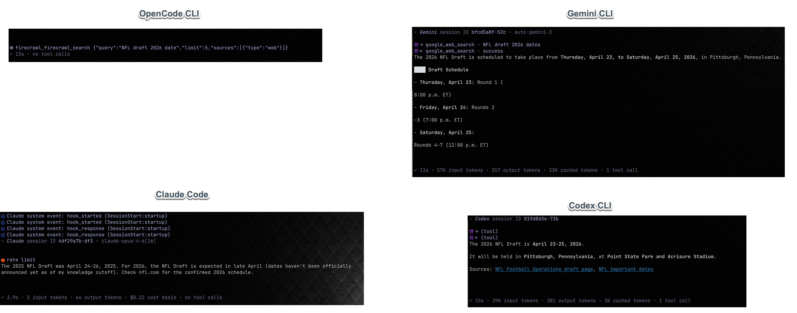

# Response Refinement

We have spent a lot of time improving the metadata we're able to get back when running non-interactive prompts but there are still a combination of obvious errors, inconsistent formatting, and just general improvement in formatting. This feature will attempt to address these.

## Four Agents, Same Prompt



I asked OpenCode, Gemini CLI, Claude Code, and Codex CLI the same question as a non-interactive session. The question was "when is the NFL draft this year?" This question was asked because the NFL draft date and information around is relatively recently announced and would NOT be in any of the model's training corpus so they would all need to make at least one tool call to get this information.

What we got was problematic for all of them but mainly in different ways. Overall the quality is VERY poor and I don't understand how we're still doing so badly considering how much effort has been made to get this right!

### OpenCode CLI

Opencode had the worst time, it:

- announced a tool call
- then reported the sessions metadata _without_ ever reporting any information to STDOUT
- even more embarrassing, the metadata claimed there were 0 tool calls (even the line above was a tool call)!
- also of note, we're still reporting JSON to the terminal:
    - instead of `⚙ firecrawl_firecrawl_search  {"query":"NFL draft 2026 date","limit":5,"sources":[{"type":"web"}]}`
    - the icon is NOT a tool call icon but this is a tool call
    - even though OpenCode only reports on _returned_ tool calls we had agreed we'd show both directions when we got the tool call's "end" event
    - we'd expect something more like:
        - `🔧 → Firecrawl Search · <dim><i>NFL draft 2026 date</i></dim>`
        - `🔧 ← Firecrawl Search · <dim><i>successful</i></dim>`
- In addition, we see there are three blank lines before we hit the tool call
    - this is pretty hard to debug until the other issues are worked out but it's likely there is a problem here too as all Agent's had issues with proper vertical spacing
    - the goal for vertical spacing is to allow 1 blank line between "sections/groups" in the content but never more

#### Output:

```sh


⚙ firecrawl_firecrawl_search {"query":"NFL draft 2026 date","limit":5,"sources":[{"type":"web"}]}
✓ 15s · no tool calls
```

### Claude Code
- duplicative SessionStart and SessionEnd events (two each)
    - these hook events should ideally trail the session ID marker (this is how it's always been and still is for all other Agents); it's possible that we forgive the sequencing if making it normalized presents enough problems.
- invalid `rate limit` warning:
    - It would seem that EVERY response returns a rate limit and then, ironically, proceeds to fulfill the request because, in fact, there IS NOT A RATE LIMIT.
    - What we need to do is check if there is an ANTHROPIC_API_KEY defined in the environment
        - If there is this indicates that the user is using API pricing
        - If there is not then the user is using a Subscription
        - In all of my tests i'm using a Subscription
- now in this case, it looks like it didn't bother to do a web search and left the info for 2026 a bit vague. That's a shame because it would have been good to see what that looked like
- on a positive note, the STDOUT content provided has been correctly treated and formatted as Markdown; this means that:
    - word wrap is applied and there is not premature and awkward truncation or wrapping far too early (as we see elsewhere)
    - it also means that things like hyperlinks, tables, headings, etc. would all be displayed nicely if they were part of the response (they were not)
- like OpenCode, Claude Code also has vertical spacing problems:
    - three blank lines between the final output and the 

#### Schema Notes

- HookResponse
    - type/subtype: "system/hook_response"
    - `outcome`: "success"
    - `exit_code`: 0
- init
    - `type`/`subtype`: "system/init"
    - `tools`: a list of tools including MCP tools
    - `mcp_servers`: all known MCP servers, their `status` (disabled|needs-auth|?)
    - `model`: (e.g, claude-sonnet-4-6)
    - `permissionMode` ("bypassPermissions"|?)
    - `slash_commands`: a list of available slash commands (built-in and user defined)
    - `claude_code_version`: semver (e.g., 2.1.108)
    - `agents`, `skills`
    - `plugins`
    - `memory_paths`: dictionary with "auto" key, value is a filepath
    - `fast_mode_state`: "off" | "on"
- `type`: "assistant"
    - this is where the "Credit balance is too low" message comes from
    - `error` is "billing_error"
- `type`/`subtype`: "result/success"
    - also reports "Credit balance is too low" in `result` prop and `is_error` is true

#### Output:

```sh
 Claude system event: hook_started (SessionStart:startup)
 Claude system event: hook_started (SessionStart:startup)
 Claude system event: hook_response (SessionStart:startup)
 Claude system event: hook_response (SessionStart:startup)
- Claude session ID 4df29a7b-df3 · claude-opus-4-6[1m]


󰀨 rate limit
The 2025 NFL Draft was April 24–26, 2025. For 2026, the NFL Draft is expected in late April (dates haven't been officially
announced yet as of my knowledge cutoff). Check nfl.com for the confirmed 2026 schedule.


✓ 3.9s · 3 input tokens · 64 output tokens · $0.22 cost basis · no tool calls
```

#### Two More Attempts

Because we didn't get a tool call the first time, I changed the query to "when exactly is the NFL draft this year (2026)?" I ran this the first time in normal mode, the second time in YOLO mode.

##### Normal Mode

```sh
 Claude system event: hook_started (SessionStart:startup)
 Claude system event: hook_started (SessionStart:startup)
 Claude system event: hook_response (SessionStart:startup)
 Claude system event: hook_response (SessionStart:startup)
- Claude session ID e7bbd911-dff · claude-opus-4-6[1m]

󰀨 rate limit
 ← (tool) · success

 ← (tool) · error
Let me look that up for you. I wasn't able to run a web search (permission not granted). Based on my knowledge:

The 2026 NFL Draft is scheduled for Pittsburgh, Pennsylvania, expected to take place over three days in late April 2026 (likely
around April 23–25). However, I can't confirm the exact dates without a live search — the NFL sometimes shifts dates slightly.

For confirmed dates, check nfl.com/draft.


✓ 20s · 7 input tokens · 613 output tokens · 70K cached tokens · $0.28 cost basis · no tool calls
```

##### YOLO Mode

```sh
 Claude system event: hook_started (SessionStart:startup)
 Claude system event: hook_started (SessionStart:startup)
 Claude system event: hook_response (SessionStart:startup)
 Claude system event: hook_response (SessionStart:startup)
- Claude session ID b613526d-0f6 · claude-opus-4-6[1m]

󰀨 rate limit
The 2026 NFL Draft is scheduled for April 23–25, 2026 in Pittsburgh, Pennsylvania (at Acrisure Stadium and surrounding areas).
That's about 9 days from now.


✓ 5.2s · 3 input tokens · 154 output tokens · 12K cached tokens · $0.15 cost basis · no tool calls
```

These two additional runs are interesting and show that:

- In normal mode it made a tool call but how many and anything about them is impossible to discern because:
    - There are two tool calls but both are `EndToolCall` not `StartToolCall`; this is dubious
    - I suspect it tried and the first tool call should have been the request but it was denied permission and that explains the return which is in a failed state
    - Neither tool call has any metadata information making it very hard to grok
    - In the end it "guesses the date" based on training data
    - Note that the metadata says "0 tool calls" which is WRONG! I suspect there was 1 tool call but that tool call was rejected.
- In YOLO mode we see no tool calls but it has precise timing suggesting that it must have done a web search but somehow we didn't log it.


### Codex CLI

- the right Tool icon (from `Status` struct) is used for tool calls
- there is ZERO metadata for the tool calls including whether the tool call was successful or not!
- there should have been a blank line between the tool calls the beginning of the final output
- there are 4 blank lines between the final output and the trailing metadata.

#### Output:

```sh
- Codex session ID 019d8d3e-73b

 → (tool)
 ← (tool)
The 2026 NFL Draft is April 23-25, 2026.

It will be held in Pittsburgh, Pennsylvania, at Point State Park and Acrisure Stadium.

Sources: NFL Football Operations draft page, NFL important dates


✓ 15s · 39K input tokens · 381 output tokens · 3K cached tokens · 1 tool call
```


### Gemini CLI

- the right Tool icon (from `Status` struct) is used for tool calls
- The tool calls look pretty good, it would be nice to adjust the formatting a little to make it prettier and more consistent:
    - `Google Web Search · <dim><i>NFL draft 2026 dates</i></dim>`
    - `Google Web Search · <dim><i>successful</i></dim>`
- There _should_ be a blank line between the tool calls and the final output to STDOUT.
- The first line of content looks like it is being rendered as Markdown and the H3 heading is _definitely_ being rendered as markdown.
    - Strangely though the unordered list that follows is truncated WAY too soon and makes the information almost unreadable
    - There is also blank lines between each line item in the unordered list

#### Output:

```sh
- Gemini session ID bfcd5a8f-52c · auto-gemini-3

 → google_web_search · NFL draft 2026 dates
 ← google_web_search · success
The 2026 NFL Draft is scheduled to take place from Thursday, April 23, to Saturday, April 25, 2026, in Pittsburgh, Pennsylvania.

████ Draft Schedule

- Thursday, April 23: Round 1 (

8:00 p.m. ET)

- Friday, April 24: Rounds 2

–3 (7:00 p.m. ET)

- Saturday, April 25:

Rounds 4–7 (12:00 p.m. ET)


✓ 11s · 57K input tokens · 357 output tokens · 23K cached tokens · 1 tool call
```

## Yolo Mode for OpenCode

I was told early on that YOLO mode does not exist for OpenCode CLI but that is true _only_ in an interactive mode! In non-interactive sessions it DOES allow for the `--dangerously-skip-permissions` flag!

That means in Claudine when we add the `--yolo` flag for an non-interactive session we should set it to YOLO mode and we should not display the message: `- Warning: --yolo is not supported for 'opencode' and was ignored` as we do today!

It is ok to include a warning like this when running opencode in an interactive mode:

- `- Warning: --yolo mode is not supported in OpenCode <i>interactive</i> sessions and was ignored`

---

## Scope and Decomposition

The observations above span several independent fixes plus one cross-cutting concern (tool-call rendering). Treat this feature as an **epic** and decompose it into the following children. The contract-first child must ship first because later children populate its struct rather than formatting strings directly.

### Epic Children (in order)

1. **Tool-Call Display Contract** (must ship first) — protocol-level `ToolCallDisplay` type + single formatter in `claudine/cli/src/commands/wrap/live_semantic_sink.rs` + humanization rules + width rules.
2. **Claude: hook/session ordering + rate-limit heuristic** — move hook events to trail the session-ID marker (with streaming-preservation constraint) and gate the rate-limit warning on `ANTHROPIC_API_KEY`.
3. **Vertical-spacing normalization** — per-provider trim of observed blank runs; rule: "maximum one blank line between sections."
4. **Gemini markdown rendering** — investigation-led fix for mid-list truncation and stray blank lines between list items.
5. **OpenCode: YOLO support + tool-call accounting + misroute diagnostic** — accept `--dangerously-skip-permissions` for non-interactive, remove synthesized outgoing tool-call, count responses only, and investigate the current `⚙ firecrawl_firecrawl_search {…raw JSON…}` misroute.

## Tool-Call Display Contract

This is Child 1. Everything downstream consumes it.

### Protocol Type (sketch)

```rust
ToolCallDisplay {
    direction: Direction,    // Outgoing | Incoming
    display_name: String,    // humanized
    summary: Option<String>, // extracted context, ellipsized to width
    status: Option<Status>,  // success | error | pending
}
```

Subsequent per-provider children populate this struct. They do NOT format strings directly; a single formatter in `claudine/cli/src/commands/wrap/live_semantic_sink.rs` owns the rendered output.

### Canonical Rendered Format

- Outgoing: `🔧 → <DisplayName> · <dim><i><summary></i></dim>`
- Incoming: `🔧 ← <DisplayName> · <dim><i><status-or-summary></i></dim>`

### Humanization (Two-Tier Resolution)

**Tier 1 — lookup table for known tools.** Seed entries at minimum:

- `firecrawl_*` → "Firecrawl <rest>" (e.g., `firecrawl_firecrawl_search` → "Firecrawl Search")
- `google_web_search` → "Google Web Search"
- Common Claude built-ins as-is: `Bash`, `Edit`, `Read`, `Write`, `Glob`, `Grep`, `WebFetch`, `WebSearch`, `Task`
- MCP servers: `mcp__<server>__<tool>` → humanized "<Server> <Tool>"

**Tier 2 — algorithmic fallback.** Strip provider-redundant prefix if any, split on `_`, apply Title Case.

**Last resort:** the raw tool id is the final display.

### Summary Truncation Width

- **TTY:** use `biscuit_terminal::Terminal` available width; ellipsize (`…`) at the boundary after accounting for prefix overhead (icon + arrow + name + ` · `).
- **Non-TTY / piped:** use `Terminal` optimistic defaults (the struct provides these).

### Per-Tool-Type Context Extraction ("no JSON to the terminal")

Goal: never lose information — extract the meaningful slice of the tool arguments for rendering. Examples:

- Web-search tools → extract `query`
- File-reading tools → extract `path`
- Shell tools → extract `command` (summarized)
- Unknown tool shape → fall back to raw JSON (respecting width rules); do NOT hide the JSON entirely, since that removes the ability to iterate.

This is **best-effort with per-tool hooks**, not a hard invariant enforced by assertion.

## Per-Provider Fix Decisions

### OpenCode

Cross-reference: "OpenCode CLI" observations above.

- **Tool-call accounting.** OpenCode only emits tool *responses*, never paired *requests*. Current code synthesizes a fake outgoing request for "balanced" rendering. **Remove the synthesis.** Emit only `SemanticEvent::ToolResult` from `handle_tool_use_completed` in `claudine/lib/src/stream/opencode_semantic.rs:267`. Count responses only — this is what lets the trailer metadata match the rendered line count.
- **YOLO flag.** OpenCode DOES accept `--dangerously-skip-permissions` in non-interactive mode. Remove the current warning `- Warning: --yolo is not supported for 'opencode' and was ignored` for non-interactive invocations; pass the flag through. In interactive mode, keep a warning with refined copy: `- Warning: --yolo mode is not supported in OpenCode <i>interactive</i> sessions and was ignored`.
- **Misroute diagnostic.** See Known Implementation-Time Investigations below.

### Claude

Cross-reference: "Claude Code" observations above (duplicate SessionStart hook events, invalid rate-limit warning).

- **Hook/session ordering.** Fix the ordering so hook events trail the session-ID marker (matches every other provider). **Constraint (load-bearing):** if reordering requires buffering that breaks live streaming, revert to current ordering and document why. Preserving streaming wins over cosmetic ordering.
- **Rate-limit heuristic.** Gate the warning on `std::env::var("ANTHROPIC_API_KEY")`:
  - **Present** → user is on API pricing; the rate-limit message reflects a real API-pricing quota; keep the warning.
  - **Absent** → user is on a subscription; suppress the warning entirely.
- **Known limitation.** Bedrock (`CLAUDE_CODE_USE_BEDROCK`) / Vertex (`CLAUDE_CODE_USE_VERTEX`) users may need future refinement. Not in scope for this feature — see Out of Scope.

### Codex

Cross-reference: "Codex CLI" observations above (correct icon, zero tool-call metadata, vertical-spacing issues).

- Tool-call rendering is fixed by Child 1 once Codex populates `ToolCallDisplay` with its available fields.
- Vertical spacing is addressed by Child 3.

### Gemini

Cross-reference: "Gemini CLI" observations above.

- **Tool-call rendering.** Current format is close; once Child 1 lands, align output to the canonical format:
  - `🔧 → Google Web Search · <dim><i>NFL draft 2026 dates</i></dim>`
  - `🔧 ← Google Web Search · <dim><i>successful</i></dim>`
- **Markdown list rendering.** See Known Implementation-Time Investigations below.

## Known Implementation-Time Investigations

These are spec'd investigation tasks, not unresolved design questions. Each must be reproduced against HEAD with tracing before the corresponding fix lands.

### 1. OpenCode misroute: `⚙ firecrawl_firecrawl_search {…raw JSON…}`

The observed rendering uses the `⚙` Info icon (not a tool-call icon) and dumps raw JSON. This does NOT match any traced render path in the current parser/sink pipeline — yet this is current HEAD behavior (not a stale capture). Reproduce against HEAD with tracing to find the misroute **before** the parser rewrite lands in Child 5. Without this, the OpenCode rewrite risks preserving the bug.

### 2. Gemini markdown root cause

Symptoms: mid-list-item truncation and stray blank lines between list items.

**Root-cause hypothesis (requires verification):** Gemini streams each list item as a separate content chunk, and the markdown renderer treats each chunk as a standalone document, producing isolated per-item rendering plus premature list-break.

**Fix options (decide after reproducing):**

- Buffer-until-logical-break in the Gemini parser, OR
- A Darkmatter streaming-continuation fix.

### 3. Current truncation-limit location

The current rendering truncates summary text "way before" terminal width. This is almost certainly a hardcoded small cap somewhere in the sink / `Status` / Prose pipeline. Locating and removing it is part of Child 1 — the width rules in the Tool-Call Display Contract cannot be implemented correctly without first removing whatever cap is currently in effect.

## Out of Scope

- **Bedrock/Vertex rate-limit heuristic.** `CLAUDE_CODE_USE_BEDROCK` / `CLAUDE_CODE_USE_VERTEX` users may need a separate heuristic; explicitly deferred.
- **Shared section-model for vertical spacing.** Child 3 applies per-provider trim of observed blank runs. A shared section model (unified notion of "section") is NOT introduced here. Noted risk: per-provider trim may regress; revisiting a section model is a future option.
- **Render-path assertions.** The "no JSON to the terminal" guideline is best-effort with per-tool hooks and raw-JSON fallback — it is NOT enforced by runtime assertion.

## Acceptance Criteria & Testing

### Test Shape

- The `.jsonl` files in `features/2026-04-14-response-refinement/` are **input fixtures**, not tests.
- Tests assert on parser output (`SemanticEvent` streams) and sink rendering (stderr/stdout strings).
- Shape: **given fixture line(s) → parser emits expected semantic events → live sink renders expected lines.**
- Add new tests for each specific symptom documented in the Observed Symptoms sections above.

### Per-Provider Fixture → Assertion Examples

- **OpenCode** (`opencode-yolo.jsonl`, `opencode-not-yolo.jsonl`): a `tool_use` fixture line → exactly one `🔧 ←` line with `Firecrawl Search` display name and the `query` value as the summary; NO synthesized outgoing line; response count in the trailer matches the rendered line count.
- **Claude** (`claude.jsonl`):
  - SessionStart hook events render AFTER the session-ID marker (if streaming-preservation permits; otherwise test documents the fallback).
  - With `ANTHROPIC_API_KEY` unset → no `󰀨 rate limit` line in stderr.
  - With `ANTHROPIC_API_KEY` set → `󰀨 rate limit` line remains.
- **Gemini**: a streamed markdown list fixture → list items render contiguously (no stray blank lines between items) and no item is truncated mid-content.
- **Codex**: tool-call events render via the canonical `🔧 →` / `🔧 ←` format once `ToolCallDisplay` is populated.

### Definition of Done

- Child 1 (contract) shipped and all per-provider renders route through the single formatter.
- Each Observed Symptom above has at least one corresponding test asserting the fixed behavior.
- No `󰀨 rate limit` noise for subscription users.
- No raw JSON payload rendered to the terminal for tools with a registered per-tool hook; unknown tools fall back to width-respected raw JSON.
- Vertical spacing: maximum one blank line between sections for all four providers against their respective fixtures.
