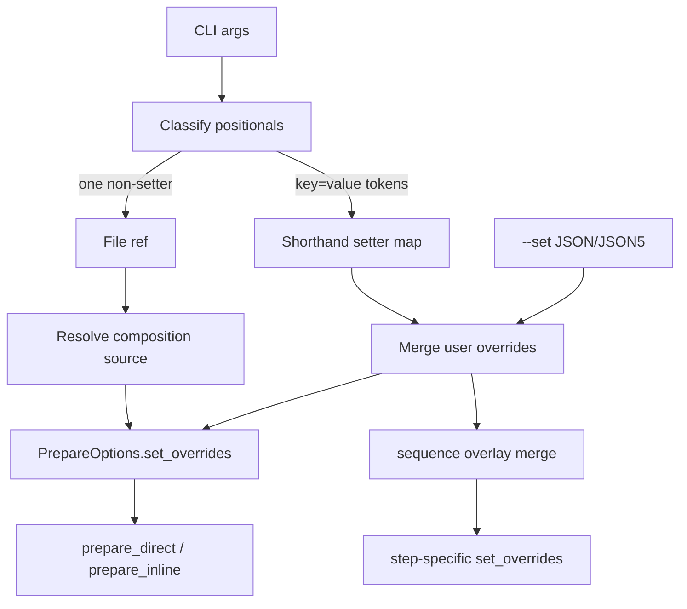

# Set Key/Value Shorthand Tech Design

This document turns `claudine/features/_unscheduled/set-key-value/spec.md` into an implementation-ready design for Claudine's composition CLI surface.

Primary inputs:

- `claudine/features/_unscheduled/set-key-value/spec.md`
- current composition command entry points in `claudine/cli/src/commands/compose.rs`
- current sequence entry point in `claudine/cli/src/commands/sequence.rs`
- current sequence overlay merge in `claudine/lib/src/composition/types.rs`
- Darkmatter reference behavior in `darkmatter/cli/src/args.rs` and `darkmatter/cli/src/commands.rs`

The core design decision is to implement `key=value` shorthand entirely in the Claudine CLI layer, reusing the existing `set_overrides` composition pipeline rather than changing Claudine's composition library contracts.

## Summary

This feature adds Darkmatter-style positional `key=value` overrides to:

1. `claudine compose`
2. `claudine inline-compose`
3. `claudine sequence`

The implementation replaces each command's single required `file` positional with a positional token list, then classifies each token as either:

1. the one required file reference, or
2. an inline override setter

The resulting override object is built in this order:

1. parse `--set` as a JSON/JSON5 object
2. apply inline setters on top of that object
3. for `sequence` only, apply reserved per-step overlay keys on top of the user object

This keeps all existing composition behavior intact because Darkmatter and Claudine already accept typed `serde_json::Value` overrides through `ComposeOptions::with_set_overrides(...)`.

## Goals

1. Match Darkmatter's setter classifier and value parsing semantics.
2. Let callers place setters before or after the file reference.
3. Preserve existing Claudine composition behavior once the final override object is built.
4. Keep sequence reserved keys authoritative over both `--set` and shorthand setters.
5. Add focused tests that lock down parity and CLI regression behavior.

## Non-Goals

1. No nested shorthand keys such as `foo.bar=baz`.
2. No change to Claudine library data models or composition preparation APIs.
3. No new top-level default routing like `claudine @prompt.md`.
4. No attempt to share code with Darkmatter by introducing a new cross-crate dependency.
5. No change to how file references are resolved after positional classification.

## Current Baseline

Today the relevant paths look like this:

1. `claudine compose` and `claudine inline-compose` accept one required `file: String` positional in [claudine/cli/src/commands/compose.rs](/Users/ken/.claudine/worktrees/rusty-biscuit/claudine/claudine/cli/src/commands/compose.rs).
2. `claudine sequence` accepts one required `file: String` positional in [claudine/cli/src/commands/sequence.rs](/Users/ken/.claudine/worktrees/rusty-biscuit/claudine/claudine/cli/src/commands/sequence.rs).
3. `parse_set_json(...)` already parses `--set` as JSON/JSON5 and enforces object shape.
4. Composition preparation already accepts typed override objects through `PrepareOptions.set_overrides`.
5. Sequence already merges user overrides with reserved overlay keys via `SequenceStepOverlay::as_set_overrides(...)`, with reserved keys winning.

That means the missing capability is not in the composition engine. It is only in CLI argument collection and merge order.

## Proposed CLI Contract

Each of the three commands will move from:

```text
claudine <command> <file> [flags]
```

to:

```text
claudine <command> [flags] <arg>...
```

where the positional list must contain:

1. exactly one non-setter token, which is the file reference
2. zero or more setter tokens matching `key=value`

Examples:

```sh
claudine compose @prompts/review.md review=review.md
claudine compose review=review.md @prompts/review.md
claudine inline-compose draft=false @notes/update.md
claudine sequence @research.md topic="async traits" retries=3
```

## Parsing Model

### Shared positional parser

Add a shared parser in `claudine/cli/src/commands/compose.rs` and reuse it from `sequence.rs`.

Recommended shape:

```rust
pub(crate) struct ParsedCompositionPositionals {
    pub file_ref: Option<String>,
    pub shorthand_setters: serde_json::Map<String, serde_json::Value>,
}
```

Recommended helpers:

1. `parse_compose_setter(token: &str) -> Option<Result<(String, Value), String>>`
2. `parse_shorthand_value(raw: &str) -> Value`
3. `parse_composition_positionals(args: &[String]) -> Result<ParsedCompositionPositionals>`
4. `merge_set_overrides(raw_set: Option<&str>, shorthand: Map<String, Value>) -> Result<Option<Value>>`

`sequence.rs` already imports `parse_set_json(...)` from `compose.rs`; extending that file into the shared home for composition-argument helpers is the lowest-friction change.

### Setter recognition

A token is treated as a setter only when all of the following are true:

1. it contains `=`
2. the key portion is non-empty
3. the first key character is ASCII letter or `_`
4. remaining key characters are ASCII letter, digit, `_`, or `-`

This preserves Darkmatter parity and intentionally rejects dot-paths and path-like keys as setters.

### Split behavior

Split on the first `=` only.

Examples:

1. `url=https://x/?a=b` becomes key `url`, value `https://x/?a=b`
2. `empty=` becomes key `empty`, value `""`
3. `a==b` becomes key `a`, value `"=b"` unless JSON5 parsing succeeds unexpectedly

### Value parsing

Inline values follow the same two-stage parse as Darkmatter:

1. try JSON5
2. on failure, fall back to string

Examples:

1. `count=3` -> number
2. `enabled=true` -> boolean
3. `tags=["a","b"]` -> array
4. `config={mode:"fast"}` -> object
5. `review=review.md` -> string

## Validation Rules

After classification, Claudine performs command-level validation:

1. if no file reference candidate remains, error
2. if more than one non-setter token remains, error and list the conflicting tokens
3. if a token begins with `=`, error immediately with the offending token
4. if a setter key is duplicated, last write wins

Important distinction:

1. `foo.bar=baz` is not a valid setter
2. it is therefore treated as a file-reference candidate
3. later file-resolution logic may still reject it as an invalid file reference

That classifier fallback is deliberate and matches the Darkmatter model described in the spec.

## Override Merge Semantics

### Compose and inline-compose

For `compose` and `inline-compose`, the final user override object is:

1. parsed `--set` object
2. plus shorthand setters, with shorthand overwriting matching keys

Recommended merge helper behavior:

```rust
fn merge_set_overrides(
    raw_set: Option<&str>,
    shorthand: serde_json::Map<String, serde_json::Value>,
) -> Result<Option<serde_json::Value>>
```

This should:

1. call `parse_set_json(raw_set)?`
2. seed a mutable object map from that result or an empty map
3. insert shorthand pairs in positional order
4. return `None` when the merged map is empty, otherwise `Some(Value::Object(...))`

### Sequence

For `sequence`, the effective precedence becomes:

1. `--set`
2. shorthand setters
3. reserved step overlay keys from `SequenceStepOverlay::as_set_overrides(...)`

This preserves existing sequence guarantees, especially that `state`, `step`, `is_first`, and related reserved keys cannot be overridden by the caller.

## Command Wiring

### `compose.rs`

Change both `ComposeArgs` and `InlineComposeArgs` from a single `file: String` positional to:

```rust
#[arg(value_name = "ARG", num_args = 1..)]
pub args: Vec<String>
```

The inner runners should:

1. parse `args` with `parse_composition_positionals(...)`
2. require exactly one `file_ref`
3. call `merge_set_overrides(shared.set.as_deref(), parsed.shorthand_setters)?`
4. continue using the merged value everywhere `set_overrides` is passed today

The rest of the execution flow stays unchanged:

1. file reference resolution
2. shell preflight
3. `prepare_direct(...)` or `prepare_inline(...)`
4. wrapper-grade execution

### `sequence.rs`

Change `SequenceArgs` from `file: String` to the same `args: Vec<String>` pattern.

The inner runner should:

1. parse the positional list with the same helper
2. require exactly one `file_ref`
3. build merged user overrides with shorthand precedence over `--set`
4. pass that merged value into `execute_sequence(...)`

No changes are required in `claudine/lib/src/composition/sequence.rs` or `claudine/lib/src/composition/types.rs` beyond any naming cleanup that improves clarity.

## Data Flow



## Error Behavior

Recommended user-facing behavior:

1. `claudine compose =foo` -> clear error naming `=foo` as an invalid setter with an empty key
2. `claudine compose review=doc.md` -> clear error that a file reference is still required
3. `claudine compose a.md b.md` -> clear error that multiple file-reference candidates were provided
4. `claudine compose foo.bar=baz` -> classifier treats it as a file candidate, then normal file-resolution errors apply

The design does not require special new error types. Existing `eyre!`-style command errors are sufficient.

## Documentation and Help Updates

The following user-facing text should be updated alongside the implementation:

1. [claudine/docs/topics/composition.md](/Users/ken/.claudine/worktrees/rusty-biscuit/claudine/claudine/docs/topics/composition.md)
2. [claudine/docs/cli/sequence.md](/Users/ken/.claudine/worktrees/rusty-biscuit/claudine/claudine/docs/cli/sequence.md)
3. [claudine/cli/README.md](/Users/ken/.claudine/worktrees/rusty-biscuit/claudine/claudine/cli/README.md)
4. command doc comments in `claudine/cli/src/commands/compose.rs` and `sequence.rs`
5. grouped help text in [claudine/cli/src/commands/help.rs](/Users/ken/.claudine/worktrees/rusty-biscuit/claudine/claudine/cli/src/commands/help.rs) if composition command descriptions are touched

Documentation should explicitly show:

1. setters may appear before or after the file reference
2. inline setters override `--set`
3. `sequence` still reserves overlay keys above all user overrides
4. command names are spelled exactly `inline-compose` and `sequence`

## Testing Plan

### Unit tests

Add parser-focused unit tests near the new helper functions in `claudine/cli/src/commands/compose.rs`.

Minimum cases:

1. accepts `_private=true` and `my-key=value`
2. rejects empty-key setters like `=value`
3. treats `9key=value` and `foo.bar=baz` as non-setters
4. parses empty values as empty strings
5. splits on first `=` only
6. parses JSON5 values into typed JSON
7. falls back to strings when JSON5 parsing fails
8. accepts setter-before-file and file-before-setter layouts
9. reports zero file candidates
10. reports multiple file candidates
11. merges `--set` then shorthand with shorthand winning

### Integration tests

Extend existing CLI tests:

1. [claudine/cli/tests/wrap_commands.rs](/Users/ken/.claudine/worktrees/rusty-biscuit/claudine/claudine/cli/tests/wrap_commands.rs)
2. [claudine/cli/tests/sequence_cli.rs](/Users/ken/.claudine/worktrees/rusty-biscuit/claudine/claudine/cli/tests/sequence_cli.rs)

Recommended coverage:

1. `compose` passes shorthand overrides into prompt composition
2. `inline-compose` composes `prompt` with shorthand overrides
3. `sequence` passes shorthand overrides into each step
4. `sequence` reserved overlay keys still beat both `--set` and shorthand
5. invalid `=value` setter produces a clear error
6. duplicate setters are last-write-wins
7. mixed `--set` and shorthand prefer shorthand for overlapping keys

Existing tests that assert help text or required `FILE` positionals will need to be updated because the commands will now expose variadic positional arguments rather than a single clap-enforced file positional.

## Compatibility and Risks

### Main compatibility change

The only intentional CLI-contract change is positional parsing:

1. callers can now place setters before the file reference
2. clap no longer enforces the file positional structurally
3. command code enforces the "exactly one file reference" rule after classification

### Risk: drift from Darkmatter

The main risk is semantic drift from Darkmatter's parser.

Mitigation:

1. mirror Darkmatter's logic closely
2. copy its edge-case tests into Claudine-adapted unit tests
3. keep the implementation narrow and local to the CLI layer

### Risk: ambiguous invalid tokens

Tokens like `foo.bar=baz` will still look odd to users because they are not setter errors; they remain file candidates by design.

This is acceptable because:

1. it matches the reference behavior
2. it preserves future file-reference flexibility
3. the spec explicitly chooses classifier fallback over aggressive reinterpretation

## Implementation Sequence

1. Add shared positional parsing and merge helpers in `compose.rs`.
2. Convert `ComposeArgs`, `InlineComposeArgs`, and `SequenceArgs` to variadic positional tokens.
3. Update command runners to require exactly one file ref after classification.
4. Reuse merged override objects in existing composition and sequence execution paths.
5. Add unit and integration coverage.
6. Update docs and help text examples.

## Open Question

The one small UX choice to settle during implementation is the exact missing-file error text after moving away from clap's single `FILE` positional. The design recommends a command-level error such as:

```text
missing file reference: expected exactly one file reference plus optional key=value setters
```

That preserves clarity even though clap can no longer express the full grammar on its own.
