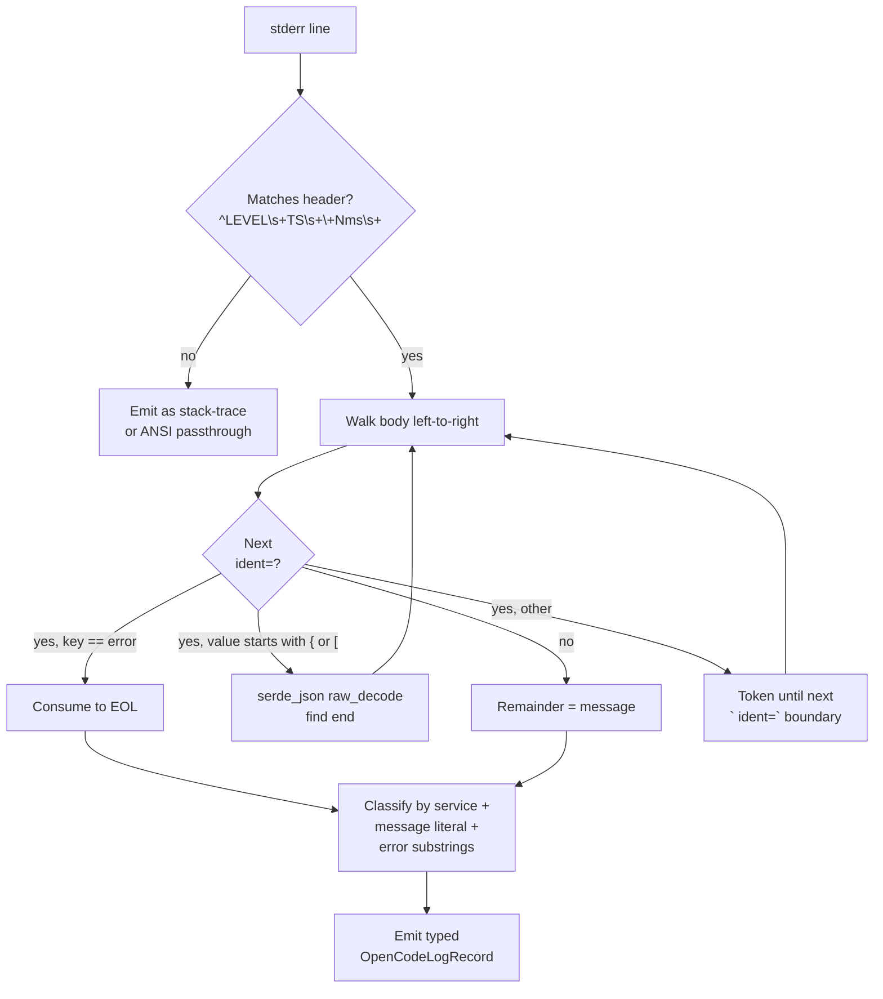

# OpenCode CLI Log Stream: Format, Parsers, and Stability

OpenCode's `--print-logs` + `--log-level ERROR` stderr stream is a first-class diagnostic signal for Claudine: it carries rate-limit notices, malformed-asset warnings, and fatal JS errors that are otherwise invisible to the JSON event stream. This document captures what is and isn't documented, where the format lives in the upstream source, the only third-party parser that exists in the wild, and a pragmatic parsing strategy for a Rust consumer inside Claudine.

## Documentation Status

Upstream documentation covers only the **flags**, not the **format**:

| Doc             | URL                                                                          | Coverage                                                                                         |
|-----------------|------------------------------------------------------------------------------|--------------------------------------------------------------------------------------------------|
| CLI reference   | [opencode.ai/docs/cli](https://opencode.ai/docs/cli)                         | `--print-logs` ("Print logs to stderr"), `--log-level` (one of `DEBUG`, `INFO`, `WARN`, `ERROR`) |
| Troubleshooting | [opencode.ai/docs/troubleshooting](https://opencode.ai/docs/troubleshooting) | Log filenames (`YYYY-MM-DDTHHMMSS.log`), last-10-files retention policy, `--log-level DEBUG`     |

Source MDX: [`packages/web/src/content/docs/cli.mdx`](https://github.com/sst/opencode/blob/dev/packages/web/src/content/docs/cli.mdx), [`troubleshooting.mdx`](https://github.com/sst/opencode/blob/dev/packages/web/src/content/docs/troubleshooting.mdx).

**The line format itself is undocumented**. The authoritative reference is the TypeScript source. There is no changelog entry, API schema, or wiki page describing `service=` tags, `+Nms` semantics, level padding, or how `error=` is serialized.

## Logger Source of Truth

The canonical implementation is in [`packages/opencode/src/util/log.ts`](https://github.com/sst/opencode/blob/dev/packages/opencode/src/util/log.ts) (around lines 117–136).

The emitted line shape is:

```text
<LEVEL><sp*> <ISO-SECONDS> +<delta>ms <key=value...> <message>\n
```

Concretely:

- `<LEVEL>` is one of `DEBUG`, `INFO`, `WARN`, `ERROR`. Internally these are padded so the header occupies a fixed visual column. `DEBUG` and `ERROR` get one trailing space; `INFO` and `WARN` get **two** trailing spaces. Parsers must not assume a single space separator — use `\s+`.
- `<ISO-SECONDS>` comes from `new Date().toISOString().split(".")[0]`, so it is UTC, second-resolution, **no fractional seconds and no `Z` suffix**: `2026-04-15T21:28:30`.
- `+<delta>ms` is the elapsed time since the **previous log line from any logger in the process** (a shared mutable `let last = Date.now()` in `log.ts`). It resets per process launch, does not reflect per-service timing, and cannot be used to reconstruct absolute timestamps.
- The `key=value` pairs are the *tags* on the logger. Tags accumulate via `Log.create({ service })` and `.tag(k, v)`. Values are serialized by:

    - `Error` → `formatError()` walks `.cause` up to depth 10 and produces `<message> Caused by: <message> Caused by: …`. **Not quoted, not escaped — contains spaces, colons, and slashes.**
    - `typeof value === "object"` → `JSON.stringify(value)` inlined **bare**, no enclosing quotes. This is how the entire `AI_RetryError` payload lands on one line.
    - Everything else → bare string coercion.

- The final token is the `message` argument to `l.error(...)` / `l.info(...)` / etc.
- Output destination: when `--print-logs` is set, every line goes to `process.stderr`. Without it, the logger writes to a file under `$XDG_DATA_HOME/opencode/log/<iso>.log`; **both** paths are not taken simultaneously.

### Log Levels

Only four levels exist: `DEBUG`, `INFO`, `WARN`, `ERROR`. There is **no** `FATAL` or `TRACE`, despite what one third-party parser claims (see below). Uncaught JS errors do not flow through the logger at all — they hit Node's default handler and print a bare stack trace (the `TypeError: U.split is not a function` case in `errors.txt` is an example — note the ANSI-colored `Error:` prefix, which is Bun's default uncaught-exception output, not OpenCode's logger).

## Known `service=` Tags

Roughly 67 call sites create tagged loggers. A non-exhaustive inventory of tags you are likely to encounter:

| Category           | `service=` values                                                                                                                                                            | What to watch for                                               |
|--------------------|------------------------------------------------------------------------------------------------------------------------------------------------------------------------------|-----------------------------------------------------------------|
| Config & assets    | `config`, `skill`, `skill-discovery`, `tool.registry`, `instruction`                                                                                                         | `failed to load command`, `err=ENOENT`, malformed frontmatter   |
| LLM                | `llm`, `provider`, `models.dev`                                                                                                                                              | `stream error`, `AI_RetryError`, `AI_APICallError`, rate limits |
| Session            | `session`, `session.prompt`, `session.processor`, `session.projector`, `session.compaction`, `session.revert`                                                                | Session lifecycle, compaction, reverts                          |
| Permissions & MCP  | `permission`, `mcp`, `mcp.oauth`, `mcp.oauth-callback`                                                                                                                       | OAuth, tool authorization                                       |
| Plugins            | `plugin`, `plugin.codex`, `plugin.copilot`                                                                                                                                   | Plugin load/runtime errors                                      |
| Server / transport | `server`, `server.sync`, `server.workspace`, `mdns`, `fence`, `workspace-router`, `workspace-sync`                                                                           | Network/daemon issues                                           |
| ACP                | `acp-agent`, `acp-session-manager`, `acp-command`                                                                                                                            | ACP bridge                                                      |
| Files & tools      | `file`, `file.time`, `file.watcher`, `ripgrep`, `bash-tool`, `truncation`                                                                                                    | File-IO errors, tool edges                                      |
| LSP                | `lsp`, `lsp.client`, `lsp.server`                                                                                                                                            | Language server crashes                                         |
| Infra              | `bus`, `storage`, `db`, `json-migration`, `snapshot`, `patch`, `share-next`, `pty`, `npm`, `ide`, `installation`, `project`, `vcs`, `worktree`, `format`, `question`, `heap` | Background systems                                              |
| TUI                | `tui.config`, `tui.migrate`, `tui.plugin`                                                                                                                                    | TUI-only                                                        |
| Fallback           | `default`                                                                                                                                                                    | Any logger without an explicit service tag                      |

This list **will grow** with releases — a Claudine parser must not whitelist `service=` values.

## Canonical Error Signatures

The events that matter for Claudine's non-interactive surface:

| Event                                  | `service=`                    | Distinguishing substrings                                                                                                 | Message literal                  |
|----------------------------------------|-------------------------------|---------------------------------------------------------------------------------------------------------------------------|----------------------------------|
| Usage limit / rate limit (z.ai `1308`) | `llm`                         | `"AI_RetryError"`, `"reason":"maxRetriesExceeded"`, `"statusCode":429`, `"code":"1308"`, `"Usage limit reached"`          | `stream error`                   |
| Generic API failure                    | `llm`                         | `"AI_APICallError"`, any `"statusCode"`                                                                                   | `stream error`                   |
| Malformed / missing command            | `config`                      | `command=<path>`, `err=ENOENT`, `err=EISDIR`, `err=SyntaxError`                                                           | `failed to load command`         |
| Malformed skill                        | `config` or `skill-discovery` | `err=…`                                                                                                                   | `failed to load skill` (variant) |
| Fatal uncaught JS error                | *(none — not from logger)*    | `ERROR … service=default name=TypeError … fatal` when caught at the process level, otherwise raw `Error:` stack on stderr | varies                           |
| Auth / network                         | `llm` or `provider`           | `"AuthenticationError"`, `"fetch failed"`, socket errors in `error={…}`                                                   | `stream error`                   |

The "Usage limit reached for 5 hour. Your limit will reset at …" text is **verbatim from the upstream provider's HTTP response body** (z.ai in the example). OpenCode does not rewrite it. If Claudine wants a provider-neutral surfacing, it must re-match on `statusCode:429` or the AI SDK error names, not on the English string.

## Third-Party Parsers

Exactly one production parser exists:

| Project                                                   | URL                                                                                                                                                 | Language | What it extracts                                                                                                                                                                                                                                                                                                       |
|-----------------------------------------------------------|-----------------------------------------------------------------------------------------------------------------------------------------------------|----------|------------------------------------------------------------------------------------------------------------------------------------------------------------------------------------------------------------------------------------------------------------------------------------------------------------------------|
| `carbonscott/deploy-opencode` — `ingest_opencode_logs.py` | [tools/opencode-logs/ingest_opencode_logs.py](https://github.com/carbonscott/deploy-opencode/blob/main/tools/opencode-logs/ingest_opencode_logs.py) | Python   | Ingests logs into DuckDB for analytics. Header regex `^(INFO\|ERROR\|WARN\|FATAL)\s+(\d{4}-\d{2}-\d{2}T\d{2}:\d{2}:\d{2})\s+\+(\d+)ms\s+(.*)`, then a procedural scanner over a `KNOWN_KEYS` allow-list, using `json.JSONDecoder().raw_decode()` to pull JSON-shaped values. Treats `error=` as "consume to end of line". |

No Rust, Go, TypeScript, or other language parser was located via GitHub code search for terms like `opencode --print-logs`, `opencode log-level parser`, `service=llm providerID`, or `AI_RetryError`. `flora131/atomic` contains an internal research note referencing OpenCode's logs but does not parse them.

**Lessons from `carbonscott`'s approach:**

- Regex-match only the header, then walk the body procedurally. This avoids brittle single-regex parsing.
- Treat any `{` or `[` as the start of a JSON literal and use a streaming JSON parser to find its end — do not try to balance braces with regex.
- Treat `error=` as a terminal key (consume to EOL) because Error messages contain unescaped spaces, commas, and key-value-shaped substrings that confuse naive parsers.
- The parser's `FATAL` entry is a mistake; OpenCode never emits it.

## Format Stability

The `build()` function in `log.ts` has been **byte-identical since at least 2025-08-31** (commit `65f0bea1`) and remains so on `dev` today. Recent commits on that file (`74b14a2d`, `fc01cad2`, `cb8b74d3`, `48dfa45a`, `5b21334f`) touch file-stream cleanup, glob handling, and Bun-vs-Node IO differences — none change the serialized line format. Configurable log levels were introduced in [`53f8e785` (2025-07-09)](https://github.com/sst/opencode/commit/53f8e785). In short: **the `LEVEL<sp+> iso +Nms key=value… message` shape has been stable for 9+ months**, but the *tag inventory* inside it grows with every release.



## Recommended Rust Parsing Strategy

For a Claudine parser that stays resilient to upstream evolution:

1. **Regex-lex only the header.** `^(DEBUG|INFO|WARN|ERROR)\s+(\d{4}-\d{2}-\d{2}T\d{2}:\d{2}:\d{2})\s+\+(\d+)ms\s+(.*)$`. Lines that do not match are **not log lines** — pass them through as-is (Bun uncaught-error stacks and ANSI-colored error blocks land here).
2. **Don't regex the body.** Walk left to right. For each candidate `[a-zA-Z_][a-zA-Z0-9_.\-]*=` boundary, branch on the first byte of the value:

    - `{` or `[` → use `serde_json::Deserializer::from_slice(...).into_iter::<Value>()` or a manual `StreamDeserializer` to find the matching end, then skip to the next space.
    - Any key named `error` → consume to EOL (the value is a `formatError()` message chain with arbitrary punctuation).
    - Otherwise → read until the next whitespace that is followed by another `ident=` boundary *or* the end of line.

3. **The message is the trailing chunk** after the last parsed value.
4. **Do not maintain a service whitelist.** Accept any `ident=...`. Only branch behavior on the *shape* of the value, not on the key name (except `error` per #2).
5. **Detect rate limits** by checking `service=llm` plus a substring match on any of `AI_RetryError`, `"statusCode":429`, `maxRetriesExceeded`. Do not depend on the English `Usage limit reached` text — it is upstream-provider-specific.
6. **Detect malformed-asset errors** by `service=config` (or any `service=skill*`) plus the trailing message `failed to load command` / `failed to load skill`.
7. **Timestamps are UTC, no timezone marker.** Parse with `chrono::NaiveDateTime` and assume `Utc`.
8. **`+Nms` is process-global, not per-service.** Record it for diagnostics; don't derive per-service latencies from it.
9. **Level padding varies** (`DEBUG ` / `ERROR ` have one trailing space; `INFO  ` / `WARN  ` have two). `\s+` in the header regex handles this.
10. **Keep every field optional.** This mirrors the existing `stream::protocol::opencode` convention: serde-derived structs with `#[serde(default)]` everywhere, so new tags never break deserialization.

## Claudine Integration Notes

The existing typed stream parsers at [`claudine/lib/src/stream/protocol/opencode.rs`](../../../claudine/lib/src/stream/protocol/opencode.rs) handle the JSON event stream on stdout; the log stream on stderr is a separate channel and warrants a sibling module, e.g. `claudine/lib/src/stream/logs/opencode.rs`, with its own `OpenCodeLogRecord` type. The two streams should converge in the live semantic sink so that a usage-limit log line emits the same `LiveEvent::RateLimited { reset_at }` that an equivalent JSON event would, letting the 9-section `LiveSemanticSink` render a single canonical "hit usage cap, resets at T" block rather than either hanging silently or printing raw stderr goo. This also unblocks a non-hanging exit path for the non-interactive wrapper: when a rate-limit log is seen before the first stream event, Claudine can terminate with a structured error instead of waiting on a never-arriving response.
