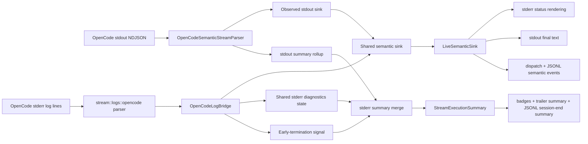

# Leveraging OpenCode Logs Tech Design

This document turns [spec.md](./spec.md) into an implementation-ready design for Claudine's OpenCode wrapper, semantic stream pipeline, and end-of-run reporting.

Primary inputs:

- `claudine/features/2026-04-15-leveraging-logs/spec.md`
- `claudine/features/2026-04-15-leveraging-logs/research.md`
- `claudine/lib/src/stream/{opencode_semantic,semantic,summary,badges,reporting}.rs`
- `claudine/lib/src/stream/protocol/opencode.rs`
- `claudine/cli/src/commands/wrap/{exec,mod,profile}.rs`
- `claudine/cli/src/commands/wrap/live_semantic_sink.rs`
- `claudine/lib/src/agents/opencode.rs`

## Summary

Claudine already has a solid stdout-side semantic stream for OpenCode, but it is blind to the provider's structured stderr logs. That blind spot is the reason usage-cap failures can appear as silent hangs and malformed skills or commands can be skipped without any user-visible signal.

The design adds a second, OpenCode-specific parsing lane for stderr and merges it into the existing semantic event pipeline instead of inventing a parallel reporting surface.

The core implementation choices are:

1. Add a new pure parser and classifier under `claudine/lib/src/stream/logs/opencode.rs`.
2. Feed stderr-derived diagnostics into the same `SemanticEventSink` used by the stdout parser.
3. Track stderr-derived counters and reset times in `StreamExecutionSummary`.
4. Terminate non-interactive OpenCode runs early when a usage-cap error appears before the first stdout semantic event.
5. Recompute badges and JSONL summary metadata after stderr diagnostics are merged into the final summary.

## Current Baseline

Today the OpenCode structured path behaves like this:

1. `OpencodeWrapper::apply_structured_stream(...)` adds `--format json`.
2. `run_child_stream_semantic(...)` pipes stdout and stderr.
3. `OpenCodeSemanticStreamParser` parses stdout NDJSON and emits `SemanticEvent`s into `LiveSemanticSink`.
4. The stderr thread only filters, formats, and optionally captures plain text. It does not parse OpenCode logs or enrich `StreamExecutionSummary`.
5. `OpenCodeSemanticStreamParser::finish(...)` builds the final `StreamExecutionSummary` and derives badges before any stderr-derived information is available.

That leaves four concrete gaps:

1. usage-cap failures on stderr do not update `error_kind`, `rate_limit`, or badges
2. malformed asset warnings never become `SemanticEvent::Warning`
3. structured sessions do not currently attach parsed stderr diagnostics to the summary
4. the wrapper cannot distinguish "provider is still working" from "provider is stuck retrying until quota resets"

## Design Goals

1. Keep stdout semantic parsing unchanged for the normal OpenCode NDJSON stream.
2. Add stderr parsing without weakening the current structured-stream fidelity guarantees.
3. Reuse `SemanticEvent`, `LiveSemanticSink`, badge derivation, and JSONL reporting rather than building a separate stderr-only UI path.
4. Keep the log parser resilient to upstream tag growth and minor format drift.
5. Limit the first implementation to OpenCode and to `ERROR`-level logs. The level is hardcoded; there is no user override in this cycle.

## Proposed Architecture



The key point is that stderr diagnostics become first-class semantic events. They do not bypass the existing sink, and they do not require a new renderer.

## `stream::logs::opencode`

Add a new module tree:

```text
claudine/lib/src/stream/
├── logs/
│   ├── mod.rs
│   └── opencode.rs
```

`stream::logs::opencode` owns three responsibilities:

1. parsing one stderr line into either a structured log record or raw passthrough text
2. classifying a parsed record into a Claudine action category
3. converting classification results into summary-friendly data

Recommended public types:

```rust
pub struct OpenCodeLogRecord {
    pub level: LogLevel,
    pub timestamp: chrono::DateTime<chrono::Utc>,
    pub delta_ms: u64,
    pub tags: BTreeMap<String, String>,
    pub message: String,
    pub raw: String,
}

pub enum ParsedOpenCodeStderrLine {
    Structured(OpenCodeLogRecord),
    RawText(String),
}

pub enum LogLevel {
    Debug,
    Info,
    Warn,
    Error,
}

pub enum AssetType {
    Skill,
    Command,
    Agent,
    Config,
    Unknown,
}

pub enum LogClassification {
    RateLimit {
        status_code: u16,
        error_name: String,
        reset_at: Option<chrono::DateTime<chrono::Utc>>,
        provider_error: String,
    },
    MalformedAsset {
        asset_type: AssetType,
        path: Option<String>,
        error: String,
    },
    ApiFailure {
        status_code: Option<u16>,
        error_name: String,
        message: String,
    },
    AuthFailure {
        message: String,
    },
    UncaughtError {
        raw_text: String,
    },
    Unclassified,
}
```

### Parsing Rules

The parser should remain deliberately small and procedural:

1. Match the header only:
   `^(DEBUG|INFO|WARN|ERROR)\s+(\d{4}-\d{2}-\d{2}T\d{2}:\d{2}:\d{2})\s+\+(\d+)ms(?:\s+(.*))?$`
2. Convert the timestamp to `DateTime<Utc>` by parsing as `NaiveDateTime` and attaching `Utc`.
3. Walk the body left-to-right to extract `key=value` tags.
4. Treat `error=` as terminal and consume to end-of-line.
5. Treat `{` and `[` as the start of inline JSON and use `serde_json` to find the end of the literal.
6. Treat anything that does not match the header as `ParsedOpenCodeStderrLine::RawText`.

Two resilience rules matter here:

1. `tags` stays open-ended and stringly typed; we do not freeze a Rust struct for tag names.
2. unknown tags and missing tags are both valid input states.

### Classification Rules

Classification is a pure function over `OpenCodeLogRecord` plus a small raw-text fallback for uncaught exceptions.

Recommended classification logic:

1. `RateLimit` when `service=llm` and the line contains any of:
   - `AI_RetryError`
   - `"statusCode":429`
   - `maxRetriesExceeded`
   - `"code":"1308"`
2. `ApiFailure` when `service=llm` and the line contains `AI_APICallError` without rate-limit signals.
3. `AuthFailure` when `service=llm` or `service=provider` and the line contains `AuthenticationError`, `unauthorized`, or `fetch failed`.
4. `MalformedAsset` when:
   - `message == "failed to load skill"` or starts with that phrase
   - `message == "failed to load command"` or starts with that phrase
   - `message == "failed to load agent"` or starts with that phrase
5. `UncaughtError` when the raw stderr line does not match the header but still contains a fatal error prefix such as `Error:` or an ANSI-colored equivalent.
6. `Unclassified` for everything else.

`reset_at` extraction should look for the provider's explicit reset timestamp first and then fall back to parsing known textual tails like `reset at 2026-04-16 02:28:57 UTC`. The stored value should be a typed `DateTime<Utc>` and rendered later as a formatted string.

## Shared Semantic Sink

The existing architecture assumes stdout is the only semantic producer. To let stderr feed the same sink without rewriting `LiveSemanticSink`, add a tiny synchronizing adapter:

```rust
pub struct SharedSemanticSink<S> {
    inner: Arc<Mutex<S>>,
}
```

`SharedSemanticSink<S>` implements `SemanticEventSink` by locking the inner sink and forwarding the event.

This is the smallest useful change because it lets both of these producers reuse the exact same downstream behavior:

1. the stdout parser thread
2. the stderr log bridge thread

The lock is acceptable here because:

1. stderr logs are low-volume at `ERROR` level
2. `LiveSemanticSink` is already stateful and not designed for lock-free fanout
3. ordering between stdout and stderr only needs to be arrival-consistent, not timestamp-perfect

## Stdout Observation Gate

The early-termination rule depends on whether any stdout semantic event has already appeared.

Add a second wrapper sink:

```rust
pub struct ObservedSemanticSink<S> {
    inner: S,
    stdout_event_seen: Arc<AtomicBool>,
}
```

`ObservedSemanticSink` sets `stdout_event_seen` to `true` before forwarding the first event from the stdout parser.

Important detail: this should trip on the first emitted `SemanticEvent`, not only on output text. The spec says "before any stdout `SemanticEvent` has been received", and the current OpenCode parser may emit `SessionStart` or `Info(step_start)` before any assistant text.

## `OpenCodeLogBridge`

`OpenCodeLogBridge` is the stderr-side integration object. It owns:

1. a `SharedSemanticSink<LiveSemanticSink>` clone
2. shared mutable stderr summary state
3. `stdout_event_seen`
4. a sender for early-termination control messages back to `run_child_stream_semantic(...)`

Recommended internal state:

```rust
#[derive(Default)]
struct SharedStderrState {
    diagnostics: StderrDiagnostics,
    rate_limit: Option<RateLimitInfo>,
}

enum EarlyTermination {
    RateLimit {
        message: String,
        reset_at: Option<DateTime<Utc>>,
    },
}
```

### Event Mapping

The bridge should map classifications like this:

| Classification | Semantic event |
|---|---|
| `RateLimit` after stdout has started | `SemanticEvent::Warning` |
| `RateLimit` before any stdout event | `SemanticEvent::Error { terminal: true }` and early-termination signal |
| `MalformedAsset` | `SemanticEvent::Warning` |
| `AuthFailure` | `SemanticEvent::Error { terminal: true }` |
| `ApiFailure` | `SemanticEvent::Error { terminal: true }` |
| `UncaughtError` | `SemanticEvent::Error { terminal: true }` |
| `Unclassified` | no event emitted; line returns `NotConsumed` |

Note: `SemanticEvent::Error { message, terminal, extra }` is the existing variant in `claudine/lib/src/stream/semantic.rs`. The bridge uses the existing `terminal: bool` field; no schema change to `SemanticEvent` is required. `MalformedAsset` is intentionally downgraded to a `Warning` even though OpenCode logs it at `ERROR`, because the session itself continues successfully after skipping the malformed asset.

Every emitted stderr-derived event should include a structured `extra` object with at least:

```json
{
  "provider": "opencode",
  "source": "stderr_log",
  "classification": "rate_limit",
  "service": "llm",
  "raw": "ERROR  2026-04-15T21:28:30 +123ms ..."
}
```

Additional fields such as `asset_type`, `path`, `status_code`, `reset_at`, and `error_name` should be attached when known.

### Summary Mutation Rules

The bridge updates `SharedStderrState` as it processes lines:

1. increment parsed log counters
2. increment per-classification counters
3. update `rate_limit_reset_at` with the newest parsed reset time
4. populate a stderr-derived `RateLimitInfo` when appropriate

The bridge does not mutate `StreamExecutionSummary` directly. Summary merge remains a single post-process step in `run_child_stream_semantic(...)`.

## Summary Model Changes

### `RateLimitInfo`

Extend `RateLimitInfo` in `claudine/lib/src/stream/summary.rs` with an optional absolute reset time:

```rust
pub struct RateLimitInfo {
    pub is_throttled: Option<bool>,
    pub retry_after_ms: Option<u64>,
    pub message: Option<String>,
    pub reset_at: Option<chrono::DateTime<chrono::Utc>>,
}
```

This keeps all rate-limit state in the existing cross-provider summary field instead of inventing a second rate-limit payload.

### `StderrDiagnostics`

Add a new summary-side struct:

```rust
pub struct StderrDiagnostics {
    pub log_records_parsed: u32,
    pub rate_limit_events: u32,
    pub malformed_asset_events: u32,
    pub api_failures: u32,
    pub auth_failures: u32,
    pub uncaught_errors: u32,
    #[serde(skip_serializing_if = "Option::is_none")]
    pub rate_limit_reset_at: Option<chrono::DateTime<chrono::Utc>>,
}
```

Then add this field to `StreamExecutionSummary`:

```rust
#[serde(skip_serializing_if = "Option::is_none")]
pub stderr_diagnostics: Option<StderrDiagnostics>,
```

### Merge Precedence

After stdout parsing finishes and the stderr thread joins, `run_child_stream_semantic(...)` should merge stderr state into the final summary with these rules:

1. `stderr_text` becomes the filtered captured stderr text for structured sessions.
2. `stderr_diagnostics` is attached when at least one structured log line was parsed.
3. `rate_limit` merges field-by-field from both sources (see below).
4. `error_kind` and `error_message` are overridden only for synthetic early termination.
5. `summary.badges` is recomputed after all stderr-derived fields are merged.

That last step matters because the provider parser currently derives badges too early.

### Rate-Limit Field-by-Field Merge

When both stdout and stderr produce `RateLimitInfo` data, neither source is treated as an outright winner. The merge runs per field:

| Field | Rule |
|---|---|
| `is_throttled` | `Some(true)` wins over `Some(false)` or `None`; stdout wins when both say `Some(true)` |
| `retry_after_ms` | The larger value wins (more conservative back-off) |
| `message` | Stdout wins when non-empty; fall back to stderr otherwise |
| `reset_at` | The later `DateTime<Utc>` wins; `Some` always beats `None` |

The merge produces a new `RateLimitInfo` only if at least one of the two sources had any rate-limit data. If both sources are empty, `summary.rate_limit` stays `None`.

For synthetic early termination, the merge is skipped and the bridge-produced `RateLimitInfo` is written directly into `summary.rate_limit`, because in that path stdout produced no rate-limit signal at all.

## Process Invocation Changes

## OpenCode Argument Injection

For OpenCode structured non-interactive runs, update `OpencodeWrapper::apply_structured_stream(...)` in `claudine/cli/src/commands/wrap/profile.rs` to add:

```text
--format json --print-logs --log-level ERROR
```

This keeps stderr logging tied to the structured wrapper path and avoids changing interactive TUI behavior.

The `--log-level` value is hardcoded to `ERROR`. There is no CLI flag, env var, or profile setting to change it in this cycle. The parser still models `Debug`, `Info`, and `Warn` variants so a future change to the injected level does not require a parser rewrite.

## `run_child_stream_semantic(...)`

Extend `run_child_stream_semantic(...)` in `claudine/cli/src/commands/wrap/exec.rs` so it can host an optional provider-specific stderr bridge.

Recommended shape:

1. create the shared sink and `stdout_event_seen` gate in `wrap/mod.rs`
2. pass the stdout-wrapped sink into the parser builder
3. pass an optional stderr bridge into `run_child_stream_semantic(...)`
4. let the stderr reader call the bridge before deciding whether to echo or suppress the line

The stderr thread behavior becomes:

1. read a line
2. drop known noise prefixes
3. append the filtered line to captured stderr text
4. if a bridge exists, let it ingest the line and report whether it consumed the line
5. if the bridge consumed the line, suppress the raw passthrough so users do not see both the raw log line and the rendered `SemanticEvent`
6. otherwise, if stderr is not suppressed on success, keep the current text passthrough behavior

"Consumed" means the bridge classified the line into any non-`Unclassified` variant AND emitted a `SemanticEvent`. The bridge returns a small ingestion outcome so the stderr thread can make this decision without re-parsing:

```rust
pub enum StderrIngestOutcome {
    Consumed,
    NotConsumed,
}
```

Rules for the outcome:

1. `Structured` records with any classification other than `Unclassified` → `Consumed`
2. `Structured` records with `Unclassified` classification → `NotConsumed` (raw line still passes through)
3. `RawText` that maps to `UncaughtError` → `Consumed`
4. `RawText` that does not match any classifier → `NotConsumed`

This keeps the terminal surface clean for the four signals we care about (rate limit, malformed asset, auth failure, API failure, uncaught error) while still showing operators any unclassified diagnostic noise OpenCode may emit.

## Early Termination Control Path

The existing function waits for child exit. That is not sufficient anymore because usage-cap hangs may never exit on their own.

Add a small control channel from worker threads back to the main wait loop:

```rust
enum ChildSignal {
    EarlyTerminate(EarlyTermination),
}
```

The wait loop should:

1. continue checking child status as today
2. also listen for `ChildSignal`
3. on `EarlyTerminate::RateLimit`, kill the child process group, stop the heartbeat, and finalize the run with a synthetic non-zero exit

Recommended synthetic summary state for pre-stream rate limits:

```rust
summary.exit_code = 1;
summary.is_error = true;
summary.error_kind = Some("usage_limit_reached".into());
summary.error_message = Some(rendered_message.clone());
summary.rate_limit = Some(RateLimitInfo {
    is_throttled: Some(true),
    retry_after_ms: None,
    message: Some(rendered_message.clone()),
    reset_at,
});
```

The early-termination path should still attach `stderr_text`, `stderr_diagnostics`, and recomputed badges.

## Badge Derivation

`claudine/lib/src/stream/badges.rs` should be extended in two ways.

First, add:

```rust
BadgeCategory::Config
```

Second, teach `derive_badges(...)` to inspect `stderr_diagnostics`:

1. emit `RateLimit` when `stderr_diagnostics.rate_limit_events > 0` and no stronger rate-limit badge already exists
2. emit `Config` when `malformed_asset_events > 0`
3. keep current `error_kind` priority rules unchanged

Recommended badge messages:

1. rate limit: include the formatted reset time when present
2. config: `"Skipped 2 malformed OpenCode assets"`

The summary merge step should always call `derive_badges(...)` after stderr enrichment so the final trailer and JSONL summary see the same badge set.

## Reporting and JSONL

`claudine/lib/src/stream/reporting.rs` should serialize stderr-derived summary data under `extra["provider_summary"]` alongside existing `raw_summary`, `rate_limit`, and `context_usage`.

Recommended addition:

```rust
if let Some(stderr_diagnostics) = &summary.stderr_diagnostics
    && let Ok(value) = serde_json::to_value(stderr_diagnostics)
{
    provider_summary.insert("stderr_diagnostics".into(), value);
}
```

This preserves the new signal in JSONL without requiring a SQLite schema migration. SQLite continues to ingest the synthetic session-end summary as a normal event with richer `extra`.

## Agent Capability Metadata

Update `claudine/lib/src/agents/opencode.rs` so the documented logging capabilities reflect the new supported controls:

```rust
logging: LoggingCapabilities {
    session_locations: vec![],
    log_locations: vec![],
    debug_controls: vec!["--print-logs", "--log-level ERROR"],
    telemetry_controls: vec![],
},
```

This is a metadata correction, not a runtime dependency.

## File-by-File Changes

| File | Action | Notes |
|---|---|---|
| `claudine/lib/src/stream/logs/mod.rs` | Create | Exports `opencode` |
| `claudine/lib/src/stream/logs/opencode.rs` | Create | Parser, classifier, bridge helpers, unit tests |
| `claudine/lib/src/stream/mod.rs` | Edit | Add `pub mod logs;` and any shared sink helper export if placed here |
| `claudine/lib/src/stream/semantic.rs` | Edit | Add `SharedSemanticSink` and `ObservedSemanticSink` helpers or place them in a nearby module |
| `claudine/lib/src/stream/summary.rs` | Edit | Extend `RateLimitInfo`; add `StderrDiagnostics` and summary field |
| `claudine/lib/src/stream/badges.rs` | Edit | Add `Config`; derive badges from `stderr_diagnostics` |
| `claudine/lib/src/stream/reporting.rs` | Edit | Serialize `stderr_diagnostics` into synthetic session-end JSONL rows |
| `claudine/cli/src/commands/wrap/profile.rs` | Edit | Inject `--print-logs --log-level ERROR` for OpenCode structured runs |
| `claudine/cli/src/commands/wrap/exec.rs` | Edit | Host stderr bridge, control channel, summary merge, early termination |
| `claudine/cli/src/commands/wrap/mod.rs` | Edit | Build the shared sink and wire OpenCode stderr bridge into the structured path |
| `claudine/lib/src/agents/opencode.rs` | Edit | Update `LoggingCapabilities.debug_controls` |
| `claudine/lib/tests/fixtures/logs/` | Create | OpenCode stderr fixtures |

## Testing Strategy

## Unit Tests

`claudine/lib/src/stream/logs/opencode.rs` should carry table-driven tests for:

1. header acceptance and rejection
2. body scanning for bare, JSON, and terminal `error=` values
3. message extraction after the last tag
4. rate-limit classification
5. malformed asset classification
6. auth failure classification
7. uncaught-error fallback for raw non-header stderr lines
8. resilience to unknown tags and missing tags
9. reset-time extraction into `DateTime<Utc>`

`summary.rs`, `badges.rs`, and `reporting.rs` also need focused tests for:

1. `RateLimitInfo.reset_at` serde round-trip
2. `StderrDiagnostics` serde round-trip
3. badge derivation from `stderr_diagnostics`
4. JSONL summary serialization of `stderr_diagnostics`

## Integration Tests

Add integration tests that exercise the actual structured execution path with synthetic child output:

1. stdout NDJSON plus stderr rate-limit log before first stdout event triggers synthetic failure
2. stdout NDJSON plus stderr malformed-skill warning surfaces a `SemanticEvent::Warning`
3. mixed valid log lines and raw stack traces do not break parsing
4. final `StreamExecutionSummary` contains merged stderr text, diagnostics, rate-limit state, and badges

The cleanest place for these tests is alongside the current structured-stream integration coverage in the wrapper layer, using short fixture files and a helper process that writes deterministic stdout and stderr lines.

## Fixture Plan

Create these fixtures under `claudine/lib/tests/fixtures/logs/`:

1. `opencode-rate-limit.txt`
2. `opencode-malformed-skill.txt`
3. `opencode-mixed.txt`

If a concurrent wrapper-level integration test needs paired stdout and stderr fixtures, keep those next to the test that consumes them rather than forcing everything into the pure-parser fixture directory.

## Implementation Order

1. Build the pure parser and classifier in `stream::logs::opencode`.
2. Extend `RateLimitInfo` and add `StderrDiagnostics`.
3. Add the shared sink wrappers and `OpenCodeLogBridge`.
4. Wire the bridge into `run_child_stream_semantic(...)`.
5. Implement pre-stream rate-limit termination.
6. Recompute badges after stderr merge.
7. Extend JSONL summary serialization.
8. Add unit and integration coverage.

## Resolved Decisions

The design resolves the spec's open questions like this:

1. Enable `--print-logs --log-level ERROR` by default for OpenCode structured non-interactive runs. The level is hardcoded in this cycle — no CLI flag, env var, or profile knob.
2. Parse reset times into `DateTime<Utc>` and serialize them as normal chrono timestamps.
3. Keep the first implementation OpenCode-only.
4. When the bridge classifies and emits a `SemanticEvent`, suppress the raw stderr passthrough for that line. Only `Unclassified` lines (and unmatched raw text) continue to echo through the current passthrough path.
5. Reuse the existing `SemanticEvent::Error { message, terminal, extra }` variant — no new fields, no new variants.
6. Merge `RateLimitInfo` field-by-field between stdout and stderr instead of picking a single "winner" source.

These choices keep the implementation focused while still making the new stderr signal usable by the renderer, the badge system, and JSONL reporting.
