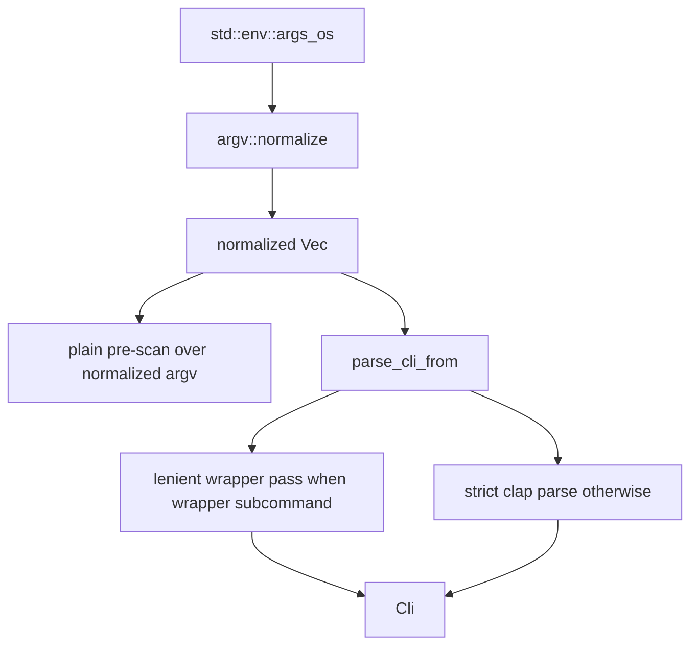

# CLI Argv Pre-Processing Tech Design

This document turns `claudine/features/2026-04-17-cli-pre-processing/spec.md` into an implementation-ready design for Claudine's CLI entrypoint, wrapper-aware clap parsing, and composition-specific argv normalization.

Primary inputs:

- `claudine/features/2026-04-17-cli-pre-processing/spec.md`
- `claudine/features/2026-04-17-cli-pre-processing/plan.md`
- `claudine/cli/src/main.rs`
- `claudine/cli/src/args.rs`
- `claudine/cli/src/commands/compose.rs`
- `claudine/cli/src/commands/sequence.rs`
- `claudine/cli/src/provider_values.rs`
- `claudine/cli/src/cli_utils.rs`
- `claudine/lib/src/events/provider.rs`

The core design decision is to add a single Claudine-owned normalization pass above clap, not to keep layering more special cases into individual commands and not to replace clap with a custom parser. clap remains authoritative for help, version, completion, errors, `ValueEnum` validation, and subcommand dispatch.

## Summary

This feature adds a new CLI-local argv module:

- `claudine/cli/src/argv.rs`

That module will expose one public function:

```rust
pub(crate) fn normalize(raw: Vec<std::ffi::OsString>) -> Vec<std::ffi::OsString>
```

`normalize(...)` will run exactly once in `main.rs`, before any clap parsing. It will perform three narrowly-scoped rewrites:

1. provider boolean flags become `--provider <slug>`
2. fuzzy `--provider` values become canonical provider slugs
3. composition commands get an inserted `--` before the first trailing setter that appears after flags have interleaved with positionals

Everything else remains a pass-through.

## Goals

1. Create one pre-clap normalization seam for the entire CLI.
2. Canonicalize provider selection before clap populates `SharedComposeArgs`.
3. Fix the `compose` / `inline-compose` / `sequence` help parsing failure without changing the common `file.md key=value` path.
4. Preserve the existing two-pass wrapper parsing model and wrapped-command passthrough behavior.
5. Keep shell completion behavior unchanged by making normalization a hard no-op under `COMPLETE`.

## Non-Goals

1. No custom parser replacing clap derive.
2. No subcommand fuzzy matching in v1.
3. No MCP tag stripping or other prompt preprocessing in this layer.
4. No mutation of tokens at or after the first user-provided `--`.
5. No library API in `claudine/lib`; this remains CLI-local.

## Current Baseline

Today there are three separate parsing-related seams in `main.rs`:

1. a raw `std::env::args()` pre-scan for `--plain`
2. a wrapper-aware `parse_cli()` path that uses a lenient clap pass for wrapper subcommands
3. direct clap parsing for non-wrapper subcommands

Composition commands add further complexity:

- `SharedComposeArgs` exposes `--provider` plus eight provider booleans
- `explicit_provider()` re-resolves those booleans after clap parsing
- `ComposeArgs.args`, `InlineComposeArgs.args`, and `SequenceArgs.args` all use `num_args = 1..`
- `parse_composition_positionals(...)` and `parse_compose_setter(...)` classify `one file reference + zero or more setters` only after clap has already accepted the argv

That split is what makes the motivating bug possible: clap reaches a state where composition positionals are being greedily collected before Claudine's own file-vs-setter classification has a chance to run.

## Design Overview



Key design point: normalization happens before wrapper detection, so both wrapper and non-wrapper flows see the same token stream.

## Module Design

Add:

```text
claudine/cli/src/argv.rs
```

Recommended structure:

- public:
  - `normalize(raw: Vec<OsString>) -> Vec<OsString>`
- private helpers:
  - `completion_mode_active() -> bool`
  - `scan_subcommand(tokens: &[OsString]) -> Option<SubcommandScan>`
  - `normalize_provider_tokens(...)`
  - `insert_compose_separator(...)`
  - UTF-8 helpers for exact token matching and `--provider=<value>` splitting
  - setters/flags classifiers used only by Rule 3

Recommended private constants:

- `WRAPPER_SUBCOMMANDS`
- `COMPOSITION_SUBCOMMANDS`
- provider boolean rewrite table
- composition flags that consume a following value
- composition short flags that consume a following value

`argv.rs` should not depend on clap. It may depend on `claudine::events::Provider` for `as_slug()` and `fuzzy_match_cli_name(...)`.

## Entrypoint Integration

### `main.rs`

Refactor `main.rs` so argv is collected exactly once:

```rust
let raw_argv: Vec<OsString> = std::env::args_os().collect();
let argv = argv::normalize(raw_argv);
```

Then:

1. run the `--plain` pre-scan against `argv`
2. call a new `parse_cli_from(&argv)` helper instead of `parse_cli()`

This removes today's double-read split between `args()` and `args_os()`. It also makes non-UTF-8 handling explicit instead of accidentally normalized through `String`.

### `parse_cli_from`

Replace the current `parse_cli()` with:

```rust
fn parse_cli_from(argv: &[OsString]) -> Cli
```

Behavior:

1. determine the effective subcommand using the same scanner used by `argv::normalize`
2. if the subcommand is a wrapper, build the lenient clap command tree with `ignore_errors(true)` on wrapper subcommands
3. otherwise parse strictly from the same normalized argv

This fixes an existing inconsistency in the current implementation: wrapper detection currently assumes the subcommand is always `raw_args[1]`, which is false when global flags appear before the subcommand.

## Normalization Algorithm

`normalize(...)` should run as one left-to-right scan over the argv prefix before the first literal `--`.

Recommended high-level flow:

1. if completion mode is active, return `raw` unchanged
2. if argv has fewer than two tokens, return unchanged
3. split the stream into:
   - `head`: tokens before the first user-provided `--`
   - `tail`: the first `--` and everything after it
4. apply Rule 1 and Rule 2 while copying `head` into a new vector
5. run Rule 3 against the rewritten `head`
6. append `tail` unchanged

This preserves the spec's "`--` is a hard stop" rule while still allowing Rule 1 and Rule 2 to run before Rule 3 sees the composition argv.

## Rule 1: Provider Boolean Rewrite

Rewrite table:

| Input flag | Rewritten value |
| --- | --- |
| `--claude` | `--provider claude` |
| `--codex` | `--provider codex` |
| `--gemini` | `--provider gemini` |
| `--goose` | `--provider goose` |
| `--kimi` | `--provider kimi_code` |
| `--opencode` | `--provider open_code` |
| `--qwen` | `--provider qwen_code` |
| `--roo` | `--provider roo_code` |

Implementation notes:

- rewrite only exact UTF-8 matches
- preserve ordering
- preserve duplicates
- do not fuzzy-match near misses like `--claud`

The output of Rule 1 is intentionally redundant when the user supplied multiple provider selectors; clap should remain the final arbiter for that error.

## Rule 2: Fuzzy `--provider` Canonicalization

Supported forms:

- `--provider VALUE`
- `--provider=VALUE`

Algorithm:

1. detect exact `--provider`
2. if the next token exists, is UTF-8, and does not begin with `-`, run `Provider::fuzzy_match_cli_name(...)`
3. if a provider is returned, replace the value with `provider.as_slug()`
4. otherwise leave the token unchanged

For `--provider=VALUE`, split only on the first `=` and rewrite the value in place.

Important no-op cases:

- `--provider` at end of argv
- `--provider=`
- `--provider -x`
- unknown provider strings

This keeps clap responsible for its own missing-value and invalid-value diagnostics.

## Rule 3: Composition `--` Insertion

Rule 3 only applies when the effective subcommand is one of:

- `compose`
- `inline-compose`
- `sequence`

### Scanner State

Use a small private state machine:

```rust
struct ComposeScanState {
    seen_positional: bool,
    saw_flag_after_positional: bool,
    expecting_flag_value: bool,
    inserted_separator: bool,
}
```

### Positional and Setter Detection

The state machine runs over tokens after the composition subcommand and after Rules 1 and 2 have already been applied.

Classification rules:

- tokens matching exact known flags are flags
- tokens attached as `--flag=value` count as a flag-with-value token
- tokens consumed as the next value for a known flag count as flag values, not positionals
- UTF-8 tokens that match setter syntax count as setters
- everything else is treated as positional

For setter detection, do not call `parse_compose_setter(...)` directly. That function is runtime-oriented and returns parsed JSON values. Rule 3 only needs a cheap shape test.

Recommended helper:

```rust
fn looks_like_shorthand_setter(token: &str) -> bool
```

Use the same key grammar as runtime composition parsing:

- first character: ASCII letter or `_`
- subsequent characters before `=`: ASCII alphanumeric, `_`, or `-`
- token must contain `=`

That keeps Rule 3 aligned with today's actual setter grammar in `parse_compose_setter(...)`, which is better than introducing a second parser contract inside the CLI.

### Flag Surface For Rule 3

The composition scanner needs an explicit list of flags that consume the next token.

Current long flags with separate values:

- `--provider`
- `--exclude`
- `--include`
- `--model`
- `--output`
- `--append-system-prompt`
- `--replace-system-prompt`
- `--timeout`
- `--operation`
- `--set`
- `--use`
- `--fail-fast` for `sequence`

Current short flags with separate values:

- `-m`
- `-o`
- `-t`

Flags like `-y`, `-i`, `-q`, `--quiet`, `--silent`, `--repo`, `--dry-run`, `--mcp`, and `--strict` do not consume the next token.

### Insertion Condition

Insert `--` immediately before the first setter token only when all of the following are true:

1. a positional token has already been seen
2. at least one flag or flag-value token occurred after that positional
3. the current token looks like a setter
4. no `--` has already been inserted

After insertion, the remainder of the rewritten head should be copied unchanged. The inserted `--` creates the boundary clap needs, and no later normalization should run on those trailing tokens.

## Downstream Command Changes

### `SharedComposeArgs`

After normalization, `--provider` becomes the canonical runtime representation. The booleans remain as clap-declared user-facing sugar for now, but downstream runtime selection should stop depending on them.

Recommended change:

```rust
pub(crate) fn explicit_provider(&self) -> Option<Provider> {
    self.provider
}
```

That makes argv normalization the sole translation layer from provider sugar to provider identity.

If implementation discovers a direct struct-construction test that still relies on booleans, keep a temporary boolean fallback and remove it in the follow-up that retires those booleans entirely. The preferred steady state is provider-only.

## Wrapper Safety

This feature must not corrupt wrapped-provider passthrough.

Safety mechanisms:

1. Rule 3 is gated strictly to composition subcommands
2. normalization stops at the first literal `--`
3. provider boolean rewrites only trigger on Claudine-owned exact long flags
4. `parse_cli_from(...)` keeps the existing lenient wrapper parse strategy

This means wrapper commands still own all tokens after the wrapper subcommand except for Claudine's own declared flags.

## Completion Guard

`argv::normalize(...)` must return argv unchanged when `COMPLETE` is set.

Rationale:

- dynamic completion needs raw argv
- adjacent file-completion work already treats `CompleteEnv` as an early path
- normalizing completion subprocess argv risks changing candidate generation in hard-to-debug ways

This guard belongs in `argv.rs`, not in `main.rs`, so the normalization contract is self-contained and unit-testable.

## Testing Strategy

### Unit Tests in `argv.rs`

Cover:

1. provider boolean rewrites, including duplicates
2. fuzzy `--provider` normalization for split and `=` forms
3. unchanged invalid or missing provider values
4. Rule 3 insertion for `compose`, `inline-compose`, and `sequence`
5. no-op behavior for non-composition subcommands
6. root globals before the subcommand, such as `--plain`
7. completion-mode no-op
8. non-UTF-8 token pass-through
9. first-`--` stop behavior

Prefer direct `Vec<OsString>` equality assertions over snapshots.

### Integration Tests

Add:

```text
claudine/cli/tests/argv_normalization.rs
```

Headline cases:

1. `claudine compose <file> --gemini name=Ken --help` renders help successfully
2. `claudine compose --provider cl <file> --dry-run` resolves to Claude end-to-end
3. `claudine compose <file> key=val` behaves unchanged

Also re-run existing regression suites that cover wrapper parsing:

- `wrap_direct_argv.rs`
- `wrap_commands.rs`
- `sequence_cli.rs`
- `command_routing.rs`

## Documentation Changes

Add:

- `claudine/docs/topics/argv-normalization.md`

Recommended contents:

1. the three rewrite rules
2. pass-through guarantees
3. first-`--` stop behavior
4. completion-mode no-op behavior
5. before/after examples

Update `claudine/docs/topics/composition.md` only if the provider-selection or positional-argument explanation becomes inaccurate after implementation.

## Risks And Mitigations

### Rule 3 Drift From Command Flags

Risk: the hard-coded list of composition flags that consume values can drift when new flags are added.

Mitigation:

- keep the list in one constant block inside `argv.rs`
- call out the maintenance rule in module docs
- add regression tests whenever composition flags change

### Hidden Rewrite Debuggability

Risk: users may report a clap error that reflects normalized argv rather than what they typed.

Mitigation:

- emit `tracing::debug!` records when normalization mutates argv
- keep logs at rewrite granularity, not per-token spam

### Wrapper Detection Drift

Risk: wrapper detection and subcommand scanning diverge again.

Mitigation:

- use one scanner helper for both normalization gating and `parse_cli_from(...)`
- avoid any second `raw_args[1]` style shortcut

### Non-UTF-8 Handling

Risk: switching to `args_os()` exposes edge cases hidden by `args()`.

Mitigation:

- UTF-8 decode only when matching known ASCII flags or provider values
- leave opaque tokens untouched
- add a Unix-only non-UTF-8 unit test

## Acceptance Mapping

This design satisfies the spec's acceptance criteria by construction:

- help parsing is fixed through Rule 3 insertion
- provider shorthand is canonicalized through Rule 2 before clap validation
- provider booleans and `--provider` converge to the same runtime field through Rule 1
- wrapper and non-composition commands remain unchanged because only Claudine-owned exact tokens are rewritten and Rule 3 is composition-only
- completion remains unchanged because normalization is disabled under `COMPLETE`

## Recommended Implementation Order

1. add `argv.rs` with no-op normalization and scanner helpers
2. refactor `main.rs` to collect `args_os()` once and parse from provided argv
3. implement Rules 1 and 2
4. simplify `explicit_provider()`
5. implement Rule 3
6. add unit and integration coverage
7. add the docs topic

This keeps the parsing seam refactor independent from the rewrite logic, which lowers regression risk and makes failures easier to localize.
