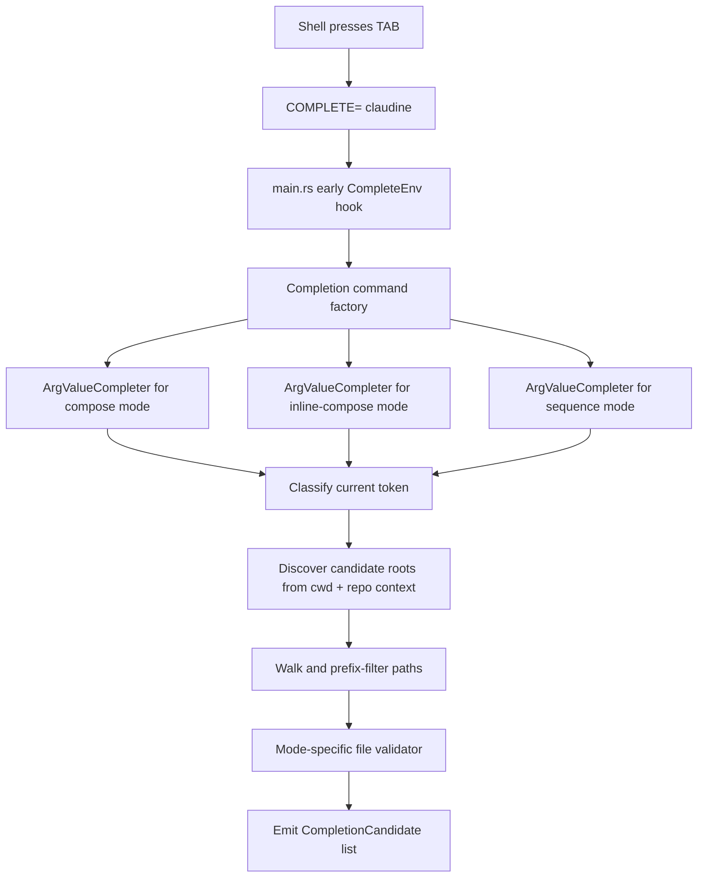

# File Completion Tech Design

This document turns `claudine/features/2026-04-17-file-completion/spec.md` into an implementation-ready design for Claudine's CLI command graph, composition-source validation, and shell completion install flow.

Primary inputs:

- `claudine/features/2026-04-17-file-completion/spec.md`
- current CLI argument graph in `claudine/cli/src/args.rs`
- current shell completion command in `claudine/cli/src/commands/completions.rs`
- current entrypoint and wrapper parsing in `claudine/cli/src/main.rs`
- current composition positional parsing in `claudine/cli/src/commands/compose.rs`
- current composition-source validation in `claudine/lib/src/composition/resolve.rs`
- current inline prompt validation in `claudine/lib/src/composition/prepare.rs`
- current sequence detection in `claudine/lib/src/composition/sequence.rs`
- current repo/package-area discovery in `sniff::filesystem::repo`

The core design decision is to implement file completion as a Claudine-owned dynamic completion layer inside the CLI binary, not as a smarter static script and not as a library feature inside `claudine/lib`.

## Summary

This feature adds dynamic completion for the shared positional `args: Vec<String>` used by:

1. `claudine compose`
2. `claudine inline-compose`
3. `claudine sequence`

The completion path will:

1. run through `clap_complete`'s dynamic `CompleteEnv` flow
2. attach a mode-specific `ArgValueCompleter` to each command's positional `args`
3. classify the current token as a setter, bare path, `./` / `../`, `@`, `!`, or unsupported prefix
4. discover filesystem candidates from the appropriate scope
5. filter files through the command-specific validity contract
6. emit only valid candidates, with no warnings or annotations for rejected files

The completion implementation stays intentionally CLI-local. Runtime execution semantics for `compose`, `inline-compose`, and `sequence` do not change.

## Goals

1. Add dynamic completion for the file-reference positional on `compose`, `inline-compose`, and `sequence`.
2. Preserve existing wrapper passthrough parsing and non-completion CLI behavior.
3. Use per-command validity filters that mirror existing Claudine composition gates closely enough to avoid misleading suggestions.
4. Suppress completion entirely for setter-shaped partials using the spec's strict regex.
5. Bound completion-time I/O with explicit walk, result, and file-size limits.
6. Replace the current static `claudine completions <shell>` output with shell bootstrap snippets for dynamic completion.

## Non-Goals

1. No change to runtime file resolution semantics in `resolve_composition_source`.
2. No setter-name or setter-value completion.
3. No position-aware suppression after the file positional has already been matched earlier on the command line.
4. No `vault:`, absolute-path, `%`, or `{{ENV}}` expansion support in v1.
5. No new shared library API in `claudine/lib` unless implementation discovers a real reuse opportunity.

## Current Baseline

Today Claudine's completion path is entirely static:

1. `claudine completions <shell>` calls `clap_complete::generate(...)`.
2. The generated script uses Clap's normal hints and generic file-path behavior.
3. The composition commands expose one repeated positional, `args: Vec<String>`, which is interpreted later by `parse_composition_positionals(...)`.
4. File vs setter classification happens only at runtime, after the command has already launched.

That means the shell has no knowledge of:

1. Claudine's `FileReference` sigils
2. the shared positional grammar of `one file reference + zero or more key=value setters`
3. the difference between `compose`'s extension-only check and `inline-compose` / `sequence` frontmatter-aware checks

## Design Clarifications

### 1. Dynamic completion should use `ArgValueCompleter`, not `ArgValueCandidates`

The spec names a `CompletionCandidates`-style hook, but `clap_complete 4.5.x` exposes two relevant dynamic APIs:

1. `ArgValueCandidates` for static candidate sets
2. `ArgValueCompleter` for partial-aware candidate generation

This feature needs the second form because candidate generation depends on the current partial. The implementation should therefore use `ArgValueCompleter`.

### 2. Completion wiring belongs in a command-factory layer

The derive structs in `args.rs` should remain the source of truth for runtime parsing, but dynamic completion needs a slightly different command graph:

1. wrapper subcommands still need `ignore_errors(true)` in the completion graph so passthrough completion does not regress
2. `compose`, `inline-compose`, and `sequence` need dynamic completers attached to their shared positional

Rather than baking this into the derive attributes, add a small command-factory layer that starts from `Cli::command()` and mutates the built `clap::Command` for completion use.

### 3. Completion exits before normal CLI startup

`CompleteEnv` must run before normal parsing and before any stdout output. The entrypoint should therefore:

1. install `color-eyre`
2. call the completion hook
3. exit immediately if the process was invoked as a completion subprocess
4. continue into the existing runtime path otherwise

This keeps completion independent from config checks, telemetry, and wrapper launch logic.

### 4. Empty partial is a landing menu, not a literal filesystem mode

The spec's bare `<TAB>` behavior is best implemented as a union of preview scopes:

1. bare cwd-relative suggestions
2. `@...` suggestions for repo-level magic candidates
3. `!...` suggestions for the current package area

Without sigil-prefixed output for the repo and package scopes, many suggestions would not be selectable from an empty partial.

### 5. Setter suppression should follow the spec literally

Runtime setter parsing currently allows hyphenated keys like `my-key=value`, but the spec's suppression regex is stricter:

```regex
^[A-Za-z_][A-Za-z0-9_]*=
```

The completion layer should implement the spec as written, not reuse `parse_compose_setter(...)` directly. This keeps v1 behavior predictable and preserves the spec's explicitly narrow suppression rule.

Consequences in v1:

1. `topic=<TAB>` suppresses
2. `_internal=<TAB>` suppresses
3. `foo.bar=<TAB>` does not suppress
4. `my-key=<TAB>` does not suppress, even though runtime parsing would later accept it as a setter

That parser/completer grammar drift should be called out in the implementation notes and can be revisited later.

### 6. `inline-compose` validity should be slightly stricter than runtime today

`prepare_inline(...)` currently requires `prompt` to be a string, but it does not reject the empty string. The spec says completion should only show files with a non-empty string `prompt:` field.

The completion validator should therefore treat `prompt: ""` and whitespace-only prompt strings as non-candidates. This is a completion-only quality filter, not a runtime behavior change.

## Target Architecture



## Recommended Module Layout

### CLI

Add a dedicated completion area under `claudine/cli/src/`:

```text
claudine/cli/src/
├── completion/
│   ├── mod.rs
│   ├── command_factory.rs
│   ├── file_reference.rs
│   ├── validate.rs
│   └── bootstrap.rs
```

Recommended responsibilities:

- `completion/mod.rs`
  - public entrypoints
  - `maybe_complete()`
  - shared constants
- `completion/command_factory.rs`
  - build the completion-aware `clap::Command`
  - attach `ArgValueCompleter`s
  - preserve lenient wrapper subcommands
- `completion/file_reference.rs`
  - token classification
  - repo-context discovery
  - scope-root selection
  - directory walking
  - candidate formatting and deduplication
- `completion/validate.rs`
  - extension-only check for `compose`
  - prompt-frontmatter check for `inline-compose`
  - sequence-plan check for `sequence`
- `completion/bootstrap.rs`
  - render `claudine completions <shell>` bootstrap snippets

### Existing files

Update:

- `claudine/cli/src/main.rs`
- `claudine/cli/src/commands/completions.rs`
- `claudine/cli/src/commands/mod.rs`
- `claudine/docs/shell-completions.md`
- `claudine/docs/topics/composition.md`
- `claudine/cli/tests/command_routing.rs`
- add a new CLI integration test file for dynamic completion behavior

## Command Factory Design

Introduce a completion-specific factory instead of calling `Cli::command()` directly from `CompleteEnv`.

Recommended shape:

```rust
pub(crate) fn completion_command() -> clap::Command
```

Behavior:

1. start from `Cli::command()`
2. mutate wrapper subcommands with `ignore_errors(true)` just like the existing lenient parse path
3. attach one dynamic completer to:
   - `compose.args`
   - `inline-compose.args`
   - `sequence.args`
4. leave all other commands unchanged

The completers should be mode-specific:

1. `ComposeMode::Compose`
2. `ComposeMode::InlineCompose`
3. `ComposeMode::Sequence`

This avoids branching on the command name inside the completion algorithm itself.

## Entrypoint Integration

`main.rs` should gain an early completion hook:

```rust
color_eyre::install()?;
completion::maybe_complete();
```

`maybe_complete()` should internally call:

```rust
clap_complete::CompleteEnv::with_factory(completion_command).complete();
```

Important behavior:

1. completion subprocesses never reach `parse_cli()`
2. completion subprocesses never run config checks
3. completion subprocesses never initialize user-facing logging
4. normal interactive and non-interactive sessions remain unchanged

## Candidate Model

Use one internal representation while walking:

```rust
struct FileCompletionEntry {
    value: String,
    resolved_path: PathBuf,
    is_dir: bool,
    source_rank: u8,
}
```

`value` is what will be inserted into the shell. `resolved_path` is what the validator inspects. `source_rank` gives deterministic ordering across mixed scopes.

Recommended source ranking:

1. cwd-local bare suggestions
2. package-area suggestions
3. repo-wide magic suggestions
4. home-scoped magic suggestions

Within a rank, sort lexically by the emitted completion value.

Deduplicate by emitted `value`, keeping the lowest `source_rank`. This ensures the most local interpretation wins when two scopes render the same token.

## Token Classification

Classify the current partial into one of these cases:

1. `SetterPartial`
2. `Bare`
3. `DotRelative`
4. `DotDotRelative`
5. `Magic`
6. `Package`
7. `Unsupported`

Rules:

1. `SetterPartial` if the current token matches `^[A-Za-z_][A-Za-z0-9_]*=`
2. `Magic` if it starts with `@`
3. `Package` if it starts with `!`
4. `DotRelative` if it starts with `./`
5. `DotDotRelative` if it starts with `../`
6. `Unsupported` for:
   - `vault:`
   - absolute `/`
   - `%`
   - `{{`
7. everything else is `Bare`

Behavior by class:

1. `SetterPartial` returns zero candidates immediately
2. `Unsupported` returns zero candidates immediately
3. all other classes continue into scope-specific discovery

## Repo Context Discovery

Completion needs lightweight repo awareness but not full filesystem inventory.

Use `sniff::filesystem::repo::detect_repo_structure(...)` for repo detection. This gives:

1. repo root
2. package list
3. package areas

Recommended context struct:

```rust
struct CompletionRepoContext {
    cwd: PathBuf,
    repo_root: Option<PathBuf>,
    repo: Option<sniff::filesystem::repo::RepoInfo>,
    current_package_area: Option<String>,
    current_package_area_root: Option<PathBuf>,
}
```

`current_package_area` should come from `RepoInfo::package_area_for_dir(&cwd)`.

`current_package_area_root` should be computed with the same deepest-match logic Claudine already uses in:

- `claudine/cli/src/commands/wrap/env.rs`
- `claudine/lib/src/system_prompt/context.rs`

Implementation recommendation:

1. extract the package-area-root selection logic into one small shared helper in the CLI crate
2. use that helper in completion instead of copying a third variant of the same algorithm

## Scope Discovery

### 1. `./` and `../`

Use direct filesystem completion semantics:

1. resolve the parent directory from the typed prefix
2. list only immediate children
3. return directories with trailing `/`
4. return files only when they pass the mode validator

This path does not need recursive walking.

### 2. `!`

`!` completion is rooted at the current package area only.

Rules:

1. if `cwd` is not inside a package area, return zero candidates
2. walk recursively under `current_package_area_root`
3. emit completion values as `!<path-relative-to-area-root>`

Example:

- area root: `<repo>/claudine`
- file: `<repo>/claudine/prompts/review.md`
- emitted value: `!prompts/review.md`

### 3. `@`

`@` completion should walk these roots:

1. current repo root, if available
2. `~/.claudine/prompts`
3. `~/.claudine/sequences`

Implementation note:

Runtime `resolve_composition_source(...)` prepends the current package area into `@` lookup via `with_package_area_magic_path()`. The spec's `@` table does not include that extra root. Completion should follow the spec for v1 and keep package-area-scoped completion under `!` and the bare landing menu. This keeps the emitted `@...` space predictable.

Emit values relative to each root:

1. repo-root matches render as `@<relative>`
2. home prompts root renders as `@prompts/<relative>`
3. home sequences root renders as `@sequences/<relative>`

### 4. Bare partial

Bare completion is a curated preview union:

1. cwd immediate children as bare relative values
2. repo-root immediate children rendered into the `@...` namespace
3. repo `<root>/prompts` depth-1 children as `@prompts/...`
4. repo `<root>/sequences` depth-1 children as `@sequences/...`
5. current package-area `<area>/prompts` depth-1 children as `!prompts/...`
6. current package-area `<area>/sequences` depth-1 children as `!sequences/...`

This gives the user a useful starter menu without forcing a recursive walk on empty input.

## Directory Walking

Use a manual `std::fs::read_dir` walker rather than adding a new dependency.

Reasons:

1. the feature only needs shallow recursion with a few explicit bounds
2. not following symlinks is enough to avoid cycles in v1
3. the CLI already has all required dependencies

Recommended constants:

```rust
const MAX_RECURSION_DEPTH: usize = 4;
const MAX_CANDIDATES: usize = 500;
const MAX_FRONTMATTER_BYTES: u64 = 1024 * 1024;
const SKIP_DIR_NAMES: &[&str] = &[
    ".git",
    "target",
    "node_modules",
    "dist",
    "build",
    ".next",
    ".venv",
    "venv",
    "__pycache__",
];
```

Special-case skip:

1. skip `.shadow` only when it sits under `.claudine/`
2. do not globally skip all directories named `.shadow`

Walking rules:

1. never follow symlinked directories
2. stop recursion when `depth > MAX_RECURSION_DEPTH`
3. stop collecting once `MAX_CANDIDATES` visible results are accumulated
4. skip unreadable directories silently

## Validation Strategy

Validation should happen after prefix narrowing and after the walker has already reduced the candidate set.

Directories are always allowed through. Only files are validated.

### Compose validator

Accept a file if:

1. it has extension `.md` or `.markdown`

Do not parse frontmatter.

### Inline-compose validator

Accept a file if:

1. it has extension `.md` or `.markdown`
2. its size is at most `MAX_FRONTMATTER_BYTES`
3. it can be read as UTF-8
4. its frontmatter contains `prompt`
5. `prompt` is a string
6. `prompt.trim()` is not empty

Implementation recommendation:

1. read the file once
2. construct `darkmatter::markdown::Markdown` from the text
3. inspect `markdown.frontmatter().as_map().get("prompt")`

Any parse or I/O failure becomes "not a candidate".

### Sequence validator

Accept a file if:

1. it has extension `.md` or `.markdown`
2. its size is at most `MAX_FRONTMATTER_BYTES`
3. it can be read as UTF-8
4. `resolve_sequence_plan(...)` returns `Ok(Some(_))`

Implementation recommendation:

1. build a temporary `ResolvedCompositionSource`
2. call the existing `claudine::composition::resolve_sequence_plan(...)`

This keeps `sequence` completion aligned with the real sequence parser, including external YAML references.

## Error Handling

Completion must be fail-closed and silent.

For all candidate evaluation paths:

1. unreadable directories are skipped
2. unreadable files are skipped
3. malformed YAML frontmatter is skipped
4. oversized files are skipped
5. missing repo/package-area context is treated as empty scope
6. non-UTF-8 paths are skipped

The completion subprocess should never print diagnostics to stdout or stderr for these conditions.

## `claudine completions <shell>` Redesign

Replace the current static generator with explicit bootstrap snippets that activate dynamic completion.

Recommended shell output:

| Shell | Output shape |
| --- | --- |
| `bash` | `source <(COMPLETE=bash claudine)` |
| `zsh` | `source <(COMPLETE=zsh claudine)` |
| `fish` | `COMPLETE=fish claudine | source` |
| `powershell` | `$env:COMPLETE=\"powershell\"; claudine | Out-String | Invoke-Expression; Remove-Item Env:\\COMPLETE` |
| `elvish` | `eval (E:COMPLETE=elvish claudine | slurp)` |

This command should remain config-free and continue writing to stdout only.

Design choice for v1:

1. do not retain the old static `clap_complete::generate(...)` path
2. support the same shell set, but only through dynamic bootstrap snippets

This keeps the mental model simple and avoids dual-path testing.

## Documentation Changes

Update:

1. `docs/shell-completions.md`
2. `claudine/docs/topics/composition.md`
3. `claudine/cli/src/commands/completions.rs` examples and help text

Documentation should state clearly:

1. users still install completion once by writing the snippet into shell startup
2. behavior updates now ship with the binary
3. `compose`, `inline-compose`, and `sequence` have command-specific file validation during completion
4. unsupported prefixes like `vault:` and `/` intentionally return no candidates in v1

## Testing Plan

### Unit tests

Add focused unit tests under the new completion module for:

1. token classification
2. setter suppression regex
3. bare landing-menu formatting
4. `@` value rendering
5. `!` value rendering
6. depth cap enforcement
7. candidate cap enforcement
8. skip-list behavior
9. symlinked directory non-recursion
10. compose validator extension filter
11. inline prompt validator, including empty-string rejection
12. sequence validator using inline and external sequence definitions

### Integration tests

Add a new CLI test file, for example:

`claudine/cli/tests/completion_cli.rs`

Recommended coverage:

1. `claudine completions <shell>` prints the dynamic bootstrap snippet and nothing on stderr
2. bash-style dynamic completion request for `compose @pro` returns only markdown candidates
3. bash-style dynamic completion request for `inline-compose @` excludes files without a valid `prompt`
4. bash-style dynamic completion request for `sequence @` excludes files without a valid `sequence`
5. setter partials return zero candidates
6. unsupported prefixes return zero candidates cleanly

The end-to-end dynamic-completion tests can invoke the binary directly with environment variables used by `clap_complete`'s shell adapters, for example:

1. `COMPLETE=bash`
2. `_CLAP_COMPLETE_INDEX=<n>`
3. `-- <command words...>`

### Regression tests

Update `claudine/cli/tests/command_routing.rs` so the completion-command assertions match the new bootstrap output instead of the old static script markers.

## Risks and Follow-Ups

### 1. `clap_complete` unstable API

Dynamic completion depends on `clap_complete`'s `unstable-dynamic` feature. Implementation should:

1. pin the crate version intentionally
2. note the dependency risk in release notes
3. avoid wrapping too much custom logic around private or undocumented behavior

### 2. Setter grammar drift

The spec's suppression regex is narrower than runtime setter parsing. This is acceptable for v1, but it should be tracked explicitly so users are not surprised by `my-key=<TAB>`.

### 3. `@` scope vs runtime magic resolution

Runtime `@` resolution currently benefits from `with_package_area_magic_path()`, while the spec keeps package-area completion in `!` and the bare landing menu. If user feedback shows this is confusing, the next iteration should reconcile the two more tightly.

### 4. Latency measurement

The design deliberately adds bounded I/O to the completion path. Implementation should measure cold-cache completion latency and record the results in the feature notes before rollout, even though no fixed SLO is part of this spec.

## Implementation Order

Recommended order:

1. add the completion command factory and early `main.rs` completion hook
2. rewrite `claudine completions <shell>` to emit bootstrap snippets
3. implement token classification and scope discovery
4. implement mode-specific validators
5. add unit tests for walking and validation
6. add end-to-end dynamic completion integration tests
7. update docs

That sequence keeps the work incrementally testable and prevents the shell-install flow from drifting away from the actual completion engine.
