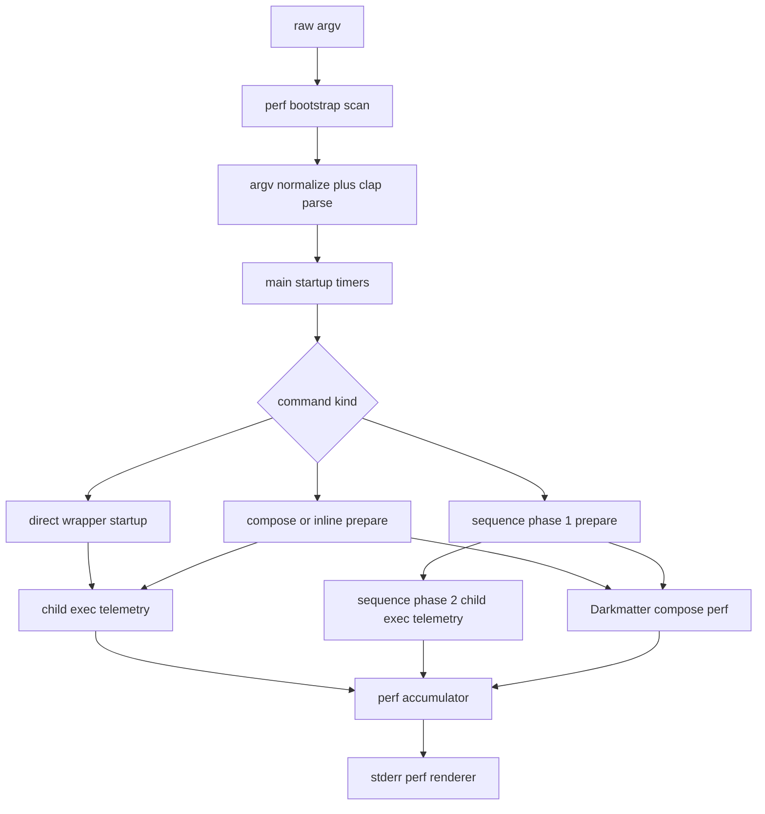

# Performance Flag Tech Design

This document turns [spec.md](./spec.md) into an implementation-ready design for adding `--perf` to Claudine's wrapper and composition commands.

Primary inputs:

- `claudine/features/2026-04-17-perf-flag/spec.md`
- `claudine/cli/src/main.rs`
- `claudine/cli/src/commands/{compose,sequence}.rs`
- `claudine/cli/src/commands/wrap/{mod,composition,sequence,exec}.rs`
- `claudine/lib/src/composition/{prepare,types}.rs`
- `claudine/lib/src/stream/{semantic,summary}.rs`
- `darkmatter/cli/src/commands.rs`
- `darkmatter/lib/src/markdown/compose/{types,perf}.rs`

## Summary

Claudine will add an opt-in `--perf` flag to:

- direct provider wrappers: `claudine {agent} ...`
- `claudine compose`
- `claudine inline-compose`
- `claudine sequence`

The implementation will use manual `Instant` timers, following Darkmatter's existing pattern, but it will split the measurements into three Claudine-specific sections:

1. `CLI Overhead`
2. `Composition Report` when document composition occurred
3. `Agent Execution`

The final report is emitted to `stderr` only, after the command has finished. `stdout` remains unchanged. `sequence` aggregates step-level data and prints exactly one report at the end of the run.

## Goals

1. Add `--perf` to all supported command surfaces without making it a global flag for unrelated subcommands.
2. Measure end-to-end time with distinct breakdowns for arg parsing, config loading, tracing init, and environment setup.
3. Reuse Darkmatter's composition perf model instead of inventing a second composition profiler inside Claudine.
4. Measure provider execution in a way that works for both structured and legacy child-process paths.
5. Keep the disabled path cheap.
6. Emit one aggregated report for `sequence`, never per-step reports.

## Non-Goals

1. No `--perf` support for admin commands such as `hooks`, `logs`, `mcp`, or `sync`.
2. No new JSONL or SQLite reporting surface in the first pass.
3. No attempt to expose every internal provider phase beyond a stable "first response latency" plus total execution time.
4. No refactor of Darkmatter's CLI perf renderer into a shared crate in this feature.
5. No requirement to render a perf report for invalid clap invocations that fail before command dispatch.

## Current Baseline

Today the relevant execution path looks like this:

1. `claudine/cli/src/main.rs`
   - normalizes argv
   - parses clap args
   - initializes tracing
   - ensures config exists
   - dispatches to wrappers or composition commands
2. `claudine/cli/src/commands/wrap/mod.rs`
   - owns direct wrapper startup, env setup, system prompt setup, MCP setup, and child launch
3. `claudine/cli/src/commands/wrap/composition.rs`
   - owns wrapper-grade composition execution
4. `claudine/cli/src/commands/wrap/sequence.rs`
   - orchestrates multi-step sequences
5. `claudine/lib/src/composition/prepare.rs`
   - composes the source document but discards the returned Darkmatter compose report
6. `claudine/cli/src/commands/wrap/exec.rs`
   - records total child duration in `StreamExecutionSummary.duration_ms`
   - does not expose first-response latency or a reusable execution telemetry struct

Darkmatter already has the right composition-side precedent:

- `darkmatter/cli/src/commands.rs` measures CLI-envelope timings with `Instant`
- `darkmatter/lib/src/markdown/compose/perf.rs` aggregates pipeline timings
- the report is emitted to `stderr` only after command completion

That existing split is the right model to copy: library-owned composition timings plus CLI-owned envelope timings.

## Proposed Architecture



The design intentionally keeps the responsibility split clear:

- `main.rs` owns bootstrap and startup timings
- composition preparation owns composition perf capture
- `exec.rs` owns child execution telemetry
- each command flow owns aggregation
- one renderer owns final stderr formatting

## CLI Surface

### Supported flags

Add `perf: bool` to:

- `claudine/cli/src/commands/wrap/mod.rs` in `WrapperArgs`
- `claudine/cli/src/commands/compose.rs` in `SharedComposeArgs`

This automatically covers:

- all direct wrapper subcommands through `WrapperArgs`
- `compose`
- `inline-compose`
- `sequence`

### Wrapper passthrough extraction

Direct wrappers already merge flags from two sources:

- clap-parsed fields on `WrapperArgs`
- `extract_wrapper_flags_from_passthrough(...)` for flags that appear after the first positional

`--perf` must be added to `ExtractedWrapperFlags` and recognized by `extract_wrapper_flags_from_passthrough_with_boundary(...)`, with the same `--` boundary rules as `--quiet`, `--repo`, and `--operation`.

That keeps wrapper behavior consistent for commands such as:

```sh
claudine codex "fix this" --perf
claudine codex "fix this" -- --perf
```

Only the first form should enable Claudine perf mode.

### Perf bootstrap scan

Arg parsing itself must be timed, which means Claudine must know whether perf is enabled before full clap parsing completes.

Add a small raw-argv bootstrap helper in a new CLI module, for example:

```rust
pub(crate) struct PerfBootstrap {
    pub enabled: bool,
    pub command_kind: Option<PerfCommandKind>,
    pub started_at: Option<Instant>,
}
```

The bootstrap scan should:

1. read `std::env::args_os()` once in `main`
2. detect whether the subcommand is one of:
   - wrapper provider commands
   - `compose`
   - `inline-compose`
   - `sequence`
3. detect `--perf` before the first literal `--`
4. start the arg-parsing timer only when the command is eligible and `--perf` is present

This keeps the disabled path cheap while still letting Claudine time `argv::normalize(...)` and `parse_cli_from(...)`.

## Data Model

### Startup and command-level telemetry

Add a new CLI-local perf module, for example `claudine/cli/src/perf.rs`, with types shaped roughly like this:

```rust
pub(crate) struct CliOverheadReport {
    pub arg_parsing: Duration,
    pub config_loading: Duration,
    pub tracing_init: Duration,
    pub environment_setup: Duration,
}

pub(crate) struct AgentExecutionPerf {
    pub launches: usize,
    pub total_elapsed: Duration,
    pub first_response_latency: Option<Duration>,
    pub provider_api_duration: Option<Duration>,
}

pub(crate) struct CommandPerfReport {
    pub title: &'static str,
    pub total_elapsed: Duration,
    pub cli: CliOverheadReport,
    pub composition: Option<darkmatter::markdown::compose::ComposePerfReport>,
    pub agent: Option<AgentExecutionPerf>,
    pub notes: Vec<String>,
}
```

This remains CLI-local because the report is presentation-oriented and only relevant to the `claudine` binary.

## Composition preparation payload

`claudine/lib/src/composition/prepare.rs` currently throws away the Darkmatter report:

```rust
let (composed, _report) = ...
```

That needs to become a first-class prepared output.

Extend `PreparedComposition` in `claudine/lib/src/composition/types.rs`:

```rust
pub struct PreparedComposition {
    ...
    pub compose_perf: Option<ComposePerfReport>,
}
```

Also extend `PrepareOptions` with:

```rust
pub perf_enabled: bool,
```

Then:

- `prepare_direct(...)` calls `ComposeOptions::with_perf(options.perf_enabled)`
- `prepare_inline(...)` does the same
- both functions retain `report.perf`

This is the key seam that lets `compose`, `inline-compose`, and `sequence` reuse the same composition performance payload.

## Child-process execution telemetry

Add a generic execution telemetry struct in `claudine/cli/src/commands/wrap/exec.rs`:

```rust
pub(crate) struct ProcessTelemetry {
    pub total_elapsed: Duration,
    pub first_response_latency: Option<Duration>,
}
```

Then extend `ProcessResult<T>`:

```rust
pub(crate) struct ProcessResult<T> {
    pub(crate) data: T,
    pub(crate) termination: ProcessTermination,
    pub(crate) telemetry: ProcessTelemetry,
}
```

This is better than extending `StreamExecutionSummary` because:

- `run_child(...)` and `run_child_capture(...)` also need to return telemetry
- the first-response latency is a local execution concern, not reporting schema
- we avoid broadening JSON serialization and reporting ingestion in the first pass

## Timing Boundaries

### 1. Arg Parsing

Measured in `main.rs` from just before `argv::normalize(...)` until just after `parse_cli_from(...)`.

Included work:

- raw argv normalization
- provider flag rewriting
- fuzzy provider canonicalization
- wrapper lenient parse path when applicable

Not included:

- `color_eyre::install()`
- actual command execution

### 2. Config Loading

Measured around `ensure_config_exists().await?` in `main.rs`.

This includes:

- config existence check
- config load and validation
- old-format backup detection
- initialization rerun when required

For wrapper commands this timing happens before `run_provider_wrapper(...)`. For compose and sequence it happens before their command handlers run.

### 3. Tracing Init

Measured around:

- `telemetry::init_tracing(cli.debug)`
- `telemetry::root_span(&cli)`

This keeps the metric aligned with what the CLI actually does between parsing and dispatch.

### 4. Environment Setup

This is the broadest startup bucket and must end immediately before the first child process launch or dry-run output.

#### Direct wrappers

For `run_provider_wrapper_inner(...)`, environment setup includes:

- startup detection from `detect_wrap_startup(...)`
- binary resolution
- passthrough flag extraction
- prompt extraction and optional editor flow
- model/output/system prompt application
- sandbox application
- env plan construction
- MCP session computation and runtime injection
- wrapper harness discovery and preflight
- CWD switching
- structured stream plumbing construction

#### Compose and inline-compose

For `execute_composition_request_inner(...)`, environment setup includes:

- provider selection
- binary resolution
- env plan construction
- MCP session setup
- system prompt setup
- harness detection and shell preflight
- request-level environment injection

The actual Darkmatter document composition belongs in the `Composition Report`, not in `Environment Setup`.

#### Sequence

For `execute_sequence(...)`, environment setup includes both sequence phases that happen before each child launch:

- sequence plan resolution
- per-step shell preflight
- per-step `prepare_direct(...)`
- per-step harness preflight
- per-step request construction

Because `sequence` prints a single final report, these setup timings are aggregated across all steps.

### 5. Composition Report

Only emitted when document composition occurred.

This section uses Darkmatter's existing `ComposePerfReport`, captured during:

- `prepare_direct(...)`
- `prepare_inline(...)`

For `sequence`, all step-level `ComposePerfReport` values are merged with `ComposePerfReport::merge(...)`.

Harness-only recomposition in `claudine/cli/src/commands/wrap/mod.rs` is intentionally not included in the composition block. It is implementation overhead for wrapper harness support, not the user-facing composition document pipeline from the spec.

### 6. Agent Execution

This section covers provider runtime and first-response latency.

#### Total execution time

Measured from just before `Command::spawn()` in `exec.rs` until the child fully exits and stream reader threads have joined.

#### First-response latency

This metric is defined as:

- preferred: time from child spawn to first semantic stdout event
- fallback: time from child spawn to first non-filtered stdout line
- final fallback: time from child spawn to first non-filtered stderr line

This is an observed latency, not a provider-reported server-side metric. It is the most robust cross-provider approximation of "how long until the model started responding".

#### Provider API duration

When `StreamExecutionSummary.duration_api_ms` is present, the renderer should show it as an additional detail line under `Agent Execution`.

This is separate from total execution time:

- total execution time is wall-clock child lifetime
- API duration is provider-reported remote work when available

## Command Flow Changes

### Direct wrapper commands

`run_provider_wrapper_inner(...)` will build a `WrapperPerfCollector` only when `args.perf || extracted.perf` is true.

The collector should:

1. accept startup timings from `main.rs`
2. time wrapper environment setup
3. gather `ProcessTelemetry` from `exec::run_child(...)`, `exec::run_child_capture(...)`, or `exec::run_child_stream_semantic(...)`
4. render the final report after the existing completion/error reporting path

Interactive direct wrappers may not always have a semantic first-response signal. In that case the report falls back to first visible process output, and if even that is unavailable, renders the latency as skipped (`--`).

### Compose and inline-compose

`SharedComposeArgs` gains `perf: bool`.

`run_compose_inner(...)` and `run_inline_compose_inner(...)` will:

1. pass `perf_enabled` into `PrepareOptions`
2. include the resulting `PreparedComposition.compose_perf` in the request or local accumulator
3. extend `CompositionExecutionRequest` with a `perf: bool` flag if command-level execution code needs it

`execute_composition_request_inner(...)` will return richer outcome data:

```rust
pub(crate) struct SingleCompositionOutcome {
    pub exit_code: i32,
    pub provider: Provider,
    pub perf: Option<AgentExecutionPerf>,
}
```

That lets `compose`, `inline-compose`, and `sequence` share the same downstream aggregation logic.

### Sequence

`sequence` needs a dedicated accumulator because it has two distinct phases.

Add a `SequencePerfAccumulator` in either the new CLI perf module or `wrap/sequence.rs`:

```rust
struct SequencePerfAccumulator {
    environment_setup: Duration,
    composition: Option<ComposePerfReport>,
    launches: usize,
    agent_total: Duration,
    first_response_latencies: Vec<Duration>,
    provider_api_total: Duration,
}
```

Behavior:

1. Phase 1 preflight and prepare work contributes to `environment_setup`
2. each prepared step merges `PreparedComposition.compose_perf`
3. each executed step merges child execution telemetry
4. exactly one final report is rendered after the existing sequence summary

For the final aggregated latency line, sequence should render:

- `first response avg`
- `first response min`

Using a single "first response latency" number for the whole sequence would be misleading once there are multiple provider launches. Averaging plus minimum keeps the report aggregated while still useful.

If a sequence is interrupted or stops on fail-fast, Claudine should still render a partial perf report for the work already performed, followed by a note such as `partial sequence metrics`.

## Rendering

Add one shared renderer in the new CLI perf module, for example:

```rust
pub(crate) fn render_perf_report(report: &CommandPerfReport) -> String
```

### Visual layout

The report should be emitted as stacked block-style sections on `stderr`:

1. `Performance`
2. `CLI Overhead`
3. `Composition Report` when present
4. `Agent Execution`

Use `biscuit_terminal` rendering primitives already used elsewhere in Claudine. The composition block should mirror Darkmatter's duration formatting and deterministic stage ordering, but Claudine should implement its own renderer rather than reaching into Darkmatter CLI private code.

### Example shape

The exact markup may vary, but the intended output shape is:

```text
▌ Performance (elapsed 3.42s)
▌
▌ CLI Overhead
▌   arg parsing:         2.1ms
▌   config loading:      18.2ms
▌   tracing init:        4.5ms
▌   environment setup:   312ms
▌
▌ Composition Report
▌   total:               280ms
▌   interpolation:       20.4ms
▌   shell expansion:     90.3ms
▌   transclusion apply:  41.1ms
▌
▌ Agent Execution
▌   launches:            1
▌   first response:      1.12s
▌   total execution:     2.79s
▌   provider api:        2.33s
```

### Emission point

The perf report must render after the command's ordinary stderr lifecycle is complete:

- after wrapper summaries and error reports
- after compose and inline-compose summaries and closure messages
- after the final sequence summary

This preserves current UX and ensures stdout consumers never see perf text.

### Dry run behavior

`--dry-run --perf` should still render a report, but:

- `Composition Report` appears only if preparation occurred
- `Agent Execution` renders skipped values with a `dry run` note

## File-Level Implementation Plan

### `claudine/cli/src/main.rs`

1. add raw argv bootstrap scan
2. measure arg parsing
3. measure tracing init
4. measure config loading for eligible commands
5. thread startup timings into command handlers

### `claudine/cli/src/commands/compose.rs`

1. add `perf` to `SharedComposeArgs`
2. pass `perf_enabled` into `PrepareOptions`
3. carry startup timings into the composition execution path

### `claudine/cli/src/commands/sequence.rs`

1. rely on `SharedComposeArgs.perf`
2. pass perf enablement into `execute_sequence(...)`

### `claudine/cli/src/commands/wrap/mod.rs`

1. add `perf` to `WrapperArgs`
2. extend passthrough extractor
3. build wrapper-level perf collector
4. render report after wrapper execution completes

### `claudine/cli/src/commands/wrap/composition.rs`

1. return richer composition outcomes that include execution perf
2. accumulate and render compose or inline-compose perf
3. keep the final perf emission after existing summary logic

### `claudine/cli/src/commands/wrap/sequence.rs`

1. aggregate per-step composition perf
2. aggregate per-step child execution perf
3. render one final sequence perf report

### `claudine/cli/src/commands/wrap/exec.rs`

1. add `ProcessTelemetry`
2. extend `ProcessResult<T>`
3. capture first-response latency across:
   - structured streaming
   - legacy stdout piping
   - stderr-only fallback cases

### `claudine/lib/src/composition/types.rs`

1. extend `PrepareOptions` with `perf_enabled`
2. extend `PreparedComposition` with `compose_perf`

### `claudine/lib/src/composition/prepare.rs`

1. enable `ComposeOptions::with_perf(...)`
2. retain `report.perf` from Darkmatter

## Testing Strategy

### Unit tests

1. perf bootstrap only enables for supported commands and ignores unrelated subcommands
2. wrapper passthrough extraction handles `--perf` correctly before the `--` boundary
3. `prepare_direct(...)` and `prepare_inline(...)` preserve `compose_perf` only when enabled
4. `ProcessTelemetry` chooses first-response timestamps in the correct precedence order
5. report renderer omits the composition block when no composition occurred

### Integration tests

1. `claudine compose --perf ...`
   - stdout matches the same invocation without `--perf`
   - stderr contains `CLI Overhead`, `Composition Report`, and `Agent Execution`
2. `claudine inline-compose --perf ...`
   - report appears once, after inline closure output
3. `claudine sequence --perf ...`
   - report appears exactly once
   - no per-step perf sections are emitted
4. direct wrapper with structured provider
   - stderr report includes first-response and total execution
5. direct wrapper with legacy provider path
   - stderr report still includes execution total
6. `--dry-run --perf`
   - report renders without polluting stdout

## Documentation and Drift

When implementation lands, update:

- `claudine/README.md`
- `claudine/cli/README.md`
- relevant CLI docs under `claudine/docs/cli/`

The docs should explicitly state:

- `--perf` is stderr-only
- it is available on wrapper and composition commands
- `sequence` emits one aggregated report

## Risks and Tradeoffs

### Arg parsing requires a bootstrap path

Timing arg parsing forces Claudine to detect perf mode before clap finishes. That introduces a small raw-argv pre-scan, but it is still cheaper than always timing every command.

### First-response latency is observational

This metric is inferred from the first meaningful process output, not directly reported by every provider. That is the right tradeoff for a cross-provider CLI and should be documented as such in code comments.

### Harness recomposition is excluded from the composition block

This is deliberate. The spec asks for composition reporting when document composition occurred; wrapper harness internals are setup overhead, not the user-facing composition pipeline.

### No JSONL schema change in the first pass

Keeping perf data CLI-local avoids widening the reporting surface. If long-term session analytics need perf data later, that should be a follow-up feature with explicit schema design.

> **Implementation note:** `provider_api_duration` is only populated for the structured-streaming path (Codex, Gemini, OpenCode). Legacy providers such as Goose do not provide this metric, and the line is omitted from the report in those cases.

## Recommended Implementation Order

1. add CLI flag plumbing and perf bootstrap
2. add CLI-local perf data model and renderer
3. extend composition prepare types to retain `ComposePerfReport`
4. add `ProcessTelemetry` to `exec.rs`
5. wire direct wrapper reporting
6. wire compose and inline-compose reporting
7. wire sequence aggregation and final rendering
8. add docs and integration tests
