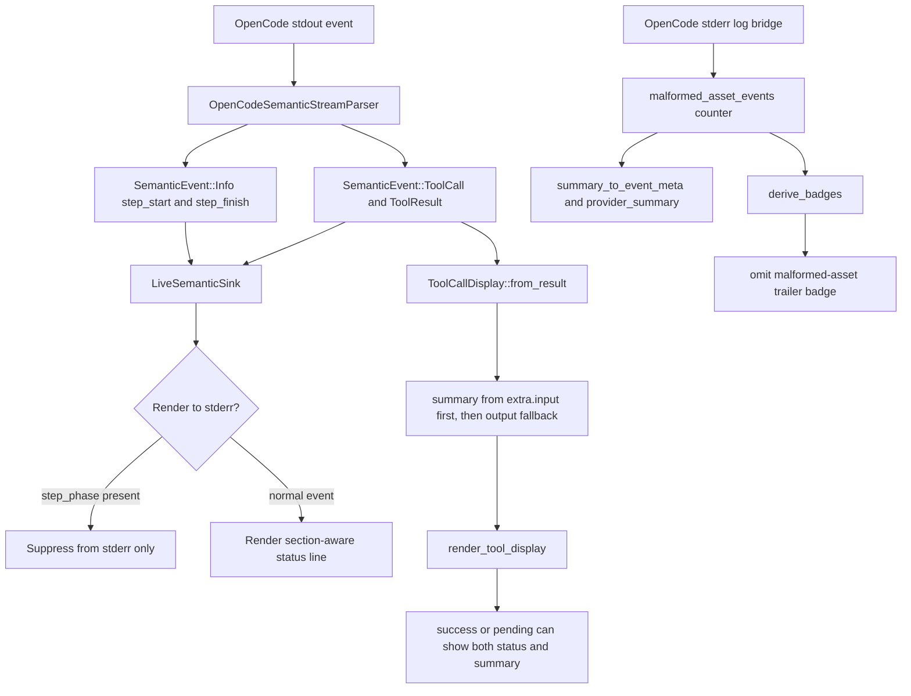

# OpenCode Reporting Improvements Tech Design

This document turns [`spec.md`](./spec.md) into an implementation-ready design for Claudine's OpenCode semantic parser, non-interactive stderr renderer, and reporting surface.

Primary inputs:

- `claudine/features/2026-04-18-opencode-reporting-improvements/spec.md`
- `claudine/lib/src/stream/opencode_semantic.rs`
- `claudine/lib/src/stream/tool_display.rs`
- `claudine/lib/src/stream/{badges,reporting,summary}.rs`
- `claudine/lib/src/stream/logs/opencode.rs`
- `claudine/cli/src/commands/wrap/{live_semantic_sink,section}.rs`
- `claudine/lib/tests/semantic_fidelity.rs`
- `claudine/cli/tests/wrap_commands.rs`

## Summary

The feature is a targeted OpenCode UX correction, not a redesign of Claudine's reporting stack.

Three user-visible defects must be fixed:

1. suppress OpenCode `step_start` and `step_finish` markers from stderr while keeping them in the semantic/logging pipeline
2. restore useful tool metadata on incoming OpenCode tool-result lines so successful `Read` and `Bash` results render symmetrically with their outgoing calls
3. stop rendering a duplicate malformed-asset trailer badge when the per-line warnings already surfaced the same condition

The main architectural decision is to keep the parser lossless and to make the stderr surface more selective. The OpenCode parser should continue emitting the same semantic information for JSONL logging and `LiveMetrics`; the live sink and trailer badge derivation become stricter about what is human-visible.

No SQLite schema change, JSONL schema change, or reporting-query change is required in this cycle.

## Goals

1. Preserve OpenCode semantic fidelity for logging and downstream reporting.
2. Make OpenCode tool-result rendering meaningfully symmetric with tool-call rendering.
3. Enforce the existing section-spacing contract on the rendered stderr surface.
4. Remove duplicate malformed-asset reporting without discarding diagnostic counters.
5. Keep scope local to OpenCode plus the shared rendering helpers it already depends on.

## Non-Goals

1. No OpenCode wire-format changes or provider-side metadata invention.
2. No new reporting tables, migrations, or `claudine logs` query changes.
3. No rename of glyphs, section ordering, or non-OpenCode trailer badge wording.
4. No cross-provider audit beyond the shared code paths touched here.
5. No parser-side removal of `step_*` events from JSONL or live metrics.

## Current Baseline

Today the OpenCode structured path behaves like this:

1. `OpenCodeSemanticStreamParser` emits `SemanticEvent::Info` for `step_start` and `step_finish`, tagging them with `extra["step_phase"]`.
2. `LiveSemanticSink::render_event(...)` renders every `Info` event as a status line in `Section::ToolUseAndEvents`.
3. `handle_tool_use(...)` caches `(tool_name, input)` by tool id, but `handle_tool_result(...)` discards the cached input when it emits the corresponding `ToolResult`.
4. `ToolCallDisplay::from_result(...)` still follows the older contract that status suppresses most summaries.
5. `LiveSemanticSink::render_tool_display(...)` only appends the summary to incoming results for file-tool paths; non-file success results still render as status-only.
6. `stream::logs::opencode` increments `malformed_asset_events`, and `stream::badges::derive_badges(...)` turns that counter into a trailer badge even though each malformed asset was already shown as a line-level warning.

That produces the current user-visible failures:

- noisy `step_start` and `step_finish` lines
- visually blank gaps around those phase markers
- `← Read(successful)` and `← Bash(successful)` with no useful slot
- duplicated malformed-asset reporting

## Design Overview



## Detailed Design

### 1. Suppress OpenCode phase markers at the sink boundary

The `step_start` and `step_finish` events are semantically useful but visually useless. They should remain in the semantic event stream and JSONL logs, but they should not be rendered to stderr.

The preferred implementation is a sink-side suppression guard in [`claudine/cli/src/commands/wrap/live_semantic_sink.rs`](../../cli/src/commands/wrap/live_semantic_sink.rs):

- gate on `self.provider == Provider::OpenCode`
- match only `SemanticEvent::Info`
- suppress only when `extra.get("step_phase")` is present

This keeps the parser lossless and matches the existing strategy used for other stderr-only suppressions in the same match arm.

Recommended helper:

```rust
fn is_suppressed_opencode_step_phase(provider: Provider, extra: &Value) -> bool
```

Behavioral contract:

1. `LiveMetrics::observe_event(...)` still sees the event
2. `semantic_event_to_event_meta(...)` still logs the event
3. only the human-facing `render_event(...)` branch changes

#### Spacing impact

The likely root cause of the visible blank noise is that the rendered `step_*` lines are acting as separators between meaningful lines, not that `SectionTracker` is fundamentally broken. The first implementation should therefore avoid changing [`section.rs`](../../cli/src/commands/wrap/section.rs).

Instead:

1. suppress the `step_*` lines
2. replay the OpenCode fixture and real-session cases
3. only touch `SectionTracker` if an independent blank-line leak still exists after suppression

This keeps the fix scoped and reduces the chance of regressing spacing for other providers.

### 2. Preserve cached tool input on OpenCode `ToolResult`

`OpenCodeSemanticStreamParser::handle_tool_use(...)` already stores both tool name and input in `self.tool_uses`. The defect is specifically in `handle_tool_result(...)`, which drops the cached input when it resolves the paired result.

The parser change is:

1. keep the current `tool_uses: HashMap<_, (Option<String>, Option<Value>)>` shape
2. in `handle_tool_result(...)`, retrieve both `cached_name` and `cached_input`
3. populate `extra["input"]` on the emitted `SemanticEvent::ToolResult`
4. if the wire-level `tool_end` payload itself includes input, prefer that value; use the cached input only as fallback

Suggested logic:

```rust
let resolved_input = resolved.input.clone().or(cached_input);
if let Some(input) = &resolved_input {
    extra.insert("input".into(), input.clone());
}
```

This aligns `handle_tool_result(...)` with the already-correct `handle_tool_use_completed(...)` path and makes OpenCode's normal paired tool flow carry the same metadata surface as its completion-only path.

### 3. Change the shared `ToolResult` summary contract

The current `ToolCallDisplay::from_result(...)` contract is too aggressive about dropping summaries once a status is present. That was compatible with a status-only slot model, but it is incompatible with the new OpenCode requirement.

The new contract should be:

1. resolve `status` exactly as today
2. derive `summary` from `extra["input"]` first
3. if no input-derived summary exists, try `output`
4. if neither yields a summary, leave `summary = None`

That means the old comment and tests that encode "status wins over summary" must be replaced with "status and summary may co-exist when the input can be summarized."

Recommended summary resolution:

```rust
let summary = extra
    .get("input")
    .and_then(|v| extract_tool_summary(raw_name, v))
    .or_else(|| output.as_ref().and_then(|v| extract_tool_summary(raw_name, v)));
```

Why input-first:

1. file tools should prefer the requested file path, not result-body content
2. shell tools should prefer the command that ran, not the command output
3. the parser now guarantees OpenCode results can carry cached input

Why output remains a fallback:

1. it preserves existing behavior for providers that only expose output-side detail
2. it avoids introducing a new provider-specific branch in shared display code

### 4. Allow status and summary to co-render for incoming results

Changing `ToolCallDisplay::from_result(...)` is necessary but not sufficient. The current [`render_tool_display(...)`](../../cli/src/commands/wrap/live_semantic_sink.rs) implementation still ignores non-file summaries whenever the status is `Success` or `Pending`.

The renderer contract must change from "status replaces summary" to "status prefixes summary when both exist."

Proposed slot matrix:

| Direction | Status | Summary kind | Rendered form |
| --- | --- | --- | --- |
| incoming | success | file path | `← Read(successful, <link>)` |
| incoming | success | non-file summary | `← Bash(successful, bash ls -la)` |
| incoming | pending | non-file summary | `← Bash(pending, bash long-job)` |
| incoming | error | file path | keep current `error, <link> <detail>` rendering |
| incoming | none/unknown | any summary | keep current summary-only rendering |

Two deliberate scope limits:

1. non-file error rendering stays as-is in this cycle; the spec only requires fixing successful OpenCode results
2. file-tool rendering keeps the current link behavior and cwd-relative visible text

Implementation shape in `render_tool_display(...)`:

- for `ToolStatus::Success`, append either the file link or escaped summary after `successful`
- for `ToolStatus::Pending`, append escaped summary when present
- leave `ToolStatus::Error` behavior unchanged except for current file-tool path handling

This is still a shared rendering improvement, but it is low-risk because it only changes cases where a structured summary already exists.

### 5. Remove the malformed-asset trailer badge, keep the diagnostics

The malformed-asset trailer badge should be deleted from [`claudine/lib/src/stream/badges.rs`](../../lib/src/stream/badges.rs). The counter in `stderr_diagnostics` should remain untouched.

Resulting behavior:

1. line-level malformed-asset warnings remain the authoritative human-visible surface
2. `stderr_diagnostics.malformed_asset_events` still contributes to JSONL summary payloads
3. `summary_to_event_meta(...)` remains unchanged
4. SQLite ingest and `claudine logs` queries remain unchanged because they already consume the diagnostics structure, not the human trailer text

This is a pure presentation change in badge derivation.

## Data Model and Reporting Impact

No reporting schema changes are needed.

### Unchanged structures

- `StreamExecutionSummary`
- `StderrDiagnostics`
- `summary_to_event_meta(...)`
- `reporting::schema`
- `reporting::queries`
- SQLite tables and indexes

### Changed semantics

1. OpenCode `ToolResult` semantic events will now carry more complete `extra["input"]` data
2. live stderr output will no longer contain OpenCode `step_*` marker lines
3. `extra["badges"]` on the final session summary will no longer include the malformed-asset `config` badge

The first change is additive and backwards-compatible. The second and third are presentation-only.

## Test Plan

The feature changes an existing rendering contract, so the tests must be updated explicitly rather than patched opportunistically.

### Library tests

In [`claudine/lib/src/stream/tool_display.rs`](../../lib/src/stream/tool_display.rs):

1. replace `from_result_uses_status_and_drops_summary_when_status_present` with a test asserting a successful shell result can keep both `status` and `summary`
2. keep the existing fallback tests for unknown status and output-only summaries
3. add a focused regression test for input-first precedence when both `extra["input"]` and `output` are present

In [`claudine/lib/tests/semantic_fidelity.rs`](../../lib/tests/semantic_fidelity.rs):

1. add an OpenCode case where `tool_start` carries `{"command":"ls"}` and `tool_end` carries `status:"success"`
2. assert the emitted `SemanticEvent::ToolResult.extra["input"]` is populated from the cached request-side input
3. keep the parser round-trip guarantees intact

In [`claudine/lib/src/stream/badges.rs`](../../lib/src/stream/badges.rs):

1. update malformed-asset badge tests to assert absence, not presence
2. keep rate-limit and auth badge tests unchanged

### Live sink tests

In [`claudine/cli/src/commands/wrap/live_semantic_sink.rs`](../../cli/src/commands/wrap/live_semantic_sink.rs):

1. replace `tool_result_status_wins_over_input_summary` with a test asserting `successful` and `bash ls -la` both appear
2. add an OpenCode replay asserting `step_start` and `step_finish` do not render
3. add an OpenCode replay asserting a successful `tool_end` renders `← Bash(successful, bash ls)`
4. keep file-tool success and file-tool error link tests intact

### Wrapper/integration tests

In [`claudine/cli/tests/wrap_commands.rs`](../../cli/tests/wrap_commands.rs):

1. update `opencode_structured_summary_merges_stderr_diagnostics_and_badges` to assert diagnostics are preserved but no `config` badge is emitted
2. add a fixture-driven integration test that counts malformed-asset warning lines and asserts there is no trailing `Config — Skipped ...` line

The existing `captured_fixtures_have_no_two_consecutive_blank_lines_per_provider` test should remain and continue to guard the shared spacing invariant. OpenCode-specific tests should supplement it by asserting the actual `step_*` lines are absent.

## Implementation Order

1. Update `opencode_semantic.rs` so `ToolResult` carries cached input.
2. Update `tool_display.rs` so result summaries prefer input and can co-exist with status.
3. Update `live_semantic_sink.rs` to suppress OpenCode `step_phase` info lines and to render status-plus-summary for incoming success and pending results.
4. Remove the malformed-asset badge from `badges.rs`.
5. Update the affected unit and integration tests.

This order keeps the intermediate states easier to reason about:

- parser first
- shared display contract second
- renderer third
- trailer cleanup last

## Risks and Mitigations

### Shared rendering drift

Risk: changing `ToolCallDisplay::from_result(...)` and `render_tool_display(...)` affects non-OpenCode providers.

Mitigation:

1. keep the new behavior additive and summary-driven
2. only append summaries when `extract_tool_summary(...)` already knows how to produce one
3. leave error rendering mostly unchanged

### Hidden blank-line source

Risk: removing `step_*` lines may not fully fix the blank-line issue.

Mitigation:

1. do not change `SectionTracker` preemptively
2. verify against replay and real-session output after suppression
3. only patch shared spacing code if a second leak remains reproducible

### Test contract churn

Risk: current tests intentionally encode the old "status wins" contract.

Mitigation:

1. rename the tests to reflect the new contract
2. update the adjacent comments so the new behavior is documented where the assertions live

## Documentation Follow-On

Because this changes the public non-interactive stderr contract, the implementation should also update the documentation that describes tool-line rendering:

1. `claudine/docs/topics/non-interactive-sessions.md`
2. any nearby feature docs that still describe "status wins over summary" for incoming tool results

No skill or reporting-doc update is required unless the implementation chooses to broaden the change beyond the design above.
