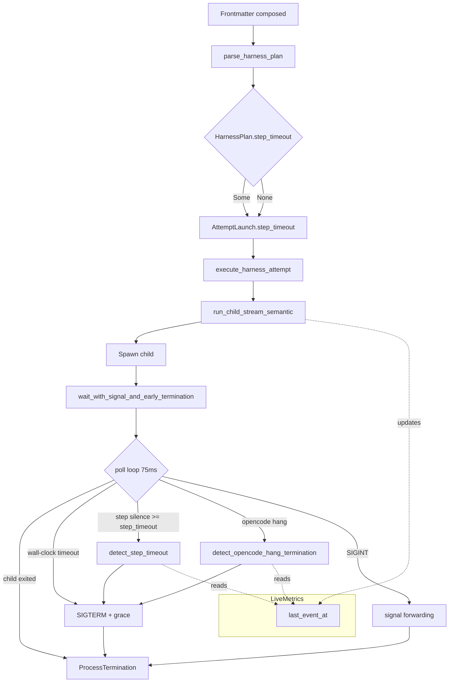

# Step Timeout — Technical Design

Companion to [`spec.md`](./spec.md). This document describes **how** the `step_timeout` feature is built inside Claudine: the data-flow surface that needs to change, the exact call sites to touch, the state transitions inside the wait loop, and the contract tests that guard the new behavior.

## Table of Contents

- [Guiding Constraints](#guiding-constraints)
- [Architectural Overview](#architectural-overview)
- [Source File Map](#source-file-map)
- [Library Changes](#library-changes)
    - [`HarnessPlan`](#harnessplan)
    - [`parse_harness_plan`](#parse_harness_plan)
    - [`HARNESS_KEYS` and `has_harness_properties`](#harness_keys-and-has_harness_properties)
    - [Validation Rules](#validation-rules)
    - [`CompositionExecutionRequest`](#compositionexecutionrequest)
- [CLI Changes](#cli-changes)
    - [`AttemptLaunch`](#attemptlaunch)
    - [Timeout Resolution Helpers](#timeout-resolution-helpers)
    - [`build_harness_launch` and `run_harness_loop`](#build_harness_launch-and-run_harness_loop)
    - [`execute_harness_attempt`](#execute_harness_attempt)
    - [Clap Surface](#clap-surface)
    - [Argv Pre-Parser](#argv-pre-parser)
- [Wait Loop Integration](#wait-loop-integration)
    - [Unified Poll Loop](#unified-poll-loop)
    - [`detect_step_timeout`](#detect_step_timeout)
    - [`EarlyTermination::StepTimeout` Variant](#earlyterminationsteptimeout-variant)
    - [`ProcessTermination::TimedOut` Promotion](#processterminationtimedout-promotion)
    - [Non-Unix Path](#non-unix-path)
- [Sequence Composition](#sequence-composition)
- [Handler Resolution](#handler-resolution)
- [Logging and Tracing](#logging-and-tracing)
- [Error Surface](#error-surface)
- [Test Strategy](#test-strategy)
- [Risks and Mitigations](#risks-and-mitigations)
- [Rollout Phases](#rollout-phases)

## Guiding Constraints

1. **Reuse `last_event_at`**. The stream layer already tracks activity in `LiveMetricsState::last_event_at`. No new tracking state is introduced in `claudine/lib/src/stream/progress.rs`.
2. **Single wait loop**. Wall-clock `timeout` and silence `step_timeout` must be enforced by the **same** poll loop so both deadlines can fire simultaneously without racing across two helper functions.
3. **Streaming-only semantics**. `step_timeout` only applies when `use_structured = true`. In capture and passthrough modes it is accepted, warned about, and ignored.
4. **Backwards compatible**. Existing `handle_timeout` handlers continue to match both wall-clock and step-silence terminations. `ProcessTermination::TimedOut` remains the single classifier.
5. **No dispatch churn**. No new `FailureEvent` variant is added in this cycle. A future `FailureEvent::StepTimeout` is possible but out of scope.

## Architectural Overview



The new enforcement point (`detect_step_timeout`) is structurally identical to the existing `detect_opencode_hang_termination`: both read `last_event_at` from the same `LiveMetrics` handle, both decide whether silence has exceeded a configured threshold, both emit an `EarlyTermination` signal that funnels into the existing SIGTERM+grace path.

## Source File Map

Absolute paths, relative to repo root:

| Concern | File |
|---|---|
| Harness plan data model | [`claudine/lib/src/harness/model.rs`](../../lib/src/harness/model.rs) |
| Harness frontmatter parser | [`claudine/lib/src/harness/parse.rs`](../../lib/src/harness/parse.rs) |
| Timeout string parser | [`claudine/lib/src/harness/timeout.rs`](../../lib/src/harness/timeout.rs) |
| Harness error type | [`claudine/lib/src/harness/error.rs`](../../lib/src/harness/error.rs) |
| Composition request type | [`claudine/lib/src/composition/types.rs`](../../lib/src/composition/types.rs) |
| Sequence step overlay | [`claudine/lib/src/composition/sequence.rs`](../../lib/src/composition/sequence.rs) |
| Live metrics | [`claudine/lib/src/stream/progress.rs`](../../lib/src/stream/progress.rs) |
| `EarlyTermination` enum | [`claudine/lib/src/stream/logs/opencode.rs`](../../lib/src/stream/logs/opencode.rs) |
| Harness loop / launch builder | [`claudine/cli/src/commands/wrap/mod.rs`](../../cli/src/commands/wrap/mod.rs) |
| Child execution / wait loop | [`claudine/cli/src/commands/wrap/exec.rs`](../../cli/src/commands/wrap/exec.rs) |
| Argv pre-parser | [`claudine/cli/src/argv.rs`](../../cli/src/argv.rs) |
| Compose / inline-compose args | [`claudine/cli/src/commands/wrap/composition.rs`](../../cli/src/commands/wrap/composition.rs) |

## Library Changes

### `HarnessPlan`

Add an optional `step_timeout` field beside `timeout`:

```rust
// claudine/lib/src/harness/model.rs
#[derive(Debug, Clone)]
pub struct HarnessPlan {
    pub source_path: PathBuf,
    pub timeout: Option<std::time::Duration>,
    pub step_timeout: Option<std::time::Duration>, // NEW
    pub pre_checks: Vec<ValidationRule>,
    pub post_checks: Vec<ValidationRule>,
    pub handlers: HandlerTable,
    pub programmatic_handler: Option<ApprovedRuntimeCommand>,
}
```

All existing `HarnessPlan { .. }` constructor sites in `parse.rs` and tests initialise `step_timeout: None`.

### `parse_harness_plan`

Extend the parser directly beneath the existing `timeout` block (around `parse.rs:81-91`). Uses the same `parse_timeout` helper so the syntax surface is guaranteed identical:

```rust
let step_timeout = if let Some(v) = obj.get("step_timeout") {
    let raw = v.as_str().ok_or_else(|| HarnessError::InvalidFrontmatter {
        source_path: source_path.to_path_buf(),
        property: "step_timeout".to_string(),
        detail: "step_timeout must be a string (e.g. \"30s\", \"5m\")".to_string(),
    })?;
    Some(parse_timeout(raw, source_path)?)
} else {
    None
};

if let (Some(step), Some(total)) = (step_timeout, timeout)
    && step > total
{
    return Err(HarnessError::InvalidTimeout {
        source_path: source_path.to_path_buf(),
        raw: format_duration(step),
        detail: format!(
            "step_timeout ({}) must not exceed timeout ({})",
            format_duration(step),
            format_duration(total),
        ),
    });
}
```

A small private `format_duration(d: Duration) -> String` helper renders the user-facing `{n}s` / `{n}m` form for the error detail. It lives in `harness/timeout.rs` beside `parse_timeout` so the inverse operation is co-located.

### `HARNESS_KEYS` and `has_harness_properties`

```rust
// claudine/lib/src/harness/parse.rs
const HARNESS_KEYS: &[&str] = &[
    "pre_checks", "post_checks", "timeout", "step_timeout", "handle",
];
```

`has_harness_properties` already iterates this slice, so the change is purely additive. The harness loop becomes active when only `step_timeout` is present.

### Validation Rules

Validation is **parse-time** (in `parse_harness_plan`) rather than runtime:

1. **Syntax**. Handled by `parse_timeout`. Invalid duration strings surface as `HarnessError::InvalidTimeout`.
2. **Non-zero**. `parse_timeout` already rejects zero.
3. **`step_timeout <= timeout`**. New check (see above).
4. **Streaming-only**. Parse-time cannot know whether the request will be streamed (`use_structured` is decided later by the CLI). The `wait_with_signal_and_early_termination` hook is simply never reached in capture/passthrough paths, so ignoring step_timeout there requires only an early `warn!` in the CLI wiring (see [`build_harness_launch`](#build_harness_launch-and-run_harness_loop)).

### `CompositionExecutionRequest`

Add the field beside `timeout`:

```rust
// claudine/lib/src/composition/types.rs
pub struct CompositionExecutionRequest {
    // ... existing fields ...
    pub timeout: Option<u64>,
    pub step_timeout: Option<u64>, // NEW
    // ...
}
```

Existing call sites (compose, inline-compose, sequence drivers) will set `step_timeout: None` until the CLI flag is wired in Phase 3. The field is a flat `u64` (seconds) to match the `timeout` convention.

## CLI Changes

### `AttemptLaunch`

```rust
// claudine/cli/src/commands/wrap/mod.rs (line ~127)
#[derive(Debug, Clone)]
pub(crate) struct AttemptLaunch {
    pub(crate) args: Vec<String>,
    pub(crate) env: HashMap<OsString, OsString>,
    pub(crate) stdin_seed: Option<String>,
    pub(crate) timeout: Option<u64>,
    pub(crate) step_timeout: Option<u64>, // NEW
}
```

### Timeout Resolution Helpers

The single-value `launch_timeout_secs` helper at `mod.rs:1894` is replaced by a struct-returning helper. The rename is a mechanical refactor with a straightforward callgraph (one caller today, in the `info_span!("harness_launch_plan", ..)` at `mod.rs:2862`, plus the `build_harness_launch` call below it).

```rust
struct LaunchTimeouts {
    timeout: Option<u64>,
    step_timeout: Option<u64>,
}

fn resolve_launch_timeouts(
    cli_timeout: Option<u64>,
    cli_step_timeout: Option<u64>,
    plan_timeout: Option<std::time::Duration>,
    plan_step_timeout: Option<std::time::Duration>,
) -> LaunchTimeouts {
    LaunchTimeouts {
        timeout: cli_timeout.or_else(|| plan_timeout.map(|d| d.as_secs())),
        step_timeout: cli_step_timeout.or_else(|| plan_step_timeout.map(|d| d.as_secs())),
    }
}
```

CLI precedence mirrors `--timeout`: explicit CLI flag wins, otherwise frontmatter. Zero-value rejection is already enforced inside `parse_timeout`.

### `build_harness_launch` and `run_harness_loop`

`build_harness_launch` at `mod.rs:1901` gains two new parameters, `cli_step_timeout` and `plan_step_timeout`, and writes the resolved value into the new `AttemptLaunch.step_timeout` field. The `run_harness_loop` signature gains `cli_step_timeout: Option<u64>`. The `info_span!("harness_launch_plan", ...)` gains a `step_timeout_secs` attribute so a launch plan trace line carries both deadlines.

When `step_timeout.is_some()` but the request is not structured-streamed (`use_structured == false`), the build step emits a one-time stderr warning via `Status::warning` before zeroing the field:

```rust
if launch.step_timeout.is_some() && !use_structured {
    warn_user("step_timeout ignored: this run is not a structured stream");
    launch.step_timeout = None;
}
```

The exact hook for this warning is inside `execute_harness_attempt` at the point where `use_structured` is known (just after launch construction at `mod.rs:2879-2894`). Zeroing the field early means the wait loop never has to re-check.

### `execute_harness_attempt`

Threads `launch.step_timeout` through to the underlying `run_child_stream_semantic` call. The capture and passthrough branches (`run_child`, `run_child_capture`) simply discard the value; they don't accept it and don't need to.

### Clap Surface

Add the flag parallel to `--timeout` in:

- `claudine/cli/src/commands/wrap/mod.rs` (direct wrapper subcommands: the shared `WrapArgs` struct at around `mod.rs:672-674`)
- `claudine/cli/src/commands/wrap/composition.rs` (`ComposeArgs`, `SequenceArgs`)

```rust
/// Step-silence timeout in seconds. Kills the child when no stream event is
/// observed for this long. Only valid in non-interactive structured mode.
#[arg(long = "step-timeout", value_name = "DURATION")]
pub step_timeout: Option<String>,
```

The value is parsed **once** by the CLI layer using the same `parse_timeout` helper the library uses for frontmatter. This keeps CLI error reporting consistent with frontmatter error reporting (same error type, same unit grammar). The parsed `Duration::as_secs()` is stored in `CompositionExecutionRequest::step_timeout`.

The existing interactive rejection block at `mod.rs:916-936` gets a twin clause:

```rust
if args.step_timeout.is_some() && args.interactive {
    bail!("--step-timeout is not valid with --interactive");
}
```

### Argv Pre-Parser

`COMPOSITION_FLAGS_WITH_VALUE` in [`claudine/cli/src/argv.rs`](../../cli/src/argv.rs) must learn the new flag so Rule 3 recognises `--step-timeout`'s value slot and does not mis-insert a `--` separator before it. A new entry `"--step-timeout"` joins `"--timeout"` / `"-t"` in that list.

The existing `composition_flags_with_value_matches_clap_surface` drift-detection test will fail until this is done; that is the intended forcing function.

## Wait Loop Integration

### Unified Poll Loop

Current behavior at `exec.rs:1662-1679`:

```rust
let (exit_code, termination, early_termination) = if let Some(seconds) = timeout {
    let (code, term) = wait_with_timeout(&mut child, seconds)?;
    (code, term, None)
} else if let Some(rx) = early_terminate_rx {
    wait_with_signal_and_early_termination(
        &mut child, true, rx, Some(wait_loop_metrics),
        stall_threshold, opencode_hang_threshold,
    )?
} else {
    ...
};
```

This three-way branch is the root cause of a design problem: `wait_with_timeout` does **not** accept `live_metrics`, so today wall-clock `timeout` and stream-aware observation are mutually exclusive. With `step_timeout`, both must coexist.

**Resolution**: fold the wall-clock deadline into `wait_with_signal_and_early_termination` so there is exactly one poll loop for any streaming run. `wait_with_timeout` remains for the non-streaming `run_child` / `run_child_capture` paths only.

New signature:

```rust
#[cfg(unix)]
fn wait_with_signal_and_early_termination(
    child: &mut Child,
    child_in_own_pgroup: bool,
    early_rx: Receiver<EarlyTermination>,
    live_metrics: Option<LiveMetrics>,
    stop_threshold: Duration,
    silent_stall_threshold: Duration,
    wall_clock_timeout: Option<Duration>,   // NEW
    step_timeout: Option<Duration>,         // NEW
) -> Result<(i32, ProcessTermination, Option<EarlyTermination>)>
```

Inside the loop, two new clauses live beside the existing OpenCode hang check:

```rust
// (existing) early_rx.try_recv() -> EarlyTermination::RateLimit
// (existing) detect_opencode_hang_termination(...) -> EarlyTermination::{CompletedButHung, SilentStall}

if early_termination.is_none()
    && let Some(budget) = wall_clock_timeout
    && loop_start.elapsed() >= budget
{
    early_termination = Some(EarlyTermination::WallClockTimeout);
    send_sigterm(...);
    grace_deadline = Some(Instant::now() + grace_period);
}

if early_termination.is_none()
    && let Some(silence_budget) = step_timeout
    && let Some(metrics) = live_metrics.as_ref()
    && let Some(signal) = detect_step_timeout(metrics, Instant::now(), silence_budget)
{
    early_termination = Some(signal);
    send_sigterm(...);
    grace_deadline = Some(Instant::now() + grace_period);
}
```

`loop_start` is captured once at the top of the function via `Instant::now()`. The wall-clock branch is new; it absorbs the behavior of `wait_with_timeout` for the streaming path (SIGTERM, 5s grace, SIGKILL, `TimedOut`). The non-streaming `wait_with_timeout` remains unchanged for its own callers.

### `detect_step_timeout`

New helper alongside `detect_opencode_hang_termination` in `exec.rs`:

```rust
fn detect_step_timeout(
    metrics: &LiveMetrics,
    now: Instant,
    step_timeout: Duration,
) -> Option<EarlyTermination> {
    let state = metrics.lock().ok()?;
    let last_event_at = state.last_event_at?;
    let silence = now.saturating_duration_since(last_event_at);
    if silence >= step_timeout {
        let silence_text = format_stall_duration(silence.as_secs());
        Some(EarlyTermination::StepTimeout {
            message: format!(
                "no stream activity for {silence_text}; terminating due to step_timeout"
            ),
        })
    } else {
        None
    }
}
```

Semantic difference from `detect_opencode_hang_termination`:

| Aspect | `detect_opencode_hang_termination` | `detect_step_timeout` |
|---|---|---|
| Gates on `in_flight.is_empty()` | Yes — does not fire while any tool or subagent is pending | No — silence is silence regardless of in-flight state |
| Gates on `provider_status == "stop"` | Special-cases `CompletedButHung` | No |
| Applies to all providers | OpenCode only | All 6 streamed providers |
| Severity | Soft recovery; promoted to `Completed` for exit classification | Hard kill; promoted to `TimedOut` |

The asymmetry is deliberate. OpenCode's detector is a provider-specific recovery for a known bug. `step_timeout` is a user-configured fatal enforcement. Keeping them as separate functions lets each evolve without coupling.

### `EarlyTermination::StepTimeout` Variant

Add a new variant to the existing enum at `claudine/lib/src/stream/logs/opencode.rs:488`:

```rust
pub enum EarlyTermination {
    RateLimit { /* ... */ },
    CompletedButHung { message: String },
    SilentStall { message: String },
    StepTimeout { message: String }, // NEW
}
```

Its `EarlyTermination` enum is shared across all providers despite the module name (historical: originated in the OpenCode bridge, later generalised). No move is necessary for this feature.

### `ProcessTermination::TimedOut` Promotion

`early_termination_process_outcome` at `exec.rs:1379-1391` must map the new variant to `TimedOut`:

```rust
fn early_termination_process_outcome(
    early_termination: Option<&EarlyTermination>,
) -> claudine::harness::ProcessTermination {
    match early_termination {
        Some(EarlyTermination::StepTimeout { .. }) => ProcessTermination::TimedOut, // NEW
        Some(EarlyTermination::CompletedButHung { .. }) => ProcessTermination::Completed,
        Some(EarlyTermination::RateLimit { .. } | EarlyTermination::SilentStall { .. }) => {
            ProcessTermination::Completed
        }
        None => ProcessTermination::Completed,
    }
}
```

The wall-clock timeout path returns `ProcessTermination::TimedOut` directly from the wait loop (matching `wait_with_timeout`'s existing behavior); the new `WallClockTimeout` variant is a pseudo-variant used only to make the poll loop's state machine explicit. It never leaves the function — the outer `match` returns `TimedOut` without inspecting `early_termination` in that case. This keeps the public `EarlyTermination` surface purely about stream-silence recoveries.

**Simpler alternative**: return `ProcessTermination::TimedOut` eagerly from the wall-clock branch by short-circuiting instead of routing through `early_termination`. This avoids adding a new variant solely for internal bookkeeping. This is the recommended shape.

### Ambiguity Resolution

Inside a single 75ms tick, both deadlines can fire. The block order in the loop — wall-clock first, step-silence second — means the wall-clock branch claims the SIGTERM first, and the step-silence branch sees `early_termination.is_some()` and does not re-fire. The attempt is reported as `TimedOut` either way, satisfying the spec's "precedence" rule implicitly.

### Non-Unix Path

The `#[cfg(not(unix))]` variant of `wait_with_signal_and_early_termination` at `exec.rs:799` must mirror the Unix changes: same two new parameters, same two new clauses. The Windows SIGTERM analog remains `child.kill()` (which is the current behavior).

### Non-Streaming Paths

`run_child()` and `run_child_capture()` do not touch `live_metrics`. They already accept `timeout: Option<u64>` and continue to use `wait_with_timeout`. `step_timeout` is dropped at the `build_harness_launch` warning hook before these paths are reached — no changes required.

## Sequence Composition

`SequenceStepOverlay` currently carries `state: serde_json::Value` (the raw step YAML). Per-step `step_timeout` rides through this existing overlay with no structural change: the step overlay's `state` is merged into the effective frontmatter as a `set` overlay before `parse_harness_plan` runs on the composed document. As long as the sequence driver includes `step_timeout` in the set of keys eligible for overlay promotion, the library's `parse_harness_plan` picks it up from the merged frontmatter identically to the document-level value.

The overlay keys live in [`claudine/lib/src/composition/sequence.rs`](../../lib/src/composition/sequence.rs). The overlay → `set` promotion path inside the sequence driver at [`claudine/cli/src/commands/wrap/sequence.rs:127-128`](../../cli/src/commands/wrap/sequence.rs) passes through the raw state map without filtering, so `step_timeout` flows automatically. A focused unit test (see [Test Strategy](#test-strategy)) pins this behavior against regressions.

## Handler Resolution

No changes. `classify_failure` at `claudine/lib/src/harness/handlers.rs:84-97` maps `ProcessTermination::TimedOut` → `FailureEvent::Timeout`. Handler authors write one `handle_timeout` block.

A brief rustdoc note is added to `FailureEvent::Timeout` noting that both wall-clock `timeout` and silence `step_timeout` produce this variant.

## Logging and Tracing

Tracing spans and fields:

- `info_span!("harness_launch_plan", attempt, timeout_secs, step_timeout_secs)` — add `step_timeout_secs` field at `mod.rs:2859`.
- `tracing::warn!` in the step-timeout branch of `wait_with_signal_and_early_termination`, mirroring the OpenCode branch:
    ```
    tracing::warn!(
        child_pid,
        silence_secs = %silence.as_secs(),
        step_timeout_secs = %budget.as_secs(),
        "step_timeout exceeded; sending SIGTERM to child process group",
    );
    ```
- The existing `kill_process_group` and `stop_progress_heartbeat` cleanup runs unchanged.

User-facing stderr rendering reuses the same `Status` block that renders `CompletedButHung` / `SilentStall` at `exec.rs:1681-1689`. Extend the `if let Some(EarlyTermination::... { message })` match to include `StepTimeout { message }`, emitting it with `StatusState::Warning`.

## Error Surface

| Condition | Error | Where |
|---|---|---|
| Non-string `step_timeout` in frontmatter | `HarnessError::InvalidFrontmatter` | `parse_harness_plan` |
| Unparseable duration string | `HarnessError::InvalidTimeout` | `parse_timeout` (reused) |
| Zero duration | `HarnessError::InvalidTimeout` | `parse_timeout` (reused) |
| `step_timeout > timeout` | `HarnessError::InvalidTimeout` with `"step_timeout (…) must not exceed timeout (…)"` detail | `parse_harness_plan` |
| `--step-timeout` + `--interactive` | `eyre!` / `bail!` | CLI guard in `mod.rs` / `composition.rs` |
| `--step-timeout` in capture or passthrough | Stderr warning; field is zeroed | `execute_harness_attempt` |
| Invalid `--step-timeout` CLI value | Clap arg parse error via `parse_timeout` | CLI |

All errors render through the existing Claudine error pipeline (Prose / color-eyre / status block), so no new rendering code is needed.

## Test Strategy

Unit tests live beside the modified module; integration tests live in the workspace `tests/` directories.

### Library Unit Tests

Located in `claudine/lib/src/harness/parse.rs` and `harness/timeout.rs`:

1. `parse_harness_plan_extracts_step_timeout` — plan carries `Some(Duration::from_secs(120))` when `step_timeout: "2m"`.
2. `parse_harness_plan_rejects_non_string_step_timeout` — numeric YAML value yields `InvalidFrontmatter`.
3. `parse_harness_plan_rejects_step_timeout_exceeding_timeout` — `timeout: 1m` with `step_timeout: 5m` yields `InvalidTimeout` with the expected detail message.
4. `parse_harness_plan_accepts_step_timeout_without_timeout` — `step_timeout` alone parses cleanly.
5. `parse_harness_plan_accepts_timeout_without_step_timeout` — preserves existing behavior.
6. `has_harness_properties_returns_true_for_step_timeout_only` — the harness loop activates for a document with only `step_timeout`.
7. `harness_plan_default_step_timeout_is_none` — explicit default for the new field.

### CLI Unit Tests

Located in `claudine/cli/src/commands/wrap/exec.rs` (`#[cfg(test)]` module):

8. `detect_step_timeout_fires_after_silence_exceeds_budget` — synthetic metrics handle with `last_event_at = now - 6s`, budget `5s`, expects `Some(EarlyTermination::StepTimeout { .. })`.
9. `detect_step_timeout_returns_none_when_recent` — `last_event_at = now - 1s`, budget `5s`, expects `None`.
10. `detect_step_timeout_returns_none_when_last_event_at_is_none` — fresh metrics with no activity yet (the session hasn't produced its first event). This is the **first-event grace** corner: the deadline does not fire until the stream has spoken at least once, preventing spurious kills during provider startup.
11. `early_termination_process_outcome_maps_step_timeout_to_timed_out` — covers the promotion from `EarlyTermination::StepTimeout` to `ProcessTermination::TimedOut`.
12. `composition_flags_with_value_matches_clap_surface` — existing drift test fails until `--step-timeout` is added; this is the sentinel.

### Integration Tests (CLI)

These mirror the spec's §Test Plan integration tests and run against a mock provider that can be scripted to stall, emit, or exit on demand:

13. `step_timeout_kills_silent_provider` — provider stays silent, kill fires at budget, exit is `TimedOut`, `handle_timeout` runs.
14. `step_timeout_tolerates_active_provider` — provider emits `OutputText` every 3s, budget is `5s`, total run exceeds 5s, process completes normally.
15. `step_timeout_fires_before_wall_clock_timeout` — `timeout: 10s`, `step_timeout: 3s`, provider stalls at 4s, step deadline wins.
16. `wall_clock_timeout_fires_before_step_timeout` — `timeout: 3s`, `step_timeout: 10s`, provider emits every 1s, wall-clock fires at 3s.
17. `cli_step_timeout_overrides_frontmatter` — frontmatter `step_timeout: 5m`, flag `--step-timeout 10s`, flag wins.
18. `cli_step_timeout_rejects_interactive` — `--step-timeout 5m --interactive` exits non-zero with the expected message.
19. `handle_timeout_runs_for_step_timeout` — `handle_timeout: echo X > out.txt` executes when step timeout fires.
20. `step_timeout_ignored_in_capture_mode` — capture mode with `step_timeout` emits the warning and runs to completion.

### Sequence Test

21. `sequence_per_step_step_timeout_override` — document-level `step_timeout: 2m`, step-level `step_timeout: 10s`, second step stalls; only the overridden step is killed at 10s.

## Risks and Mitigations

| Risk | Mitigation |
|---|---|
| Fusing wall-clock `timeout` into the signal-aware wait loop changes the existing `--timeout` behavior subtly. | The semantics are preserved: SIGTERM then 5s grace then SIGKILL, returning `TimedOut`. A regression test (`wall_clock_timeout_fires_at_budget_for_streamed_run`) pins this. `wait_with_timeout` remains untouched for non-streaming paths. |
| First-event grace window (no `last_event_at` yet) could let a wedged provider escape the step deadline indefinitely. | Acceptable: the wall-clock `timeout` is the guard for "never emitted anything". Documented in rustdoc for `detect_step_timeout`. Test 10 pins the behavior. |
| Sequence step overlay might silently drop `step_timeout` if the overlay-to-frontmatter merge strips unknown keys. | Add test 21. The existing sequence overlay passes state through without a key filter; any future filter addition will fail this test. |
| Long-running tool calls that legitimately block the model for minutes (e.g. `Bash` with heavy build) look identical to a stuck provider. | This is the user's configuration choice. Recommend default budget of `2m` in docs; warn authors to align `step_timeout` with their slowest known tool. |
| Provider-specific heartbeats (some providers emit periodic keepalive events, some don't) create different effective thresholds across providers. | The design documents only `SemanticEvent` activity counts; providers that don't emit are louder candidates for stalling. This is expected. |
| `detect_step_timeout` acquiring the `LiveMetrics` mutex inside a 75ms tight loop. | The mutex is already acquired once per tick by `detect_opencode_hang_termination`; the new helper reuses the same lock acquisition pattern. Contention is already bounded and documented. A future optimisation could merge the two lock acquisitions into one tick. |

## Rollout Phases

Execution order mirrors `spec.md` §Implementation Phases:

```mermaid
gantt
    title Step Timeout Rollout
    dateFormat  X
    axisFormat  %s
    section Phase 1 - Data Model
    HarnessPlan + parse_harness_plan + validation + HARNESS_KEYS + CompositionExecutionRequest :p1, 0, 3
    section Phase 2 - Wait Loop
    EarlyTermination::StepTimeout + detect_step_timeout + wait_loop unification + AttemptLaunch + launch_timeouts :p2, after p1, 4
    section Phase 3 - CLI Flag
    Clap surface + argv flag list + interactive guard + wiring :p3, after p2, 2
    section Phase 4 - Sequence
    Overlay regression test + any key-filter fix :p4, after p3, 1
    section Phase 5 - Docs
    composition.md + validations-and-handlers.md + non-interactive-sessions.md :p5, after p4, 1
```



Each phase is testable on its own: Phase 1 is pure library with unit tests; Phase 2 is enforceable via the `detect_step_timeout` unit tests and the wait-loop integration tests without a user-facing flag; Phase 3 makes the feature reachable from the CLI; Phase 4 makes sequence per-step overrides explicit; Phase 5 locks the surface via docs drift checks.
