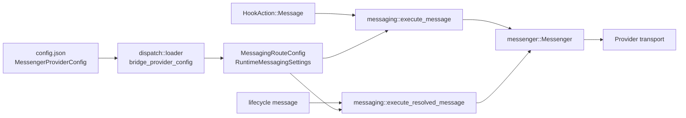
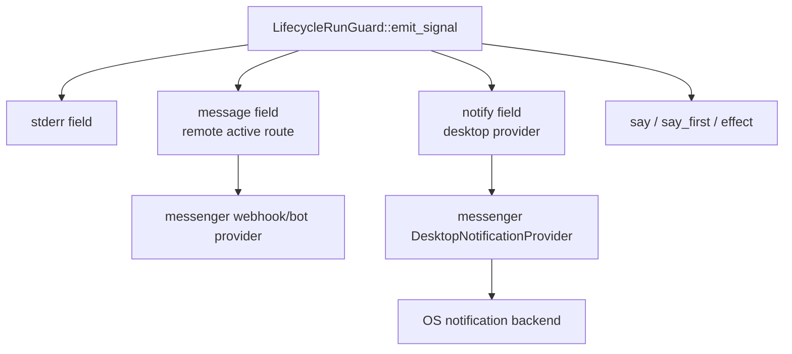

# Technical Design: New Message and Notification Platforms

## Summary

This feature extends Claudine's existing outbound communication path in two separate directions:

- **Messaging platforms** add Discord and Slack webhook routes to the existing `message` action and lifecycle `message` field.
- **Desktop notifications** add a local-only `notify` lifecycle field that delegates to `messenger`'s desktop notification provider.

The design keeps Claudine as the configuration, parsing, and lifecycle orchestration layer. The `messenger` crate remains the transport and operating-system integration layer for webhook delivery and desktop notification driver selection.

## Goals

- Add Discord webhook and Slack webhook route types without changing the current named messenger configuration model.
- Preserve existing `HookAction::Message` behavior and lifecycle `message` behavior for bot-token routes.
- Add lifecycle `notify` fan-out that can run alongside `stderr`, `message`, `say`, `say_first`, and `effect`.
- Keep desktop notifications zero-config in Claudine.
- Treat webhook and desktop notification failures as non-fatal operational warnings.
- Avoid exposing webhook secrets in config TUI rendering, input echo, logs, snapshots, or error messages.

## Non-Goals

- Do not add a hook action named `Notify` in this feature. The spec only requires lifecycle frontmatter support.
- Do not add desktop notification settings to `claudine config`.
- Do not implement webhook transport in Claudine. Claudine must call provider types from `messenger`.
- Do not migrate existing Discord or Slack bot route names or behavior.
- Do not add multi-route fan-out. The existing active-route model remains unchanged.

## Current Architecture

Claudine currently has two messenger configuration representations:

- `claudine::config::claudine_config::MessengerProviderConfig` is the user-facing config model used by `~/.claudine/config.json`, repo overrides, and `claudine config`.
- `claudine::messaging::MessagingRouteConfig` is the runtime route model used by the send path.

`dispatch::loader::bridge_provider_config()` converts user-facing config into the runtime route model. Runtime sends flow through `claudine/lib/src/messaging/send.rs`, which builds a `messenger::Messenger`, registers the provider for the active route, creates a `Dispatch`, plans the send, and calls `send_planned()`.

Composition lifecycle side effects are centralized in `claudine/lib/src/composition/lifecycle.rs`. `LifecycleRunGuard::emit_signal()` currently emits non-audio outputs immediately, then runs audio phases sequentially. The new `notify` field should join the non-audio fan-out phase.



## Proposed Architecture

### Messaging Platform Routes

Add webhook variants to both config representations:

```rust
pub enum MessengerProviderConfig {
    Discord { channel_id: String, bot_token_env: String },
    Slack { channel_id: String, bot_token_env: String },
    Signal { /* existing fields */ },
    Whatsapp { /* existing fields */ },
    DiscordWebhook {
        webhook_url: Option<String>,
        webhook_url_env: String,
    },
    SlackWebhook {
        webhook_url: Option<String>,
        webhook_url_env: String,
    },
}
```

The runtime `MessagingRouteConfig` mirrors these variants:

```rust
pub enum MessagingRouteConfig {
    Discord { /* existing fields */ },
    Slack { /* existing fields */ },
    Signal { /* existing fields */ },
    WhatsApp { /* existing fields */ },
    DiscordWebhook {
        webhook_url: Option<String>,
        webhook_url_env: String,
    },
    SlackWebhook {
        webhook_url: Option<String>,
        webhook_url_env: String,
    },
}
```

Use explicit serde names for the new variants:

- `discord_webhook` in `MessengerProviderConfig`, matching existing `rename_all = "snake_case"`.
- `discordwebhook` would be the default for `MessagingRouteConfig` because it uses `rename_all = "lowercase"`. Override this with `#[serde(rename = "discord_webhook")]`.
- Use the same override for `slack_webhook`.

The config fields intentionally support both inline and env-var-based secrets, matching the runtime route model used for existing bot credentials. The config TUI should prefer inline entry for webhooks because the spec asks for masked webhook URL input, but env-var fallback remains useful for hand-authored config and consistency with the existing send path.

Default env var names:

- `DISCORD_WEBHOOK_URL`
- `SLACK_WEBHOOK_URL`

### Send Path

Update `claudine/lib/src/messaging/send.rs`:

- Import `DiscordWebhookConfig`, `DiscordWebhookProvider`, `SlackWebhookConfig`, and `SlackWebhookProvider` from `messenger::provider`.
- In `build_payload()`:
  - `DiscordWebhook` maps to `Target::discord_webhook()` and `ProviderKind::DiscordWebhook`.
  - `SlackWebhook` maps to `Target::slack_webhook()` and `ProviderKind::SlackWebhook`.
  - Keep the current image behavior aligned with provider capabilities:
    - Discord bot and Discord webhook may include image attachments.
    - Slack bot and Slack webhook ignore images when text exists.
    - Slack image-only sends are skipped.
- In `send_payload()`:
  - Resolve webhook URL from inline `webhook_url` or `webhook_url_env`.
  - Construct webhook providers through their validating constructors.
  - Register only the active provider.
- In `provider_kind_label_from_config()`, return `discord_webhook` and `slack_webhook`.
- Extend `failure_hint()` with webhook-specific guidance:
  - URL validation failures: verify the configured webhook URL.
  - Discord 404 or Slack `no_service`: recreate or re-enable the webhook.

Webhook URLs are secrets. Any error text rendered to users must be checked so it does not echo the full URL. If `messenger` returns a URL-bearing error, Claudine should redact it before rendering.

### Desktop Notifications

Expose a new Claudine helper:

```rust
pub fn execute_notification(title: &str)
```

The helper lives in `claudine/lib/src/messaging/send.rs` and is re-exported from `claudine/lib/src/messaging/mod.rs`. It should:

- Trim empty titles and no-op when blank.
- Spawn an async task, preserving the existing fire-and-forget pattern.
- Build a `messenger::Messenger`.
- Register `DesktopNotificationProvider::new(DesktopConfig::default())`.
- Send `Message::text(title).title(title)` or a title-only desktop-capable message to `Target::desktop()`.
- Log or render a warning on failure, but never return an error to lifecycle execution.

The helper should not accept or read Claudine config. Driver selection and OS capability detection are owned by `messenger`.



### Lifecycle Parsing and Emission

Update `LifecycleNotification`:

```rust
pub struct LifecycleNotification {
    pub say: Option<String>,
    pub say_first: Option<String>,
    pub effect: Option<String>,
    pub message: Option<String>,
    pub notify: Option<String>,
    pub stderr: Option<String>,
}
```

Update `parse_lifecycle_config()` to normalize `notify` with the same empty-string handling used for other optional string fields.

Update `LifecycleEmitter`:

```rust
fn emit_notification(&self, title: &str);
```

`DefaultLifecycleEmitter::emit_notification()` calls `crate::messaging::execute_notification(title)`.

Update `LifecycleRunGuard::emit_signal()` so the immediate fan-out phase runs in this order:

1. `stderr`
2. `message`
3. `notify`
4. audio phases

This preserves existing terminal and remote-message behavior while allowing local notification delivery to happen before any blocking TTS or sound effect.

### Config TUI

`claudine config` already has a messenger tab with provider selection and modal input. Extend it without adding any desktop notification controls.

Provider list:

- `discord`
- `discord_webhook`
- `slack`
- `slack_webhook`
- `signal`
- `whatsapp`

Rendering:

- List webhook routes as `Discord Webhook` and `Slack Webhook`.
- Never display inline webhook URLs. Show a stable masked summary such as `webhook: ********`.
- Keep env-var names visible because they are not secrets.

Input modal:

- Mark webhook URL fields as secret fields.
- Render secret input buffers as bullets or asterisks, not raw characters.
- Preserve the actual buffer in modal state so saving still writes the full value.
- Add URL validation before advancing from the webhook URL field.

Validation should be shared between the TUI and config validation where practical:

```rust
fn validate_discord_webhook_url(url: &str) -> bool
fn validate_slack_webhook_url(url: &str) -> bool
```

Initial regexes should be intentionally conservative:

- Discord: `^https://(discord\.com|discordapp\.com)/api/webhooks/[0-9]+/[A-Za-z0-9._-]+$`
- Slack: `^https://hooks\.slack\.com/services/[A-Z0-9]+/[A-Z0-9]+/[A-Za-z0-9]+$`

The final source of truth for production validation remains the `messenger` provider constructor. The TUI regex is early feedback, not a replacement for provider validation.

Test connection:

- Add a focused control for webhook routes only.
- The button should build the in-progress route and call a Claudine helper that sends a short test message through `messenger`.
- Success and failure should update modal-local status text.
- Failure status must redact webhook URLs.
- Do not save config as a side effect of testing.

Because ratatui controls are currently modal-driven rather than button widgets, the first implementation can expose `T` as the hotkey for "Test Connection" when the webhook input flow is complete.

### Config Validation

> **Implementation Note:** The validation function was implemented as
> `validate_provider_config` (free function) rather than
> `ClaudineMessengerConfig::validate` (method). The behavior is identical;
> this naming drift is recorded here for future consolidation.

Update `validate_provider_config` and runtime `ScopedMessagingSettings::validate()`:

- Active-route validation remains unchanged.
- Existing bot routes continue to require channel IDs and env var names.
- Webhook routes require either:
  - a non-empty inline `webhook_url`, or
  - a non-empty `webhook_url_env`.
- If inline `webhook_url` is present, validate the provider URL format.
- `webhook_url_env` must not be blank.

Do not require an inline URL for hand-authored configs that only use an env var.

### Repo Override Behavior

Repo override semantics do not change. `RepoOverrideConfig.active_messenger` still selects, disables, or inherits the active route by name. Since webhook routes live in the same named config map, repo-scoped selection works without a new schema.

### Error Handling

Messaging and desktop notification sends are operational side effects. They must not fail hooks or composition runs.

Expected behavior:

- Config parse and validation errors remain fatal when loading a malformed config.
- Runtime send failures are warnings.
- Desktop notification failures are warnings and never block lifecycle state transitions.
- Empty interpolated `message` or `notify` values are no-ops.
- Missing active remote message route is a no-op for `message`, unchanged from current behavior.
- `notify` does not consult active messenger route and should still run when remote messaging is disabled.

### Dependencies and Feature Flags

The `messenger` skill and current source show these providers already exist behind `messenger` feature flags:

- Discord webhook behind `discord`
- Slack webhook behind `slack`
- Desktop notifications behind `desktop`

Update `claudine/lib/Cargo.toml` if needed so the `messenger` dependency enables `desktop` in addition to the provider features already used by Claudine. If adding `desktop` changes transitive dependencies, update `docs/dependencies.md` and any relevant per-area dependency docs.

### Compatibility

Existing configs continue to deserialize because no existing fields or variant names change. New variants are additive.

Example config:

```json
{
  "messenger": {
    "active_config": "deploys",
    "configurations": {
      "deploys": {
        "provider": "slack_webhook",
        "webhook_url_env": "DEPLOY_SLACK_WEBHOOK_URL"
      },
      "personal-alerts": {
        "provider": "discord_webhook",
        "webhook_url_env": "DISCORD_WEBHOOK_URL"
      }
    }
  }
}
```

Example lifecycle frontmatter:

```yaml
---
success:
  stderr: "Deployment finished"
  message: "Production deployment finished"
  notify: "Deployment Successful"
failure:
  message: "Production deployment failed"
  notify: "Deployment Failed"
---
```

## Implementation Plan

1. Extend config models:
   - Add webhook default env var helpers.
   - Add webhook variants to `MessengerProviderConfig`.
   - Add webhook variants to `MessagingRouteConfig`.
   - Extend validation and serde tests.

2. Bridge config to runtime:
   - Extend `dispatch::loader::bridge_provider_config()`.
   - Add tests for both webhook variants.

3. Extend messaging send:
   - Add target/provider mapping in `build_payload()`.
   - Register webhook providers in `send_payload()`.
   - Add `execute_notification()`.
   - Re-export the new helper.
   - Add unit tests for target/provider mapping, image handling, and no-op notification input.

4. Extend lifecycle:
   - Add `notify` to `LifecycleNotification`.
   - Add `emit_notification()` to `LifecycleEmitter`.
   - Update default emitter and test emitter.
   - Emit `notify` in the immediate fan-out phase.
   - Add parse and ordering tests.

5. Extend config TUI:
   - Add webhook options to the messenger provider modal.
   - Add secret-field rendering to input modals.
   - Add webhook URL validation.
   - Add the test connection action and status display.
   - Add snapshot or reducer tests for provider labels, field definitions, and masking.

6. Update docs:
   - Update feature docs or user-facing messaging docs if public config examples change.
   - Update dependency docs if Cargo feature changes introduce new dependencies.
   - Update `.claude/skills/claudine` only if the architecture or workflow summary needs to mention webhook/desktop notification support.

## Test Plan

- `cargo test -p claudine-lib messaging`
- `cargo test -p claudine-lib composition::lifecycle`
- `cargo test -p claudine-lib dispatch::loader`
- `cargo test -p claudine-cli config_tui`
- `cargo test -p messenger-lib discord_webhook`
- `cargo test -p messenger-lib slack_webhook`
- `cargo test -p messenger-lib desktop`

Add focused tests:

- `MessengerProviderConfig::DiscordWebhook` and `SlackWebhook` deserialize and round-trip.
- Runtime `MessagingRouteConfig` webhook variants deserialize with explicit snake-case names.
- Inline webhook URL validation accepts production URLs and rejects wrong hosts.
- Env-var-only webhook configs validate when the env var name is non-empty.
- `bridge_provider_config()` preserves webhook URL and env var fields.
- `build_payload()` maps webhook configs to `Target::discord_webhook()` and `Target::slack_webhook()`.
- Slack webhook image-only sends are skipped; Discord webhook image-only sends are retained.
- `parse_lifecycle_config()` accepts and normalizes `notify`.
- `LifecycleRunGuard::emit_signal()` emits `message` and `notify` independently for the same signal.
- TUI secret input does not render raw webhook URLs.
- Test connection failure output redacts webhook URLs.

## Risks and Mitigations

| Risk | Mitigation |
| --- | --- |
| Webhook URLs leak through TUI rendering or errors | Centralize masking and redaction helpers; add snapshot tests with known fake URLs. |
| TUI regex drifts from messenger provider validation | Treat regex as early feedback only; provider constructors remain authoritative before send/test. |
| Desktop provider requires a Cargo feature not enabled by Claudine | Enable `messenger/desktop` in `claudine/lib/Cargo.toml` and document dependency changes. |
| `notify` blocks lifecycle on slow OS notification APIs | Keep `execute_notification()` fire-and-forget, matching `execute_resolved_message()`. |
| Existing `message` field confusion with terminal status messages | Preserve the current meaning: lifecycle `message` is remote messaging in this feature context; `stderr` remains terminal output. |

## Acceptance Criteria

- A user can configure Discord and Slack webhook routes in `claudine config` with masked URL entry.
- Invalid webhook URLs are rejected in the TUI before saving.
- A user can test a webhook route from the TUI without saving the route.
- Existing `HookAction::Message` and lifecycle `message` can send through bot routes or webhook routes.
- Lifecycle `notify` sends a local desktop notification with no Claudine config.
- A lifecycle state may define both `message` and `notify`, and both are attempted independently.
- Desktop notification failure does not interrupt the composition lifecycle.
- No desktop notification enable toggle or driver selector appears in `claudine config`.
