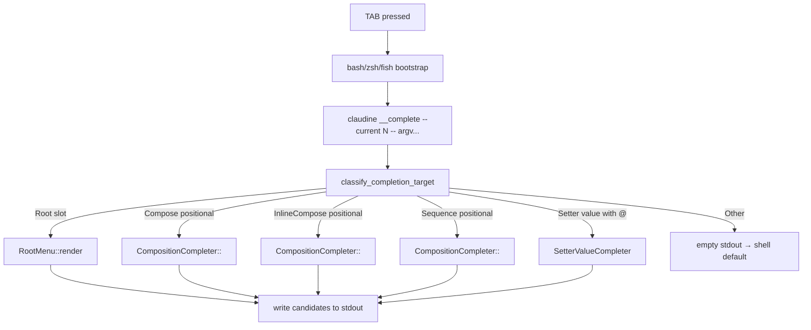
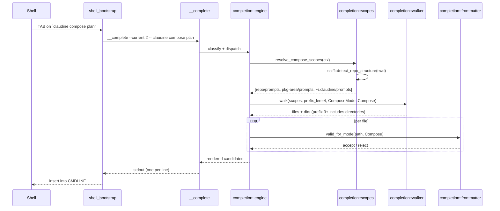

# Tech Design — Improved Shell Completions

- **Feature**: `2026-04-24-improved-shell-completions`
- **Spec**: [`spec.md`](./spec.md)
- **Target module**: `claudine/cli/src/completion/`
- **Consumers**: `claudine completions <shell>` output + hidden `claudine __complete` subcommand

## 1. Goals

The current completion engine (`completion/supplement.rs`) treats all three
composition commands identically, offers only `.md` files under `prompts/`
and `sequences/`, and exposes no root-level curation. The spec shifts the
design in four directions:

1. **Curated root-level menu** — `claudine <TAB>` must present only the
   subcommands that a user would actually type, in a documented order,
   with `init` elided once configuration already exists.
2. **Per-subcommand discovery** — `compose`, `inline-compose`, and
   `sequence` each pull from a different "high-profile" directory set and
   apply a different frontmatter contract.
3. **Prefix-length progression** — 0–2 typed characters stay curated;
   3+ characters additionally surface directories (for drill-down) under
   a bounded, `.gitignore`-aware walk.
4. **Post-file completion of `@`-prefixed setter values** — the sole
   signal that a `key=value` assignment references a file is a leading
   `@`; discovery is then scoped to `docs/`, `features/`, `fixes/`, and
   `reviews/`.

A non-functional goal — **sub-100ms** completion resolution with **no
cache** on first pass, and a documented stale-while-revalidate fallback
if profiling shows ≥150ms.

Finally, a user-visible help defect (`sequence` missing from the
Composition group in `cli/src/commands/help.rs`) must be fixed in the
same feature.

## 2. Scope & non-goals

### In scope

- Replacement of the root-level completion behavior.
- Replacement of the `compose` / `inline-compose` / `sequence`
  positional-argument completers with per-command pipelines.
- New `@`-prefixed setter-value file-reference completer.
- A new `claudine/docs/topics/shell-completions.md` (replacing the
  existing one) that documents every rule **and** a `Performance
  Optimization` section.
- Help defect fix in `cli/src/commands/help.rs`.

### Out of scope

- Variable-schema-aware typing for setters (the engine treats every
  value as an opaque string except when the user types `@`).
- Wrapper-subcommand positional completion (wrappers already disable it
  because their positionals are forwarded to the wrapped CLI).
- Rewriting PowerShell / Elvish bootstrap scripts — they retain the
  legacy `CompleteEnv` bootstrap path unchanged.
- Caching on the happy path. The fallback cache is implemented only if
  the no-cache path misses the 100ms target in profiling.

## 3. Architectural overview

The completion engine runs in-process inside `claudine __complete`. The
generated bash/zsh/fish bootstraps from `completion/bootstrap.rs` do not
change their protocol — they still shell out to
`claudine __complete --current <INDEX> -- <argv...>`. Only the engine
behind that subcommand changes.



The two existing modules (`supplement.rs`, `command_factory.rs`,
`file_reference.rs`, `validate.rs`) will be consolidated. The new layout
is:

```text
completion/
├── mod.rs            - maybe_complete() + public wiring
├── bootstrap.rs      - unchanged shell scripts
├── engine.rs         - top-level classifier + dispatcher
├── root_menu.rs      - root subcommand menu + --help rule
├── composition.rs    - compose / inline-compose / sequence pipeline
├── setter_value.rs   - `@`-prefixed setter value completer
├── scopes.rs         - "high profile" directory resolver (sniff-backed)
├── walker.rs         - bounded .gitignore-aware walker (ignore crate)
├── frontmatter.rs    - markdown frontmatter gates (prompt / sequence)
├── fuzzy.rs          - fuzzy vs. prefix matchers
└── cache.rs          - (fallback) stale-while-revalidate cache
```

`supplement.rs` and `command_factory.rs` are deleted in this feature;
their behavior is folded into `engine.rs` + `root_menu.rs` +
`composition.rs`. `validate.rs` becomes `frontmatter.rs` with a
slightly narrower contract (see §6.3).

## 4. Root-level completion

### 4.1 Candidate set

The root-level menu (triggered when the cursor is at argv position 1 and
no subcommand has been consumed yet) surfaces exactly this fixed list,
in this display order:

1. Composition subcommands — `compose`, `inline-compose`, `sequence`.
2. Wrapper subcommands — `claude`, `codex`, `gemini`, `goose`, `kimi`,
   `opencode`, `qwen`. (`roo` is **not** surfaced today; it is gated
   behind the provider matrix and intentionally absent from the
   user-facing wrapper set.)
3. Shared-resources — `skills`, `commands`, `agents`, `mcp`.
4. Hooks / actions — `hooks`, `actions`. (Spec names "hooks and
   events"; the clap-registered subcommand is `actions`, so the spec's
   "events" is resolved to `actions` in the implementation.)
5. Administration — `sync`, `uninstall`, `providers`, `logs`,
   `completions`, `config`.
6. `init` — **only when neither a user config nor a repo config
   exists**. See §4.2.

The **only** flag emitted at the root level is `--help`. Global flags
(`--verbose`, `--debug`, `--plain`) are intentionally **not** offered
at the root-level menu — they are discoverable from `claudine --help`
and do not belong in the primary completion menu.

### 4.2 `init` visibility rule

`init` is elided from the root menu when **either**:

- a user-scope config exists at `~/.claudine/config.json`
  (also accepted: `config.json5`), **or**
- a repo-scope config exists at `<repo>/.claudine/config.json` when
  cwd is inside a detected repo.

The rule mirrors the spec literally: "only show if there is NO
configuration for current repo (if in repo), or if there is no
user based configuration." Interpreted as: when in a repo, if neither
user nor repo config exists, show `init`. When outside a repo, if no
user config exists, show `init`.

Implementation: `root_menu::should_offer_init(&ctx)` inspects the two
paths via `std::fs::metadata` (single `stat` each). No config parse —
file presence is enough.

### 4.3 Classifier

`engine::classify_root_slot(argv, current_index)` returns `Some(RootSlot)`
when **all** of the following hold:

- `current_index == 1`, **or** every token before `current_index` is a
  global flag (`--verbose` / `-v` / `--debug <LEVEL>` / `--plain` /
  `--help` / `-h`).
- `argv[current_index]` does not start with `-` unless it is one of
  `-h` / `--help` (in which case we still offer the root menu but the
  shell typically auto-completes the flag itself — see §4.4).
- No `--` separator has been crossed.

### 4.4 `--help` rule

At the root level the partial token `-` / `--` / `--h` / `-h` should
resolve to `--help` as the single candidate. Any other flag-shaped
partial returns zero candidates — the shell's native flag completion
does not fire because our bootstrap does not invoke clap's static
completion at this slot.

## 5. Composition subcommand completion

### 5.1 Shared pipeline

All three composition commands share one pipeline, parameterized by a
`ComposeMode` enum:

```rust
enum ComposeMode { Compose, InlineCompose, Sequence }
```

The pipeline is:

1. **Classify the partial** — one of `Empty`, `ShortPrefix(n < 3)`,
   `LongPrefix(n >= 3)`, `Magic(@...)`, `CommittedDir(path/)`.
2. **Resolve high-profile scopes** — per `ComposeMode` (see §5.2).
3. **Walk scopes** under the current strategy:
   - `Empty` / `ShortPrefix` → enumerate files only, no directory
     suggestions.
   - `LongPrefix` → enumerate files **and** directories. Directories
     are starting-substring matched (not fuzzy) for short input; once
     the user passes 3 characters, directory matching also becomes
     fuzzy. See §5.3.
   - `Magic` → resolve against the three-tier priority order
     (§5.5) and render back as a relative path on selection.
   - `CommittedDir` → walk only inside the committed directory.
4. **Filter by mode contract** — extension + frontmatter
   (§5.4).
5. **Apply hidden-file filter + `.gitignore`** (§5.6).
6. **Dedup + sort** — stable order favoring repo-local over
   user-scope.
7. **Render** — produce tokens the shell will insert.

### 5.2 High-profile scope sets

The "high profile" directory set is resolved per mode. `sniff`
vocabulary applies: `package_area` is the multi-crate area (e.g.
`claudine`, `biscuit-file`), `package` is the discrete package directory
(e.g. `claudine/cli`). `sniff` is the single source of truth for both.

| Scope | compose | inline-compose | sequence |
|---|---|---|---|
| `<repo>/prompts/` | ✓ | ✓ | ✓ |
| `<package-area>/prompts/` (if applicable) | ✓ | ✓ | ✓ |
| `<package>/prompts/` (if applicable) | ✓ | ✓ | ✓ |
| `<repo>/.claudine/prompts/` | ✓ | ✓ | ✓ |
| `~/.claudine/prompts/` | ✓ | ✓ | ✓ |
| `<repo>/docs/` | — | ✓ | ✓ |
| `.claude/skills/**/*.md` (+ 6 peers) | — | ✓ | ✓ |

The "6 peers" list is `.codex`, `.gemini`, `.opencode`, `.goose`,
`.qwen`, `.kimi`. Only repo-local skill directories are walked; user
skill directories are not included.

### 5.3 Prefix-length progression

The spec defines three prefix regions. All counts are of characters
**the user has typed past any committed directory separator**, so
`prompts/re` counts as 2 characters (`re`), not 10:

- **0 characters** — enumerate files in high-profile scopes only.
  Directories are emitted **only when** they themselves exist directly
  under a scope (for drill-down), and their names are not fuzzy-matched.
- **1–2 characters** — file names are fuzzy-matched (subsequence
  match, case-insensitive); directories are elided.
- **3+ characters** — files remain fuzzy-matched, directories are
  emitted **and** fuzzy-matched. Directory walking is confined to the
  current repo (or cwd when not inside a repo). Directory matching
  becomes fuzzy at this length, not starting-substring.

Once the user selects a directory (the completion ends with `/`), the
pipeline flips to `CommittedDir` mode and every subsequent `<TAB>`
operates exclusively inside the selected directory — high-profile
scopes are no longer consulted.

### 5.4 Frontmatter contracts

| Mode | File contract |
|---|---|
| `compose` | `.md` / `.markdown` file whose frontmatter does **not** have a `prompt` key (the presence of `prompt` is reserved for `inline-compose`). |
| `inline-compose` | `.md` / `.markdown` file whose frontmatter **has** a non-empty string `prompt` key. |
| `sequence` | `.md` / `.yaml` / `.yml` file whose root document has a `sequence` property. |

Frontmatter matching is **case-sensitive**; only lowercase `prompt` and
`sequence` keys are recognized.

For `sequence`, YAML files (root-level `sequence:` key) are accepted
**in addition to** markdown files — the spec calls this out as a YAML
target, distinct from `compose`'s markdown-only target.

The `compose` contract is a **negative** filter (no `prompt` key) — a
frontmatter-less markdown file still passes, consistent with the
existing runtime's behavior in
`claudine::composition::resolve_composition_source`.

Frontmatter parsing routes through `darkmatter::markdown::Markdown` so
behavior matches the runtime composition pipeline. For plain YAML
(only `sequence`), a `serde_yaml_ng` parse of the top-level document is
used — scoped to the file-size cap below.

### 5.5 `@` magic path resolution

The `@` prefix triggers three-tier lookup in strict priority order:

1. `<repo>/prompts/...` (and per-mode additional scopes — see §5.2).
2. `<repo>/.claudine/prompts/...`.
3. `~/.claudine/prompts/...`.

The first hit wins. On acceptance, the magic path is **resolved** to a
relative path the shell inserts:

| Source tier | Inserted token |
|---|---|
| Repo | `prompts/plan.md` |
| Repo `.claudine/` | `.claudine/prompts/plan.md` |
| User global | `~/.claudine/prompts/plan.md` |

This differs from the current supplement engine, which inserts `@`-
prefixed tokens verbatim. The new behavior is a deliberate reversal:
`@` is a **search sigil**, not part of the inserted value.

### 5.6 Hidden-file + `.gitignore` filter

Files and directories are dropped when **any** of:

- the file name starts with `_`;
- any directory component on the path starts with `_`;
- any path component is in the curated skip list (`.git`, `target`,
  `node_modules`, `dist`, `build`, `.next`, `.venv`, `venv`,
  `__pycache__`);
- the path matches an active `.gitignore` rule.

`.gitignore` application uses `ignore::WalkBuilder` with
`.git_ignore(true).git_global(true).git_exclude(true).hidden(false)` —
the same configuration that
[`sniff::filesystem::docs::collect_markdown_paths`](../../../sniff/lib/src/filesystem/docs.rs)
uses. `.gitignore` rules are applied at **every directory level**, not
only at the repo root. This is the default `ignore` crate behavior.

### 5.7 Symlink handling

Per the spec, symlink handling is **mode-local**:

- For **non-skill** scanned directories, symlinks are followed.
- For **agent skill** directories (`.claude/skills/` and its six
  peers), symlinks are **not** followed. This prevents duplicate skills
  appearing when Claudine has symlinked a skill directory across
  multiple provider CLI directories.

Implementation: the walker accepts a `FollowSymlinks(bool)` flag per
scope; agent-skill scopes pass `false`, every other scope passes
`true`. `ignore::WalkBuilder` supports this via `.follow_links(bool)`.

### 5.8 Monorepo detection via `sniff`

Scope resolution delegates to
[`sniff::filesystem::repo::detect_repo_structure`](../../../sniff/lib/src/filesystem/repo/types.rs)
plus
[`RepoInfo::package_area_for_dir`](../../../sniff/lib/src/filesystem/repo/types.rs)
and
[`RepoInfo::package_for_dir`](../../../sniff/lib/src/filesystem/repo/types.rs).
The completion engine does **not** implement its own monorepo
heuristics.

- If `detect_repo_structure` returns `None`, only cwd-local and user-
  global scopes apply.
- If `package_area_for_dir(cwd)` returns `Some("root")`, the area-scope
  is elided; `"root"` is a pseudo-area for top-level crates and is not
  a real subdirectory.
- If `package_for_dir(cwd)` returns `Some(pkg)`, a package-scope scope
  applies at `pkg.path.join("prompts")`.

The engine caches the `RepoInfo` for the duration of one completion
invocation — `sniff::detect_repo_structure` can itself shell out to
`cargo metadata`, so re-running it per scope lookup would blow the
performance budget.

## 6. Post-file-reference completion (setter values)

### 6.1 Trigger

When the cursor is **past** the first positional of a composition
subcommand (i.e. the file reference is already supplied), the engine
looks at the partial token:

- If the token **does not** match the setter pattern
  `^[A-Za-z_][A-Za-z0-9_-]*=`, return zero candidates (shell default).
- If the token **does** match, inspect the value portion after `=`.

The setter value is classified by its first non-quote character:

| First char | Behavior |
|---|---|
| `@` | File-reference completion (see §6.2). |
| Any other | Zero candidates; value is opaque. |

Opening-quote handling: leading `"` or `'` is stripped for
classification. If the user opened with `"`, the final rendered
candidate substitutes `'` for `"` so the closing quote can be a
single-quote pair (see §6.3).

### 6.2 Setter-value file scope

Scope set, in priority order:

1. `<repo>/docs/`, `<repo>/features/`, `<repo>/fixes/`, `<repo>/reviews/`.
2. If `package_area_for_dir(cwd)` resolves, additionally:
   `<package-area>/{docs|features|fixes|reviews}`.
3. If `package_for_dir(cwd)` resolves, additionally:
   `<package>/{docs|features|fixes|reviews}`.

Only `.md` / `.markdown` files are surfaced. Hidden-file + `.gitignore`
rules from §5.6 apply unchanged. Matching is fuzzy (subsequence,
case-insensitive) against the filename stem.

### 6.3 Quote-wrapping contract

Regardless of whether the user opened with `"`, `'`, or no quote, the
emitted candidate is wrapped in single quotes so spaces in the path do
not break shell parsing. Specifically:

- `spec=@spec<TAB>` → `spec='docs/2026-04-24-improved-shell-completions/spec.md'`
- `spec="@spec<TAB>` → `spec='docs/2026-04-24-improved-shell-completions/spec.md'`
  (opening double-quote is replaced by single-quote)
- `spec='@spec<TAB>` → `spec='docs/2026-04-24-improved-shell-completions/spec.md'`

The shell inserts the full token; zsh's `compadd -U -Q` path (already
used for substring matches — see
[`bootstrap.rs`](../../cli/src/completion/bootstrap.rs)) ensures the
quotes survive verbatim.

### 6.4 No schema inference

The completer has **no** knowledge of the composition frontmatter
schema. It does not pre-parse the target file and does not know
whether a given key is expected to be a file path. The `@` sigil is the
sole disambiguator; schema-driven completion may be added in a future
feature but is explicitly out of scope here.

## 7. Other commands

Every non-composition subcommand (`skills`, `commands`, `hooks`, `mcp`,
`logs`, wrappers, etc.) defers to clap's derived completion for flag
names and argument shapes. The engine returns an empty candidate list
at those slots so the shell's static completion (derived from the
clap command tree via `clap_complete`) takes over — matching the spec's
"behave in a more typical behavior to clap's normal provided behavior."

This is a reversal from the current `supplement.rs` design, where
wrapper subcommands had `--append-system-prompt` / `--replace-system-
prompt` value-slot completion. The spec intentionally moves those value
slots back to clap's native completion (which renders `_files` on zsh
and default file completion on bash/fish). The new engine does **not**
attach file completers to those flags.

## 8. Performance strategy

### 8.1 Target

≤100ms wall-clock from `__complete` entry to last byte written on
stdout. Measurement via `tracing::span` around the dispatch layer
under `RUST_LOG=claudine::completion=trace`, emitted to a log file when
`CLAUDINE_COMPLETION_PROFILE=1` is set (completion's stderr is
swallowed by shells, and stdout is reserved for candidates).

### 8.2 No-cache plan (default)

- **Resolve scopes lazily** — high-profile scopes are discovered in
  priority order; if any tier satisfies the candidate budget
  (`MAX_CANDIDATES = 500`), later tiers short-circuit.
- **Extension gate first** — every file is checked by extension
  (`.md` / `.markdown` / `.yaml` / `.yml`) before any frontmatter parse.
- **File-size guard** — files larger than `MAX_FRONTMATTER_BYTES = 1
  MiB` skip frontmatter parsing and are dropped. This protects against
  generated fixture files that would otherwise dominate wall time.
- **Prefix-gated scope** — 0-2 character partials never recurse into
  directories; the walker sticks to immediate children of each scope
  root.
- **Single `sniff` invocation** — `detect_repo_structure` is called at
  most once per `__complete` run and threaded through every scope
  helper.
- **Hand-rolled setter regex** — avoid the `regex` crate; the setter
  shape is a 10-line byte scan (already present in
  `supplement::is_setter_shaped`).

### 8.3 Fallback cache (only if profiling shows ≥150ms)

If profiling under a representative monorepo (the rusty-biscuit repo at
48 crates is the benchmark target) exceeds 150ms, a
stale-while-revalidate cache is introduced at
`~/.cache/claudine/completions/<repo-hash>.json`:

- **Repo hash** — `blake3` of the canonicalized absolute repo root
  path. `repo-hash` is 16 hex chars of the BLAKE3 digest — collisions
  here are a convenience-layer nuisance, not a correctness risk.
- **Cache payload** —

  ```json
  {
    "repo_git_head": "<40-char SHA>",
    "youngest_mtime": "<RFC3339 timestamp>",
    "scanned_at": "<RFC3339 timestamp>",
    "candidates": [/* per-scope enumerated file paths */]
  }
  ```

- **Read path** — on entry, attempt to read the cache. If readable,
  emit its candidate list **immediately** and spawn a background
  refresh via a detached `std::thread`. If the cache is unreadable
  (missing / corrupt / version-mismatch), fall through to the
  synchronous scan.
- **Staleness check** — the **background** refresh compares:
  1. `repo_git_head` vs. the current HEAD (read from `.git/HEAD`
     without invoking `git`), and
  2. every scanned directory's mtime vs. `scanned_at`.
  If either is stale, the refresh writes a new cache file.
- **Atomic write** — `std::fs::write` to a tempfile (same directory as
  the target, suffixed `.tmp.<pid>`), then `std::fs::rename` to the
  final path. The rename is atomic on every supported filesystem.
- **Version gate** — the payload carries a schema version; a mismatch
  forces a full scan (invalidation on read).

The read is background-refreshed; the user sees stale-but-fast results
on the first `<TAB>` after a change and fresh results on the next.

### 8.4 Why no cache on the happy path

Caches are a performance stopgap, not a model. The happy path should be
fast enough on its own that cache staleness never becomes a
correctness problem. A cache only appears if the profile says we need
one — at which point the staleness semantics are documented
explicitly.

## 9. Help-system defect fix

`cli/src/commands/help.rs` currently builds a `Composition` group that
includes only `compose` and `inline-compose`. `sequence` must be added:

```rust
// cli/src/commands/help.rs (around line 77-86)
CommandGroup {
    name: "Composition",
    commands: vec![
        cmd("compose", "Compose a Markdown document and send as prompt"),
        cmd("inline-compose", "Inline composition: generate and replace body"),
        cmd("sequence", "Run a serial sequence of composition steps"),
    ],
},
```

The description string mirrors the existing `Cli::Sequence` doc
comment in `cli/src/args.rs:108` ("Run a serial sequence of composition
steps from a single document"), truncated to match the terse style of
its siblings.

This is a one-line fix but lives in the same feature to guarantee the
visible command list matches the completion-engine's root menu.

## 10. Data flow — composition completion example



## 11. Type surface (illustrative)

```rust
pub(crate) enum ComposeMode { Compose, InlineCompose, Sequence }

pub(crate) enum RootSlot {
    /// Cursor at subcommand position; no partial yet.
    BareMenu,
    /// Partial typed but no `-` prefix.
    Partial(String),
    /// `-` / `--` / `--h` — offer only `--help`.
    HelpFlag,
}

pub(crate) enum CompositionSlot {
    /// `claudine compose <TAB>` / `claudine compose pl<TAB>`.
    Positional { mode: ComposeMode, partial: String },
    /// `claudine compose foo.md spec=@s<TAB>`.
    SetterValue { key: String, value_partial: String },
    /// Anything else — fall through to clap.
    None,
}

pub(crate) struct ScopeSet {
    pub repo: Option<PathBuf>,
    pub package_area: Option<PathBuf>,
    pub package: Option<PathBuf>,
    pub repo_claudine: Option<PathBuf>,
    pub user_claudine: PathBuf,
    pub extras: Vec<PathBuf>,  // docs/, skills/** per mode
}

pub(crate) struct CandidateEntry {
    pub insert: String,        // what the shell pastes in
    pub resolved: PathBuf,     // absolute path for validation
    pub is_dir: bool,
    pub source_rank: u8,       // 0 = repo, 1 = area, 2 = pkg, 3 = repo/.claudine, 4 = user
}
```

Exact signatures are finalized during phase planning; the enums above
are the design contract.

## 12. Testing strategy

### 12.1 Unit tests (per module)

- `root_menu`: menu composition for each of: no config, user-only,
  repo-only, both; `--help` partial variants; global-flag-interspersed
  argv.
- `engine::classify_completion_target`: cursor on root, composition
  positional, setter key, setter value with/without `@`, setter value
  on non-composition subcommand (returns None), cursor past `--`.
- `scopes`: scope set for cwd at repo root, inside package area,
  inside discrete package, outside any repo.
- `walker`: `.gitignore` honored at every depth, `_`-prefixed files
  and directories elided, symlinks followed per scope flag, skip list
  honored, `MAX_CANDIDATES` budget honored.
- `frontmatter::valid_for_mode`: the existing cases in `validate.rs`
  plus the new `compose` **negative** contract (no `prompt` key) and
  the new `sequence` YAML-file path.
- `setter_value`: `@` trigger, quote normalization, scope resolution
  with/without package-area/package.
- `cache` (only when implemented): read returns stale payload
  immediately; background refresh updates the file atomically;
  corrupt payload falls through to sync scan.

### 12.2 Integration tests

`cli/tests/completion_*.rs` drives `claudine __complete --current N --
<argv>` against seeded temp-directory fixtures. One file per root-slot
scenario, one per compose / inline-compose / sequence, one for setter-
value completion. All assertions are on stdout lines.

### 12.3 Performance harness

A `criterion` bench (or a lighter custom harness under
`cli/tests/completion_perf.rs` behind `#[ignore]`) times the end-to-end
`__complete` path against a fixture that mirrors the rusty-biscuit
scale (~48 packages, ~2000 markdown files). Pass criterion: p95 ≤
100ms on the CI's reference hardware. Missing this threshold gates in
the fallback cache.

### 12.4 Golden regression — help output

A golden test over `cli/src/commands/help.rs::run()` asserts the
Composition group contains `compose`, `inline-compose`, **and**
`sequence`, in that order.

## 13. Migration & deletion list

Files deleted:

- `cli/src/completion/supplement.rs`
- `cli/src/completion/command_factory.rs` (the legacy `CompleteEnv`
  path is removed; the bootstrap scripts never invoked it on bash/zsh/
  fish, and PowerShell / Elvish continue to use the `CompleteEnv`
  runtime path via `completion/mod.rs` directly attaching
  `ArgValueCompleter`s on the composition subcommands — see §13.1).
- `cli/src/completion/file_reference.rs`
- `cli/src/completion/validate.rs`

Files modified:

- `cli/src/completion/mod.rs` — re-exports the new engine, retains
  `maybe_complete()` for PowerShell / Elvish.
- `cli/src/completion/bootstrap.rs` — no script-body changes; only
  the module-level doc-comments reference the new engine path.
- `cli/src/commands/completions.rs` — `run_complete` calls the new
  engine entry point (`engine::run`) instead of
  `supplement::run`; the CLI contract
  (`--current <INDEX> -- <argv>`) is unchanged.
- `cli/src/commands/help.rs` — add `sequence` to Composition group.
- `docs/topics/shell-completions.md` — full rewrite (see §14).

Files added:

- `cli/src/completion/engine.rs`
- `cli/src/completion/root_menu.rs`
- `cli/src/completion/composition.rs`
- `cli/src/completion/setter_value.rs`
- `cli/src/completion/scopes.rs`
- `cli/src/completion/walker.rs`
- `cli/src/completion/frontmatter.rs`
- `cli/src/completion/fuzzy.rs`
- `cli/src/completion/cache.rs` (only if cache fallback is triggered)

### 13.1 Legacy shells

PowerShell and Elvish retain the `source <(COMPLETE=<shell>
claudine)` bootstrap because `clap_complete::CompleteEnv` cannot
realistically be replaced for those shells in this feature. Their
completion surface therefore is "whatever clap derives" — subcommand
names and flag names, with no composition-specific behavior. This
matches the current state and is documented in
`docs/topics/shell-completions.md` so the gap is explicit.

## 14. Documentation — `docs/topics/shell-completions.md`

The existing topic file is rewritten to cover:

1. **Overview** — one-paragraph statement of purpose.
2. **Installation** — unchanged per-shell bootstrap commands.
3. **Root-level menu** — the fixed menu, the `init` visibility rule,
   and the `--help` rule.
4. **Composition commands** — one subsection per `ComposeMode`
   documenting scope sets, frontmatter contracts, the prefix-length
   progression, the `@` magic resolution, symlink behavior, and the
   `.gitignore` contract. Each rule paired with a "Why" paragraph
   where the reasoning is non-obvious (e.g. why symlinks are dropped
   for skill scopes; why `@` resolves to a relative path on
   selection; why directory names require 3+ characters for fuzzy
   matching).
5. **Setter values** — trigger rules, quote-wrapping contract,
   scope set.
6. **Other commands** — clap-default behavior.
7. **Performance Optimization** — the §8 strategy, including the
   no-cache default and the fallback cache semantics. This section
   is required by the spec.
8. **Legacy shells** — PowerShell / Elvish behavior gap.
9. **Examples** — realistic `<TAB>` sessions for each scenario,
   shown as inline code with the typed prefix annotated.
10. **Architecture diagram** — mermaid flowchart mirroring §3.

The file lives at
[`claudine/docs/topics/shell-completions.md`](../../../docs/topics/shell-completions.md)
and is linked from
[`CLAUDINE_SKILL.md`](../../../.claude/skills/claudine/SKILL.md) under
"deeper topic references."

## 15. Open questions

These are called out for resolution during the `/plan` review cycle.
None block this design, but each has a judgment call worth surfacing.

1. **Menu ordering on root slot** — should wrappers come before
   shared-resources, or after composition (as spec'd)? The spec's
   ordering is "composition → wrappers → shared resources → hooks/
   events → administration → init." This is the order used here.
2. **Skill-scope mode scope** — the spec lists 7 provider skill
   directories (`.claude/skills`, `.codex/skills`, etc.). Should the
   engine also walk `.roo/skills`? Roo is a supported provider in the
   catalog but has no wrapper subcommand at the root slot. Design
   here treats the 7-entry list from the spec as authoritative and
   does **not** walk Roo skills.
3. **Setter-value completion on `inline-compose` / `sequence`** —
   spec says "with all three composition commands," implementation
   treats all three identically.
4. **Fuzzy matcher choice** — `fuzzy_matcher::skim::SkimMatcherV2`
   is the de-facto standard in Rust CLIs and is already available in
   the workspace via indirect dependency trees. Cost: one additional
   direct dependency in `claudine-cli/Cargo.toml`. Alternative: a
   hand-rolled subsequence matcher. Recommendation: use
   `fuzzy_matcher` for consistency with the rest of the Rust CLI
   ecosystem and because score-ranked output improves the candidate
   order.
5. **Help-defect description wording** — the one-line description
   used here (`"Run a serial sequence of composition steps"`) is a
   truncation of the clap doc comment. Phase planning should confirm
   no shorter/better phrasing is preferred.

## 16. Risk register

| Risk | Impact | Mitigation |
|---|---|---|
| `sniff::detect_repo_structure` shells out to `cargo metadata` on the hot path | Blows 100ms budget on first `<TAB>` per shell | Single invocation per `__complete` run; fallback cache on miss; |
| Frontmatter parse dominates wall time on large markdown files | Falls out of budget even on cheap scopes | 1 MiB file-size cap before parse; extension gate first |
| Users type `--help` at the root slot and expect clap's help output | Completion offers the flag; shell inserts it; then `claudine --help` runs — OK; however, `claudine -<TAB>` currently emits zero from the supplement | Explicit `HelpFlag` slot with `--help` as the sole candidate |
| Agent-skill symlinks leak duplicate entries | Noisy candidate list; wrong source attribution | Per-scope `follow_links` flag; default `true` for generic scopes, `false` for agent-skill scopes |
| `@` magic-path resolution inserts a token the user did not expect | Confusion on first use | Document the reversal explicitly in the topic file; example table maps every `@` form to the final inserted value |
| Cache correctness diverges from real filesystem | Stale candidate list across branches | Staleness keyed on `repo_git_head` (branch changes invalidate) + `youngest_mtime`; background refresh updates on every read |
| Fallback cache file corruption | `__complete` panics | All reads are `Result`-wrapped; corrupt file → fall through to sync scan + overwrite on next refresh |

## 17. Phase plan preview

For the follow-up `/plan` run, the natural phase decomposition is:

1. **Phase 1 — scaffolding + classifier rewrite.** New `engine.rs`,
   `root_menu.rs`, classifier with golden tests. Wire into
   `__complete`. Leaves old code paths unreachable but compiled.
2. **Phase 2 — scope + walker.** `scopes.rs` built on `sniff`;
   `walker.rs` built on `ignore::WalkBuilder`; hidden-file filter;
   unit tests for each scope composition.
3. **Phase 3 — composition completer.** `composition.rs` with all
   three modes; frontmatter contracts; prefix-length progression; `@`
   resolution; integration tests against fixture repos.
4. **Phase 4 — setter-value completer.** `setter_value.rs`;
   quote-wrapping; integration tests.
5. **Phase 5 — delete legacy code + doc rewrite + help-defect fix.**
   Remove `supplement.rs`, `command_factory.rs`, `file_reference.rs`,
   `validate.rs`. Rewrite `docs/topics/shell-completions.md`. Add
   `sequence` to `help.rs`. Golden test on help output.
6. **Phase 6 — performance profiling + optional cache.** Run the perf
   harness; if p95 > 150ms on the reference monorepo, implement
   `cache.rs` per §8.3. Otherwise, mark the cache section in the
   topic file as "not currently active; reserved for future
   activation" and close out the feature.
