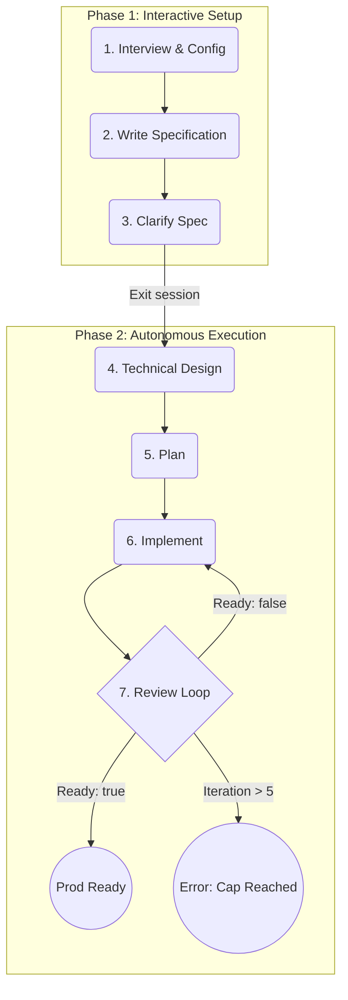

# An end-to-end `just` Flow

The current **just** recipes defined in the `just/*` directory allow a user to run one step at a time through an overall end-to-end flow which brings a feature (or fix) to a fully implemented, production ready state.

The goal of the `just` based flow is to take user input at the beginning but then let the flow be fully automated after that.

## The Flow Lifecycle

The flow is divided into two distinct phases: **Interactive Setup** and **Autonomous Execution**.

### Phase 1: Interactive Setup
1.  **Interview & Configuration**: The user is interviewed via `fzf` dialogs to select the Agents and Models for every stage. **Crucially, if the configuration already exists in the `spec.md` frontmatter, this step is skipped entirely to facilitate seamless resumption.**
2.  **Write Specification**: The user ensures the `spec.md` file is populated with requirements.
3.  **Clarification**: Claudine runs the `prompts/clarify.md` prompt in an interactive session. The user interacts with the agent to refine the specification. **Exiting this session triggers the transition to Phase 2.**

### Phase 2: Autonomous Execution
Once Phase 1 is complete, the flow proceeds without further human intervention:
4.  **Technical Design**: An agent builds a complementary `design.md` document using `prompts/design.md`.
5.  **Plan**: The planning agent produces a plan using `prompts/plan.md`.
6.  **Implement**: The plan is implemented phase-by-phase (wrapping the `implement-plan` logic).
7.  **Review Loop**: The feature is reviewed using `prompts/review-feature.md`.
    - If `ready: true` is set in the frontmatter, the flow completes.
    - If `ready: false`, suggestions are implemented using `prompts/implement-feature-review-suggestions.md`.
    - **Commit**: A commit is made via `prompts/commit.md` after review suggestions are implemented or after the initial implementation phase.
    - **Hard Cap**: The loop is limited to **5 iterations**. If `review-5.md` is reached and the feature is still not marked as ready, the flow terminates with an error.

## Bulletproof Resilience & State Management

To ensure this long-running process is resilient to failures (timeouts, crashes, etc.), it must be both **persistent** and **idempotent**.

### State Persistence
The initial configuration and progress must be saved to the `spec.md` YAML frontmatter. This allows the flow to be resumed at any time by running the same `just flow` command.

We use the `darkmatter` tool (invoked via `md set`) to store:
- `clarify_agent` / `clarify_model`
- `design_agent` / `design_model`
- `planning_agent` / `planning_model`
- `implementation_agent` / `implementation_model`
- `review_agent` / `review_model`
- `flow_iteration` (current review loop count)

### Idempotency
Each stage must check for existing artifacts before execution:
- If `design.md` exists and is non-empty, the **Design** stage is skipped.
- If a plan exists, the **Plan** stage is skipped.
- The **Implement** stage tracks completed phases in frontmatter (existing `implement-plan` behavior).

## Implementation Details

- **File Location**: The new end-to-end flow will be defined in `just/flow.just`.
- **Utilities**: Leverages `just/utils.just` for `fzf` selections and `darkmatter` operations.
- **Agents**: Users select agents for each stage. If `Opencode` is selected, a model must also be chosen. Git commits always use `Opencode` with the default model.

## Claudine Prompts
The following 'compose' based prompts are utilized:
- Design: `prompts/design.md`
- Plan: `prompts/plan.md`
- Implement: `prompts/implement-phase.md`
- Commit to git: `prompts/commit.md`
- Review: `prompts/review-feature.md`
- Implement Review Suggestions: `prompts/implement-feature-review-suggestions.md`
