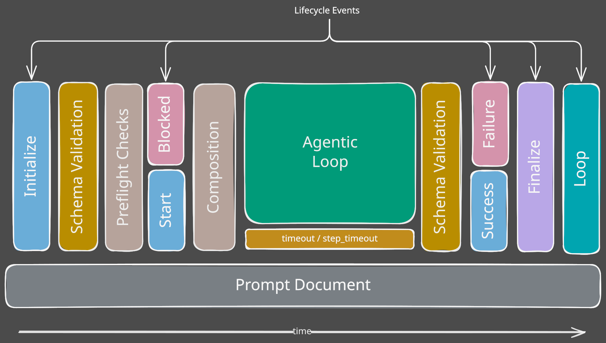

# Lifecycle Formalization for Claudine Prompts & Late Binding Context

## Introduction

When Claudine _executes_ a Markdown document -- via `compose`, `inline-compose`, `sequence`, etc. -- it kicks off a "lifecycle" of events. Today we already have  
four lifecycle events:

- `start` and `blocked`
- `success` and `failure`

At each of these stages, Claudine accepts instructions for how the prompt should communicate through the channels Claudine provides: TTS, messaging apps, desktop notifications, and stderr.

In this feature we will:

- add additional lifecycle events
- extend the number of lifecycle events we support
- introduce the idea of _lazily loaded_ variables and shell execution
- and increase the document author's ability to affect what happens at each lifecycle event:
    - you can still use the messaging features you're used to 
    - but you can also:
        - create side-effects (files, network messages, etc.)
        - handle errors (if there are any)
        - conditionally send messages (currently there is no "conditional" element)
        - throw errors if the LLM completed but didn't actually do what you wanted

## The Prompt Lifecycle



A Claudine prompt document moves through a fixed set of **composition lifecycle signals**. These are not the provider hook events modeled by `AgenticEvent` (`session_start`, `before_tool`, `turn_complete`, etc.); they are prompt-document execution milestones owned by `composition/lifecycle.rs`. Today four of them exist as `LifecycleSignal` variants (`start`, `success`, `blocked`, `failure`), but they only support a handful of communication properties. This feature formalizes the full composition-lifecycle signal set, introduces a unified per-event configuration model, and folds the pre-existing composition `loop` concern into that model.

### Event Inventory

| Event        | New?           | Fires when                                                                          |
|--------------|----------------|-------------------------------------------------------------------------------------|
| `initialize` | **new**        | Prompt file has been identified and frontmatter has parsed, before user `$schema` validation and shell pre-flight checks |
| `start`      | existing       | Pre-flight checks have all passed; about to invoke the agent                        |
| `blocked`    | existing       | Pre-flight checks failed; agent will not be invoked                                 |
| `success`    | existing       | Agentic loop completed without error                                                |
| `failure`    | existing       | Agentic loop returned an error                                                      |
| `finalize`   | **new**        | Once per iteration, immediately after the terminal `success`/`failure` (or `blocked`) completes; allows cleanup and last-chance error handling |
| `loop`       | **repurposed** | Post-`finalize` "iterate again?" gate; evaluates the document's `loop` while/until condition and either re-enters at `start` or exits (see [Loop](#loop)) |

### A Lifecycle event's `stack`

We'll get into this more later but for now it's important to know that each lifecycle event provides "a stack" of operations which can be run.

- these operations take place _not_ when the document is first loaded but instead when the document reaches the particular stage of the lifecycle

### Introduction to Lazily Loaded Variables, Functions and Side Effects

All of the variables in `doc`, `ctx`, and `env` are calculated once at the beginning of a Markdown's lifecycle but as we move through time
we will want to be able to react to state that is changing in the environment.

When in a lifecycle event's "stack" your conditional expressions as well as actions can gain access to:

- extended global variables (`err`, `timing`, `current`)
- additional functions categorized as "side effects" (because they can mutate the state outside of the current document)

> Note: `err`/`timing`/`current` are **lifecycle-only** globals. Document body and *non-lifecycle* frontmatter interpolation is evaluated at composition start, before any lifecycle event fires, so a bare `err`/`timing`/`current` there has **no** special meaning — it resolves as an ordinary identifier against frontmatter/context, exactly like any other variable name (with normal undefined-variable handling if absent). Lifecycle event properties are different: they interpolate **at event-time** (see the [late-binding spec](../2026-06-22-late-binding/spec.md)), so a lifecycle property/action string's `{{ … }}` span can read these globals. They are still meaningless outside a lifecycle event. This mirrors the err-vs-`doc.err` static-scan rule below: the globals are special only inside lifecycle events.

#### `err` global variable

Maybe the most obvious things we will want to do is interrogate and describe any error which has taken place. Currently there is no way to do that 
but we will introduce the `err` global variable.

- when there is an error the `err` variable will look like this (pseudo code):

    ```rust
    enum ErrorKind {
        ClaudineError(ClaudineError),
        HarnessError(HarnessError),
        CompositionError(CompositionError)
    }
    struct Err {
        /// serialized ErrorKind
        kind: String,
        /// the variant name of the underlying 
        variant: String,
        /// a description of the specific error 
        msg: String,
    }
    ```

- most lifecycle events are known to have an error (Blocked, Failure),
- some are also known to never have an error (initialize, start, success, loop),
- only the `finalize` state can _optionally_ be in an error state

Misuse of `err` is caught by a **static, parse-time scan** that reuses the existing expression-walk machinery — the same approach as `ExpressionFinder` in `composition/lifecycle.rs`. The two surface kinds are scanned differently, because communication/action bodies are now literal text with `{{ … }}` interpolation (the `literal-short-form-args` change), not whole expressions:

- **`when:` clauses** are whole boolean expressions — scanned as a single expression for a bare `err` reference.
- **communication / message / action strings** are literal prose; the scan walks only their `{{ … }}` **interpolation spans**, parsing each span and checking it for a bare `err` reference. A bare `err` outside a span is literal text, not a reference.

If a reference to the global `err` appears in an event that never carries an error, the scan raises a typed parse-time error (e.g. `CompositionError::LifecycleErrNotAvailable { event, .. }`) and the document does not run.

- **No-error events** (referencing `err` HALTS): `initialize`, `start`, `success`, `loop`
- **err-capable events** (`err` allowed): `blocked`, `failure`
- **optional-error event**: `finalize` — `err` may or may not be present, so referencing it is allowed

> Note: `doc.err` is the documented escape hatch and is **excluded** from this rule (exactly as the expression walk already excludes the `doc.` / `ctx.` / `env.` roots). If the reference the user was intending to make was `doc.err` then they will need to explicitly write it that way to be clear. Our goal with treating `err` as the global `err` object even when you are in a state that can't have errors is to quickly identify faulty logic and help the user to only use this variable where it is available.

#### `timing` global variable

The `timing` global variable provides the following information (pseudo code):

```rust
struct SequenceStep {
    name: String,
    /// the duration of a step in the sequence (total time if looped)
    duration: u32,
    /// how many loops did this step take before completing
    loops: u8, // TODO(clarify): u8 caps loops at 255; loop `max` defaults to 100 but is author-configurable and a higher `max` would overflow this field. Timing-type redesign deferred.
}

struct TimingInfo {
    /// the clock time since this document started executing (in seconds)
    duration: u32,
    /// the total clock time; will include all preceding steps in a sequence (if we're running inside one) or a loop (if we're running inside one)
    total_duration: u32,
    
    /// timings broken up by steps in the sequence
    sequence: Option<SequenceStep>
}
```

#### `current` global variable

Provides a structure of:

```rust
struct Current {
    ctx: CurrentContext,
    env: CurrentEnvironment,
}
```

- `current.ctx` and `current.env` allows you to check the same things which `ctx` and `env` provided but the calculation will be done at the time the event state has been reached.

### Events 

- **`initialize`** 
    - an early lifecycle state -- before schema validation and preflight checks -- to make sure everything is set up for success
    - at this part in the lifecycle the `ctx` and `env` global variable are fully available, however
    - the `doc` global variables which represent **state/frontmatter** are not completely formed yet:
        - ✔ the merging of any passed in state into the document's static state is complete
        - ✔ the 1st pass of interpolation has taken place on the Frontmatter
        - however, the 2nd stage of interpolation has not been done yet place because that can't be done until _after_ we do pre-flight validation and shell-expansion
    - Examples for usage might include:
        - if a particular doc variable is set, proxying to a different prompt file which expects that variable
        - fail fast if we know that the documents state or the ENV variables mean that this prompt can not succeed
- **`start`**
    - best moment to announce *this* prompt is running. 
    - Pre-flight has passed; the agent will be invoked next.
    - You may also want to "prep" the environment further than what was done in "initialize" now that you know we are going to run the agentic loop
- **`blocked`**
    - communicate why the prompt was rejected
    - optionally proxy to a different prompt instead?
- **`success`**
    - communicate completion, capture metrics, fire webhooks, advance a sequence.
    - you may also want to double check that the Agentic Loop that just completed actually did what it was supposed to
- **`failure`**
    - communicate failure, or
    - recover from Agentic errors with `Retry` / `Resume` / `Defer` / `Proxy`
- **`finalize`** 
    - fires once per iteration, immediately after the terminal `success`/`failure` (or `blocked`) completes
    - this is the only lifecycle state where you _might_ be in an error state but _might not_ be too
    - it gives you a chance to:
        - finalize things before exiting regardless of outcome
        - one last chance to handle an error
            - the errors that take place during the Agentic loop are probably most likely handled in the `Failure` lifecycle event but if the Agentic loops completes successfully and in `Success` you determine that in fact the Agentic loop did not complete successfully then you can handle those here
    - finalize has **no** special relationship to looping: in a looping document it fires every iteration, exactly like `success`/`failure`
- **`loop`** 
    - the post-`finalize` "iterate again?" gate
    - once a document has been "finalized", if the document has defined the "loop" property this event will trigger and evaluate its `while`/`until` condition
        - if the condition says to continue, the next iteration re-enters at `start` (not `initialize`)
        - if the condition says to stop, the document exits
    - documents that don't define the "loop" property will not receive a loop lifecycle event (a non-looping document runs exactly one iteration and exits)
    - the "loop" property is structurally a little different than the other lifecycle hooks in that _looping_ is predicated on a condition up front
    - however, the loop event allows for providing side effects both when the condition IS and IS NOT met

## Configuration Model

Every lifecycle event is configured under a frontmatter key matching its name and shares the same configuration shape.

```yaml
start:
    # Legacy communication properties (backward compatible)
    say: "Starting build for {{ctx.repo}}"
    notify: "Build starting"
    effect: small-group-cheer

    # The stack: ordered list of conditional actions
    stack:
        # conditional action, using key/value action
        - when: "env.AGENT == 'claude'"
          action: say
          message: "Using Claude provider"
        # conditional action, shorthand action

        - when: "env.AGENT == 'codex'"
          action: "say('using codex')"
        # unconditional actions, using shorthand form

        - action: "shell('git status --short')"
        - action: "info('pre-flight status captured')"

        # conditional multi-action

        - when: "file_exists('@state.md')"
          action:
            - "say('state file present')"
            - "info('continuing')"
```

> Reviewer note: an earlier revision removed the lifecycle `stdout` channel, reserving stdout exclusively for pipeable command data. That decision was reversed: `stdout` is a first-class channel again, emitting plain prose (no status glyph) to stdout. Authors opt into it knowing it interleaves with the composed/provider output on the same stream; most lifecycle communication should still prefer `stderr`/`info`/`warn`/`success`. The other channels (status and user-facing progress) continue to render to stderr via `TerminalRenderable` components.

### Top-Level Communication Properties

Each event accepts the following shorthand properties at its top level. They are unconditional and execute **before** the stack.

| Property       | Purpose                                                                          |
|----------------|----------------------------------------------------------------------------------|
| `say`, `speak` | TTS via host's speech provider, after `effect` when both are present             |
| `say_first`    | TTS via host's speech provider, before `effect` when both are present            |
| `effect`       | Sound effect from the embedded library                                           |
| `message`      | Send via configured messenger route (Slack, Discord, WhatsApp, Signal, webhooks) |
| `notify`       | OS desktop notification (replaces the deprecated `desktop:` alias)               |
| `stderr`       | Plain prose line to STDERR — **no status glyph or status styling**               |
| `info` (new)    | string presented using the Status::Info style                                   |
| `warn` (new)    | string presented using the Status::Warn style                                   |
| `success` (new) | string presented using the Status::Success style                                |
| `stdout` (new)  | Plain prose line to STDOUT — **no status glyph**; interleaves with composed/provider output |

`say` and `say_first` remain mutually exclusive. This preserves the existing `LifecycleSayConflict` contract and the current audio-ordering behavior.

`stderr`, `info`, `warn`, `success`, and `stdout` must render through `biscuit-terminal` `TerminalRenderable` components, not raw `eprintln!`/`println!` formatting. This keeps lifecycle output aligned with Claudine's existing terminal-output contract. Only `info`, `warn`, and `success` carry a `Status` decoration (glyph + state styling); `stderr` (to stderr) and `stdout` (to stdout) are the **statusless** channels and render as plain `Prose` (inline styling and links are honored, but no status glyph is attached) regardless of the owning lifecycle event.

All values support [Darkmatter interpolation](@darkmatter/docs/topics/darkmatter-expressions.md) but also get to use the new global variables provided to lifecycle events.

### The Stack

`stack:` is an **ordered list, processed top to bottom.** Each element is a `LifecycleStackItem`:

```rust
pub struct LifecycleStackItem {
    pub when: Option<Expression>,  // omitted == always true
    // one-or-many: a scalar deserializes to a single-element list, a YAML
    // sequence to many. At most one Lifecycle Action, always last (see below).
    pub action: OneOrMany<ActionRef>,
}
```

- `when:` is a [Darkmatter conditional expression](@darkmatter/docs/topics/darkmatter-expressions.md). When omitted, the item always executes.
- `action:` is one action or an ordered array of actions (_see [Actions](#actions)_), executed in order; a scalar deserializes to a single-element list.

### Stack Processing

```text
For each stack item, top to bottom:
  evaluate `when` →
    false: skip (no-op)
    true:  execute the item's actions in order
             (parse-time guarantee: at most ONE lifecycle action, and it is
              always the last action in the item — see cardinality rule below)
      for each action, in order:
        • communication, side effect, expression call, shell → run, continue
        • lifecycle action (Stop/Skip/Error/Proxy/Retry/Resume/Defer)
            → run, then stop processing this event (it is necessarily last)

If the stack runs to completion without a lifecycle action matching, the event ends normally.
```

## Actions

An action is one of five categories.

1. Lifecycle Actions
2. Communication Actions
3. Side-Effect Actions
4. Expression-Function Actions
5. Shell Actions

Most accept a **short form** (string) and a **long form** (dictionary). For any given when/action block you can have a singular action or an array of actions:

```yaml
    when: "phase > total_phases"
    # an array of actions, in both short form and long form are allowed
    action:
        - "say('you did it')"
        - "message('nice job')"
        - action: set_frontmatter
          file: "@spec.md"
          prop: "status"
          value: "in-progress"
```

but if there is only one action to take that is completely fine too:

```yaml
    when: "phase > total_phases"
    action: "say('you did it')"
```

The one important consideration for cardinality of _actions_ is that only ONE "Lifecycle Action" is allowed per block. This is because a lifecycle action is always the LAST action to be executed. We _could_ allow other actions to follow a lifecycle action but this is effectively "dead code" and these actions would never be executed. For that reason, we feel it is better to just have a Markdown file with this type of configuration resolve to a well communicated error to let the document owner make changes.

### Short-Form Action Grammar

The short form is `verb(args)`. The arguments inside the parentheses are **not** literal strings — they are parsed by the **Darkmatter expression engine**, the same engine used for `when:` clauses and `{{ }}` interpolation. Consequences:

- `say(ctx.repo)` evaluates the expression `ctx.repo`
- `say('hello')` passes the literal string `hello` (string literals must be quoted)
- `say(ctx.user || 'anon')` is an expression with a fallback
- `retry(3)` passes the integer `3`
- `proxy('@foo.md')` passes a file reference

Because args are expressions, a bare unquoted multi-word string (e.g. `say(using codex)`) is **invalid** — quote it (`say('using codex')`) or write a real expression.

Validation is **static / parse-time**: short-form syntax, argument cardinality, and "Where valid" placement are all checked when the document is parsed, emitting typed `CompositionError` variants — they never surface at runtime. In particular:

- the cardinality rule (only ONE Lifecycle Action per block) is enforced at parse time, e.g. `CompositionError::LifecycleMultipleLifecycleActions`
- the "Where valid" matrix (below) is enforced at parse time, e.g. `CompositionError::LifecycleActionNotValidHere { action, event }`

This is consistent with the existing static validators in `composition/lifecycle.rs`.

### Lifecycle Actions

These actions change what happens next. The first one whose `when:` matches **terminates stack processing** for the current event.

| Action    | Where valid                        | Effect                                                                                                                                                                                                                                              |
|-----------|------------------------------------|-----------------------------------------------------------------------------------------------------------------------------------------------------------------------------------------------------------------------------------------------------|
| `Stop`    | every event                        | End this event's stack cleanly. Composition continues with the current outcome unchanged.                                                                                                                                                           |
| `Skip`    | `initialize` only                  | Whole-document opt-out. Ends the run immediately — no agent invocation, no `finalize`, no `loop` gate, no iterations (looping a skipped prompt is incoherent). Pre-flight does not run. Emits an `INFO` log line indicating the skip. In a sequence, advances to the next step. |
| `Error`   | every event                        | Mark this event as failed with a reason. At `initialize`/`start` this prevents agent invocation and routes to `failure`; at `success` it routes to `failure` before `finalize`; at `finalize` it converts the final outcome to failure without re-entering `failure`; at `blocked`/`failure` it short-circuits further recovery attempts. |
| `Proxy`   | every event | Hand off execution to another prompt document. The proxied document enters at its own `initialize` event — a fresh prompt run, including pre-flight. The target document's own opt-out logic (`Skip`/`Proxy`/`Error` at `initialize`) is respected. |
| `Retry`   | every event | Try the current prompt again. When the provider has not launched yet (`initialize`/`start`/`blocked`), retry re-runs the pre-flight/start path; once it has (`success`/`failure`/`finalize`), retry re-invokes the agentic loop. Parameters: `max_attempts` (the number of additional attempts beyond the original attempt, default `1`), `backoff` (`fixed` \| `exponential`, default `fixed`), `delay` (duration, default `0s`). |
| `Resume`  | every event | Resume the agent session with its context intact and a follow-up message. Requires a live session, so pre-launch events surface `ResumeWithoutSession` at runtime. Parameters: `message` (the follow-up prompt, required), `max_attempts` (default `1`). In short form, `resume("...message...")` binds its string argument to the required `message:` parameter. |
| `Defer` | every event | Defer this prompt to **run again later** — a fresh scheduled run after the delay (not an in-place pause), via the `rendezvous` deferred-execution scheduler. Parameters: `delay` (duration, required), `reason` (string, optional). **Not implemented yet:** `defer` parses and dispatches but surfaces a typed `LifecycleDeferNotImplemented` error until the rendezvous backend lands. |

**`finalize` is one of many recovery surfaces.** Because `finalize` is the only terminal event that may carry an error, it is a natural last-chance recovery surface — a `finalize.stack` guarded by `when: "err"` can `Retry`/`Resume`/`Defer`/`Proxy`. But recovery is **not** unique to `finalize`: any event may do the same in response to any state (see below).

### Flow control is universal; `Skip` is the one placement rule

Flow control reacts to **state**, and an error is just one kind of state. So `Error`, `Stop`, `Retry`, `Resume`, `Defer`, and `Proxy` are valid in **every** event. Examples: a `success` stack may `resume("you finished but never wrote abc.md — create it")` when an expected artifact is missing; a `start` stack may `proxy` based on an `env` value; a `blocked` stack may `defer` for later.

`Skip` is the **single** placement-restricted action — `initialize`-only, because opting out of the whole document is incoherent once anything has run.

Apparent event-specific differences are **runtime capability**, not placement, and are checked at runtime:

- `Resume` needs a live provider session — pre-launch (`initialize`/`start`/`blocked`) it surfaces `ResumeWithoutSession`.
- `Retry`'s re-entry point is derived from whether the provider had launched, not from which event fired.

This is enforced in **one** place — the parse-time pre-scan (`is_valid_for` → `LifecycleActionPlacement`, which now restricts only `Skip`, alongside the still-active `err`-in-no-error-event scan). **Runtime dispatch is uniform:** every event's stack runs and dispatches its control through the same event-agnostic path; there is no second, per-event runtime gate. The iteration/`loop` engine is a separate concern from handlers and is never coupled to handler dispatch.

Short forms:

- `"stop"`, `"skip"`
- `"proxy('@prompts/foo.md')"`
- `"error(\"reason\")"`
- `"retry"`, `"retry(3)"` — count shorthand: `retry(N)` sets `max_attempts = N` (the number of additional attempts beyond the original attempt), so bare `retry` / `retry(1)` means one retry
- `"resume(\"please set the production_ready frontmatter\")"` — binds the string argument to the required `message:` parameter
- `"defer('5m')"`

### Communication Actions

The same channels as the top-level properties, but each is a discrete stack item (so it can be guarded by `when:`).

| Action          | Short form         | Long form parameter                                           |
|-----------------|--------------------|---------------------------------------------------------------|
| `say` / `speak` | `say("hi")`        | `message:`                                                    |
| `effect`        | `effect("applause")` | `sound:`                                                    |
| `message`       | `message("done")`  | `message:` (optionally `route:` to pin to a specific channel) |
| `notify`        | `notify("done")`   | `message:`                                                    |
| `stderr`        | `stderr("warn")`   | `message:`                                                    |
| `info`          | `info("status")`   | `message:`                                                    |
| `warn`          | `warn("careful")`  | `message:`                                                    |

```yaml
success:
    stack:
        - when: "env.AGENT == 'claude'"
          action: say
          message: "Claude finished"

        - action: effect
          sound: applause
```

### Side-Effect Actions

Mutating operations (file creation, frontmatter updates, HTTP POSTs, etc.) are provided by the Darkmatter side-effects system (canonical reference: [`side-effects.md`](@darkmatter/docs/topics/side-effects.md); implemented in `darkmatter/lib/src/effects/`). The lifecycle stack invokes them by name:

```yaml
start:
    stack:
        - action: "ensure_file('@prompts/state.md')"
        - action: set_frontmatter
          file: "@spec.md"
          prop: "status"
          value: "in-progress"
```

This spec deliberately does **not** define the side-effect catalog. The Darkmatter side-effects system is **already implemented** — for the authoritative, live list and call shapes run `claudine context --side-effects` (rendered from Darkmatter's typed descriptor catalogs, so it cannot drift) or read [`side-effects.md`](@darkmatter/docs/topics/side-effects.md). At time of writing it provides three groups:

- **Frontmatter Mutations** — `set_frontmatter`, `merge_frontmatter`, `delete_frontmatter`, `increment_frontmatter`, `decrement_frontmatter`, `append_frontmatter`, `prepend_frontmatter`
- **File & Directory** — `ensure_file`, `ensure_dir`, `append_line`, `append_jsonl`
- **Network** — `http_post`

### Expression-Function Actions

Read-only [Darkmatter expression functions](@darkmatter/docs/topics/darkmatter-expressions.md) may also be invoked as stack actions, primarily for logging their result or feeding it into a subsequent `set_frontmatter` step. They are mostly useful inside `when:` clauses; standalone use is supported but rare.

### Shell Actions

Bespoke shell commands invoked from the stack.

```yaml
- "shell('git status --short')"
- action: shell
  command: "git push origin HEAD"
  on_error: "Push failed; check network"
  no_error: false
```

| Long-form parameter | Purpose                                                                        |
|---------------------|--------------------------------------------------------------------------------|
| `command`           | The shell command string (required)                                            |
| `on_error`          | Message to emit when the command exits non-zero                                |
| `no_error`          | Boolean; when `true`, suppress error exit codes without altering STDOUT/STDERR |

**Pre-flight requirement:** every shell command in every reachable stack must pass Claudine's command whitelist during pre-flight, exactly like body-level shell expansions today.

## Per-Event Details

### `initialize`

Runs as soon as the prompt file is identified. Pre-flight checks have **not** run. Use for:

- Cheap upfront communication ("starting pre-flight…")
- Opting out via `Skip` (e.g., feature-flag a prompt off) — `Skip` terminates the whole document immediately; the loop gate is never reached (sequence: advance to next step)
- Proxying to a different prompt via `Proxy` (e.g., route based on env)
- Preparing the environment via side effects so pre-flight checks will succeed

**`initialize` is a timing slot, not a validation phase.** It runs after the prompt file and its frontmatter have parsed, after CLI/frontmatter override merging, and before user `$schema` validation and shell pre-flight. It cannot "fail itself" — pre-flight (owned by `start`) remains the single validation surface. The only way `initialize` alters flow is by a stack item evaluating a lifecycle action (`Skip`, `Proxy`, `Error`, `Stop`). An `Error` raised here routes through the normal `failure` event path, same as anywhere else.

**What "pre-flight" means.** Throughout this spec, "pre-flight checks" refers to exactly two surfaces: `$schema` validation and the shell-command audit (every reachable stack's shell commands pass Claudine's whitelist). It does **not** include the legacy harness `pre_checks`/`post_checks` and handler DSL, whose gating/verification/recovery roles are subsumed by the lifecycle stack (`when:` guards plus `Error`/`Skip`/`Proxy`/`Retry`/`Resume`/`Defer` actions). That DSL has been retired in a companion feature — see [Retire the Harness Pre/Post Validation & Handler DSL](../2026-06-21-remove-validations/spec.md); declaring any of those keys now rejects with a typed `RemovedValidationKey` diagnostic. A `blocked` outcome is therefore produced by a schema-validation failure or a shell-audit denial.

### `start`

Pre-flight has passed; the agent is about to be invoked. Last chance to communicate before non-determinism takes over.

### `blocked`

A pre-flight check failed. The agent will not be invoked. Common patterns: communicate the failure, `Proxy` to a fallback prompt, `Retry` after a side-effect fixes the offending condition, or `Defer` for later execution.

### `success`

Agentic loop completed cleanly. Common patterns: announce outcome, commit a side effect (e.g., `append_jsonl` to a log), or advance the sequence via the normal success path (e.g., `Defer` the next step).

### `failure`

Agentic loop errored. Common patterns: announce failure, recover via `Retry` / `Resume` / `Defer` / `Proxy`, or simply communicate and exit.

### `finalize`

Fires once per iteration, immediately after the terminal `success`/`failure` (or `blocked`) completes. It is the **only** terminal event that might or might not carry an error: `err` is present when the iteration ended in failure (or `success` was converted to failure) and absent otherwise.

Use for:

- Cleanup that must run **regardless of outcome** (close handles, flush logs, remove scratch files)
- A last-chance error handler — e.g., the agentic loop reported success but `finalize` inspects `current` state, decides the work was not actually done, and raises an `Error`
- A last-chance **recovery** handler — `finalize` may also `Retry`, `Resume`, `Defer`, or `Proxy` (typically guarded by `when: "err"`) when it determines the iteration's work is incomplete. A recovery action re-enters the run (or hands off) under the same per-control `max_attempts` budget as the `failure` event. This is the canonical pairing for "verify in `success`, recover in `finalize`": a `success` stack raises `Error` (routing through `failure`), and the subsequent `finalize` — now carrying `err` — retries.

> Note: this is not in tension with the [Action Error Propagation](#action-error-propagation) table's "composition outcome unchanged" rule for `finalize`. That rule governs an action that *unintentionally* errors. The last-chance handler here uses the **explicit `Error` lifecycle action**, which (per the [Lifecycle Actions](#lifecycle-actions) "Where valid" matrix) is a deliberate author choice and **does** convert success → failure. Because `finalize` is already the last terminal boundary, an `Error` raised there updates the final outcome and does **not** re-enter the `failure` event.

`finalize` has no special relationship to looping. In a looping document it fires every iteration, exactly like `success`/`failure`.

### `loop`

The `loop` event is **both** an iteration-control configuration **and** a lifecycle event. The two concern groups share one frontmatter block.

The `loop` gate answers "should I iterate again?", not "what went wrong?" — even though the just-completed iteration may have failed, error inspection belongs in `failure`/`finalize`, so the gate is intentionally error-agnostic and `err` is statically forbidden here (it remains a no-error event).

#### Iteration Controls (already implemented)

These keys govern *how* the prompt iterates:

| Key                  | Type                                 | Purpose                                                 | Default |
|----------------------|--------------------------------------|---------------------------------------------------------|---------|
| `while`              | expression                           | Continue while truthy. Mutually exclusive with `until`. | —       |
| `until`              | expression                           | Continue until truthy. Mutually exclusive with `while`. | —       |
| `action` / `actions` | string or list                       | Per-iteration frontmatter mutations                     | —       |
| `max`                | positive integer                     | Hard iteration cap                                      | `100`   |
| `fail_fast`          | boolean                              | Abort the loop on first iteration error                 | `true`  |
| `on_rate_limit`      | enum: `pause` \| `abort` \| `continue` | Behavior on provider rate-limit                         | `pause` |

Per-iteration `action` operations (existing DSL):

- `increment(prop)`, `decrement(prop)` — numeric mutation
- `set(prop, value)` — assign
- `append(prop, value)`, `prepend(prop, value)` — array mutation
- `merge(prop, value)` — shallow object merge

Both DSL string form (`"increment(phase)"`) and structured form (`{op: "increment", prop: "phase"}`) are accepted.

Ambient variables exposed inside each iteration:

- `_loop_count` (1-based iteration number)
- `_loop_is_first`, `_loop_is_last` (booleans; `_loop_is_last` is speculative)
- `_loop_last_output`, `_loop_last_exit_code` (from previous iteration)

#### Lifecycle Concerns

In addition to iteration controls, the `loop` block accepts the standard lifecycle-event properties (`say`, `say_first`, `notify`, `effect`, `message`, `stderr`, `info`, `warn`, `success`, `stdout`, `stack`).

**Firing model:** looping **wraps the whole document** — each iteration is a complete execution of the lifecycle. The `loop` event is a **single unified gate** that runs after `finalize` and decides whether to iterate again.

- **First iteration** runs the full lifecycle: `initialize` → (`start` | `blocked`) → (`success` | `failure`) → `finalize` → `loop` gate.
- **Later iterations re-enter at `start`** (not `initialize`): `start` → (`success` | `failure`) → `finalize` → `loop` gate.
- `initialize`, pre-flight checks, and schema validation run **only once** (first iteration). They are **not** repeated on later iterations.
- `success`, `failure`, and `finalize` fire **per iteration**. A document that loops 5 times fires 5 `success`/`failure` events and 5 `finalize` events.
- `fail_fast` is evaluated after terminal handling for the iteration. When `fail_fast: true` and the iteration ends in unrecovered `blocked`/`failure`, Claudine still emits `finalize` but exits before the `loop` gate. When `fail_fast: false`, the `loop` gate runs after failed iterations too.

**At the gate**, in this order:

1. The loop block's **lifecycle concerns** fire (`say`/`say_first`/`notify`/`effect`/`message`/`stderr`/`info`/`warn`/`success`/`stdout`/`stack`) against the **just-completed iteration's** frontmatter state — i.e. *before* the per-iteration `action` mutation is applied. Because this runs after `finalize`, the lifecycle concerns describe the iteration that just finished, not the one about to start.
2. The condition (`while`/`until`) is evaluated.
3. If continuing, the per-iteration `action` mutations (`increment`/`set`/`append`/etc.) are applied and control re-enters at `start`. If stopping, the document exits.

Because the concerns fire in step 1 — before the stop condition is evaluated in step 2 — **they fire on every gate pass, including the terminal pass that decides to exit.** This is a uniform rule with no special-casing: a `say`/`notify` at the gate announces on the final iteration too. To scope behavior to the exit, guard it with `when: "_loop_is_last"`; for entry-only behavior, use `when: "_loop_is_first"`.

```text
                ┌──────────────┐
                │  initialize  │   (first iteration only)
                └──────┬───────┘
                       │
   ┌──────────────┐    │
   │  continue:   │    │
   │ re-enter at  ▼    ▼
   │   `start`  ┌───────┐              ┌─────────┐
   │  (skips    │ start │              │ blocked │
   │ initialize)└───┬───┘              └────┬────┘
   │                │                       │
   │           ┌────┴─────┐                 │
   │           ▼          ▼                 │
   │      ┌─────────┐ ┌─────────┐           │
   │      │ success │ │ failure │           │
   │      └────┬────┘ └────┬────┘           │
   │           └─────┬─────┘────────────────┘
   │                 ▼
   │            ┌──────────┐
   │            │ finalize │   (fires every iteration)
   │            └────┬─────┘
   │                 ▼
   │            ┌──────────┐
   └────────────┤   loop   │
     continue   │  (gate)  │
                └────┬─────┘
                     │ stop
                     ▼
                   done
```

Use the ambient variables `_loop_is_first` and `_loop_is_last` in `when:` clauses to express entry-only, exit-only, or per-iteration behavior. The iteration controls (`while`/`until`/`action`/`max`/`fail_fast`/`on_rate_limit`) are processed by the existing loop engine and are **not** lifecycle events themselves — they govern *whether* and *how* the next iteration runs, while the lifecycle concerns govern *what to say and do at* each iteration boundary.

There is **no** separate outer-vs-inner terminal event: terminal events (`success`/`failure`/`finalize`) fire once per iteration, full stop.

**Blocked first iteration:** if pre-flight fails on the first iteration the document routes to `blocked`. The intended behavior is that a blocked iteration always reaches `finalize`. It reaches the `loop` gate only when the blocked state was recovered or `fail_fast: false`; with the default `fail_fast: true`, an unrecovered blocked first iteration exits after `finalize`.

```yaml
phase: 1
total_phases: 6
loop:
    # Iteration controls — processed by the loop engine
    until: "phase > total_phases"
    action: "increment(phase)"
    max: 10
    fail_fast: true
    on_rate_limit: pause

    # Lifecycle concerns — fire at the gate, after `finalize`, once per iteration.
    # The announcement names the iteration that JUST finished (pre-increment),
    # so phrase it as completion, not as the upcoming phase.
    say: "Completed phase {{phase}} of {{total_phases}}"
    stack:
        - when: "_loop_is_first"
          action: notify
          message: "Build loop started"

        # `_loop_is_last` is still speculative (see Iteration Controls).
        - when: "_loop_is_last"
          action: effect
          sound: applause
```

## Action Error Propagation

When a side-effect, expression-function, or shell action errors during stack processing, what happens depends on which event is processing the stack.

| Event                  | Default behavior on errored action                               |
|------------------------|------------------------------------------------------------------|
| `initialize`           | Stop the stack, log the error, transition to `failure` event     |
| `start`                | Stop the stack, log the error, transition to `failure` event     |
| `blocked`              | Stop the stack, log the error, transition to `failure` event     |
| `success`              | Stop the stack, log the error, **composition outcome unchanged** |
| `failure`              | Stop the stack, log the error, **composition outcome unchanged** |
| `finalize`             | Stop the stack, log the error, **composition outcome unchanged** |
| `loop` (gate)          | Stop the stack, log the error, **composition outcome unchanged** |

The split is intentional: setup-phase errors should propagate so the agent isn't invoked with a broken environment, but terminal-phase errors (a flaky webhook in `success.stack`) must never invert the composition's actual outcome. The `loop` gate runs *after* `finalize`, so it is treated like a terminal-phase event: an errored action there cannot retroactively change an iteration's already-decided outcome.

**An action that errors vs. the explicit `Error` lifecycle action.** This table governs **unintentional** action errors — a side-effect, shell, or expression action that happens to fail. At terminal-phase events (`success`/`failure`/`finalize`/`loop`) those never invert the outcome. An explicit `Error` **lifecycle action**, by contrast, is a deliberate author choice and **does** change the outcome (success → failure) wherever the [Lifecycle Actions](#lifecycle-actions) "Where valid" matrix permits it. The two are governed by different tables: "an action that errored" by this propagation table, "the explicit `Error` action" by the Lifecycle Actions table.

**Explicit lifecycle-action transitions:**

| Current event | `Error` transition | `Proxy` transition | `Retry` transition |
|---------------|--------------------|--------------------|--------------------|
| `initialize` | route to `failure`, then `finalize`, then optional `loop` gate | replace the current run with the target prompt at its `initialize` | not valid |
| `start`      | route to `failure`, then `finalize`, then optional `loop` gate | not valid | not valid |
| `blocked`    | keep blocked/failure outcome, skip remaining recovery actions, then `finalize`, then optional `loop` gate | replace the current run with the target prompt at its `initialize` | retry pre-flight/start path |
| `success`    | route to `failure`, then `finalize`, then optional `loop` gate | not valid | not valid |
| `failure`    | keep failure outcome, skip remaining recovery actions, then `finalize`, then optional `loop` gate | replace the current run with the target prompt at its `initialize` | retry provider invocation path |
| `finalize`   | convert final outcome to failure; do not re-enter `failure` | replace the current run with the target prompt at its `initialize` | retry provider invocation path (re-enter the run) |
| `loop`       | convert final outcome to failure and exit the loop | not valid | not valid |

**Per-action escape hatch:** any action accepts a `no_error: true` parameter to suppress error propagation. When set, errors are logged but the stack continues to the next item, and the composition outcome is unchanged regardless of which event is processing the stack.

```yaml
start:
    stack:
        - action: shell
          command: "git fetch --all"
          no_error: true       # never block agent invocation on fetch failure

        - action: "ensure_file('@out/log.md')"
```

This extends the existing `no_error` flag (previously defined only for `shell`) to all action categories.

## Backward Compatibility

Existing prompts using only top-level communication properties continue to work unchanged:

```yaml
start:
    say: "hi"
success:
    effect: applause
failure:
    message: "Something broke"
```

Adding `stack:` is purely additive. The top-level properties fire first, then the stack is processed.

## Acceptance Criteria

Each item is a concrete, checkable assertion derived from the decisions above.

- All 7 events (`initialize`, `start`, `blocked`, `success`, `failure`, `finalize`, `loop`) parse and dispatch in the defined order.
- Later loop iterations re-enter at `start` and do **not** re-run `initialize`, pre-flight, or schema validation.
- `finalize` fires once per iteration after `success`/`failure` (or `blocked`); an N-iteration loop fires exactly N `finalize` events.
- When the `loop` gate is reached, lifecycle concerns fire before the condition is evaluated, and the per-iteration `action` mutation is applied only on continue (and only after the concerns fired) — so the concerns observe pre-mutation frontmatter.
- With `fail_fast: true`, an unrecovered `blocked`/`failure` iteration still emits `finalize` but exits before the `loop` gate; with `fail_fast: false`, failed iterations can reach the `loop` gate.
- Short-form action args parse as Darkmatter expressions; an unquoted multi-word literal (e.g. `say(using codex)`) is a **parse-time** error.
- Cardinality (at most one Lifecycle Action per block) and "Where valid" violations are reported as typed `CompositionError` variants at **parse time**, never at runtime.
- Referencing the global `err` in a no-error event (`initialize`/`start`/`success`/`loop`) halts at parse time; `doc.err` is exempt from the scan.
- A bare `err`/`timing`/`current` in body or frontmatter interpolation resolves as an ordinary identifier (no special meaning), with normal undefined-variable handling if absent.
- Top-level communication properties fire before the stack for every event.
- `say_first` remains supported and mutually exclusive with `say` for every lifecycle event.
- Lifecycle output mostly uses `stderr`, `info`, `warn`, or `success`, with machine-readable side effects via files/frontmatter/JSONL. The opt-in `stdout` channel writes plain prose to stdout for authors who specifically want it there.
- An action carrying `no_error: true` logs its error and continues to the next stack item, leaving the composition outcome unchanged regardless of event.
- An unintentional action error at a terminal-phase event (`success`/`failure`/`finalize`/`loop`) does not invert the composition outcome; an explicit `Error` lifecycle action at `success`/`finalize` does convert success → failure, with `finalize` doing so without re-entering `failure`.
- The recovery actions `Retry`, `Resume`, `Defer`, and `Proxy` are valid in `finalize` (parse-time and runtime), and a `finalize.stack` recovery re-enters the run (or hands off) under the same per-control `max_attempts` budget as `failure`. The canonical "verify in `success`, recover in `finalize`" pattern (success `Error` → `failure` event → `finalize` retry) works end-to-end.
- Existing top-level-only prompts (`say`/`effect`/`message` at `start`/`success`/`failure`) continue to work unchanged.

## Test Strategy

Tests follow the existing `composition/lifecycle.rs` patterns and the monorepo L1/L2/L3 tier taxonomy in the `rust-testing` skill.

- **L1 (`just test`, unit):**
    - frontmatter parsing of all 7 event blocks and the merged `loop` block
    - short-form action grammar (`verb(args)`), including the unquoted-multi-word parse-time error
    - expression-argument parsing for action args
    - cardinality (one Lifecycle Action per block) and "Where valid" validation
    - `err` static-scan (halts in no-error events; `doc.err` exempt)
    - the lifecycle `stdout` field and `stdout(...)` action parse as a statusless stdout channel; genuinely unknown fields still error typed and include frontmatter excerpts
    - lifecycle interpolation-leak / undefined-variable guards extended to the new events (`initialize`/`finalize`/`loop`)
    - action error-propagation defaults per event
    - `fail_fast` interaction with failed iterations (`finalize` always fires; `loop` gate only runs for failed iterations when `fail_fast: false` or the failure was recovered)
    - the `no_error: true` escape hatch
- **L2 (`just test-l2`, integration):**
    - end-to-end lifecycle dispatch ordering across the full event set
    - loop gate flow: re-enter at `start`, per-iteration `finalize` count, concerns-before-condition-before-mutation ordering
    - `Proxy` / `Retry` / `Resume` / `Defer` control flow
    - the blocked-first-iteration edge case (`blocked` → `finalize`, then exit for unrecovered `fail_fast: true` or reach the `loop` gate for recovered / `fail_fast: false`)
- **L3 (optional, real terminal / provider):**
    - a real provider wrap exercising `start` → `success` → `finalize` with a trivial prompt

## Migration

> Draft for author review. The intended direction is **extend, not replace** — consistent with the "Adding `stack:` is purely additive" and Backward Compatibility statements above. The internal-type sketch below states only the additive contract; do not read it as a committed refactor of internal types.

- Today's `LifecycleConfig` / `LifecycleNotification` gain new **optional** fields (`stack`, `info`, `warn`, `success`, `stdout`) rather than being replaced. Their `#[serde(deny_unknown_fields)]` must be updated to admit the new keys while continuing to reject genuinely unknown fields.
- The `LifecycleSignal` enum gains `Initialize`, `Finalize`, and `Loop` variants (today only `start`/`success`/`blocked`/`failure` exist).
- The existing `LoopConfig` block gains the lifecycle-concern keys (`say`/`say_first`/`notify`/`effect`/`message`/`stderr`/`info`/`warn`/`success`/`stdout`/`stack`) alongside its iteration controls.
- Existing prompts using only top-level communication properties continue to parse and behave identically — no breaking change.

## Dependencies

- **Darkmatter side-effects system** — **already implemented** (source: `darkmatter/lib/src/effects/`; canonical doc: [`side-effects.md`](@darkmatter/docs/topics/side-effects.md); design spec: [`more-context-variables`](@darkmatter/features/_completed/2026-06-01-more-context-variables/spec.md); live catalog: `claudine context --side-effects`). Side effects are the substrate for non-lifecycle, non-shell, non-communication actions. This dependency is **satisfied** — no longer a blocker for this feature shipping.
- **Darkmatter expression engine** ([`expressions`](@darkmatter/docs/topics/darkmatter-expressions.md)) — already implemented; used for `when:` conditions and interpolation in messages.
