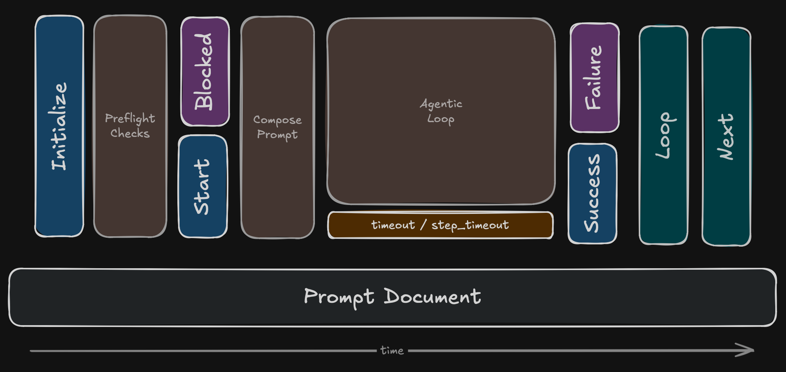

# Lifecycle Formalization for Claudine Prompts

## The Prompt Lifecycle



A Claudine prompt document moves through a fixed set of lifecycle events. Today four of them exist as `LifecycleSignal` variants in `composition/lifecycle.rs` (`start`, `success`, `blocked`, `failure`), but they only support a handful of communication properties. This feature formalizes the full event set, introduces a unified per-event configuration model, and folds two pre-existing composition concerns (`loop`, `next`) into that model.

### Event Inventory

| Event | New? | Fires when |
|---|---|---|
| `initialize` | **new** | Prompt file has been identified, before any pre-flight checks have run |
| `start` | existing | Pre-flight checks have all passed; about to invoke the agent |
| `blocked` | existing | Pre-flight checks failed; agent will not be invoked |
| `success` | existing | Agentic loop completed without error |
| `failure` | existing | Agentic loop returned an error |
| `loop` | **repurposed** | An iteration of a looping prompt boundary (see [Loop](#loop)) |
| `next` | **new** | Composition completed successfully and a handoff is configured |

### Event Purpose

- **`initialize`** — quick communication, environment prep, or opt-out before the prompt commits to running. Cheap, runs even when pre-flight will fail.
- **`start`** — best moment to announce *this* prompt is running. Pre-flight has passed; the agent will be invoked next.
- **`blocked`** — communicate why the prompt was rejected; optionally proxy to a different prompt.
- **`success`** — communicate completion, capture metrics, fire webhooks, advance a sequence.
- **`failure`** — communicate failure, recover with `Retry` / `Resume` / `Requeue` / `Proxy`, or simply exit.
- **`loop`** — per-iteration boundary inside a looping prompt; layers lifecycle-event behavior on top of the existing iteration controls.
- **`next`** — handoff to another document on successful completion.

## Configuration Model

Every lifecycle event is configured under a frontmatter key matching its name and shares the same configuration shape.

```yaml
start:
    # Legacy communication properties (backward compatible)
    say: "Starting build for {{ctx.repo}}"
    notify: "Build starting"
    effect: small-group-cheer

    # The stack: ordered list of conditional actions
    stack:
        - when: "env.AGENT == 'claude'"
          action: say
          message: "Using Claude provider"
        - "shell(git status --short)"
```

### Top-Level Communication Properties

Each event accepts the following shorthand properties at its top level. They are unconditional and execute **before** the stack, in the order written.

| Property | Purpose |
|---|---|
| `say`, `speak` | TTS via host's speech provider |
| `effect` | Sound effect from the embedded library |
| `message` | Send via configured messenger route (Slack, Discord, WhatsApp, Signal, Telegram) |
| `notify` | OS desktop notification (replaces the deprecated `desktop:` alias) |
| `stderr` | Plain string to STDERR |
| `stdout` | Plain string to STDOUT |

All values support [Darkmatter interpolation](@darkmatter/docs/topics/darkmatter-expressions.md).

### The Stack

`stack:` is an **ordered list, processed top to bottom.** Each element is a `LifecycleStackItem`:

```rust
pub struct LifecycleStackItem {
    pub when: Option<Expression>,  // omitted == always true
    pub action: ActionRef,
}
```

- `when:` is a [Darkmatter conditional expression](@darkmatter/docs/topics/darkmatter-expressions.md). When omitted, the item always executes.
- `action:` is exactly one action (see [Actions](#actions)). If you want multiple effects, write multiple stack items.

### Stack Processing

```text
For each stack item, top to bottom:
  evaluate `when` →
    false: skip (no-op)
    true:  execute action
      • communication, side effect, expression call, shell → continue to next item
      • lifecycle action (Stop/Skip/Error/Proxy/Retry/Resume/Requeue) → stop processing this event

If the stack runs to completion without a lifecycle action matching, the event ends normally.
```

## Actions

An action is one of five categories. Most accept a **short form** (string) and a **long form** (mapping with `action:` key plus parameters).

### Lifecycle Actions

These actions change what happens next. The first one whose `when:` matches **terminates stack processing** for the current event.

| Action | Where valid | Effect |
|---|---|---|
| `Stop` | every event | End this event's stack cleanly. Composition continues. |
| `Skip` | `initialize` only | Mark the prompt as skipped without running it. Pre-flight does not run. Emits an `INFO` log line indicating the skip. In a sequence, advances to the next step. |
| `Error` | every event | Mark this event as failed with a reason. At `start`/`initialize` this prevents agent invocation; at `success` it converts the outcome to failure; at `blocked`/`failure` it short-circuits further recovery attempts. |
| `Proxy` | `initialize`, `blocked`, `failure` | Hand off execution to another prompt document. The proxied document enters at its own `initialize` event — a fresh prompt run, including pre-flight. The target document's own opt-out logic (`Skip`/`Proxy`/`Error` at `initialize`) is respected. |
| `Retry` | `blocked`, `failure` | Re-run the agentic loop from the last invocation. Parameters: `max_attempts` (default `1`), `backoff` (`fixed` \| `exponential`, default `fixed`), `delay` (duration, default `0s`). |
| `Resume` | `failure` only | Resume the agent session with its context intact and a follow-up message. Parameters: `message` (the follow-up prompt, required), `max_attempts` (default `1`). |
| `Requeue` | `blocked`, `failure` | Push this prompt onto the deferred-execution queue (via `rendezvous`). Parameters: `delay` (duration, required), `reason` (string, optional). |

Short forms:

- `"stop"`, `"skip"`
- `"proxy(@prompts/foo.md)"`
- `"error(\"reason\")"`
- `"retry"`, `"retry(3)"` (count shorthand)
- `"resume(\"please set the production_ready frontmatter\")"`
- `"requeue(5m)"`

### Communication Actions

The same channels as the top-level properties, but each is a discrete stack item (so it can be guarded by `when:`).

| Action | Short form | Long form parameter |
|---|---|---|
| `say` / `speak` | `say("hi")` | `message:` |
| `effect` | `effect(applause)` | `sound:` |
| `message` | `message("done")` | `message:` (optionally `route:` to pin to a specific channel) |
| `notify` | `notify("done")` | `message:` |
| `stderr` | `stderr("warn")` | `message:` |
| `stdout` | `stdout("ok")` | `message:` |

```yaml
success:
    stack:
        - when: "env.AGENT == 'claude'"
          action: say
          message: "Claude finished"
        - action: effect
          sound: applause
```

### Side-Effect Actions

Mutating operations (file creation, frontmatter updates, HTTP POSTs, etc.) are provided by the Darkmatter side-effects system introduced in [`more-context-variables`](@darkmatter/features/_unscheduled/more-context-variables/spec.md). The lifecycle stack invokes them by name:

```yaml
start:
    stack:
        - "ensure_file(@prompts/state.md)"
        - action: set_frontmatter
          file: "@spec.md"
          prop: "status"
          value: "in-progress"
```

This spec deliberately does **not** define the side-effect catalog. See the Darkmatter spec for the authoritative list and call shapes. **Dependency:** the Darkmatter side-effects work must ship before this lifecycle feature ships.

### Expression-Function Actions

Read-only [Darkmatter expression functions](@darkmatter/docs/topics/darkmatter-expressions.md) may also be invoked as stack actions, primarily for logging their result or feeding it into a subsequent `set_frontmatter` step. They are mostly useful inside `when:` clauses; standalone use is supported but rare.

### Shell Actions

Bespoke shell commands invoked from the stack.

```yaml
- "shell(git status --short)"
- action: shell
  command: "git push origin HEAD"
  on_error: "Push failed; check network"
  no_error: false
```

| Long-form parameter | Purpose |
|---|---|
| `command` | The shell command string (required) |
| `on_error` | Message to emit when the command exits non-zero |
| `no_error` | Boolean; when `true`, suppress error exit codes without altering STDOUT/STDERR |

**Pre-flight requirement:** every shell command in every reachable stack must pass Claudine's command whitelist during pre-flight, exactly like body-level shell expansions today.

## Per-Event Details

### `initialize`

Runs as soon as the prompt file is identified. Pre-flight checks have **not** run. Use for:

- Cheap upfront communication ("starting pre-flight…")
- Opting out via `Skip` (e.g., feature-flag a prompt off)
- Proxying to a different prompt via `Proxy` (e.g., route based on env)
- Preparing the environment via side effects so pre-flight checks will succeed

**`initialize` is a timing slot, not a validation phase.** It cannot "fail itself" — pre-flight (owned by `start`) remains the single validation surface. The only way `initialize` alters flow is by a stack item evaluating a lifecycle action (`Skip`, `Proxy`, `Error`, `Stop`). An `Error` raised here routes through the normal `failure` event path, same as anywhere else.

### `start`

Pre-flight has passed; the agent is about to be invoked. Last chance to communicate before non-determinism takes over.

### `blocked`

A pre-flight check failed. The agent will not be invoked. Common patterns: communicate the failure, `Proxy` to a fallback prompt, `Retry` after a side-effect fixes the offending condition, or `Requeue` for later execution.

### `success`

Agentic loop completed cleanly. Common patterns: announce outcome, commit a side effect (e.g., `append_jsonl` to a log), or chain via `next`.

### `failure`

Agentic loop errored. Common patterns: announce failure, recover via `Retry` / `Resume` / `Requeue` / `Proxy`, or simply communicate and exit.

### `loop`

The `loop` event is **both** an iteration-control configuration **and** a lifecycle event. The two concern groups share one frontmatter block.

#### Iteration Controls (already implemented)

These keys govern *how* the prompt iterates:

| Key | Type | Purpose | Default |
|---|---|---|---|
| `while` | expression | Continue while truthy. Mutually exclusive with `until`. | — |
| `until` | expression | Continue until truthy. Mutually exclusive with `while`. | — |
| `action` / `actions` | string or list | Per-iteration frontmatter mutations | — |
| `max` | positive integer | Hard iteration cap | `100` |
| `fail_fast` | boolean | Abort the loop on first iteration error | `true` |
| `on_rate_limit` | enum: `pause` \| `abort` \| `continue` | Behavior on provider rate-limit | `pause` |

Per-iteration `action` operations (existing DSL):

- `increment(prop)`, `decrement(prop)` — numeric mutation
- `set(prop, value)` — assign
- `append(prop, value)`, `prepend(prop, value)` — array mutation
- `merge(prop, value)` — shallow object merge

Both DSL string form (`"increment(phase)"`) and structured form (`{op: "increment", prop: "phase"}`) are accepted.

Ambient variables exposed inside each iteration:

- `_loop_count` (1-based iteration number)
- `_loop_is_first`, `_loop_is_last` (booleans; `_loop_is_last` is speculative)
- `_loop_last_output`, `_loop_last_exit_code` (from previous iteration)

#### Lifecycle Concerns

In addition to iteration controls, the `loop` block accepts the standard lifecycle-event properties (`say`, `notify`, `effect`, `message`, `stderr`, `stdout`, `stack`).

**Firing model:** the lifecycle concerns fire **once per iteration**, immediately before the iteration's prompt is sent to the agent. Use the ambient variables `_loop_is_first` and `_loop_is_last` in `when:` clauses to express entry-only, exit-only, or per-iteration behavior. The iteration controls (`while`/`until`/`action`/`max`/`fail_fast`/`on_rate_limit`) are processed by the existing loop engine and are **not** lifecycle events themselves — they govern *whether* and *how* the next iteration runs, while the lifecycle concerns govern *what to say and do at* each iteration boundary.

The composition's outer `start` / `success` / `failure` events still fire once per overall run (before the loop begins / after it ends), distinct from `loop` event firings.

```yaml
phase: 1
total_phases: 6
loop:
    # Iteration controls — processed by the loop engine
    until: "phase > total_phases"
    action: "increment(phase)"
    max: 10
    fail_fast: true
    on_rate_limit: pause

    # Lifecycle concerns — fire once per iteration
    say: "Phase {{phase}} of {{total_phases}}"
    stack:
        - when: "_loop_is_first"
          action: notify
          message: "Build loop started"
        - when: "_loop_is_last"
          action: effect
          sound: applause
```

### `next`

Opt-in: present means a handoff is configured. Mutually exclusive `suggest` vs `push` keys determine interactivity.

```yaml
# Interactive: prompt the user before handing off
next:
    suggest:
        compose: "the-next-thing.md"

# Non-interactive: run immediately on success
next:
    push:
        compose: "the-next-thing.md"
```

The handoff target accepts any of the **execution-group node kinds**:

| Kind | Shape |
|---|---|
| `compose` | `compose: "<file>"` — run another prompt through the composition pipeline |
| `inline-compose` | `inline-compose: "<file>"` — run an inline-compose prompt |
| `sequence` | `sequence: "<file>"` — run a sequence |
| `shell` | `shell: "<command>"` — run a shell command |
| `prompt` | `prompt: "<text>"` — send a direct prompt to the current agent |

Additional optional parameters mirror the execution-group node form (e.g., `yolo:`, `agent:`, `model:`).

Standard lifecycle-event properties (`say`, `notify`, `effect`, `message`, `stack`) are also accepted on the `next` event.

## Action Error Propagation

When a side-effect, expression-function, or shell action errors during stack processing, what happens depends on which event is processing the stack.

| Event | Default behavior on errored action |
|---|---|
| `initialize` | Stop the stack, log the error, transition to `failure` event |
| `start` | Stop the stack, log the error, transition to `failure` event |
| `blocked` | Stop the stack, log the error, transition to `failure` event |
| `loop` (per-iteration) | Stop the stack, log the error, transition to `failure` event |
| `success` | Stop the stack, log the error, **composition outcome unchanged** |
| `failure` | Stop the stack, log the error, **composition outcome unchanged** |
| `next` | Stop the stack, log the error, **composition outcome unchanged** |

The split is intentional: setup-phase errors should propagate so the agent isn't invoked with a broken environment, but terminal-phase errors (a flaky webhook in `success.stack`) must never invert the composition's actual outcome.

**Per-action escape hatch:** any action accepts a `no_error: true` parameter to suppress error propagation. When set, errors are logged but the stack continues to the next item, and the composition outcome is unchanged regardless of which event is processing the stack.

```yaml
start:
    stack:
        - action: shell
          command: "git fetch --all"
          no_error: true       # never block agent invocation on fetch failure
        - "ensure_file(@out/log.md)"
```

This extends the existing `no_error` flag (previously defined only for `shell`) to all action categories.

## Backward Compatibility

Existing prompts using only top-level communication properties continue to work unchanged:

```yaml
start:
    say: "hi"
success:
    effect: applause
failure:
    message: "Something broke"
```

Adding `stack:` is purely additive. The top-level properties fire first, then the stack is processed.

## Dependencies

- **Darkmatter side-effects spec** ([`more-context-variables`](@darkmatter/features/_unscheduled/more-context-variables/spec.md)) — must be finalized and implemented before this feature lands. Side effects are the substrate for non-lifecycle, non-shell, non-communication actions.
- **Darkmatter expression engine** ([`expressions`](@darkmatter/docs/topics/darkmatter-expressions.md)) — already implemented; used for `when:` conditions and interpolation in messages.
