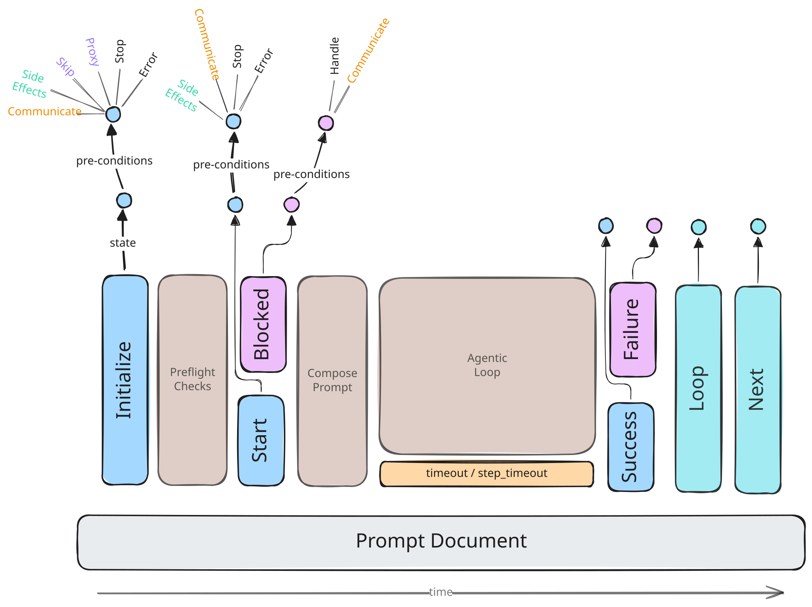

# Lifecycle Formalization for Claudine Prompts

## The Prompt Lifecycle



Today we have the following "lifecycle" events defined for a prompt document in Claudine:

1. **Start** - _pre-flight checks have passed_

    - the best time to communicate about _this_ prompt file starting (no opportunity to proxy or skip to another prompt)
    - you can also stop this prompt from completing by raising an error if certain preconditions aren't available for a successful run

2. **Blocked** - _pre-flight checks failed_

    - communicate the outcome

3. **Success** (agentic loop completed successfully)

    - communicate a successful outcome and/or status of a metric
    - create a side-effect to positively effect the execution environment

4. **Failure** (agentic loop ran into an error)

    - communicate a failed outcome
    - handle the failure by taking action:
        - retry
        - resume
        - proxy

These are a good starting point but we'll add two new events and modify our terminology a bit to incorporate one more:

- **Initialize (new)** - _when the prompt file is first identified and before the pre-flight checks are run; good for:_
    - Quick upfront communication to the user
    - Allows _proxying_ a request to a different prompt for processing
    - Allows the prompt to be _skipped_ which is the same as **stop** except that it's only stopping the execution of _this_ prompt 
    - A useful time to "prep" the environment for this prompt by creating some "side-effects" which will be used at **start**
- **Loop (repurposed)** - _today we see the `loop` frontmatter as responsible for defining a prompt loop; that won't change but it's worthwhile considering it as part of the Lifecycle just like the other events_
- **Next (new)** - _a new instruction we'll add in this feature (see below) as well as being considered a lifecycle event_

## Commonality Among Lifecycle Events

While there are differences between the different lifecycle events, the ambition is to find as large of a _common_ API surface as possible.

> a larger _common_ interface makes the learning curve less steep as each lifecycle event is configured and behaves very similarly

Today the lifecycle events are an opportunity to _communicate_ about the

## Actions

### Lifecycle Actions

Any given lifecycle event will have some subset of the following actions _available_ to them but the first lifecyle event which matches it's preconditions finalizes the lifecycle action.

- `Proxy`
- `Skip`
- `Stop`*
- `Error`*
- `Handle`**

> - those actions with a `*` are available on ALL lifecycle events
> - those actions with a `**` are available to all failure based events (`blocked` and `failure`)

### Other Actions

The lifecycle actions above have a **`1:M`** cardinality with each lifecycle event but all other actions operate on a **`0:M`** basis:

#### Communication (existing)

The communication mechanisms we have today will be used at every lifecycle event (they already exist in current lifecycle events):

- `effect` - play a sound effect from playa sounds effect's library to get user's attention
- `say`, `speak` - use the host's TTS solutions to _speak_ a message to the user
- `message` - send a message to a messaging application (Discord, Slack, etc.)
- `desktop` - send a message to the OS's desktop notification system
- `stderr` - communicate a message to the console's STDERR stream
- `stdout` - communicate a message to the console's STDOUT stream

#### Side Effects (new)

Side effects are often spoken about in very unkind terms by functional programming snobs but in fact the world wouldn't be worth living without side effects. I mean, unless you're a huge fan of the **status quo**. In this feature we're offering side effects
at every lifecycle event.

Side effects are broken up into two categories:

1. **Bespoke** shell commands
    - will need to go through the normal white-listing approval process during preflight checks to be usable
2. **built-ins**
    - designed to be safe, do not need approval to be used
    - provides nice reporting out of the box


##### **built-in Commands**

- `ensureFile(file)`
- `ensureFile(file, handle: ignore | fail)`
    - tries to resolve the passed in file path using the normal `FileReference` rules
    - if file reference found then, then this is a no-op
    - if file wasn't found then the file is created as an empty file:
        - if the file reference is "multi-pathed" (like magic paths, or an implicit relative file) we will resolve to the most _localized_ variant
        - for example, the path `@prompts/foobar.md` could resolve to a file off
- `ensureDir(path)`
- `removeDocumentation(file | glob)`
    - allows the removal of documentation files (.md, .txt, .doc, .docx, .xls, .ppt, etc.) but only within:
        - the current repo
        - the `~/.claudine`, and agent user scoped directories (e.g., `~/.claude`, `~/.codex`, `~/.config/opencode`, `~/.qwen`, etc.)
- `removeData(file | glob)`
    - allows the removal of data files (.json, .toml, .yaml, .csv, .tsv, .xml)
- `removeImage(file | glob)`
- `set_frontmatter(...)`
    - two signatures:
        - `set_frontmatter(file, JSON)`
        - `set_frontmatter(file, prop, value)`
- `append_jsonl(file, content)`
- `append(file, content)`
- `post(url, payload)`


## Configuring a Lifecycle Event

Today lifecycle events just let us communicate. For instance:

```yaml
say: "hi"
stderr: "I said hello"
```

To preserve backward compatibility as well provide a simple, clean interface for _just communicating_ this same API surface is available with the introduction of this feature. 

However, as a part of this feature, we will be introducing a property called `stack` to each lifecycle event. The `stack` property is an array/vector/list of `LifecycleStackItem`:

```rust
pub struct LifecycleStackItem {
    when: {expression},
    action: {action}
}
```

- the _conditional expressions_ use the same [expression syntax](@darkmatter/docs/topics/expression-syntax.md) which shared by **Darkmatter** and **Claudine**.
- _actions_ can be expressed as a string (shorthand) or a dictionary (long form)
- _actions_ can also be expressed as a block a singular "action" or an array of actions

### Action Definitions

#### Built-in Commands

The **built-in** commands defined above can be configured in a very formulaic way:

```yaml
- start:
    stack:
        - "ensureFile(@foo/bar/baz.md)"
        - action: ensureFile
          file: "@foo/bar/baz.md"
```

> In the above example we see stack items but both items do exactly the same thing; one uses the short form and the latter the long form.

#### Bespoke Shell Commands

To execute a **bespoke shell command** the syntax is:

- The short form is: `shell(cmd)`
- The long form is:
    ```yaml
    action: shell
    command: {cmd}
    ```

    the "long form" provides the following additional (but optional) props:
    - `on_error` - provide the STDOUT output for the command whenever an error code is returned
        - if you want to suppress STDERR output on errors just append ` &2> /dev/null` to the end of your command
    - `no_error` - a boolean flag which will suppress any error return value when set to `true` without changing the STDOUT/STDERR streams

#### Communication in the Stack

While you are offered a chance to communicate with the basic `say`, `effect` based props, these props are not conditional. Therefore, it's possible to stack as many communications as you like on the stack.

- The short form looks like: `say(hi)` or `effect(space-alarm)`
- The long form is depends a little bit by the communication method but primarily is:
    - `say`, `speak`, `message`, and `desktop` all require a **message** parameter:

        ```yaml
        success:
            stack:
                - action: say
                  message: "hi"
        ```
    - in contrast `effect` requires a **effect** parameter

        ```yaml
        success:
            stack:
                - action: effect
                  effect: applause
        ```

> The pattern is that the _short form_ allows you pass the required parameters positionally whereas the _long form_ provides named parameters (required parameters are required but each communication style exposes other optional config params)

## Processing Lifecycle Stack

Each lifecycle event starts by _communicating_ through the same means that is done today (e.g., leveraging the existing `say`, `effect`, etc. properties on the lifecycle event). Immediately following that though, the lifecycle `stack` is processed.

- `stack` is treated as a FIFO stack (aka, items at the top are executed before items at the bottom)
- items in the stack are taken off one at a time until
    - a stack item who's `when` condition matches _and_ who's action is a Lifecycle Action
    - if condition above is never met then execution stops when the stack has been exhausted
- each item off the stack is first evaluated for a match to the `when` condition
    - if there is NOT a match then this stack item becomes a **no-op**
    - if there **is** a match then this action is executed
        - if the matched action is a Lifecycle Action then this lifecycle's event process is over
        - the Lifecycle action will dictate what action will happen next
