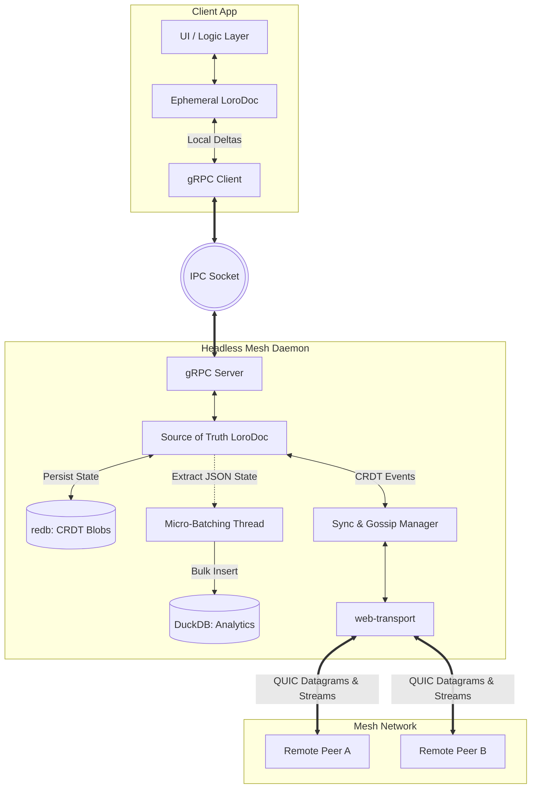
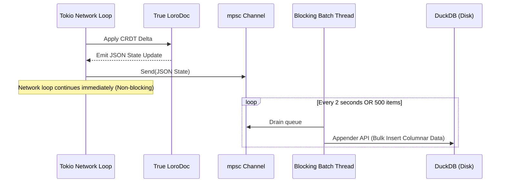

# Remote Signal

The @claudine/remote-signal directory will the root of the new `remote-signal` daemon. This daemon process is meant to run as a companion to the **Claudine CLI**. It handles the longer running and background tasks that a session-based execution model like the Claudine CLI can not realistically handle. 

In this very first feature associated with this new binary, we are going to implement a working proof of concept of the **remote-signal**'s distributed, local-first mesh architecture.

The first proof-of-concept scope is the **Session-log POC**: daemon + durable test client + peer discovery + explicit pairing + signed CRDT delta sync between paired nodes. The POC must include one concrete session-log document type, chunking behavior, redb persistence, and testable restart/replay/sync behavior. Compute jobs and production Claudine log ingestion are out of scope for this first proof of concept. Node capabilities may be described as future work unless a minimal capability field is needed to support tests.

## Overview

**remote-signal** is a local-first, peer-to-peer distributed mesh network. The first POC focuses on paired session-log synchronization, while the longer-term system is designed to facilitate an agentic compute grid and aggregate localized AI session logs. It utilizes a **Sidecar/Daemon Architecture** to decouple heavy network and storage operations from lightweight, responsive user interfaces. The system guarantees eventual consistency across paired nodes using Conflict-free Replicated Data Types (CRDTs).

## Core Technology Stack

- **CRDT Engine:** `loro` 
    - chosen for its high-performance Movable Tree capabilities and efficient version tracking
    - research found at @claudine/docs/research/remote-signal/loro.md
- **Mesh Networking:** `web-transport`
    - backed natively by `quinn` for QUIC/UDP, 
    - providing a future-proof path to WebAssembly/Browser clients
    - research found at @claudine/docs/research/remote-signal/web-transport.md
- **Inter-Process Communication (IPC):** 
    - **gRPC** via `tonic` over Unix Domain Sockets (UDS) or Named Pipes.
    - research found at @claudine/docs/research/remote-signal/tonic.md
- **Transactional Storage (OLTP):** `redb` 
    - Embedded, high-performance Key-Value store for CRDT binary snapshots and deltas).
    - research found at @claudine/docs/research/remote-signal/redb.md
- **Analytical Storage (OLAP):** `duckdb` 
    - embedded columnar database for fast SQL queries on resolved document state
    - research found at @claudine/docs/research/remote-signal/duckdb.md
- **Async Runtime:** `tokio`
    - we will use the `tokio` runtime
    - research found at @claudine/docs/researchremote-signal//tokio.md
- **Signaling / Bootstrap:** `axum`
    - HTTPS/WebSocket for initial peer discovery
    - research found at @claudine/docs/research/remote-signal/axum.md

> Research links above have functional details, common uses with code examples, and more; they should be used in any design activity on the given parts of the architecture.

### Infrastructure Tech Stack

- `tracing` for providing span diagnostics and metrics 
- `thiserror` for custom errors
- `ed25519-dalek`
    - In a peer-to-peer mesh, you cannot trust the network. If Node B sends you a Loro delta claiming to be from Node A, how do you know Node B didn't forge it?
    - `ed25519-dalek` provides extremely fast cryptographic signatures. Every node generates a keypair on first launch. Before sending a Loro update, the node signs the binary payload. When peers receive it, they verify the signature against the sender's public key.
    - more detailed reseach available at @claudine/docs/research/remote-signal/ed25519-dalek.md 
- `tokio-console`
    - Debugging async, peer-to-peer mesh networks over QUIC with concrurrent Tokio tasks is notoriously difficult. 
    - Print statements are NOT enough.
    - The `tracing` crate will help but adding `tokio-console` (a CLI for tokio) as a dev-dependency allows watching your async tasks and network streams in real time, spot deadlocks, dropped QUIC connections, or stalled gossip syncs.
- `flume`
    - a high-performance, multi-producer, multi-consumer (MPMC) channel library for Rust
    - research found at @claudine/docs/research/remote-signal/flume.md
- `foca` _or_ `plumtree`
    - research found at @claudine/docs/research/remote-signal/foca.md
    - research found at @claudine/docs/research/remote-signal/plumtree.md
- `mdns-sd` 
    - for mDNS peer discovery
    - research found at @claudine/docs/research/remote-signal/mdns-sd.md

## Architecture

> **Note:** the "Client App" will eventually become Claudine (and possibly others) but in this initial rollout we will build a test client. This client should be designed so that we can build integration tests that prove out all of our foundational test regarding networking, CRDT delta passing and more. This client is expected to continue on in some fashion even after we integrate the Claudine CLI as a combination debugging tool and testing infrastructure. This longer view of how the test client's role shouldn't strictly be designed for in this feature but the main point is that it's not "throw away" code.

## Data Topologies

The full system is expected to handle the following kinds of data, utilizing the CRDT mesh differently:

1. AI Agent Session Log Data
2. Node Capabilities
3. Compute Jobs

For the Session-log POC, only AI Agent Session Log Data is in scope. Node capabilities and compute jobs remain future work unless a minimal capability field is required for test support.

### AI Agent Session Log Data

AI session logs are aggregated locally and synced between explicitly paired nodes.

- **Ownership & Permissions:** The local Daemon (tailing log files) and the local Client App both have write access to the local node's session documents. Remote mesh peers act strictly as **read-only listeners**.
- **POC Document Type:** The POC must define one concrete session-log CRDT document type with enough structure to append log entries, preserve ordering within a session, identify the owning node, and replay the same document from redb after restart. Production Claudine log ingestion is out of scope.
- **Chunking Strategy:** To prevent infinite CRDT history growth, log documents must be aggressively chunked (e.g., session-[ID]-part-1, session-[ID]-part-2) based on byte size or line count. The POC must make the chunk threshold deterministic and testable.
- **Conflict Profile:** Low risk. Merge conflicts are restricted to local Daemon vs. local Client updates, ensuring high-speed state vector resolution across the mesh.

### Node Capabilities and Current State

Future work unless needed for POC test support.

- Nodes advertise their compute capabilities:
    - OS availability, GPU support, RAM, Cores, ...
- Nodes advertise their current status:
    - Repo's already checked out (which indicates where a server can quickly get up to date and split off a worktree)
    - CPU utilization

This data is owned by the local node and advertised to other nodes but external nodes act strictly as **read-only listeners**.

### Compute Jobs & Agentic Grid

Future work. Compute jobs are explicitly excluded from the Session-log POC.

One of the big features that eventually could be provided to Claudine is the ability to send work to other nodes to be done there. That includes:

- executing non-interactive prompts on an Agentic platform
- run tests (cross-OS testing) and ship back results

 and assign tasks across the mesh.

- **Capabilities Registry:** A Loro Map storing locally-written, globally-read state about what a node can execute (e.g., Linux, Windows, specific LLMs).
- **Job Execution:** Any node can create a job and assign it to another peer.
- **Consistency Model:** The system operates under an AP (Available/Partition-tolerant) model. During a network partition, jobs may be reassigned, leading to potential duplicate execution. Compute jobs must be inherently **idempotent**, accepting a low rate of double-execution in favor of high availability and system simplicity.

## Persistence and Query Pipeline (CQRS)

To support both real-time UI synchronization and complex historical analytics, the daemon implements a Command Query Responsibility Segregation (CQRS) pattern.
- **Transactional Path (redb):** All Loro document snapshots and incremental binary deltas are synchronously saved to redb. redb is the source of truth for CRDT durability. Local writes are acknowledged only after the relevant snapshot/delta is durable in redb. This ensures immediate crash-recovery and provides the raw byte arrays required to respond to state-vector sync requests from remote peers.
- **Analytical Path (duckdb):** Clients query the daemon for metadata and historical rollups via gRPC (e.g., "Get sessions from today"). The daemon serves these requests from DuckDB, but DuckDB is an asynchronous, disposable, rebuildable projection. It may lag behind redb and must not be treated as authoritative.

### Asynchronous Ingestion Pipeline

To prevent DuckDB's heavy disk I/O from blocking the Tokio network loop, ingestion is handled via a micro-batching queue.

## Security and Identity

- **Peer Identity:** Nodes generate an ed25519 keypair upon initialization.
- **Payload Verification:** All CRDT updates broadcast over the WebTransport datagrams must be signed by the originating node. Receiving nodes drop any deltas that fail signature verification against the advertised public key.
- **Peer Trust:** The POC uses explicit pairing only. mDNS can discover peers, but discovery alone must not authorize session-log data exchange. A peer must be paired through manual invitation or explicit local approval before it can exchange session-log deltas. Pairing state should be represented so future per-peer policy can be added later.
- **Local Security:** IPC communication relies on OS-level file permissions (Unix Domain Sockets) to ensure only authorized local applications can push commands to the daemon.

## Peer Discovery

When a new node first starts up there must be a way to have them discover other nodes in the mesh. With **remote-signal** we will employ two techniques to achieve this:

### Primary: Local DNS Discovery (mDNS)

mDNS (Multicast DNS) is the exact same protocol Apple uses for AirDrop and Google uses for Chromecast. It is perfect for zero-configuration networking.

- The Crate: `mdns-sd` is a robust, pure-Rust implementation.
- **The Implementation:** when your headless daemon starts up, it registers a service on the local network (e.g., `_agentgrid._udp.local`).
- Along with its IP address and WebTransport port, the daemon includes its `ed25519` public key inside the mDNS TXT records.
- Simultaneously, the daemon continuously browses for other `_agentgrid` services.
- When it spots one, it extracts the IP, port, and public key as a discovered peer candidate. Discovery is not pairing and must not authorize data exchange by itself. The daemon may use this information to support an explicit local approval flow, but session-log data exchange starts only after pairing.

### Secondary: Manual Peer Invitation

mDNS is magic when it works, but it is routinely blocked by strict enterprise firewalls, university networks, or virtual machines (like Docker desktop bridging). Manual invitations act as your escape hatch.

- **The Format:** 
    - you don't want users typing in raw JSON or IP addresses. 
    - You should serialize the connection data (IP, Port, Public Key) and encode it into a user-friendly, copy-pasteable string. 
    - Base58 or Bech32 (often used in crypto, e.g., `grid1qpzry9x8...`) are great for this because they prevent typo errors.
 - **The Implementation:**
    - Node A (The Host): The user clicks "Invite Peer" in the UI. 
    - The UI queries the daemon via gRPC for its connection string.
    - Node B (The Joiner): The user pastes that string into their UI. 
    - The UI sends a gRPC command (`ConnectToPeer(invite_string)`) down to the daemon.
    - The daemon decodes the string, dials the WebTransport endpoint, records the pairing if the remote identity matches the invitation, and bootstrapping is complete.

## Gossip

OPEN DECISION:

- decide between `foca` or `plumtree` for Gossip
- [`foca`](@claudine/docs/research/remote-signal/foca.md):
    Why it fits: Much like ⁠str0m⁠, ⁠foca⁠ is a pure state machine. You tell it "I have a new CRDT delta" or "I just received a ping from Peer B," and ⁠foca⁠ tells you "Send this exact byte array to Peer C and Peer D." It handles the mathematical complexities of epidemic broadcast, failure detection, and cluster membership while letting you push the actual bytes over your WebTransport QUIC streams.
- [`plumtree`](@claudine/docs/research/remote-signal/plumtree.md)
    - What it is: A Rust implementation of the Plumtree algorithm (Epidemic Broadcast Trees).
    - Why it fits: Plumtree is famous for combining the robustness of random gossip with the efficiency of deterministic tree broadcast. If you want to ensure your Loro CRDT deltas propagate to the entire mesh with the absolute minimum number of duplicate QUIC datagrams, wrapping this algorithm around your WebTransport layer is the academic gold standard.

Research available at:

- @claudine/docs/research/remote-signal/foca.md and 
- @claudine/docs/research/remote-signal/plumtree.md

> Note: `libp2p-gossipsub` is another option but it's a massive framework and not a good fit with [`web-transport`](@claudine/docs/research/remote-signal/web-transport.md)

## Queuing DuckDB Work

- `flume`
    - What it is: A blazingly fast, multi-producer, multi-consumer (MPMC) channel that is explicitly designed to cross the async/sync divide seamlessly.
    - Why it fits: ⁠flume⁠ provides dual APIs on the same channel. In your Tokio network loop, you can call ⁠sender.send_async(json).await⁠ (which yields to the async runtime without blocking). On your dedicated DuckDB thread, you can call ⁠receiver.recv_timeout()⁠ (which behaves like a standard blocking system thread). It is practically tailor-made for this exact micro-batching architecture.

## Acceptance Criteria

- Two explicitly paired local nodes can append to the POC session-log document type, exchange signed Loro deltas, and converge to the same document state after sync.
- A discovered but unpaired mDNS peer cannot exchange session-log deltas. Data exchange begins only after manual invitation or explicit local approval.
- A CRDT delta with an invalid signature, mismatched sender identity, or unknown unpaired sender is rejected and does not mutate local redb state.
- Local session-log writes are acknowledged only after the corresponding Loro snapshot/delta is durable in redb.
- After daemon restart, the node rebuilds its Loro state from redb and can replay/sync with a paired peer without losing acknowledged writes.
- DuckDB may lag behind redb. Tests can demonstrate that DuckDB is rebuilt from redb and that redb, not DuckDB, is authoritative for sync/replay.
- Chunking is deterministic and testable: appending beyond the configured threshold creates the next session-log chunk and both paired nodes converge on the same chunk set.
- The Session-log POC excludes compute jobs and production Claudine log ingestion. Node capabilities remain future work unless a minimal field is required for test support.
