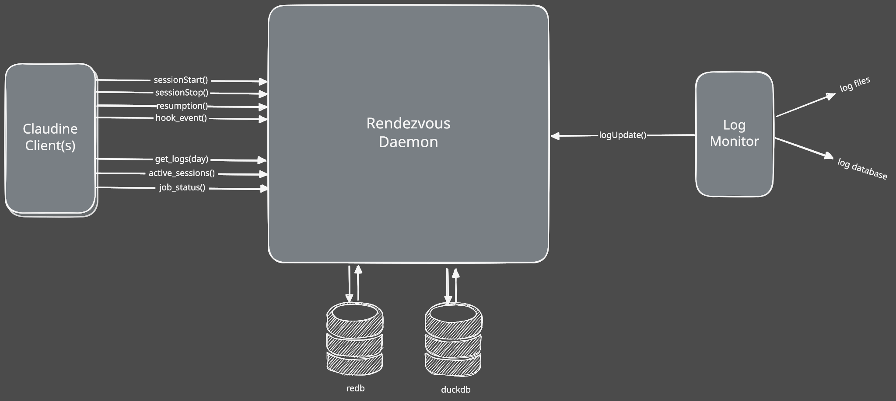

# Logging Refactor

We have had logging for a long time in Claudine but it was never implemented well and hasn't been used in a long time in it's current form. In more recent times we've had a few important feature developments:

1. Provider Research -> Metadata

    - we have a much more structured and thorough process for managing intelligence about the Agentic CLI's we support
    - this intelligence includes logging formats from each of these vendors (where each provider writes its logs, in what format, and with what time semantics — see the `agent-logging` research topic)

2. Rendezvous

    - We have a basic implementation of Rendezvous implemented
    - Rendezvous is a daemon process (a long-running background service) that Claudine interacts with over gRPC (a typed RPC protocol, carried over Unix domain sockets on macOS/Linux and named pipes on Windows)
    - Logging will be largely owned by Rendezvous (and a monitor client which streams updates to the Rendezvous daemon via gRPC)

> **Important:** this is a major refactor of logging and the current solution is being fully replaced. If there is anything that we feel is worth bringing over to the new implementation that is fine but do not be constrained by the current way of doing things.

## High Level Architecture

- The three actors are:
    - **Rendezvous** daemon
    - **Claudine** CLI client
    - **Logging Monitor** client (working name `agent-tail` — see [Open Decisions](#open-decisions) D2)
- When **Rendezvous** starts up it will spawn a **Logging Monitor** to monitor the various agent logs
    - note: we could also have a monitor _per_ agent installed on the host
    - note: also possible that we have multiple variants of the logging monitor:
        - one that monitors files
        - another one which monitors a Database (some providers log to SQLite rather than flat files)

- in terms of **state**, the Rendezvous daemon maintains state in two separate databases:

    1. **redb** — an embedded, pure-Rust key/value store; this is our transactional system of record
    2. **DuckDB** — an embedded columnar SQL database (think "SQLite for analytics"); this is our analytical/reporting database

- all — _or at least most_ — of the data stored in **redb** will be CRDT documents
    - a CRDT (Conflict-free Replicated Data Type) is a data structure that multiple machines can update independently and later merge without conflicts; we use the **Loro** crate for this
    - in our design almost every document has exactly **one** writing node, so Loro is effectively serving as a replication protocol between daemons rather than a collaborative editor — this keeps the data modeling simple
- the CRDT documents are then projected into **DuckDB** for reporting purposes

### Data Model

The document taxonomy, projection invariants, and entity-to-storage mapping for everything below are defined once in the shared data-model doc: [rendezvous data model](../../rendezvous/docs/crdt.md). The short version:

- **Fact logs** (Kind 1): append-only events in chunked Loro documents — this is where log entries live
- **State registers** (Kind 2): "current value" documents (e.g. which sessions are active right now)
- **DuckDB is a disposable projection**: every row must be rebuildable from the CRDT documents in redb; metrics are SQL views, never stored state

## Logging Sources

Three producers feed the same ingestion pipeline (see also `rendezvous/docs/logging.md`):

1. **Claudine CLI** — wrapped-session start/stop, all provider hook events, PIDs for the Claudine process and the child agent process, plus repo metadata (name, git host, remote URL)
2. **Logging Monitor** (`agent-tail`) — tails each provider's own log surface (file or database), transforming proprietary entries into our canonical form
3. **Process Monitor** — interval-based host process scanning, primarily for *unwrapped* sessions (see the [process-monitor spec](../2026-07-12-process-monitor/spec.md))

All three normalize into a single canonical envelope before ingestion (D1 below), so the daemon, redb, and DuckDB never need per-source schemas.

## Reporting Requirements

We keep track of logs so we can report on them to the user in a way that provides utility. The Rendezvous daemon and Log Monitor client are both long running processes whose job it is to capture log information and store it in a way which can be easily queried as well as synchronized across other Rendezvous daemons on other hosts.

Major entities we want to track (the storage column references the data-model doc's taxonomy):

| Entity | What it is | Storage |
|--------|-----------|---------|
| **Session** | the primary unit of execution for an Agentic CLI (interactive or non-interactive) | fact-log chunks + `sessions-active` register; `sessions` dimension in DuckDB |
| **Sequence** | a Claudine concept that groups otherwise separate non-interactive sessions | `sequence/{node}/{id}` register; `sequences` dimension |
| **Agent** | which Agentic CLI ran the session (usage by agent, interactive vs non-interactive preference, …) | attribute on facts; `DISTINCT` view |
| **Model** | which models are being used | attribute on facts; `DISTINCT` view |
| **Repo** | which repos a user works on — short-term situational awareness, long-term a story of focus over time | attribute on facts (canonical remote-URL form); `DISTINCT` view |
| **Commit / PR / CI-CD** | git-side activity correlated with sessions | Kind-1 `git/...` observation facts (git is the source of truth; we transport observations, we don't manage this state) |
| **Project** (v2) | kanban/project-management boards associated with a repo; card movement correlates strongly with commits and PRs. We already have API support for Trello, ClickUp, Asana, etc. and would add GitHub, GitLab, Gitea(?) | Kind-1 observation facts from listener clients; future fact table |

## Decisions (RATIFIED 2026-07-12)

All decisions below were ratified as recommended. The option discussion is kept for
context; the ratified choice is the *Recommendation* line of each item. D1's concrete
envelope shape is recorded in [data-modeling.md](./data-modeling.md).

- **D1 — Canonical log envelope.** All three sources must normalize into one schema (working name `ClaudineAgenticLog`). The existing chunk `Entry` (sequence, timestamp, source, level, message, JSON metadata) is close but was designed for the POC. We need to decide the typed fields vs what rides in `metadata`: candidates for promotion are `session_id`, `agent`, `model`, `repo`, `event_kind`. *Recommendation:* keep the envelope small and typed on exactly the fields reports filter on; everything provider-specific stays in `metadata`. This decision gates everything else — settle it first.
- **D2 — Monitor topology.** One monitor process per host that internally spawns a tailing task per log source, vs one OS process per agent, vs separate file-monitor and database-monitor binaries. *Recommendation:* a single `agent-tail` process with per-source async tasks; fewer processes to supervise, and the file-vs-database distinction is a per-source implementation detail, not a process boundary.
- **D3 — Session identity & correlation.** The same session is observed by up to three producers: Claudine's wrapper (its own session concept), the agent's log (the provider's session/conversation id), and the process monitor (a PID). Do we merge these into one enriched record at write time, or store separate facts and join at query time? *Recommendation:* store separate facts, each carrying whatever identifiers it natively has, and correlate in the projection layer — write-time merging requires the producers to know about each other and breaks the append-only model. Needs spike S3.
- **D4 — Deduplication across sources.** A hook event Claudine reports may also appear in the agent's own log a moment later. Are these one event seen twice (dedup) or two observations of one event (keep both, correlate)? *Recommendation:* keep both — they carry different detail and arrive with different latency; dedup at the reporting layer where a report would otherwise double-count.
- **D5 — What survives from the old implementation.** The current `reporting` module (JSONL → SQLite index) and the `claudine logs …` command surface. *Recommendation:* retire the JSONL/SQLite pipeline entirely; keep the `claudine logs` UX but repoint it at the Rendezvous gRPC Query API. The old code's report *shapes* (today/week/month/sessions/tools/errors/repos/trends) are worth porting as DuckDB views.
- **D6 — Retention.** Fact-log chunks currently live forever and sync to every peer. Do we prune old chunks, and does pruning replicate? (CRDT deletion is not the same as forgetting — peers that already synced a chunk keep it unless told otherwise.) *Recommendation:* defer actual pruning, but decide the *policy shape* now (age-based per domain) so chunk metadata carries what pruning will need.

## Risk Areas & Spikes

- **S1 — Volume & throughput.** The POC chunk caps (64 entries / 16 KiB) are test-scale; a busy interactive session can produce orders of magnitude more. Spike: replay a real day of provider logs through the pipeline, size the chunk caps, and switch DuckDB writes from row-by-row inserts to its bulk Appender API if needed.
- **S2 — Provider log format drift.** Providers change their log formats without notice. We already have per-provider logging research (formats, locations, time semantics) and a signal catalog for runtime detection — the monitor must be built to *degrade gracefully* (unparseable lines become raw-message entries, flagged for research follow-up) rather than crash or silently drop.
- **S3 — Correlation spike (feeds D3).** Take one wrapped session and one unwrapped session per provider and prove we can stitch wrapper events + agent log + process observations into a single session view in DuckDB. This is the riskiest query in the system; better to discover schema gaps now.
- **S4 — Mesh-wide log growth.** Every daemon currently syncs every document. All session logs on all hosts forever is a lot of replicated bytes. Spike: measure, and evaluate selective sync (e.g. registers sync everywhere, fact-log chunks sync on demand or by domain).
- **S5 — Cross-host clock skew.** Fact timestamps are wall-clock (`created_at_unix_ms`). Cross-host reports (e.g. a sequence spanning machines) can show effects before causes if clocks drift. Cheap mitigation: record the daemon's receive time alongside the producer's claimed time; decide which one reports order by.

## Companion Documents

- [data-modeling.md](./data-modeling.md) — feature-specific data-modeling notes (canonical taxonomy lives in the [rendezvous data-model doc](../../rendezvous/docs/crdt.md))
- [monitoring-logs.md](./monitoring-logs.md) — per-provider log-surface details for the monitor (to be authored; draws on the `agent-logging` research topic)
