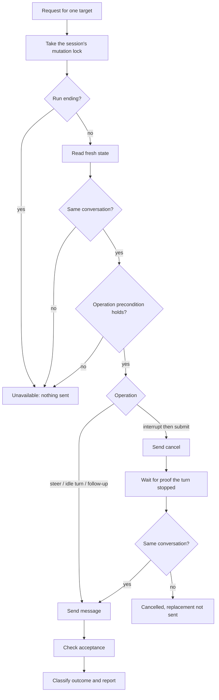

# Steering Delivery Pipeline

Status: Draft for author review.
Created: 2026-09-29

## Purpose

Deliver steering messages to every roster provider through **one pipeline**
that provider metadata configures. No provider gets its own implementation of
delivery, discovery, or managed launch.

This replaces the per-provider adapter design that `2026-09-08-steering`
shipped, and it answers that feature's open scope question: every provider
whose route can be verified is enabled, through the pipeline.

## What Was Found

`2026-09-08-steering` built a shared, metadata-driven core (discovery,
eligibility, controller, audit, identity, the `steer` command) and then put the
wire protocol behind hand-written adapters. Three observations from the code as
of 2026-09-29:

1. **The two adapters are mostly the same code.** `codex_app_server` and
   `pi_rpc` define the same error type, the same request and response
   correlation, the same settlement and shutdown handling, and the same
   delivery sequence. With provider names removed, about two thirds of their
   lines are identical (145 of 210 to 261 in `executor.rs`; 283 of 404 to 472
   in `mod.rs`, compared as unordered line sets, so the figure is approximate).
2. **The researched wire protocol drives nothing.** Every mechanism's
   `request_format` reaches `lib/src/steering/generated.rs`, and no production
   code reads it. It is a prose sentence. Codex's transport is recorded as
   `other`.
3. **Eight providers have no route** because each was waiting for its own
   adapter.

The rest of Claudine's provider support already follows the rule this spec
applies: generated metadata plus shared code, with a guard against new
per-provider dispatch. Steering adapters escaped that guard because they are
selected by adapter, not by `match Provider`.

## Decision

1. Delivery is a fixed sequence of stages. The stages are code, written once.
2. Everything that differs between providers is typed configuration, generated
   from metadata into static tables.
3. Adding a provider, or following a provider's protocol change, is a metadata
   change plus verification. It adds no Rust outside the generated tables.
4. A provider need that the configuration vocabulary cannot express is met by
   extending the vocabulary for everyone, never by a provider-specific branch.

## The Pipeline

Outcome classification is shared and already exists in both adapters: an
answer proves acceptance, a refusal is reported as refused, a request that may
have been sent and got no answer is reported as unknown and is never resent,
and a request that was never written is reported as unavailable.

## What Metadata Configures

Each row is a typed field with a closed set of values or a template. The
"observed values" column lists what the ten providers' research requires today.

| Setting | Observed values |
| --- | --- |
| Carrier | retained child stdio; HTTP; Unix socket; Windows named pipe |
| Framing | JSON lines; JSON-RPC over JSON lines; JSON-RPC over HTTP; HTTP with JSON body; server-sent events for later state |
| Credential | pipe ownership only; HTTP Basic; bearer token; authentication frame sent first |
| Session setup | none; initialize handshake, then open or resume a conversation |
| Message per operation | a template with placeholders for the message text, conversation, active operation, and request ID |
| Target guard | none; a named request field bound to the active operation (`expectedTurnId`, `expectedRunId`) |
| State source | a request and the fields to read; events tracked from the stream; a status endpoint |
| Acceptance rule | any successful answer; a named answer field equals the bound value; an HTTP status |
| Accepted outcome | accepted; queued |
| Stop proof | poll state until idle; a completion event with a given status; the outstanding request returns a given stop reason |
| Provider-initiated requests | the fixed answer to give, such as cancelling a dialog or refusing an unsupported request |
| Managed launch | argv, readiness probe, endpoint and credential handoff, fallback launch |

### Provider fit

Every researched mechanism fits the stages above. The differences are all
settings in the table.

| Provider | Carrier and framing | Target guard | Acceptance | Stop proof |
| --- | --- | --- | --- | --- |
| Codex | stdio, JSON-RPC | `expectedTurnId` | answer names the same turn | completion event, interrupted |
| Pi | stdio, JSON lines | none | successful answer | poll state |
| Gemini | stdio, JSON-RPC (ACP) | none | successful answer | outstanding prompt returns cancelled |
| Goose | HTTP, JSON-RPC (ACP) | `expectedRunId` | answer carries run and message IDs | outstanding prompt returns cancelled |
| Kimi | HTTP with JSON; stdio ACP | none | answer carries prompt ID | outstanding prompt returns cancelled |
| OpenCode | HTTP with JSON | none | status 204 | poll status |
| Kilo | HTTP with JSON | none | status 204 | poll status |
| Qwen | HTTP with JSON, events | none | status 202 with prompt ID | event for the old prompt |
| Claude | Unix socket or named pipe, JSON lines | none | status frame | not researched |
| Antigravity | stdio, JSON lines | none | not established | not applicable (idle only) |

A provider without a target guard is not a pipeline problem. It is a policy
fact: the activation policy decides whether the unguarded route may be granted,
as it already does for Pi.

## What Stays Code

Written once, shared by every provider:

- the pipeline stages and outcome classification;
- one implementation per carrier and per framing;
- the template renderer and the field reader;
- the managed-launch runner.

Nothing in this list names a provider.

## Metadata Changes

### Research contract

The draft of revision 5 is in [research-schema](research-schema/): a document
schema and a file of named types. Every property has a type as narrow as the
fact allows and a description of what to record. Every object shape is a named
type, so a key the type does not declare is an error.

Revision 5 replaces the prose fields `request_format`, `response_format`,
`request_framing`, `response_framing`, `authentication`, `destination`,
`initialization`, and `target_guards` on a mechanism, and `locator`,
`identity_check`, `liveness_check`, and `state_detection` on a discovery
method. It adds `channels`, which holds what several mechanisms share: the
carrier, the credential, the setup exchange, and how state is read.

[examples/codex.md](research-schema/examples/codex.md) and
[examples/pi.md](research-schema/examples/pi.md) fill in `channels` and
`mechanisms` from the two adapters that ship today. Both validate, which shows
the vocabulary can express two real protocols.

### Two gates on every research run

The fleet's `success` stack already runs both gates; revision 5 gives them
something to enforce.

| Gate | Command | Checks |
| --- | --- | --- |
| Shape | `md schema validate` | types, closed sets, patterns, unknown keys |
| Relations | `claudine providers steering check` | everything a shape cannot express |

The relations gate gains these checks:

- a message template uses only the placeholders the contract lists;
- every `channel_id`, `profile_id`, `mechanism_id`, and `evidence_ids` entry
  names something that exists;
- a condition whose test is `equals` has a value;
- `cancel` is present exactly when the operation is `interrupt_then_submit`,
  and its `stop_proof` rule is then not `not_applicable`;
- `send` is absent only when the mechanism records why in `gaps`;
- every `unknown` has a matching entry in `gaps` or `discovery_gaps`;
- an HTTP request has `target` and `expect_status`, and a stream request has
  neither.

### Generator and policy

1. `claudine-gen` emits the typed configuration into the generated steering
   tables and rejects a grant whose mechanism or channel holds an `unknown`.
2. `docs/providers/steering-activation.yaml` keeps grants and blocks. Its
   `adapters` list is replaced by a reviewed configuration revision per
   mechanism, so a protocol change still withdraws a grant until re-reviewed.
3. Activation stays evidence-gated exactly as today: a grant needs passing
   verification records for the exact provider version, OS, profile, and state.

### Going live

Revision 5 and the refreshed research documents land together. The generator
validates every research document against the live contract and stops when
one fails, so switching the contract first would block generation.

## Discovery

The same rule applies. There is one discoverer per discovery method (provider
registry, server endpoint registration, process inspection), configured by the
researched discovery records. The existing Claude registry reader becomes the
registry method's first configuration.

## Migration Order

1. Define the configuration types and the pipeline. Express Codex and Pi as
   configuration and delete both adapters. The existing adapter tests and the
   real Codex tests must pass unchanged in what they assert.
2. Add the HTTP carrier. Configure Kilo, then OpenCode and Qwen.
3. Add ACP framing over stdio and HTTP. Configure Gemini, then Goose.
4. Add the socket and named-pipe carriers. Configure Claude.
5. Configure Antigravity and Kimi once their protocol facts are established.

Each provider is enabled only after its verification records pass.

## Acceptance Criteria

- No file under `lib/src` or `cli/src` implements steering delivery,
  discovery, or managed launch for a single provider. A guard test fails when
  one is added.
- Codex behaves as it did before the change, shown by the existing real-tier
  tests, and is re-granted under its new configuration revision.
- Every roster provider has either a granted route or an unavailable
  explanation that names the missing fact or the reviewed block.
- Changing a provider's message template in metadata and regenerating changes
  what is sent, with no other edit. A test proves this with a fixture provider.
- The steering topic docs describe the pipeline and the configuration
  vocabulary for a reader new to the repository.

## Non-goals

- A general scripting language in metadata. Settings are closed sets and
  templates; there are no conditionals or loops.
- Relaxing the evidence gate. Configuration makes a route possible;
  verification makes it selectable.
- Lifting Pi's reviewed block. That is a policy decision, unchanged here.

## Open Decisions

1. **Managed launch arguments.** A launch profile records the arguments that
   start it. Codex also translates the caller's `exec` options into setup
   parameters, which the draft contract does not yet express.
2. **Kimi 2.x.** The research describes 0.28.1. Recommended: a new roster
   entry, as the roster rules require for a major version.
3. **Goose.** Verification needs `goose` installed on a test host.
4. **Research gaps that block configuration.** Claude's response frames and
   Antigravity's input fields are not established. Each needs a disposable
   probe before its configuration can be written.
